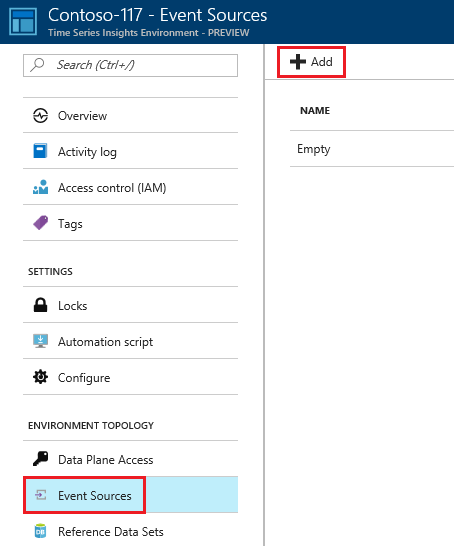
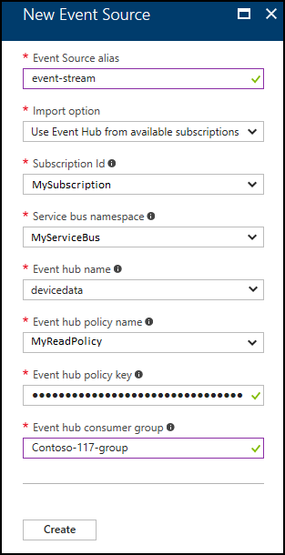

# Create an event source for your Time Series Insights environment using the Azure portal

Time Series Insights Event Source is derived from an event broker, like Azure Event Hubs. Time Series Insights connects directly to Event Sources, ingesting the data stream without requiring users to write a single line of code. Currently, Time Series Insights supports Azure Event Hubs and Azure IoT Hubs, and in the future, more Event Sources will be added.

## Steps to add an event source to your environment

1.	Sign in to the [Azure portal](https://portal.azure.com).
2.	Click “All resources” in the menu on the left side of the Azure portal.
3.	Select your Time Series Insights environment.

  

4.	Select “Event Sources”, click “+ Add.”

  

5.	Specify the name of the event source. This name is associated with all events coming from this event source and is available at query time.
6.	Select an event hub from the list of Event Hub resources in the current subscription or choose Import option "Provide Event Hub settings manually” to specify an event hub located in another subscription. Events must be published in JSON format.
7.	Select policy that has read permission in the event hub.
8.	Specify event hub consumer group.

  > [!IMPORTANT]
  > Make sure this consumer group is not used by any other service (such as Stream Analytics job or another Time Series Insights environment). If consumer group is used by other services, read operation is negatively affected for this environment and the other services. If you are using “$Default” as the consumer group, it could lead to potential reuse by other readers.

9.	Click “Create.”

After creation of the event source, Time Series Insights will automatically start streaming data into your environment.

## Next steps

* [Send events](time-series-insights-send-events.md) to the event source
* View your environment in [Time Series Insights Portal](https://insights.timeseries.azure.com)
