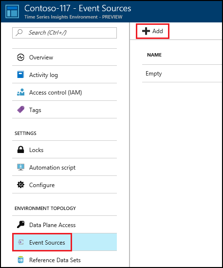
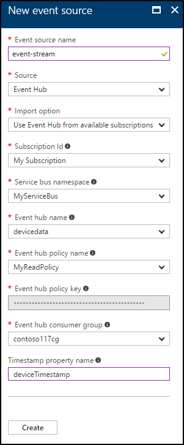

# Create an event source for your Time Series Insights environment using the Azure portal

Time Series Insights Event source data is derived from an event broker, such as Azure Event Hubs. Time Series Insights connects directly to Event Sources, ingesting the data stream without requiring users to write any code. Currently, Time Series Insights supports Azure Event Hubs and Azure IoT Hubs. In the future, more Event Sources will be added.

## Add a new event source

1. Sign in to the [Azure portal](https://portal.azure.com).

2. Locate your existing Time Series Insights environment. Click **All resources** in the menu on the left side of the Azure portal. Select your Time Series Insights environment.

2. Under the **Environment Topology** heading, click **Event Sources**.

   

3. Click **+ Add**.

4. Provide an **Event source name** unique to this Time Series Insights environment, such as **event-stream**. This name is associated with all events coming from this event source and is available at query time.

   

5. Choose the **Source** as **Event Hub** or **IoT Hub** depending on your source type.

6. Select the appropriate **Import option**. 
   - If you already have an existing Event Hub on one of your subscriptions, it is easiest to select **Use Event Hub from available subscriptions**. 
   - If the Event Hub is external to your subscriptions, or you wish to choose advanced options, choose **Provide Event Hub settings manually**. 

   
   
7. If you have selected the **Use Event Hub from available subscriptions** option, the following table explains each required property:

   | Property | Description |
   | --- | --- |
   | Subscription Id | Select the subscription in which this event hub was created.
   | Service bus namespace | Select the Service Bus namespace that contains the Event Hub.
   | Event hub name | Select the name of the Event Hub.
   | Event hub policy name | Select the shared access policy, which can be created on the Event Hub Configure tab. Each shared access policy has a name, permissions that you set, and access keys. The shared access policy for your event source *must* have **read** permissions.
   | Event hub policy key | The key is prepopulated.
   | Event hub consumer group | The Consumer Group to read events from the Event Hub. It is highly recommended to use a dedicated consumer group for your event source.

   > [!IMPORTANT]
   > Make sure this consumer group is not used by any other service (such as Stream Analytics job or another Time Series Insights environment). If the consumer group is used by other services, the read operation is negatively affected for this environment and the other services. If you are using “$Default” as the consumer group, it could lead to potential reuse by other readers.

8. If you have selected the **Provide Event Hub settings manually** option, the following table explains each required property:

   | Property | Description |
   | --- | --- |
   | Subscription Id | The subscription in which this event hub was created.
   | Resource group | The subscription in which this event hub was created.
   | Service bus namespace | A Service Bus namespace is a container for a set of messaging entities. When you created a new Event Hub, you also created a Service Bus namespace.
   | Event hub name | The name of your Event Hub. When you created your event hub, you also gave it a specific name.
   | Event hub policy name | The shared access policy, which can be created on the Event Hub Configure tab. Each shared access policy has a name, permissions that you set, and access keys. The shared access policy for your event source *must* have **read** permissions.
   | Event hub policy key | The Shared Access key used to authenticate access to the Service Bus namespace. Type the primary or secondary key here.
   | Event hub consumer group | The Consumer Group to read events from the Event Hub. It is highly recommended to use a dedicated consumer group for your event source.

9. Select the **Event serialization format**. JSON is the only available serialization at present.

10. It is recommended to provide a **Timestamp property name**. You need to know the message format of the event data to make this decision. This is the name of the event property in the message data that should be used as the event timestamp when visualizing the data. If you leave this option blank, the event enqueue time within the event source is used as the event timestamp.

11. Select **Create** to add the new event source.

After creation of the event source, Time Series Insights will automatically start streaming data into your environment.

## Next steps
* [Send events](time-series-insights-send-events.md) to the event source
* View your environment in [Time Series Insights Explorer](https://insights.timeseries.azure.com)
