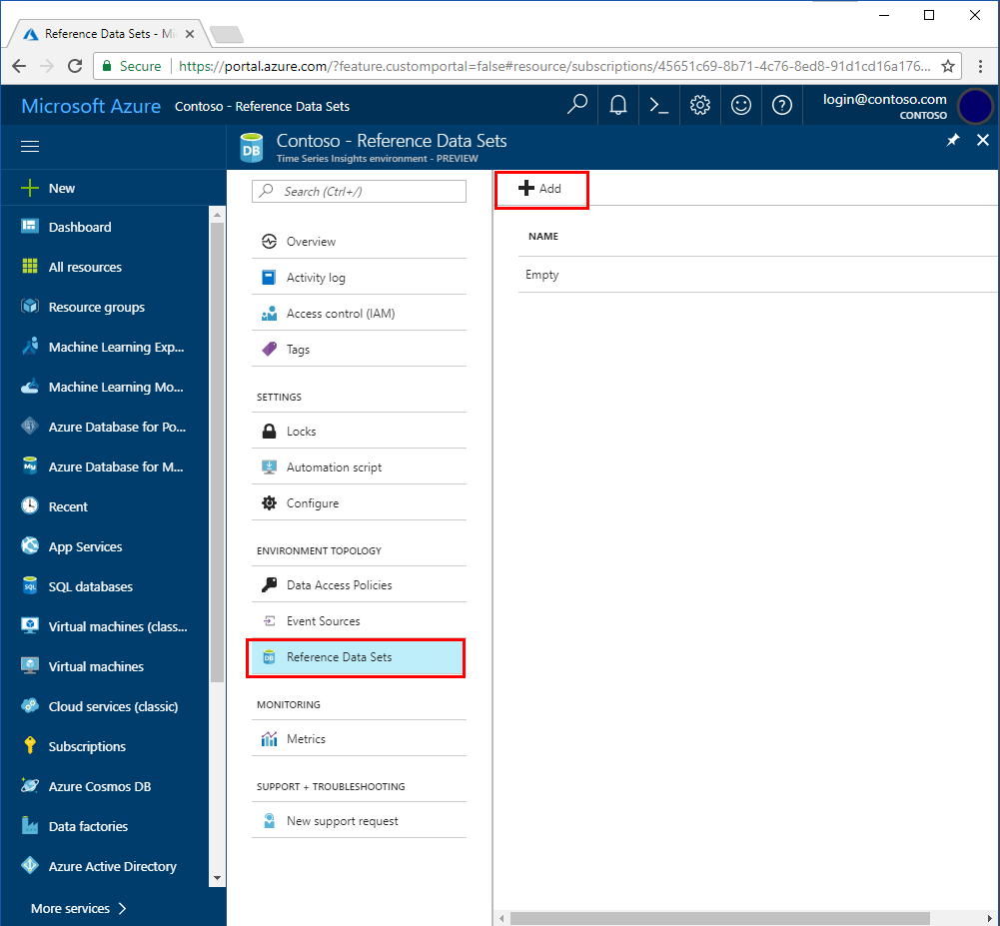
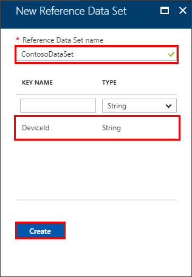
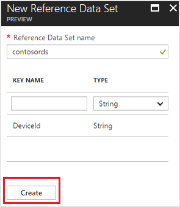

# Create reference data set for your Time Series Insights environment using the Ibiza portal

A Reference Data Set is a collection of items that are augmented with the events from your event source. Time Series Insights ingress engine joins an event from your event source with an item in your reference data set. This augmented event is then available for query. This join is based on the keys defined in your reference data set.

## Steps to add a reference data set to your environment

1. Sign in to the [Ibiza portal](https://portal.azure.com).
2. Click “All resources” in the menu on the left side of the Ibiza portal.
3. Select your Time Series Insights environment.

    

4. Select “Reference Data Sets”, click “+ Add.”

    

5. Specify the name of the reference data set.
6. Specify the key name and its type. This name and type is used to pick the correct property from the event in your event source. For instance, if you provide key name as “DeviceId” and type as “String”, then the ingress engine looks for a property with the name “DeviceId” of type “String” in the incoming event. You can provide more than one key to join with the event. The property name match is case-sensitive.

     

7. Click “Create.”

## Next steps

* [Manage reference data](time-series-insights-manage-reference-data-csharp.md) programmatically.