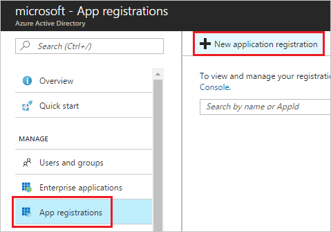
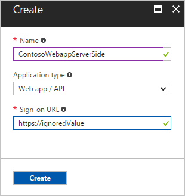
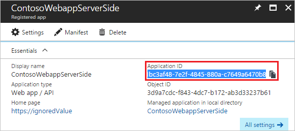
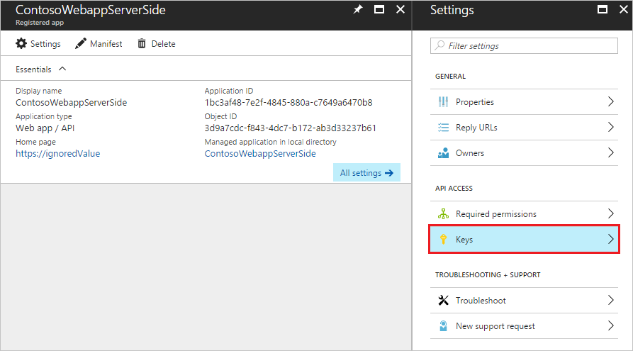
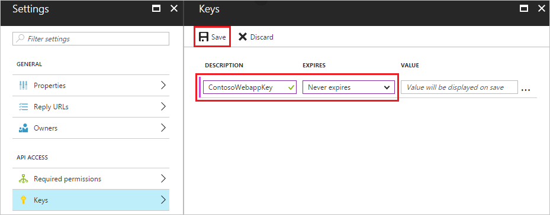
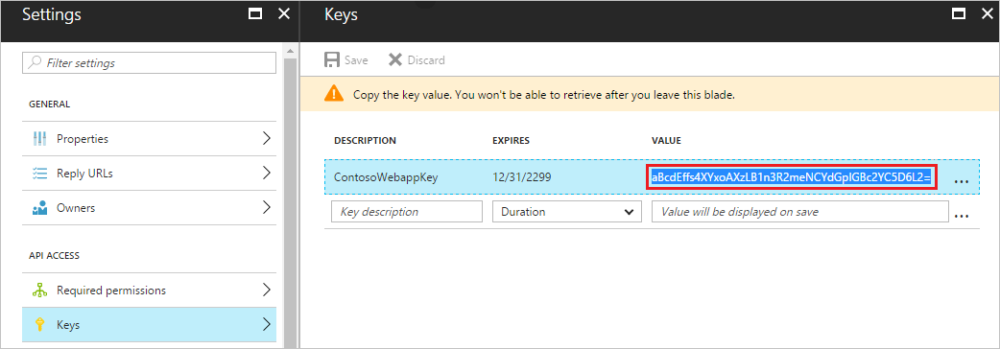

# Authentication and authorization for Azure Time Series Insights API

This article explains how to configure a custom application that calls the Azure Time Series Insights API.

## Service principal

This section explains how to configure an application to access the Time Series Insights API on behalf of the application. The application can then query data or publish reference data in the Time Series Insights environment with application credentials and not the user credentials.

When you have an application that needs to access Time Series Insights, you must set up an Azure Active Directory application and assign the data access policies in the Time Series Insights environment. This approach is preferable to running the app under your own credentials because:

* You can assign permissions to the app identity that are different from your own permissions. Typically, these permissions are restricted to exactly what the app needs to do. For example, you can allow the app to only read data in a particular Time Series Insights environment.
* You don't have to change the app's credentials if your responsibilities change.
* You can use a certificate or an application key to automate authentication when you're running an unattended script.

This article shows you how to perform those steps through the Azure portal. It focuses on a single-tenant application where the application is intended to run in only one organization. You typically use single-tenant applications for line-of-business applications that run in your organization.

The setup flow consists of three high-level steps:

1. Create an application in Azure Active Directory.
2. Authorize this application to access the Time Series Insights environment.
3. Use the application ID and key to acquire a token to the `"https://api.timeseries.azure.com/"` audience or resource. The token can then be used to call the Time Series Insights API.

Here are the detailed steps:

1. In the Azure portal, select **Azure Active Directory** > **App registrations** > **New application registration**.

     

2. Give the application a name, select the type to be **Web app / API**, select any valid URI for **Sign-on URL**, and click **Create**.

   

3. Select your newly created application and copy its application ID to your favorite text editor.

   

4. Select **Keys**, enter the key name, select the expiration, and click **Save**.

   

   

5. Copy the key to your favorite text editor.

   

6. For the Time Series Insights environment, select **Data Access Policies** and click **Add**.

   

7. In the **Select User** dialog box, paste the application name (from step 2) or application ID (from step 3).

   

8. Select the role (**Reader** for querying data, **Contributor** for querying data and changing reference data) and click **Ok**.

   

9. Save the policy by clicking **Ok**.

10. Use the application ID (from step 3) and application key (from step 5) to acquire the token on behalf of the application. The token can then be passed in the `Authorization` header when the application calls the Time Series Insights API.

    If you're using C#, you can use the following code to acquire the token on behalf of the application. For a complete sample, see [Query data using C#](time-series-insights-query-data-csharp.md).

    ```csharp
    var authenticationContext = new AuthenticationContext(
        "https://login.windows.net/common",
        TokenCache.DefaultShared);

    AuthenticationResult token = await authenticationContext.AcquireTokenAsync(
        // Set the resource URI to the Azure Time Series Insights API
        resource: "https://api.timeseries.azure.com/", 
        clientCredential: new ClientCredential(
            // Application ID of application registered in Azure Active Directory
            clientId: "1bc3af48-7e2f-4845-880a-c7649a6470b8", 
            // Application key of the application that's registered in Azure Active Directory
            clientSecret: "aBcdEffs4XYxoAXzLB1n3R2meNCYdGpIGBc2YC5D6L2="));

    string accessToken = token.AccessToken;
    ```

## Next steps

Use the application ID and key in your application. For sample code that calls the Time Series Insights API, see [Query data using C#](time-series-insights-query-data-csharp.md).

## See also

* [Query API](/rest/api/time-series-insights/time-series-insights-reference-queryapi) for the full Query API reference
* [Create a service principal in the Azure portal](../azure-resource-manager/resource-group-create-service-principal-portal.md)
