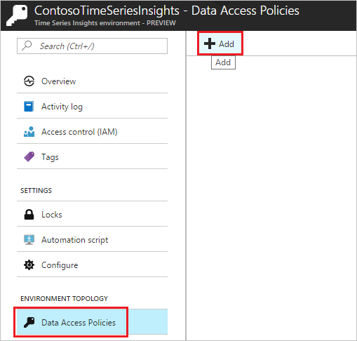
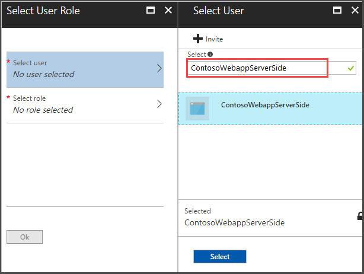
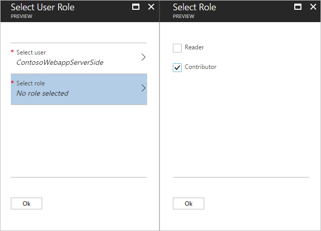

# Authentication and authorization for Azure Time Series Insights API

This document describes how to register an app in Azure Active Directory using the new Azure Active Directory blade. Apps registered in Azure Active Directory enable users to authenticate to and be authorized to use the Azure Time Series Insight API associated with a Time Series Insights environment.

## Service principal

The following sections describe how to configure an application to access the Time Series Insights API on behalf of an app. The application may then query or publish reference data in the Time Series Insights environment using its own application credentials through Azure Active Directory.

## Summary and best practices

The Azure Active Directory app registration flow involves three main steps.

1. [Register an application](#azure-active-directory-app-registration) in Azure Active Directory.
1. Authorize the application to have [data access to the Time Series Insights environment](#granting-data-access).
1. Use the **Application ID** and **Client Secret** to acquire a token from `https://api.timeseries.azure.com/` in your [client app](#client-app-initialization). The token can then be used to call the Time Series Insights API.

Per **step 3**, separating your application's and your user credentials allows you to:

* Assign permissions to the app identity that are distinct from your own permissions. Typically, these permissions are restricted to only what the app requires. For example, you can allow the app to read data only from a particular Time Series Insights environment.
* Isolate the app's security from the creating user's authentication credentials by using a **Client Secret** or security certificate. As a result, the application's credentials are not dependent on a specific user's credentials. If the user's role changes, the application does not necessarily require new credentials or further configuration. If the user changes their password, all access to the application doesn't require new credentials or keys.
* Run an unattended script using a **Client Secret** or security certificate rather than a specific user's credentials (requiring them to be present).
* Use a security certificate rather than a password to secure access to your Azure Time Series Insights API.

> [!IMPORTANT]
> Follow the principle of **Separation of Concerns** (described for this scenario above) when configuring your Azure Time Series Insights security policy.

> [!NOTE]
> * The article focuses on a single-tenant application where the application is intended to run in only one organization.
> * You'll typically use single-tenant applications for line-of-business applications that run in your organization.

## Detailed setup

### Azure Active Directory app registration

[!INCLUDE [Azure Active Directory app registration](../../includes/time-series-insights-aad-registration.md)]

### Granting data access

1. For the Time Series Insights environment, select **Data Access Policies** and select **Add**.

   [](media/authentication-and-authorization/time-series-insights-data-access-policies-add.png#lightbox)

1. In the **Select User** dialog box, paste either the **Application Name** or the **Application ID** from the Azure Active Directory app registration section.

   [](media/authentication-and-authorization/time-series-insights-data-access-policies-select-user.png#lightbox)

1. Select the role. Select **Reader** to query data or **Contributor** to query data and change reference data. Select **OK**.

   [](media/authentication-and-authorization/time-series-insights-data-access-policies-select-role.png#lightbox)

1. Save the policy by selecting **OK**.

   > [!TIP]
   > Read about [granting data access](./time-series-insights-data-access.md) to your Time Series Insights environment in Azure Active Directory.

### Client app initialization

1. Use the **Application ID** and **Client Secret** (Application Key) from the Azure Active Directory app registration section to acquire the token on behalf of the application.

    In C#, the following code can acquire the token on behalf of the application. For a complete sample, see [Query data using C#](time-series-insights-query-data-csharp.md).

    ```csharp
    // Enter your Active Directory tenant domain name
    var tenant = "YOUR_AD_TENANT.onmicrosoft.com";
    var authenticationContext = new AuthenticationContext(
        $"https://login.microsoftonline.com/{tenant}",
        TokenCache.DefaultShared);

    AuthenticationResult token = await authenticationContext.AcquireTokenAsync(
        // Set the resource URI to the Azure Time Series Insights API
        resource: "https://api.timeseries.azure.com/",
        clientCredential: new ClientCredential(
            // Application ID of application registered in Azure Active Directory
            clientId: "YOUR_APPLICATION_ID",
            // Application key of the application that's registered in Azure Active Directory
            clientSecret: "YOUR_CLIENT_APPLICATION_KEY"));

    string accessToken = token.AccessToken;
    ```

1. The token can then be passed in the `Authorization` header when the application calls the Time Series Insights API.

## Next steps

- For sample code that calls the GA Time Series Insights API, see [Query data using C#](./time-series-insights-query-data-csharp.md).

- For Preview Time Series Insights API code samples, see [Query Preview data using C#](./time-series-insights-update-query-data-csharp.md).

- For API reference information, see [Query API reference](/rest/api/time-series-insights/ga-query-api).

- Learn how to [create a service principal](../active-directory/develop/howto-create-service-principal-portal.md).