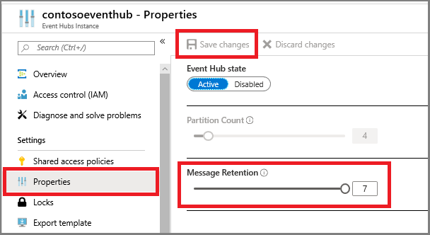

# Understand data retention in Azure Time Series Insights

This article describes two settings that impact data retention in your Azure Time Series Insights environment.

## Video

### The following video summarizes Time Series Insights data retention and how to plan for it. 

> [!VIDEO https://www.youtube.com/embed/03x6zKDQ6DU]

Each of your Azure Time Series environments has a setting that controls **Data retention time**. The value spans from 1 to 400 days. The data is deleted based on the environment storage capacity or retention duration, whichever comes first.

Additionally, your Azure Time Series environment has a **Storage limit exceeded behavior** setting. It controls ingress and purge behavior when the max capacity of an environment is reached. There are two behaviors to choose from when configuring it:

- **Purge old data** (default)  
- **Pause ingress**

> [!NOTE]
> By default, when creating a new environment, the retention is configured to **Purge old data**. This setting can be toggled as needed after creation time using the Azure portal, on the **Configure** page of the Time Series Insights environment.

For information on switching retention behaviors, review [Configuring retention in Time Series Insights](time-series-insights-how-to-configure-retention.md).

Compare the data retention behavior:

## Purge old data

- This behavior is the default behavior for Time Series Insights environments.  
- This behavior is preferred when users want to always see their *most recent data* in their Time Series Insights environment.
- This behavior *purges* data once the environment’s limits (retention time, size, or count, whichever comes first) are reached. Retention is set to 30 days by default.
- The oldest ingested data is purged first (FIFO approach).

### Example one

Consider an example environment with retention behavior **Continue ingress and purge old data**:

**Data retention time** is set to 400 days. **Capacity** is set to S1 unit, which contains 30 GB of total capacity.   Let's assume inbound data accumulates to 500 MB each day on average. This environment can only retain 60 days worth of data given the rate of inbound data, since the maximum capacity is reached at 60 days. The inbound data accumulates as: 500 MB each day x 60 days = 30 GB.

On the 61st day, the environment shows the freshest data, but purges the oldest data, older than 60 days. The purge makes room for the new data streaming in, so that new data may continue to be explored. If the user wishes to retain data longer, they can increase the size of the environment by adding additional units or can push less data.  

### Example two

Consider an environment also configured retention behavior **Continue ingress and purge old data**. In this example, **Data retention time** is set to a lower value of 180 days. **Capacity** is set to S1 unit, which contains 30 GB of total capacity. In order to store data for the full 180 days, the daily ingress cannot exceed 0.166 GB (166 MB) per day.  

Whenever this environment’s daily ingress rate exceeds of 0.166 GB per day, data cannot be stored for 180 days, since some data gets purged. Consider this same environment during a busy time frame. Assume the environment’s ingress rate may increase to an average 0.189 GB per day. In that busy time frame, about 158 days of data are retained (30GB/0.189 = 158.73 days of retention). This time is less than the desired data retention time frame.

## Pause ingress

- The **Pause ingress** setting is designed to ensure data is not purged if the size and count limits are reached prior to their retention period.  
- **Pause ingress** provides additional time for the users to increase the capacity of their environment before data is purged due to breaching of retention period
- It helps protect you from data loss but can create an opportunity for the loss of your most recent data if ingress is paused beyond the retention period of your event source.
- However, once an environment’s maximum capacity is reached, the environment pauses data ingress until the following additional actions occur:

   - You increase the environment’s maximum capacity to add more scale units as described in [How to scale your Time Series Insights environment](time-series-insights-how-to-scale-your-environment.md).
   - The data retention period is reached and data is purged, bringing the environment below its maximum capacity.

### Example three

Consider an environment with retention behavior configured to **pause ingress**. In this example, the **Data retention period** is configured to 60 days. **Capacity** is set to three (3) units of S1. Assume this environment has ingress of 2-GB data each day. In this environment, ingress is paused once the maximum capacity is reached.

At that time, the environment shows the same dataset until ingress resumes or until **continue ingress** is enabled (which would purge older data to make room for new data).

When ingress resumes:

- Data flows in the order it was received by event source
- The events are indexed based on their timestamp, unless you have exceeded retention policies on your event source. For more information on event source retention configuration, [Event Hubs FAQ](../event-hubs/event-hubs-faq.md)

> [!IMPORTANT]
> You should set alerts to provide notice to help avoid ingress being paused. Data loss is possible since the default retention is 1 day for Azure event sources. Therefore, once ingress is paused, you likely lose the most recent data unless additional action is taken. You must increase capacity, or switch behavior to **Purge old data** to avoid the data loss potential.

In the impacted Event Hubs, consider adjusting the **Message Retention** property to minimize data loss when pause ingress occurs in Time Series Insights.

If no properties are configured on event source (`timeStampPropertyName`), Time Series Insights defaults to the timestamp of arrival at event hub as the X-axis. If `timeStampPropertyName` is configured to be something else, the environment looks for the configured `timeStampPropertyName` in the data packet when events are parsed.

If you need to scale your environment up to accommodate additional capacity or to increase the length of retention, see [How to scale your Time Series Insights environment](time-series-insights-how-to-scale-your-environment.md) for more information.  

## Next steps

- For information on configuring or changing data retention settings, review [Configuring retention in Time Series Insights](time-series-insights-how-to-configure-retention.md).
