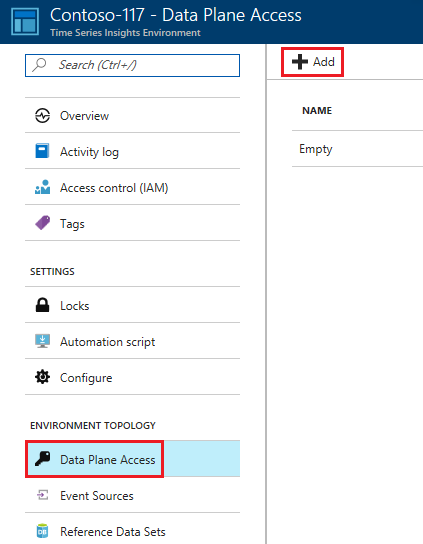
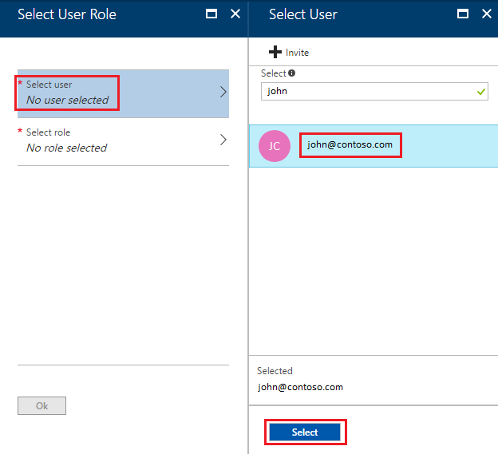
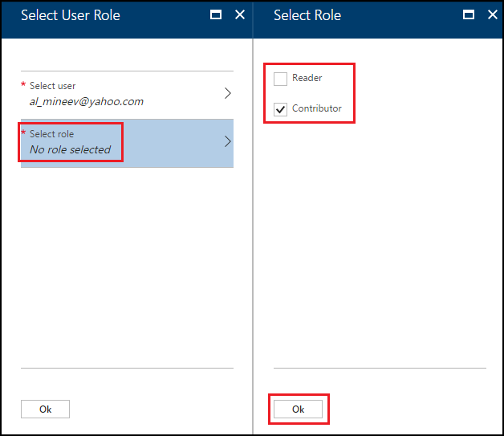
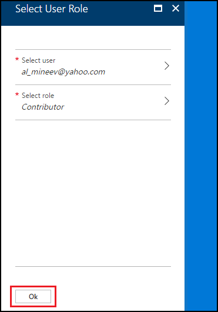
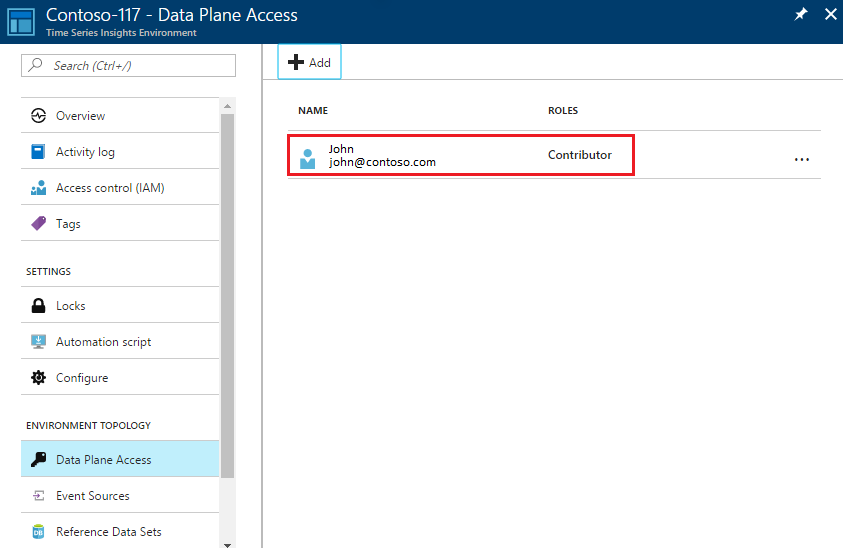

# Grant data access to a Time Series Insights environment using Azure portal

Time Series Insights environments have two independent types of access policies:

* Management access policies
* Data access policies

Both policies grant Azure Active Directory principals (users and apps) various permissions on a particular environment. The principals (users and apps) must belong to the active directory (or “Azure tenant”) associated with the subscription containing the environment.

Management access policies grant permissions related to the configuration of the environment, such as
*	Creation and deletion of the environment, event sources, reference data sets, and
*	Management of the data access policies.

Data access policies grant permissions to issue data queries, manipulate reference data in the environment, and share saved queries and perspectives associated with the environment.

The two kinds of policies allow clear separation between access to the management of the environment and access to the data inside the environment. For example, it is possible to setup an environment such that the owner/creator of the environment is removed from the data access. As well as users and services that are allowed to read data from the environment may be granted no access to the configuration of the environment.

## Grant data access
The following steps show how to grant data access for a user principal:

1.	Sign in to the [Azure portal](https://portal.azure.com).
2.	Click “All resources” in the menu on the left side of the Azure portal.
3.	Select your Time Series Insights environment.

  

4.	Select “Data Plane Access”, click “Add”

  

5.	Click “Select user”.
6.	Search and select user by the email.
7.	Click “Select” in “Select User” blade.

  

8.	Click “Select role”.
9.	Select “Contributor” if you want to allow user to change reference data and share saved queries and perspectives with other users of the environment. Otherwise select “Reader” to allow user query data in the environment and save personal (not shared) queries in the environment.
10.	Click “Ok” in the “Select Role” blade.

  

11.	Click “Ok” in the “Select User Role” blade.
12.	You should see:

  

## Next steps

* [Create an event source](time-series-insights-add-event-source.md)
* [Send events](time-series-insights-send-events.md) to the event source
* View your environment in [Time Series Insights Portal](https://insights.timeseries.azure.com)
