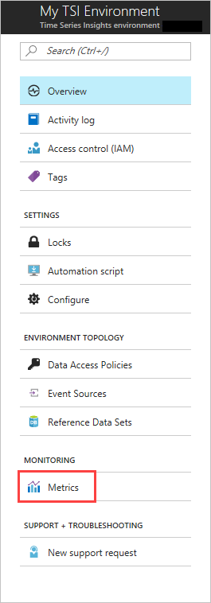
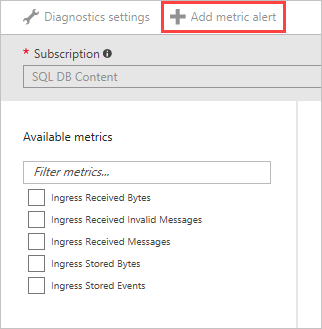
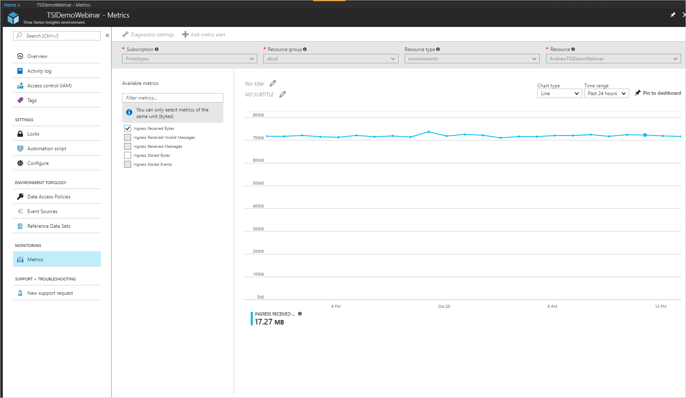

# Monitor and mitigate throttling to reduce latency in Azure Time Series Insights

When the amount of incoming data exceeds your environment's configuration, you may experience latency or throttling in Azure Time Series Insights.

You can avoid latency and throttling by properly configuring your environment for the amount of data you want to analyze.

You are most likely to experience latency and throttling when you:

- Add an event source that contains old data that may exceed your allotted ingress rate (Time Series Insights will need to catch up).
- Add more event sources to an environment, resulting in a spike from additional events (which could exceed your environment’s capacity).
- Push large amounts of historical events to an event source, resulting in a lag (Time Series Insights will need to catch up).
- Join reference data with telemetry, resulting in larger event size.  From a throttling perspective, an ingressed data packet with a packet size of 32 KB is treated as 32 events, each sized 1 KB. The maximum allowed event size is 32 KB; data packets larger than 32 KB are truncated.

## Video

### Learn about Time Series Insights data ingress behavior and how to plan for it. 

> [!VIDEO https://www.youtube.com/embed/npeZLAd9lxo]

## Monitor latency and throttling with alerts

Alerts can help you to help diagnose and mitigate latency issues caused by your environment.

1. In the Azure portal, select **Metrics**.

   

1. Select **Add metric alert**.  

   

From there, you can configure alerts using the following metrics:

|Metric  |Description  |
|---------|---------|
|**Ingress Received Bytes**     | Count of raw bytes read from event sources. Raw count usually includes the property name and value.  |  
|**Ingress Received Invalid Messages**     | Count of invalid messages read from all Azure Event Hubs or Azure IoT Hub event sources.      |
|**Ingress Received Messages**   | Count of messages read from all Event Hubs or IoT Hubs event sources.        |
|**Ingress Stored Bytes**     | Total size of events stored and available for query. Size is computed only on the property value.        |
|**Ingress Stored Events**     |   Count of flattened events stored and available for query.      |
|**Ingress Received Message Time Lag**    |  Difference in seconds between the time that the message is enqueued in the event source and the time it is processed in Ingress.      |
|**Ingress Received Message Count Lag**    |  Difference between the sequence number of last enqueued message in the event source partition and sequence number of message being processed in Ingress.      |

* If you are being throttled, you will see a value for the *Ingress Received Message Time Lag*, informing you of how many seconds behind your TSI is from the actual time the message hits the event source (excluding indexing time of appx. 30-60 seconds).  *Ingress Received Message Count Lag* should also have a value, allowing you to determine how many messages behind you are.  The easiest way to get caught up is to increase your environment's capacity to a size that will enable you to overcome the difference.  

  For example, if you have a single unit S1 environment and see that there is a 5,000,000 message lag, you could increase the size of your environment to six units for around a day to get caught up.  You could increase even further to catch up faster. The catch-up period is a common occurrence when initially provisioning an environment, particularly when you connect it to an event source that already has events in it or when you bulk upload lots of historical data.

* Another technique is to set an **Ingress Stored Events** alert >= a threshold slightly below your total environment capacity for a period of 2 hours.  This alert can help you understand if you are constantly at capacity, which indicates a high likelihood of latency. 

  For example, if you have three S1 units provisioned (or 2100 events per minute ingress capacity), you can set an **Ingress Stored Events** alert for >= 1900 events for 2 hours. If you are constantly exceeding this threshold, and therefore, triggering your alert, you are likely under-provisioned.  

* If you suspect you are being throttled, you can compare your **Ingress Received Messages** with your event source’s egressed messages.  If ingress into your Event Hub is greater than your **Ingress Received Messages**, your Time Series Insights are likely being throttled.

## Improving performance

To reduce throttling or experiencing latency, the best way to correct it is to increase your environment's capacity.

You can avoid latency and throttling by properly configuring your environment for the amount of data you want to analyze. For more information about how to add capacity to your environment, see [Scale your environment](time-series-insights-how-to-scale-your-environment.md).

## Next steps

- For additional troubleshooting steps, [Diagnose and solve problems in your Time Series Insights environment](time-series-insights-diagnose-and-solve-problems.md).

- For additional assistance, start a conversation on the [MSDN forum](https://social.msdn.microsoft.com/Forums/home?forum=AzureTimeSeriesInsights) or [Stack Overflow](https://stackoverflow.com/questions/tagged/azure-timeseries-insights). You can also contact [Azure support](https://azure.microsoft.com/support/options/) for assisted support options.
