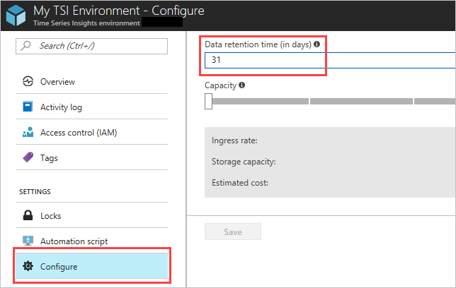

# Plan your Azure Time Series Insights GA environment

This article describes how to plan your Azure Time Series Insights general availability (GA) environment based on your expected ingress rate and your data retention requirements.

## Video

### Learn more about data retention in AzureTime Series Insights and how to plan for it. 

> [!VIDEO https://www.youtube.com/embed/03x6zKDQ6DU]

## Best practices

To get started with Time Series Insights, it’s best if you know how much data you expect to push by the minute as well as how long you need to store your data.  

For more information about capacity and retention for both Time Series Insights SKUs, see [Time Series Insights pricing](https://azure.microsoft.com/pricing/details/time-series-insights/).

Consider the following attributes to best plan the environment for long-term success:

- <a href="#understand-storage-capacity">Storage capacity</a>
- <a href="#understand-data-retention">Data retention period</a>
- <a href="#understand-ingress-capacity">Ingress capacity</a>
- <a href="#shape-your-events">Shaping your events</a>
- <a href="#ensure-you-have-reference-data">Ensuring you have reference data in place</a>

## Understand storage capacity

By default, Azure Time Series Insights retains data based on the amount of storage you have provisioned (units times amount of storage per unit) and ingress.

## Understand data retention

You can configure your Time Series Insights environment’s **Data retention time** setting, enabling up to 400 days of retention. Time Series Insights has two modes, one that optimizes for ensuring your environment has the most up-to-date data (on by default), and another that optimizes for ensuring retention limits are met, where ingress is paused if the overall storage capacity of the environment is hit.  You can adjust retention and toggle between the two modes in the environment’s configuration page in the Azure portal.

You can configure a maximum of 400 days of data retention in your Time Series Insights environment.

### Configure data retention

1. In the [Azure portal](https://portal.azure.com), select your Time Series Insights environment.

1. On the **Time Series Insights environment page**, under the **Settings** heading, select **Configure**.

1. In the **Data retention time (in days)** box, enter a value from 1 to 400.

   

> [!TIP]
> Learn more about implementing an appropriate data retention policy by reviewing [How to configure retention](./time-series-insights-how-to-configure-retention.md).

## Understand ingress capacity

The other area to focus on for planning is ingress capacity, which is a derivative of the per-minute allocation.

From a throttling perspective, an ingressed data packet with a packet size of 32 KB is treated as 32 events, each sized 1 KB. The maximum allowed event size is 32 KB; data packets larger than 32 KB are truncated.

The following table summarizes the ingress capacity for each SKU:

|SKU  |Events Count / Month / Unit  |Events size / Month / Unit  |Events Count / Minute / Unit  | Size / Minute / Unit   |
|---------|---------|---------|---------|---------|
|S1     |   30 million     |  30 GB     |  720    |  720 KB   |
|S2     |   300 million    |   300 GB   | 7,200   | 7,200 KB  |

You can increase the capacity of an S1 or S2 SKU to 10 units in a single environment. You cannot migrate from an S1 environment to an S2, or from an S2 environment to an S1.

For ingress capacity, you should first determine the total ingress you require on a per-month basis. Next, determine what your per-minute needs are, as this is where throttling and latency play a role.

If you have a spike in your data ingress lasting less than 24 hours, Time Series Insights can "catch-up" at an ingress rate of 2x the listed rates above.

For example, if you have a single S1 SKU and ingress data at a rate of 720 events per minute, and spike for less than 1 hour at a rate of 1440 events or less, there would be no noticeable latency to your environment. However, if you exceed 1440 events per minute for more than one hour, you would likely experience latency to data that is visualized and available for query in your environment.

You may not know in advance how much data you expect to push. In this case, you can find data telemetry for [Azure IoT Hub](https://docs.microsoft.com/azure/iot-hub/iot-hub-metrics) and [Azure Event Hubs](https://blogs.msdn.microsoft.com/cloud_solution_architect/2016/05/25/using-the-azure-rest-apis-to-retrieve-event-hub-metrics/) in your Azure portal. This telemetry can help you determine how to provision your environment. Use the **Metrics** page in the Azure portal for the respective event source to view its telemetry. If you understand your event source metrics, you can more effectively plan and provision your Time Series Insights environment.

### Calculate ingress requirements

- Confirm your ingress capacity is above your average per-minute rate and that your environment is large enough to handle your anticipated ingress equivalent to 2x your capacity for less than 1 hour.

- If ingress spikes occur that last for longer than 1 hour, use the spike rate as your average, and provision an environment with the capacity to handle the spike rate.

### Mitigate throttling and latency

For information about how to prevent throttling and latency, read about how to [Mitigate latency and throttling](time-series-insights-environment-mitigate-latency.md).

## Shape your events

It's important to ensure the way you send events to TSI supports the size of the environment you are provisioning (conversely, you can map the size of the environment to how many events TSI reads and the size of each event). Likewise, it's important to think about the attributes you may want to slice and filter by when querying your data.

> [!TIP]
> Review the JSON shaping documentation in [Sending events](https://docs.microsoft.com/azure/time-series-insights/time-series-insights-send-events).

## Ensure you have reference data

A **Reference Data Set** is a collection of items that augment the events from your event source. Time Series Insights ingress engine joins each event from your event source with the corresponding data row in your reference data set. This augmented event is then available for query. This join is based on the Primary Key column(s) defined in your reference data set.

Note, reference data is not joined retroactively. This means that only current and future ingress data is matched and joined to the reference date set, once it has been configured and uploaded.  If you plan to send lots of historical data to TSI and don't upload or create reference data in TSI first, then you may have to re-do your work (hint, not fun).  

To learn more about how to create, upload, and manage your reference data in TSI, head to our [Reference data set documentation](https://docs.microsoft.com/azure/time-series-insights/time-series-insights-add-reference-data-set).

[!INCLUDE [business-disaster-recover](../../includes/time-series-insights-business-recovery.md)]

## Next steps

- Get started by creating [a new Time Series Insights environment in the Azure portal](time-series-insights-get-started.md).

- Learn how to [add an Event Hub event source](time-series-insights-how-to-add-an-event-source-eventhub.md) to Time Series Insights.

- Read about how to [configure an IoT Hub event source](time-series-insights-how-to-add-an-event-source-iothub.md).
