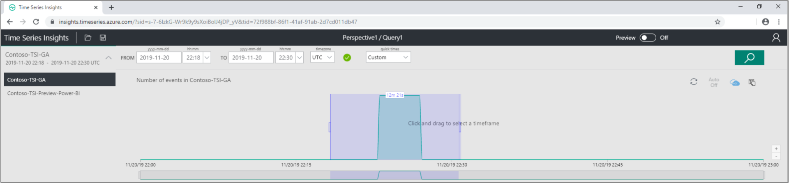
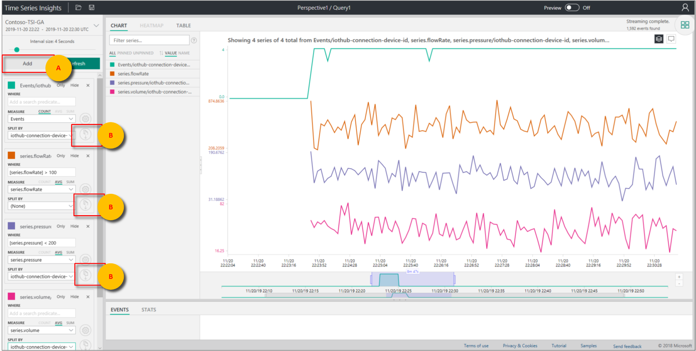
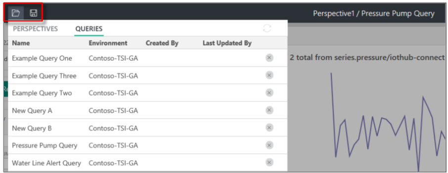
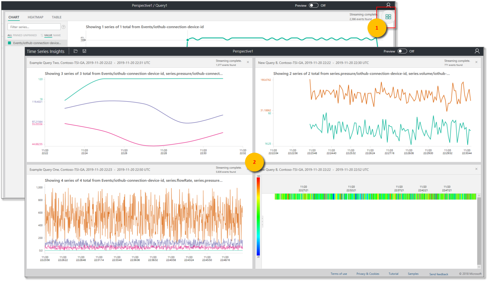
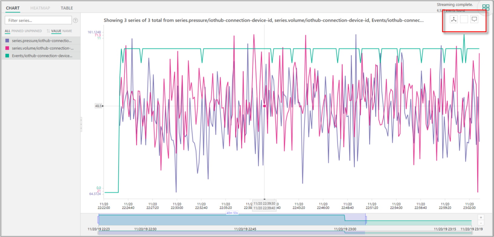
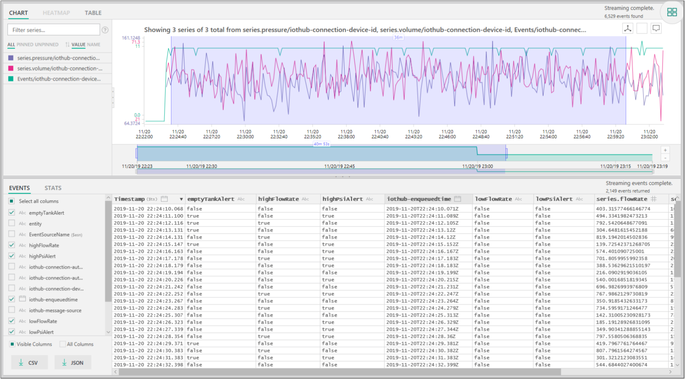

# Azure Time Series Insights explorer

This article describes the features and options in general availability for the Azure Time Series Insights [explorer web app](https://insights.timeseries.azure.com/). The Time Series Insights explorer demonstrates the powerful data visualization capabilities provided by the service and can be accessed within your own environment.

Azure Time Series Insights is a fully managed analytics, storage, and visualization service that makes it simple to explore and analyze billions of IoT events simultaneously. It gives you a global view of your data, which lets you quickly validate your IoT solution and avoid costly downtime to mission-critical devices. You can discover hidden trends, spot anomalies, and conduct root-cause analyses in near real time. The Time Series Insights explorer is currently in public preview.

> [!TIP]
> For a guided tour through the demonstration environment, read the [Azure Time Series Insights quickstart](time-series-quickstart.md).

## Video

### Learn about querying data by using the Time Series Insights explorer.  

> [!VIDEO https://www.youtube.com/embed/SHFPZvrR71s]

>[!NOTE]
>Play the preceding video <a href="https://www.youtube.com/watch?v=6ehNf6AJkFo">"Getting started with Time Series Insights by using an Azure IoT Solution Accelerator."</a>

## Prerequisites

Before you can use Time Series Insights explorer, you must:

- Create a Time Series Insights environment. For more information, read [How to get started with Time Series Insights](./time-series-insights-get-started.md).
- [Provide access](time-series-insights-data-access.md) to your account in the environment.
- Add an [IoT hub](time-series-insights-how-to-add-an-event-source-iothub.md) or [event hub](time-series-insights-how-to-add-an-event-source-eventhub.md) event source to it.

## Explore and query data

Within minutes of connecting your event source to your Time Series Insights environment, you can explore and query your time series data.

1. To start, open the [Time Series Insights explorer](https://insights.timeseries.azure.com/) in your web browser. On the left side of the window, select an environment. All environments that you have access to are listed in alphabetical order.

1. After you select an environment, either use the **From** and **To** configurations at the top, or select and drag over the timespan you want. Select the magnifying glass in the upper-right corner, or right-click on the selected timespan and select **Search**.

1. You also can refresh availability automatically every minute by selecting the **Auto On** button. The **Auto On** button only applies to the availability chart, not the content of the main visualization.

1. The Azure cloud icon takes you to your environment in the Azure portal.

   

1. Next, a chart that shows a count of all events during the selected timespan is displayed. Here you have a number of controls:

    - **Terms Editor panel**: The term space is where you query your environment. It’s found on the left side of the screen:
      - **MEASURE**: This drop-down list shows all numeric columns (**Doubles**).
      - **SPLIT BY**: This drop-down list shows categorical columns (**Strings**).
      - You can enable step interpolation, show minimum and maximum, and adjust the y-axis from the control panel next to **MEASURE**. You also can adjust whether data shown is a count, average, or sum of the data.
      - You can add up to five terms to view on the same x-axis. Select **Add** to add a fresh term or use the **Clone this term** button to add a copy of an existing term.

        

      - **Predicate**: Use the predicate to quickly filter your events by using the set of operands listed in the following table. If you conduct a search by selecting or clicking, the predicate automatically updates based on that search. Supported operand types include:

         |Operation  |Supported types  |Notes  |
         |---------|---------|---------|
         |**<**, **>**, **<=**, **>=**    |  **Double**, **DateTime**, **TimeSpan**       |         |
         |**=**, **!=**, **<>**     | **String**, **Bool**, **Double**, **DateTime**, **TimeSpan**, **NULL**        |         |
         |**IN**     | **String**, **Bool**, **Double**, **DateTime**, **TimeSpan**, **NULL**        |  All operands should be of the same type or be **NULL** constant.        |
         |**HAS**     | **String**        |  Only constant string literals are allowed at the right side. Empty string and **NULL** aren't allowed.       |

      - **Example queries**

         

1. You can use the **Interval Size** slider tool to zoom in and out of intervals over the same timespan. The slider provides more precise control of movement between large slices of time that show smooth trends down to slices as small as the millisecond, which allow you to display and analyze granular, high-resolution cuts of your data. The slider’s default starting point is set as the most optimal view of the data from your selection to balance resolution, query speed, and granularity.

1. The **Time brush** tool makes it easy to navigate from one timespan to another.

1. Select the **Save** icon to save your current query and share it with other users of the environment. When you select the **Open** icon, you can review all of your saved queries and any shared queries of other users in environments you have access to.

   

## Visualize data

1. Use the **Perspective View** tool for a simultaneous view of up to four unique queries. The **Perspective View** button is in the upper-right corner of the chart.

   

1. View a chart to visually explore your data, and use the **Chart** tools:

    - **Select** or **click** a specific timespan or a single data series.
    - Within a timespan selection, you can zoom or explore events.
    - Within a data series, you can split the series by another column, add the series as a new term, show only the selected series, exclude the selected series, ping that series, or explore events from the selected series.
    - In the filter area to the left of the chart, you can review all displayed data series and reorder by value or name. You also can view all data series or any pinned or unpinned series. You can select a single data series and split the series by another column, add the series as a new term, show only the selected series, exclude the selected series, pin that series, or explore events from the selected series.
    - When you view multiple terms simultaneously, you can stack, unstack, review additional data about a data series, and use the same y-axis across all terms. Use the buttons in the upper-right corner of the chart.

    

1. Use the **heatmap** to quickly spot unique or anomalous data series in a given query. Only one search term can be visualized as a heatmap.

    

1. When you explore events by selecting or right-clicking, the **EVENTS** panel is made available. Here, you can review all of your raw events and export your events as JSON or CSV files. Time Series Insights stores all raw data.

    

1. Select the **STATS** tab after you explore events to expose patterns and column stats.

    - **Patterns**: This feature proactively surfaces the most statistically significant patterns in a selected data region. You don't have to look at thousands of events to understand what patterns require the most time and energy. With Time Series Insights, you can jump directly into these statistically significant patterns to continue conducting an analysis. This feature is also helpful for post-mortem investigations into historical data.
    - **Column Stats**: Column stats provide charts and tables that break down data from each column of the selected data series over the selected timespan.

      

Now you've learned about the key features, configuration settings, and display options that are available in the Time Series Insights explorer web app.

## Next steps

- Learn how to [diagnose and solve problems](time-series-insights-diagnose-and-solve-problems.md) in your Time Series Insights environment.

- Take the guided [Azure Time Series Insights quickstart](time-series-quickstart.md) tour.
