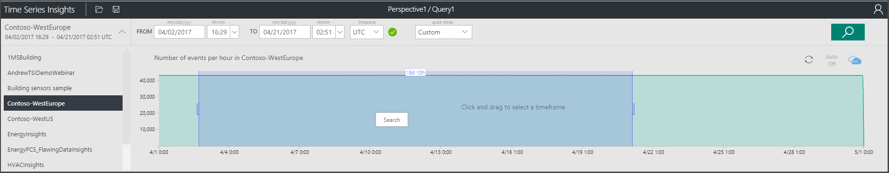
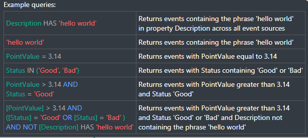
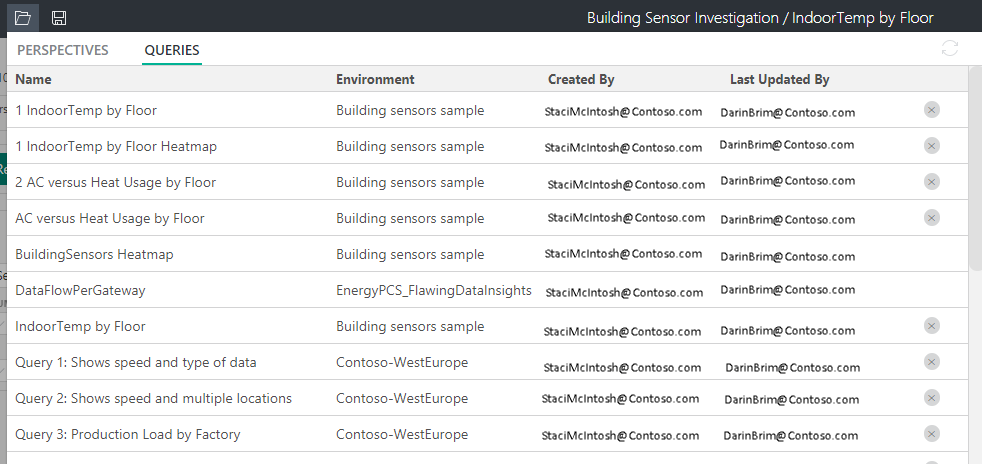
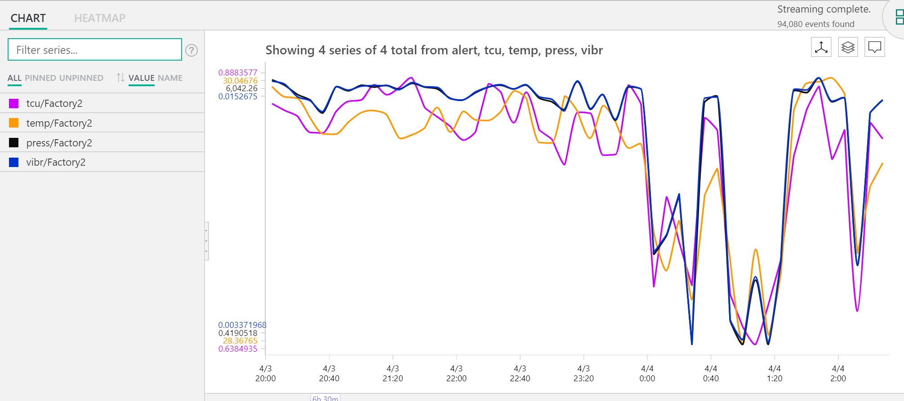
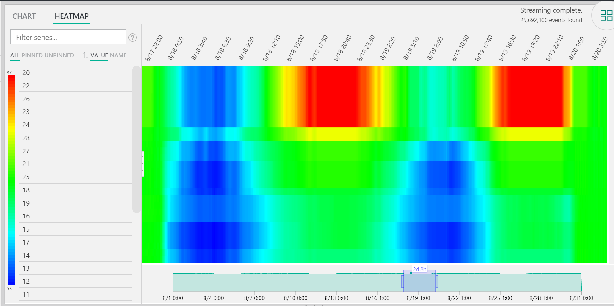
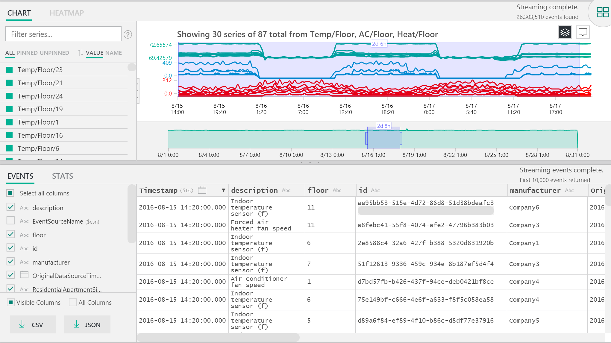
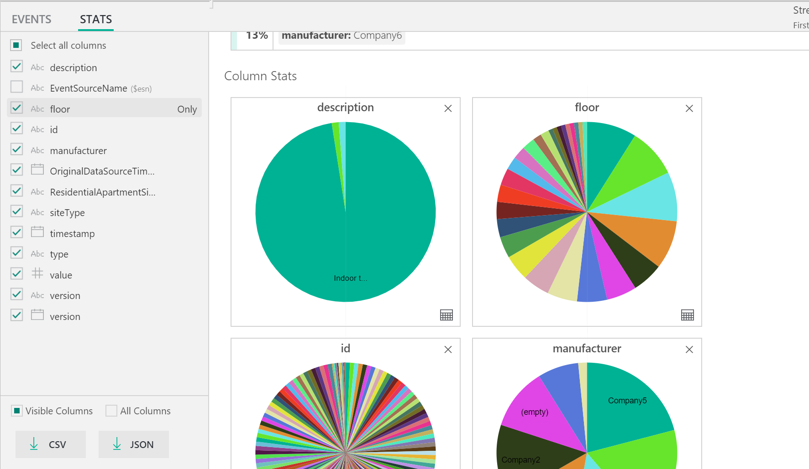

# Azure Time Series Insights explorer
This article explores the various features and options available within the Time Series Insights explorer web app. 
You use Time Series Insights explorer in your web browser to create visualizations of your data.
 
Azure Time Series Insights is a fully managed analytics, storage, and visualization service that makes it simple to explore and analyze billions of IoT events simultaneously. It gives you a global view of your data, which lets you quickly validate your IoT solution and avoid costly downtime to mission-critical devices. You can discover hidden trends, spot anomalies, and conduct root-cause analyses in near real time. The Time Series Insights explorer is currently in public preview.

## Video:

In this video, we cover querying data using the Time Series Insights explorer. 

This video builds on Video Time Series Insights:  
Getting starts with Time Series Insights using an Azure IoT Solution Accelerator.
 

> [!VIDEO https://www.youtube.com/embed/SHFPZvrR71s]

## Prerequisites

Before you can use Time Series Insights explorer, you must:
- Create a Time Series Insights environment
- Provide access to your account in the environment
- Add an event source to ingest data and store it

## Explore and query data
Within minutes of connecting your event source to your Time Series Insights environment, you can explore and query your time series data.

1. To start, open the [Time Series Insights explorer](https://insights.timeseries.azure.com/) in your web browser, and select an environment on the left side of the window. All environments that you have access to are listed in alphabetical order.

2. Once you select an environment, either use the **FROM** and **TO** configurations at the top, or click and drag over your desired time span.  Click the magnifying glass at the top right, or right-click over the selected timespan and select **Search**.  

3. You can also refresh availability automatically every minute, by selecting the **Auto On** button.  Note, the 'Auto-On' button only applies to the availability chart, not the content of the main visualization.

4. Notice, the Azure cloud icon takes you to your environment in the Azure portal.

   

5. Next, you see a chart that shows a count of all events during the selected timespan.  Here you have a number of controls:

    **Terms Editor Panel**:  The term space is where you query your environment.  It’s found on the left-hand side of the screen, enables 
      - **Measure**:  This drop down shows all numeric columns (Doubles)
      - **Split By**: This drop down shows categorical columns (Strings)
      - You can enable step interpolation, show minimum and maximum, and adjust the Y-axis from the control panel next to measure.  Additionally, you can adjust whether data shown is a count, average, or sum of the data.
      - You can add up to five terms to view on the same X-axis.  Use the **copy-down** button to add an additional term or click the **Add** button to add a fresh term.
     
        

      - **Predicate**:  The predicate enables you to quickly filter your events using the set of operands listed below. If you conduct a search by selecting/clicking, the predicate will automatically update based on that search.      Supported operand types include:

         |Operation  |Supported types  |Notes  |
         |---------|---------|---------|
         |<, >, <=, >=     |  Double, DateTime, TimeSpan       |         |
         |=, !=, <>     | String, Bool, Double, DateTime, TimeSpan, NULL        |         |
         |IN     | String, Bool, Double, DateTime, TimeSpan, NULL        |  All operands should be of the same type or be NULL constant.        |
         |HAS     | String        |  Only constant string literals are allowed at right-hand side. Empty string and NULL are not allowed.       |

      - **Examples of queries**
      
         

6. The **Interval Size** slider tool enables you to zoom in and out of intervals over the same timespan.  This provides more precise control of movement between large slices of time that show smooth trends down to slices as small as the millisecond, allowing you to see granular, high-resolution cuts of your data. The slider’s default starting point is set as the most optimal view of the data from your selection; balancing resolution, query speed, and granularity.

7. The **Time brush** tool makes it easy to navigate from one time span to another, putting intuitive UX front and center for seamless movement between time ranges.

8. The **Save** command lets you save your current query and enable it for sharing with other users of the environment. Using **Open**, you can see all of your saved queries and any shared queries of other users in environments you have access to. 

   

9. The **Perspective View** tool provides a simultaneous view of up to four unique queries. You can find the perspective view button in the upper right corner of the chart.  

   

10. The **Chart** lets you visually explore your data. Chart tools include:

   - Select/click, which enables a selection of a specific timespan or of a single data series.  
   - Within a time span selection, you can zoom or explore events.  
   - Within a data series, you can split the series by another column, add the series as a new term, show only the selected series, exclude the selected series, ping that series, or explore events from the selected series.
   - In the filter area to the left of the chart, you can see all displayed data series and reorder by value or name, view all data series or specifically pinned or unpinned series.  You can also select a single data series and split the series by another column, add the series as a new term, show only the selected series, exclude the selected series, pin that series, or explore events from the selected series.
   - When viewing multiple terms simultaneously, you can stack, unstack, see additional data about a data series, and use the same Y-axis across all terms with the buttons in the top right-hand corner of the chart.
 
    

11. The **heatmap** can be used to quickly spot unique or anomalous data series in a given query. Only one search term can be visualized as a heatmap.    

   

12. **Events**:  When you choose explore events when selecting or right-clicking above, the events panel is made available.  Here, you can see all of your raw events and export your events as JSON or CSV files. Note that Time Series Insights stores all raw data.

   

13. Click the **STATS** tab after exploring events to expose patterns and column stats.  

   - **Patterns**: this feature proactively surfaces the most statistically significant patterns in a selected data region. This relieves you from having to look at thousands of events to understand what patterns most warrant time and energy. Further, Time Series Insights enables you to jump directly into these statistically significant patterns to continue conducting an analysis. This feature is also helpful for post-mortem investigations into historical data. 

   - **Column Stats**:  Column stats provide charting and tables that break down data from each column of the selected data series over the selected time span.  
 
       

Now you have seen the various features and options available within the Time Series Insights explorer web app. 

## Next steps
> [!div class="nextstepaction"]
>[Diagnose and solve problems in your Time Series Insights environment](time-series-insights-diagnose-and-solve-problems.md)
