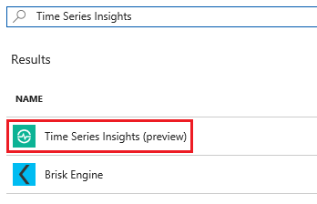
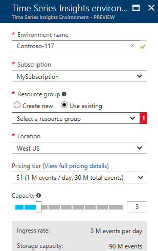
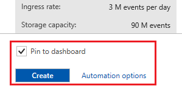

# Create a new Time Series Insights environment in the Azure portal

Time Series Insights environment is an Azure resource with ingress and storage capacity. Customers provision environments via the Azure portal with the required capacity.

## Steps to create the environment

Follow these steps to create your environment:

1.	Sign in to the [Azure portal](https://portal.azure.com).
2.	Click the plus sign (“+”) in the top left corner.
3.	Search for “Time Series Insights” in the search box.

  

4.	Select “Time Series Insights”, click “Create”.

  

5.	Specify environment name. This name will represent the environment in [time series explorer](https://insights.timeseries.azure.com).
6.	Select a subscription. Choose one that contains your event source. Time Series Insights can auto-detect Azure IoT Hub and Event Hub resources existing in the same subscription.
7.	Select or create a resource group. A resource group is a collection of Azure resources used together.
8.	Select a hosting location. To avoid moving data across data centers, choose location that contains your event source.
9.	Select a pricing tier.
10.	Select capacity. You can change capacity of an environment after creation.
11.	Create your environment. You can also pin your environment to the dashboard for easy access whenever you sign in.

  

## Next steps

* [Define data access policies](time-series-insights-data-access.md) to access your environment in [Time Series Insights Portal](https://insights.timeseries.azure.com)
* [Create an event source](time-series-insights-add-event-source.md)
* [Send events](time-series-insights-send-events.md) to the event source
