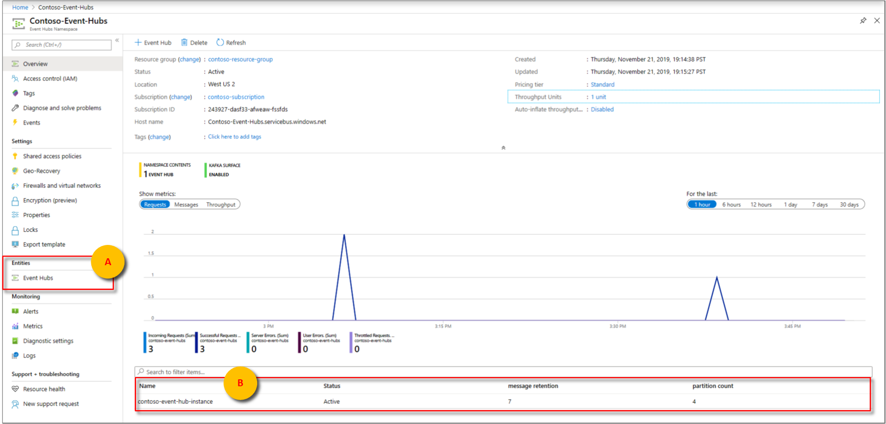
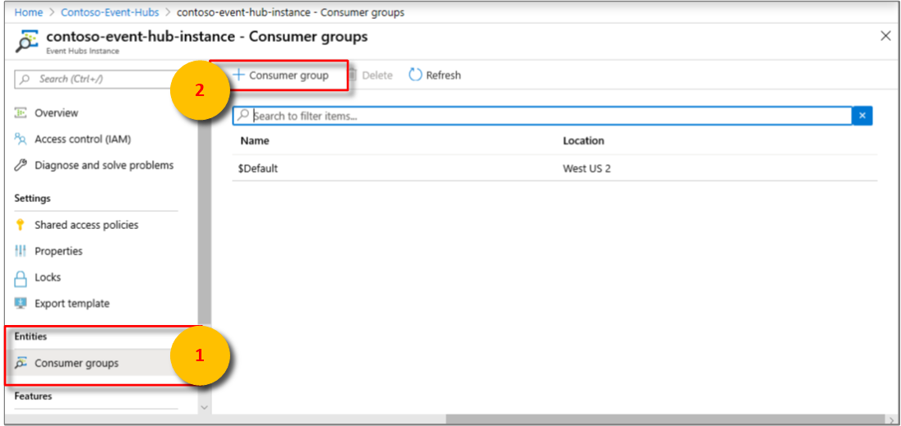
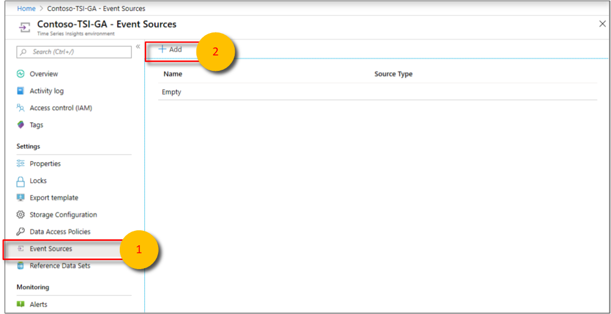
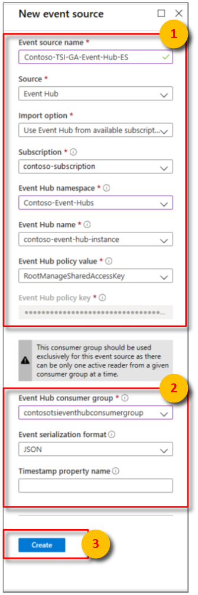

# Add an event hub event source to your Time Series Insights environment

This article describes how to use the Azure portal to add an event source that reads data from Azure Event Hubs to your Azure Time Series Insights environment.

> [!NOTE]
> The steps that are described in this article apply both to the Time Series Insights GA and Time Series Insights Preview environments.

## Prerequisites

- Create a Time Series Insights environment as described in [Create an Azure Time Series Insights environment](./time-series-insights-update-create-environment.md).
- Create an event hub. Read [Create an Event Hubs namespace and an event hub by using the Azure portal](../event-hubs/event-hubs-create.md).
- The event hub must have active message events sent to it. Learn how to [Send events to Azure Event Hubs by using the .NET Framework](../event-hubs/event-hubs-dotnet-framework-getstarted-send.md).
- Create a dedicated consumer group in the event hub that the Time Series Insights environment can consume from. Each Time Series Insights event source must have its own dedicated consumer group that isn't shared with any other consumer. If multiple readers consume events from the same consumer group, all readers are likely to exhibit failures. There's a limit of 20 consumer groups per event hub. For details, read the [Event Hubs programming guide](../event-hubs/event-hubs-programming-guide.md).

### Add a consumer group to your event hub

Applications use consumer groups to pull data from Azure Event Hubs. To reliably read data from your event hub, provide a dedicated consumer group that's used only by this Time Series Insights environment.

To add a new consumer group in your event hub:

1. In the [Azure portal](https://portal.azure.com), locate and open your event hub instance from the **Overview** pane of your event hub namespace. Select **Entities > Event Hubs** or find your instance under **Name**.

    

1. In your event hub instance, select **Entities > Consumer groups**. Then, select **+ Consumer group** to add a new consumer group. 

   

   Otherwise, select an existing consumer group and skip to the next section.

1. On the **Consumer groups** page, enter a new unique value for **Name**.  Use this same name when you create a new event source in the Time Series Insights environment.

1. Select **Create**.

## Add a new event source

1. Sign in to the [Azure portal](https://portal.azure.com).

1. Locate your existing Time Series Insights environment. In the left menu, select **All resources**, and then select your Time Series Insights environment.

1. Select **Event Sources**, and then select **Add**.

   

1. Enter a value for **Event source name** that is unique to this Time Series Insights environment, such as `Contoso-TSI-GA-Event-Hub-ES`.

1. For **Source**, select **Event Hub**.

1. Select the appropriate values for **Import option**:

   * If you have an existing event hub in one of your subscriptions, select **Use Event Hub from available subscriptions**. This option is the easiest approach.

     

    *  The following table describes the required properties for the **Use Event Hub from available subscriptions** option:

       

       | Property | Description |
       | --- | --- |
       | Subscription | The subscription the desired event hub instance and namespace belongs to. |
       | Event Hub namespace | The event hub namespace the desired event hub instance belongs to. |
       | Event Hub name | The name of the desired event hub instance. |
       | Event Hub policy value | Select the desired shared access policy. You can create the shared access policy on the event hub **Configure** tab. Each shared access policy has a name, permissions that you set, and access keys. The shared access policy for your event source *must* have **read** permissions. |
       | Event Hub policy key | Pre-populated from the selected Event Hub policy value. |

    * If the event hub is external to your subscriptions or if you want to select advanced options, select **Provide Event Hub settings manually**.

       The following table describes the required properties for the **Provide Event Hub settings manually** option:
 
       | Property | Description |
       | --- | --- |
       | Subscription ID | The subscription the desired event hub instance and namespace belongs to. |
       | Resource group | The resource group the desired event hub instance and namespace belongs to. |
       | Event Hub namespace | The event hub namespace the desired event hub instance belongs to. |
       | Event Hub name | The name of the desired event hub instance. |
       | Event Hub policy value | Select the desired shared access policy. You can create the shared access policy on the event hub **Configure** tab. Each shared access policy has a name, permissions that you set, and access keys. The shared access policy for your event source *must* have **read** permissions. |
       | Event Hub policy key | The shared access key that's used to authenticate access to the Service Bus namespace. Enter the primary or secondary key here. |

    * Both options share the following configuration options:

       | Property | Description |
       | --- | --- |
       | Event Hub consumer group | The consumer group that reads events from the event hub. We highly recommend that you use a dedicated consumer group for your event source. |
       | Event serialization format | Currently, JSON is the only available serialization format. Event messages must be in this format or data can't be read. |
       | Timestamp property name | To determine this value, you need to understand the message format of the message data that's sent to the event hub. This value is the **name** of the specific event property in the message data that you want to use as the event timestamp. The value is case-sensitive. If left blank, the **event enqueue time** in the event source is used as the event timestamp. |

1. Add the dedicated Time Series Insights consumer group name that you added to your event hub.

1. Select **Create**.

   After the event source is created, Time Series Insights automatically begins streaming data to your environment.

## Next steps

* [Define data access policies](time-series-insights-data-access.md) to secure the data.

* [Send events](time-series-insights-send-events.md) to the event source.

* Access your environment in the [Time Series Insights explorer](https://insights.timeseries.azure.com).
