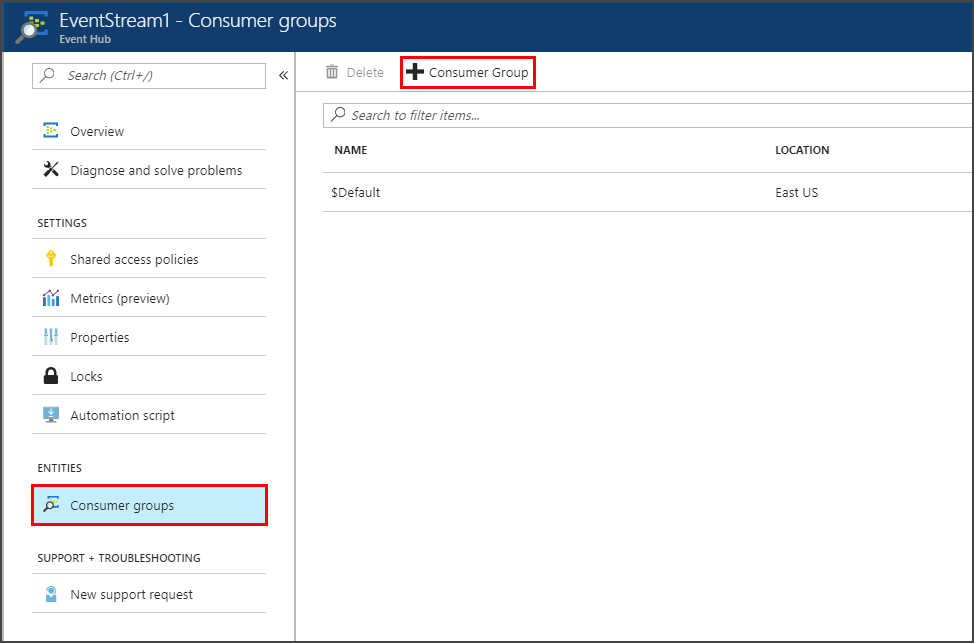
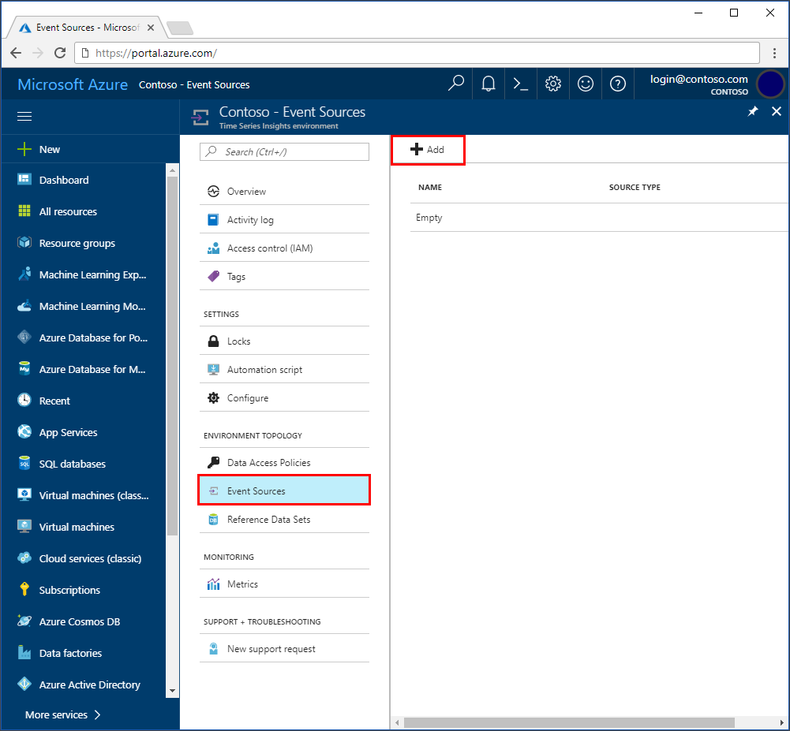
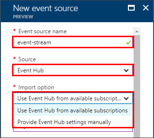
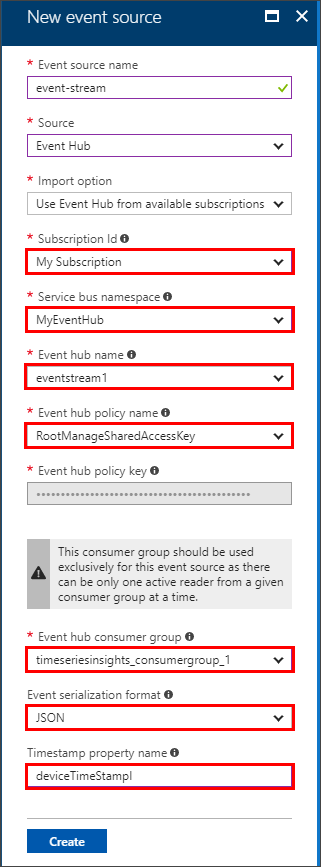

# How to add an Event Hub event source to Time Series Insights environment

This article describes how to use the Azure portal to add an event source that reads data from an Event Hub into your Time Series Insights environment.

## Prerequisites
- Create a Time Series Insights environment. For more information, see [Create an Azure Time Series Insights environment](time-series-insights-get-started.md) 
- Create an Event Hub. For more information on Event Hubs, see [Create an Event Hubs namespace and an event hub using the Azure portal](../event-hubs/event-hubs-create.md)
- The Event Hub needs to have active message events being sent in. For more information, see [Send events to Azure Event Hubs using the .NET Framework](../event-hubs/event-hubs-dotnet-framework-getstarted-send.md).
- Create a dedicated consumer group in Event Hub for the Time Series Insight environment to consume from. Each Time Series Insights event source needs to have its own dedicated consumer group that is not shared with any other consumers. If multiple readers consume events from the same consumer group, all readers are likely to see failures. Note that there is also a limit of 20 consumer groups per Event Hub. For details, see the [Event Hubs Programming Guide](../event-hubs/event-hubs-programming-guide.md).

### Add a consumer group to your Event Hub
Consumer groups are used by applications to pull data from Azure Event Hubs. Provide a dedicated consumer group, for use by this Time Series Insights environment only, to reliably read data from your Event Hub.

To add a new consumer group in your Event Hub, follow these steps:
1. In the Azure portal, locate and open your Event Hub.

2. Under the **Entities** heading, select **Consumer groups**.

   

3. Select **+ Consumer Group** to add a new consumer group. 

4. On the **Consumer groups** page, provide a new unique **Name**.  Use this same name when creating a new event source in the Time Series Insights environment.

5. Select **Create** to create the new consumer group.

## Add a new event source
1. Sign in to the [Azure portal](https://portal.azure.com).

2. Locate your existing Time Series Insights environment. Click **All resources** in the menu on the left side of the Azure portal. Select your Time Series Insights environment.

3. Under the **Environment Topology** heading, click **Event Sources**.

   

4. Click **+ Add**.

5. Provide an **Event source name** unique to this Time Series Insights environment, such as **event-stream**.

   

6. Select the **Source** as **Event Hub**.

7. Select the appropriate **Import option**. 
   - Choose **Use Event Hub from available subscriptions** when you already have an existing Event Hub on one of your subscriptions. This is the easiest approach.
   - Choose **Provide Event Hub settings manually** when the Event Hub is external to your subscriptions, or you wish to choose advanced options. 

8. If you have selected the **Use Event Hub from available subscriptions** option, the following table explains each required property:

   

   | Property | Description |
   | --- | --- |
   | Subscription Id | Select the subscription in which this event hub was created.
   | Service bus namespace | Select the Service Bus namespace that contains the Event Hub.
   | Event hub name | Select the name of the Event Hub.
   | Event hub policy name | Select the shared access policy, which can be created on the Event Hub Configure tab. Each shared access policy has a name, permissions that you set, and access keys. The shared access policy for your event source *must* have **read** permissions.
   | Event hub policy key | The key value may be prepopulated.
   | Event hub consumer group | The consumer group to read events from the Event Hub. It is highly recommended to use a dedicated consumer group for your event source. |
   | Event serialization format | JSON is the only available serialization at present. The event messages must be in this format, or no data can be read. |
   | Timestamp property name | To determine this value, you need to understand the message format of the message data sent into Event Hub. This value is the **name** of the specific event property in the message data that you want to use as the event timestamp. The value is case-sensitive. When left blank, the **event enqueue time** within the event source is used as the event timestamp. |

9. If you have selected the **Provide Event Hub settings manually** option, the following table explains each required property:

   | Property | Description |
   | --- | --- |
   | Subscription ID | The subscription in which this event hub was created.
   | Resource group | The resource group in which this event hub was created.
   | Service bus namespace | A Service Bus namespace is a container for a set of messaging entities. When you created a new Event Hub, you also created a Service Bus namespace.
   | Event hub name | The name of your Event Hub. When you created your event hub, you also gave it a specific name.
   | Event hub policy name | The shared access policy, which can be created on the Event Hub Configure tab. Each shared access policy has a name, permissions that you set, and access keys. The shared access policy for your event source *must* have **read** permissions.
   | Event hub policy key | The Shared Access key used to authenticate access to the Service Bus namespace. Type the primary or secondary key here.
   | Event hub consumer group | The Consumer Group to read events from the Event Hub. It is highly recommended to use a dedicated consumer group for your event source.
   | Event serialization format | JSON is the only available serialization at present. The event messages must be in this format, or no data can be read. |
   | Timestamp property name | To determine this value, you need to understand the message format of the message data sent into Event Hub. This value is the **name** of the specific event property in the message data that you want to use as the event timestamp. The value is case-sensitive. When left blank, the **event enqueue time** within the event source is used as the event timestamp. |

10. Add the dedicated TSI consumer group name that you added to your Event hub.

11. Select **Create** to add the new event source.
   
   

   After creation of the event source, Time Series Insights will automatically start streaming data into your environment.

## Next steps
- [Define data access policies](time-series-insights-data-access.md) to secure the data.
- [Send events](time-series-insights-send-events.md) to the event source.
- Access your environment in the [Time Series Insights explorer](https://insights.timeseries.azure.com).
