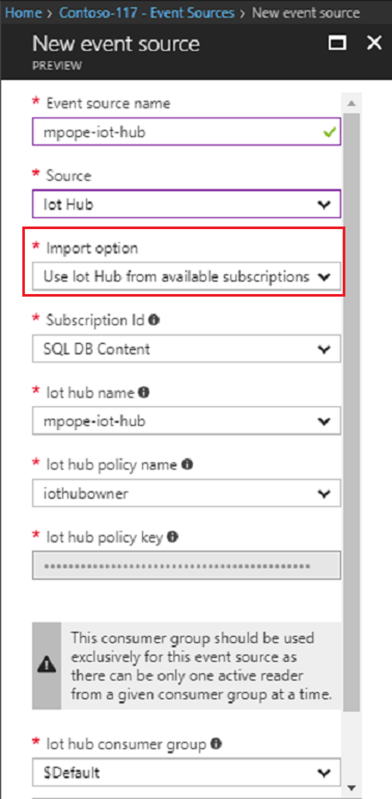
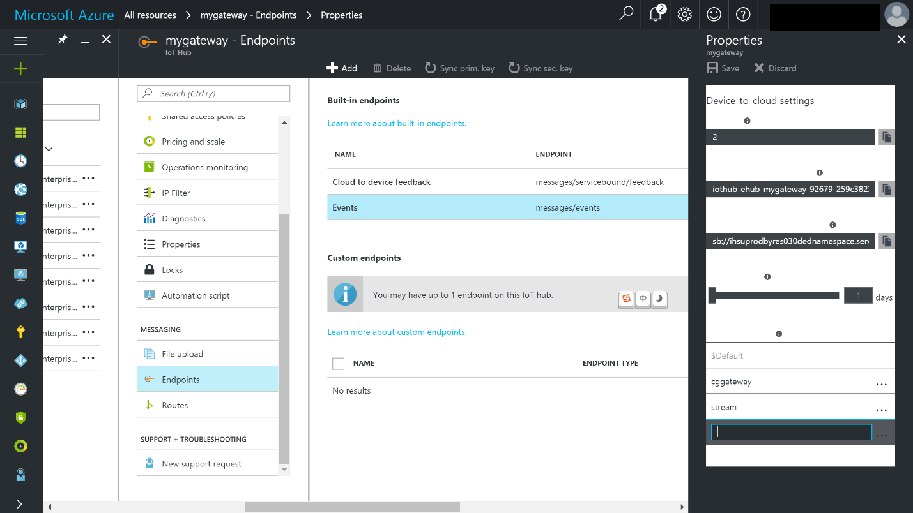

# How to add an IoT Hub event source to Time Series Insights environment
This article describes how to use the Azure portal to add an event source that reads data from an IoT Hub into your Time Series Insights  environment.

## Prerequisites
- Create a Time Series Insights environment. For more information, see [Create an Azure Time Series Insights environment](time-series-insights-get-started.md) 
- Create an IoT Hub. For more information on IoT Hubs, see [Create an IoT hub using the Azure portal](../iot-hub/iot-hub-create-through-portal.md)
- The IoT Hub needs to have active message events being sent in.
- Create a dedicated consumer group in IoT Hub for the Time Series Insight environment to consume from. Each Time Series Insights event source needs to have its own dedicated consumer group that is not shared with any other consumers. If multiple readers consume events from the same consumer group, all readers are likely to see failures. For details, see the [IoT Hub developer guide](../iot-hub/iot-hub-devguide.md).

## Add a new event source
1. Sign in to the [Azure portal](https://portal.azure.com).

2. Locate your existing Time Series Insights environment. Click **All resources** in the menu on the left side of the Azure portal. Select your Time Series Insights environment.

2. Under the **Environment Topology** heading, click **Event Sources**.

3. Click **Add**.

4. Provide an **Event source name** unique to this Time Series Insights environment, such as **IoTSource1**.

5. Select the **Source** as **IoT Hub**.

6. Select the appropriate **Import option**. 
   - If you already have an existing IoT Hub on one of your subscriptions, it is easiest to select **Use IoT Hub from available subscriptions**. 
   - If the IoT Hub is external to your subscriptions, or you wish to choose advanced options, choose **Provide IoT Hub settings manually**. 
   
   

7. If you have selected the **Use IoT Hub from available subscriptions** option, the following table explains each required property:

   | Property | Description |
   | --- | --- |
   | Subscription Id | Select the subscription in which this IoT hub was created.
   | Service bus namespace | Select the Service Bus namespace that contains the IoT Hub.
   | IoT hub name | Select the name of the IoT Hub.
   | IoT hub policy name | Select the shared access policy, which can be found on the IoT Hub settings tab. Each shared access policy has a name, permissions that you set, and access keys. The shared access policy for your event source *must* have **service connect** permissions.
   | IoT hub policy key | The key is prepopulated.
   | IoT hub consumer group | The consumer group to read events from the IoT Hub. It is highly recommended to use a dedicated consumer group for your event source.

8. If you have selected the **Provide IoT Hub settings manually** option, the following table explains each required property:

   | Property | Description |
   | --- | --- |
   | Subscription Id | The subscription in which this IoT hub was created.
   | Resource group | The resource group name in which this IoT hub was created.
   | Service bus namespace | A service bus namespace is a container for a set of messaging entities. When you created a new IoT Hub, you also created a Service Bus namespace.
   | IoT hub name | The name of your IoT Hub. When you created your IoT hub, you also gave it a specific name.
   | IoT hub policy name | The shared access policy, which can be created on the IoT Hub settings tab. Each shared access policy has a name, permissions that you set, and access keys. The shared access policy for your event source *must* have **service connect** permissions.
   | IoT hub policy key | The shared access key used to authenticate access to the Service Bus namespace. Type the primary or secondary key here.
   | IoT hub consumer group | The consumer group to read events from the IoT Hub. It is highly recommended to use a dedicated consumer group for your event source.

9. Select the **Event serialization format**. JSON is the only available serialization at present.

10. It is recommended to provide a **Timestamp property name**. You need to know the message format of the event data to make this decision. This is the name of the event property in the message data that should be used as the event timestamp. When not specified, event enqueue time within the event source is used as the event timestamp.

11. Select **Create** to add the new event source.

After creation of the event source, Time Series Insights will automatically start streaming data into your environment.

### Add a consumer group to your IoT hub
Consumer groups are used by applications to pull data from Azure IoT Hub.  You need to create a consumer group to be used by Time Series Insights to reliably read data from your IoT hub.

To add a consumer group to your IoT hub, follow these steps:
1. In the Azure portal, locate and open your IoT hub.

2. Select **Endpoints**, select **Events** on the middle pane.

3. Provide a new name under **Consumer groups** on the right pane, and then click **Save**. Use this same name in Time Series Insights environment when creating a new event source.

   

## Next steps
- [Define data access policies](time-series-insights-data-access.md) to secure the data.
- [Send events](time-series-insights-send-events.md) to the event source.
- Access your environment in the [Time Series Insights explorer](https://insights.timeseries.azure.com).
