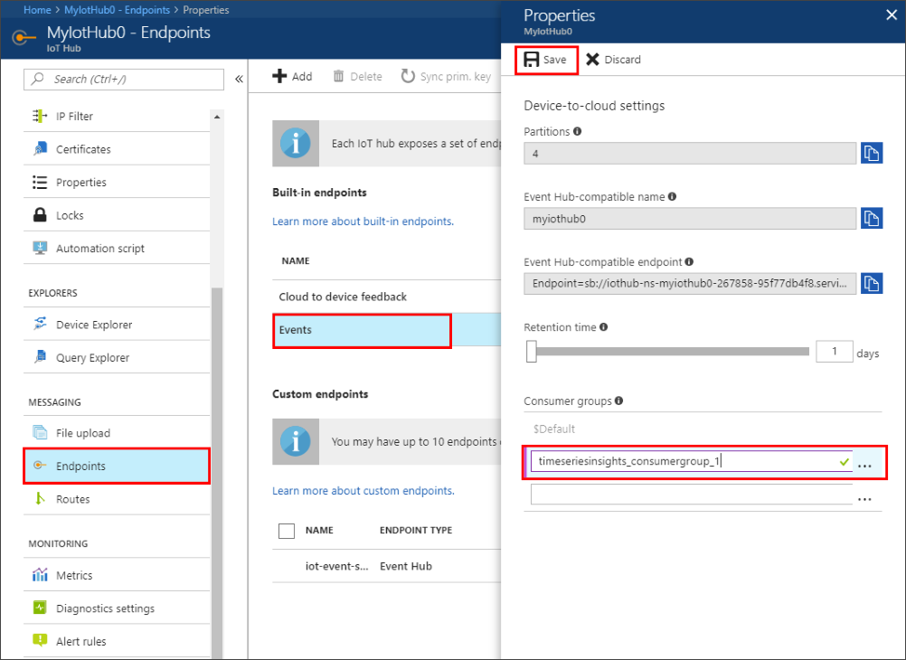
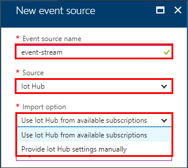
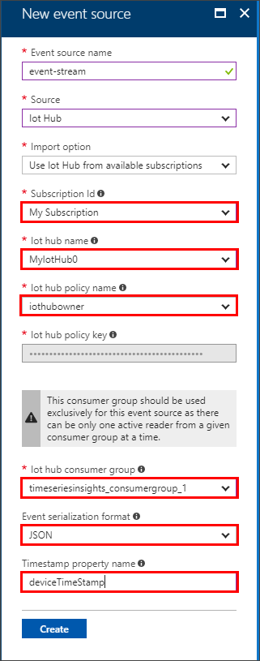
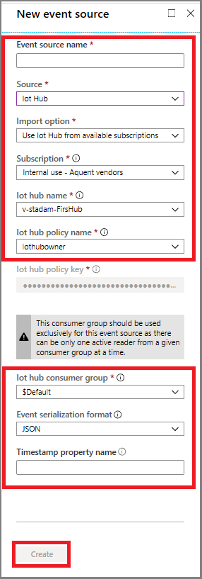

# How to add an IoT Hub event source to Time Series Insights environment
This article describes how to use the Azure portal to add an event source that reads data from an IoT Hub into your Time Series Insights  environment.

## Prerequisites
- Create a Time Series Insights environment. For more information, see [Create an Azure Time Series Insights environment](time-series-insights-get-started.md) 
- Create an IoT Hub. For more information on IoT Hubs, see [Create an IoT Hub using the Azure portal](../iot-hub/iot-hub-create-through-portal.md)
- The IoT Hub needs to have active message events being sent in.
- Create a dedicated consumer group in IoT Hub for the Time Series Insight environment to consume from. Each Time Series Insights event source needs to have its own dedicated consumer group that is not shared with any other consumers. If multiple readers consume events from the same consumer group, all readers are likely to see failures. For details, see the [IoT Hub developer guide](../iot-hub/iot-hub-devguide.md).

### Add a consumer group to your IoT Hub
Consumer groups are used by applications to pull data from Azure IoT Hubs. Provide a dedicated consumer group, for use by this Time Series Insights environment only, to reliably read data from your IoT Hub.

To add a new consumer group to your IoT Hub, follow these steps:
1. In the Azure portal, locate and open your IoT Hub.

2. Under the **Messaging** heading, select **Endpoints**. 

   

3. Select the **Events** endpoint, and the **Properties** page opens.

4. Under the **Consumer groups** heading, provide a new unique name for the consumer group. Use this same name in Time Series Insights environment when creating a new event source.

5. Select **Save** to save the new consumer group.

## Add a new event source
1. Sign in to the [Azure portal](https://portal.azure.com).

2. Locate your existing Time Series Insights environment. Click **All resources** in the menu on the left side of the Azure portal. Select your Time Series Insights environment.

3. Under the **Environment Topology** heading, click **Event Sources**.
   

4. Click **+ Add**.

5. Provide an **Event source name** unique to this Time Series Insights environment, such as **event-stream**.

   

6. Select the **Source** as **IoT Hub**.

7. Select the appropriate **Import option**. 
   - Choose **Use IoT Hub from available subscriptions** when you already have an existing IoT Hub on one of your subscriptions. This is the easiest approach.
   - Choose **Provide IoT Hub settings manually** when the IoT Hub is external to your subscriptions, or you wish to choose advanced options. 

8. If you have selected the **Use IoT Hub from available subscriptions** option, the following table explains each required property:

   

   | Property | Description |
   | --- | --- |
   | Subscription ID | Select the subscription in which this IoT Hub was created.
   | IoT Hub name | Select the name of the IoT Hub.
   | IoT Hub policy name | Select the shared access policy, which can be found on the IoT Hub settings tab. Each shared access policy has a name, permissions that you set, and access keys. The shared access policy for your event source *must* have **service connect** permissions.
   | IoT Hub policy key | The key is prepopulated.
   | IoT Hub consumer group | The consumer group to read events from the IoT Hub. It is highly recommended to use a dedicated consumer group for your event source.
   | Event serialization format | JSON is the only available serialization at present. The event messages must be in this format, or no data can be read. |
   | Timestamp property name | To determine this value, you need to understand the message format of the message data sent into IoT Hub. This value is the **name** of the specific event property in the message data that you want to use as the event timestamp. The value is case-sensitive. When left blank, the **event enqueue time** within the event source is used as the event timestamp. |

9. If you have selected the **Provide IoT Hub settings manually** option, the following table explains each required property:

   | Property | Description |
   | --- | --- |
   | Subscription ID | The subscription in which this IoT Hub was created.
   | Resource group | The resource group name in which this IoT Hub was created.
   | IoT Hub name | The name of your IoT Hub. When you created your IoT Hub, you also gave it a specific name.
   | IoT Hub policy name | The shared access policy, which can be created on the IoT Hub settings tab. Each shared access policy has a name, permissions that you set, and access keys. The shared access policy for your event source *must* have **service connect** permissions.
   | IoT Hub policy key | The shared access key used to authenticate access to the Service Bus namespace. Type the primary or secondary key here.
   | IoT Hub consumer group | The consumer group to read events from the IoT Hub. It is highly recommended to use a dedicated consumer group for your event source.
   | Event serialization format | JSON is the only available serialization at present. The event messages must be in this format, or no data can be read. |
   | Timestamp property name | To determine this value, you need to understand the message format of the message data sent into IoT Hub. This value is the **name** of the specific event property in the message data that you want to use as the event timestamp. The value is case-sensitive. When left blank, the **event enqueue time** within the event source is used as the event timestamp. |

10. Add the dedicated TSI consumer group name that you added to your IoT Hub.

11. Select **Create** to add the new event source.

   

   After creation of the event source, Time Series Insights will automatically start streaming data into your environment.

## Next steps
- [Define data access policies](time-series-insights-data-access.md) to secure the data.
- [Send events](time-series-insights-send-events.md) to the event source.
- Access your environment in the [Time Series Insights explorer](https://insights.timeseries.azure.com).
