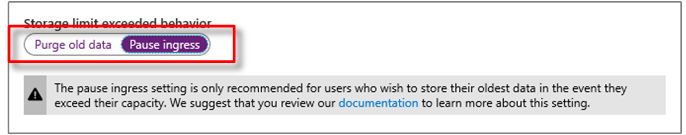

# Configuring retention in Time Series Insights

This article describes how to configure **Data retention time** and **Storage limit exceeded behavior** in Azure Time Series Insights.

## Summary

Each Azure Time Series Insights environment has a setting to configure **Data retention time**. The value spans from 1 to 400 days. The data is deleted based on the environment storage capacity or retention duration (1-400), whichever comes first.

Each Time Series Insights environment has an additional setting **Storage limit exceeded behavior**. This setting controls ingress and purge behavior when the max capacity of an environment is reached. There are two behaviors to choose from:

- **Purge old data** (default)
- **Pause ingress**

For detailed information to better understand these settings, review [Understanding retention in Time Series Insights](time-series-insights-concepts-retention.md).  

## Configure data retention

1. Sign in to the [Azure portal](https://portal.azure.com).

1. Locate your existing Time Series Insights environment. Select **All resources** in the menu on the left side of the Azure portal. Select your Time Series Insights environment.

1. Under the **Settings** heading, select **Storage Configuration**.

    

1. Select the **Data retention time (in days)** to configure the retention using the slider bar or type a number in text box.

1. Note the **Capacity** setting, since this configuration impacts the maximum amount of data events and total storage capacity for storing data.

1. Toggle the **Storage limit exceeded behavior** setting. Select **Purge old data** or **Pause ingress** behavior.

    

1. Review the documentation to understand the potential risks of data loss. Select **Save** to configure the changes.

## Next steps

- For more information, review [Understanding retention in Time Series Insights](time-series-insights-concepts-retention.md).

- Learn [how to scale your Time Series Insights environment](time-series-insights-how-to-scale-your-environment.md).

- Learn about [planning out your environment](time-series-insights-environment-planning.md).
