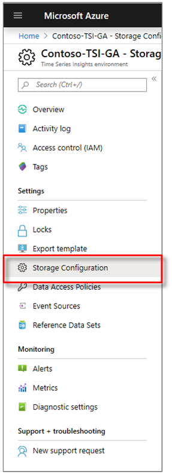
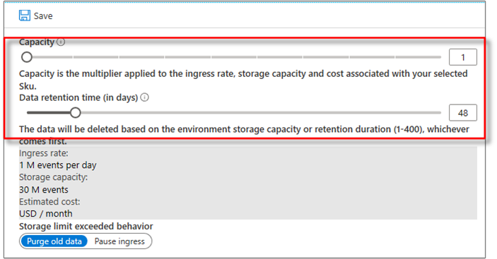

# How to scale your Time Series Insights environment

This article describes how to change the capacity of your Time Series Insights environment using the [Azure portal](https://portal.azure.com). Capacity is the multiplier applied to the ingress rate, storage capacity, and cost associated with your selected SKU.

You can use the Azure portal to increase or decrease capacity within a given pricing SKU.

However, changing the pricing tier SKU is not allowed. For example, an environment with an S1 pricing SKU cannot be converted into an S2, or vice versa.

## GA limits

[!INCLUDE [Azure Time Series Insights GA limits](../../includes/time-series-insights-ga-limits.md)]

## Change the capacity of your environment

1. In the Azure portal, locate and select your Time Series Insights environment.

1. In the menu for your Time Series Insights environment, select **Storage Configuration**.

   

1. Adjust the **Capacity** slider to select the capacity that meets the requirements for your ingress rates and storage capacity. Notice the **Ingress rate**, **Storage capacity**, and **Estimated cost** update dynamically to show the impact of the change.

   

   Alternatively, you can type the number of the capacity multiplier into the text box to the right of the slider.

1. Select **Save** to scale the environment. The progress indicator is displayed until the change is committed, momentarily.

1. Verify that the new capacity is [sufficient to prevent throttling](time-series-insights-diagnose-and-solve-problems.md).

## Next steps

- For more information, review [Understanding retention in Time Series Insights](time-series-insights-concepts-retention.md).

- Learn about [configuring data retention in Azure Time Series Insights](time-series-insights-how-to-configure-retention.md).

- Learn about [planning out your environment](time-series-insights-environment-planning.md).