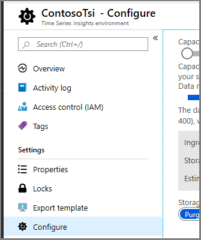
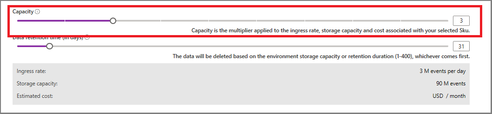

# How to scale your Time Series Insights environment

This article describes how to change the capacity of your environment your Time Series Insights environment using the Azure portal. Capacity is the multiplier applied to the ingress rate, storage capacity, and cost associated with your selected SKU. 

You can use the Azure portal to increase or decrease capacity within a given pricing SKU. 

However, changing the pricing tier SKU is not allowed. For example, an environment with an S1 pricing SKU cannot be converted into an S2, or vice versa. 

## S1 SKU ingress rates and capacities

| S1 SKU Capacity | Ingress Rate | Maximum Storage Capacity
| --- | --- | --- |
| 1 | 1 GB (1 million events) | 30 GB (30 million events) per month |
| 10 | 10 GB (10 million events) | 300 GB (300 million events) per month |

## S2 SKU ingress rates and capacities

| S2 SKU Capacity | Ingress Rate | Maximum Storage Capacity
| --- | --- | --- |
| 1 | 10 GB (10 million events) | 300 GB (300 million events) per month |
| 10 | 100 GB (100 million events) | 3 TB (3 billion events) per month |

Capacities scale linearly, so an S1 SKU with capacity 2 supports 2 GB (2 million) events per day ingress rate and 60 GB (60 million events) per month.

## Change the capacity of your environment
1. In the Azure portal, locate and select your Time Series Insights environment. 

2. In the menu for your Time Series Insighs environment, select **Configure**.

   

3. Adjust the **Capacity** slider to select the capacity that meets the requirements for your ingress rates and storage capacity. Notice the **Ingress rate**, **Storage capacity**, and **Estimated cost** update dynamically to show the impact of the change. 

   

   Alternatively, you can type the number of the capacity multiplier into the text box to the right of the slider. 

4. Select **Save** to scale the environment. The progress indicator is displayed until the change is committed, momentarily. 

## Next steps
> [!div class="nextstepaction"]
> [Verify that the new capacity is sufficient to prevent throttling](time-series-insights-diagnose-and-solve-problems.md).
