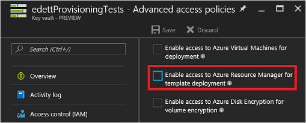
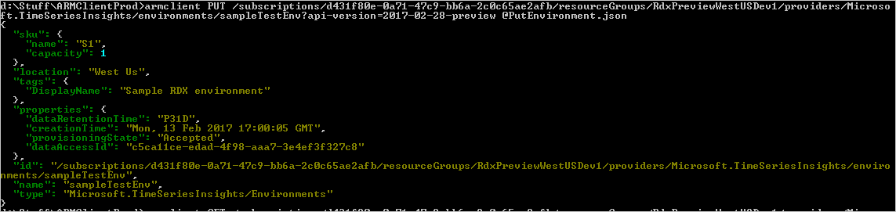
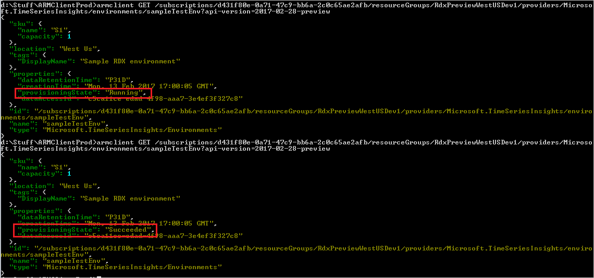
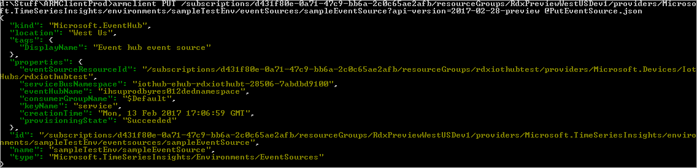
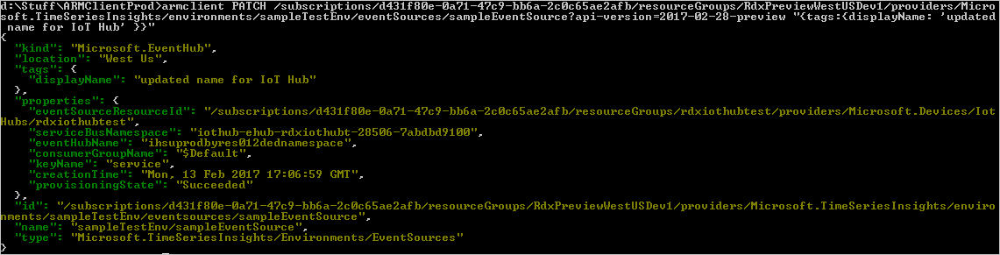

# Manage Time Series Insights Resources with Azure Resource Manager

Azure Time Series Insights is a fully managed analytics, storage, and visualization service that makes it simple to explore and analyze billions of IoT events simultaneously. It gives you a global view of your data, letting you quickly validate your IoT solution and avoid costly downtime to mission-critical devices by helping you discover hidden trends, spot anomalies, and conduct root-cause analyses in near real time. If you are building an application that needs to store or query time series data, you can develop using Time Series Insights using its REST APIs.

This tutorial demonstrates how to manage Time Series Insights with Azure Resource Management  resources. This helps you manage Time Series Insights environments where using the Azure portal doesn’t make sense, for example if you have a custom application built on top of Time Series Insights.  Using Azure Resource Manager allows you to automate control for the same resources you can configure in the Azure portal.

There are four types of Time Series Insights resources that can be created using this Resource Manager template:  

-	Environments
-	Event sources
-	Reference data sets
-	Role assignments


A Time Series Insights Environment is a logical grouping of event sources. You can add one or more event sources in a Time Series Insights Environment (current limits in private preview are two event sources per environment). 

An event source is a data source from which Time Series Insights reads and ingests data into Time Series Insights storage. Time Series Insights supports two event sources:  Azure IoT Hubs and Azure Event Hubs.

Reference data sets provide metadata about the events in the environment. Metadata in the reference data sets are joined with events during ingress. Reference data sets are defined as resources by their event key properties. The actual metadata that makes up the reference data set is uploaded or modified through data plane APIs.

Before Time Series Insights is released publicly, support for Role Assignment resources will also be added. Currently, access control must be controlled via role assignments on the resources in the management plane.

This document covers the different options for managing Time Series Insights resources that are available during private preview. 

The high-level options currently available to manage Time Series Insights resources are:

- Resource Manager template deployments
- REST APIs
- Azure Management portal extension (coming soon!)

## Prerequisite

Before creating Time Series Insights resources, you must perform the following prerequisite:

- Create a resource group for your Time Series Insights resources

Create a ResourceGroup in your subscription. This can be done through REST APIs, PowerShell, or by using the Azure Management portal. 

## Managing Resources through Resource Manager template Deployments

A Resource Manager template is a JSON file that defines the infrastructure and configuration of resources in a resource group. For more information, see the following documents:

- [Azure Resource Manager overview - Template deployment](https://docs.microsoft.com/en-us/azure/azure-resource-manager/resource-group-overview#template-deployment)

- [Deploy resources with Resource Manager templates and Azure PowerShell](https://docs.microsoft.com/en-us/azure/azure-resource-manager/resource-group-template-deploy)

The template that creates a Time Series Insights Environment and a child EventSource that reads events from an EventHub can be downloaded from the following link: 

https://microsoft.sharepoint.com/teams/TSIcore/Shared%20Documents/Getting%20Started/CreateTSIEnvironmentAndEventSourceTemplate.json 


|Parameter Name |Description  |Required/Optional |Default Value  |
|---------|---------|---------|---------|
|**environmentName**     | Name of the environment. The name cannot include:   '<', '>', '%', '&', ':', '\\', '?', '/' and any control characters. All other characters are allowed.        |   Required      |         |
|**environmentDisplayName** |An optional friendly name to show in tooling or user interfaces instead of the environment name.  | Optional | Blank (the environment name will be used in this case)   |
|**environmentSkuName**	| The name of the SKU. Must be one of the following values: S1, S2, P1. For more information, see [SKU ingress rates and capacities](#sku-ingress-rates-and-capacities).| Optional|	S1     
|**environmentSkuCapacity**|The capacity of the SKU. This value can be changed to support scale out of environments after they have been created. See the SKU Ingress Rates and Capacities table for more details.|Optional|	1         |
|**environmentDataRetentionTime**|	The minimum timespan the environment’s events will be available for query. The value must be specified in the ISO 8601 format, for example, "P30D" for a retention policy of 30 days. You can adjust this value up to 400 days, for example, “P400D”.| Optional	|30      |
|**eventSourceName**|Name of the event source child resource. The name cannot include: '<', '>', '%', '&', ':', '\\', '?', '/' and any control characters. All other characters are allowed.|Required   |         |      
|**eventSourceDisplayName**|An optional friendly name to show in tooling or user interfaces instead of the event source name.|	Optional|	Blank (the event source name will be used in this case)     |  
|**eventHubResourceId**	|The resource ID of the source Event Hub or IoT Hub in Azure Resoure Manager, for example, '/subscriptions/{subscriptionId}/resourceGroups /{resourceGroupName}/providers/Microsoft.Devices/IotHubs/{hubName}'.|	Required  |	   |           
|**eventHubServiceBusNamespace**|The service bus namespace of the source Event Hub.|Required    |   
|**eventHubName**|The name of the source Event Hub.|Required    |    |
|**eventHubConsumerGroupName**|The name of the consumer group that Time Series Insights will use to read the data from the event hub. You should create a dedicated consumer group on the event hub for Time Series Insights. This consumer group should not be shared with other services to avoid contention.|	Required  |         
|**eventHubKeyName**|The name of the event hub's shared access key that Time Series Insights will use to connect to the event hub.|Required   |   |
|**eventHubSharedAccessKey**|The shared access key value that Time Series Insights will use to connect to the event hub. This parameter is a secure string, so the value isn't displayed in the deployment logs or history in the Azure portal.|Required  |         |
|**eventSourceTimestampPropertyName**|The event property that is used as the event source's timestamp. If a value isn't specified for timestampPropertyName, or if null or empty-string is specified, the event creation time is used.|Optional	 |         |      
|**accessPolicyName**|	The name of the access policy child resource. The name cannot include:   '<', '>', '%', '&', ':', '\\', '?', '/' and any control characters. All other characters are allowed.	|Required	     |           |         |
|**accessPolicyPrincipalObjectId**|	The objectId of the service principal for the user or application in AAD. The service principal objectId can be obtained by calling the **Get-AzureRMADUser** or the **Get-AzureRMADServicePrincipal** cmdlets. Creating an access policy for AAD groups is not supported.|Required	  |         |         |
|**accessPolicyRole**|	The role granted to the service principle. The supported roles are *Reader* and *Contributor*. For more information, see [Time Series Insights RBAC roles](#time-series-insights-rbac-roles).|	Required  |         |

You can pass parameters at the PowerShell command line, but it’s often cleaner and more convenient to use a Parameters file. In this case, the command to create the environment would look like: 

`PS C:> New-AzureRmResourceGroupDeployment -ResourceGroupName TestTSITemplateDeployment1 -TemplateFile .\CreateEnvironmentTemplate.json -TemplateParameterFile .\CreateEnvironmentParameters.json`

The body of the parameters file should look something like:

```
{
  "$schema": "https://schema.management.azure.com/schemas/2015-01-01/deploymentParameters.json#",
  "contentVersion": "1.0.0.0",
  "parameters": {
    "environmentName": {
      "value": "TSIPreviewEnvWithChildESFromTemplate"
    },
    "environmentSkuCapacity": {
      "value": 2
    },
    "eventSourceName": {
      "value": "eventHubESUnderPreviewEnv"
    },
    "eventSourceDisplayName": {
      "value": "TSI Preview Microsoft.EventHub event source from template"
    },
    "eventHubResourceId": {
      "value": "/subscriptions/d431f80e-0a71-47c9-bb6a-2c0c65ae2afb/resourceGroups/Default-ServiceBus-WestUS/providers/Microsoft.ServiceBus/namespaces/crystaldevsb/eventHubs/edett"
    },
    "eventHubServiceBusNamespace": {
      "value": "crystaldevsb"
    },
    "eventHubName": {
      "value": "edett"
    },
    "eventHubConsumerGroupName": {
      "value": "TSItemplatetesting"
    },
    "eventHubKeyName": {
      "value": "Manage"
    },
    "eventHubSharedAccessKey": {
      "reference": {
        "keyVault": {
          "id": "/subscriptions/d431f80e-0a71-47c9-bb6a-2c0c65ae2afb/resourceGroups/edettProvisioningTests/providers/Microsoft.KeyVault/vaults/edettProvisioningTests"
        },
        "secretName": "edettTestEventHubKey"
      }
    } ,
    "eventSourceTimestampPropertyName": {
      "value": "someTimestampProperty"
    },
    "accessPolicyName": {
      "value": "edettAccessPolicy"
    },
    "accessPolicyPrincipalObjectId": {
      "value": "afc69970-7f28-414b-af7f-efcce374f0dd"
    },
    "accessPolicyRole": {
      "value": "Contributor"
    }
  }
}
```
Some of the properties shown in the template file are optional properties (for example, eventSourceDisplayName). If the default values work for your scenario, you don’t need to include these properties in the parameters file.

Note the use of a keyVault reference to read the event hub’s shared access key. For the key vault to be referenced in template files, you must set the **enabledForTemplateDeployment** property on the vault to **true**. 

You can do this in the Azure portal through the following setting on the KeyVault’s **advanced access policies**:



## Managing Resources through REST APIs

The Azure Resoure Manager REST APIs are the foundation of Azure Resoure Manager resource management. When provisioning resources through either the management UX or template deployments, the REST APIs are being called.

This is a quick example of using REST APIs to manage Time Series Insights resources in Azure Resoure Manager. 

Examples shown use ARMClient to invoke the REST APIs. For more information about ARMClient, see http://blog.davidebbo.com/2015/01/azure-resource-manager-client.html.  

### Enable Time Series Insights on your subscription

You must enable Time Series Insights by running the following ARMClient command:

`armclient POST /subscriptions/{**subscriptionId**}/providers/Microsoft.TimeSeriesInsights/register?api-version=2015-01-01`

### Creating a Time Series Insights environment 

ArmClient command to create a new environment:

`armclient PUT /subscriptions/{subscriptionId}/resourceGroups/{resourceGroupName}/providers/Microsoft.TimeSeriesInsights/environments/{environmentName}?api-version=2017-02-28-preview @PutEnvironment.json`

where PutEnvironment.json contains:
```
{
  "location" : "West Us",
  "tags" : {
    "DisplayName" : "Sample Time Series Insights environment"
  },
  "sku" : {
    "name" : "S1",
    "Capacity" : 1
  },
  "properties" : {
    "dataRetentionTime" : "P31D"
  }
}
```

See the SKU Ingress Rates and Capacities section to determine the required SKU name and capacity.



The request to create the environment is asynchronous. You can perform a GET on the environment until the **provisioningState** goes into the terminal state of **Succeeded** or **Failed**.

```
armclient GET 
/subscriptions/{subscriptionId}/resourceGroups/{resourceGroupName}/providers/Microsoft.TimeSeriesInsights/environments/{environmentName}?api-version=2017-02-28-preview
```


### Creating an EventHub event source in the environment
The ArmClient command to create an event hub event source in an environment is:

```
armclient PUT 
/subscriptions/{subscriptionId}/resourceGroups/{resourceGroupName}/providers/Microsoft.TimeSeriesInsights/environments/{environmentName}/eventsources/{eventSourceName}?api-version=2017-02-28-preview @PutEventSource.json
```

where PutEventSource.json contains:

```
{
  "location": "West Us",
  "kind": "Microsoft.EventHub",
  "tags": {
    "DisplayName": "Event hub event source"
  },
  "properties": {
    "eventSourceResourceId": "/subscriptions/d431f80e-0a71-47c9-bb6a-2c0c65ae2afb/resourceGroups/TSIiothubtest/providers/Microsoft.Devices/IotHubs/TSIiothubtest",
    "serviceBusNamespace" : "iothub-ehub-TSIiothubt-28506-7abdbd9100",
    "eventHubName" : "ihsuprodbyres012dednamespace",
    "consumerGroupName": "$Default",
    "keyName": "service",
    "sharedAccessKey" : " REDACTED-EVENTHUBACCESSKEY ",
  }
}
```


### Updating the event source through PATCH

ArmClient command to update an event source by using PATCH

```
armclient PATCH 
/subscriptions/{subscriptionId}/resourceGroups/{resourceGroupName}/providers/Microsoft.TimeSeriesInsights/environments/{environmentName}/eventSources/{eventSourceName}?api-version=2017-02-28-preview "{tags:{displayName: 'updated name for IoT Hub' }}"
```
Note the use of an inline request body rather than the path to a json file.


ArmClient command to update an event source’s timestamp property name via PATCH

```
armclient PATCH 
/subscriptions/{subscriptionId}/resourceGroups/{resourceGroupName}/providers/Microsoft.TimeSeriesInsights/environments/{environmentName}/eventSources/{eventSourceName}?api-version=2017-02-28-preview "{properties:{timestampPropertyName: '{timestampPropertyNameValue}' }}"
```


### Create a ReferenceDataSet in the environment

The ARMClient command to create a ReferenceDataSet in an environment is:

```
armclient PUT /subscriptions/{subscriptionId}/resourceGroups/{resourceGroupName}/providers/Microsoft.TimeSeriesInsights/environments/{environmentName}/referenceDataSets/{referenceDataSetName}?api-version=2017-02-28-preview @CreateReferenceDataSet.json
```

where CreateReferenceDataSet.json contains:

```
{
  "location": "westus",
  "properties": {
    "keyProperties": [
      {
        "name": "Manufacturer",
        "type": "String"
      },
      {
        "name": "DeviceId",
        "type": "Double"
      }
    ]
  }
}
```

  

### Delete a Time Series Insights environment

The deletion is cascading. Any event sources and reference data sets will be deleted with the environment.

ArmClient command to delete an environment:

`armclient DELETE /subscriptions/{subscriptionId}/resourceGroups/{resourceGroupName}/providers/Microsoft.TimeSeriesInsights/environments/{environmentName}?api-version=2017-02-28-preview` 

### Create an access policy in the environment

The ARMClient command to create an AccessPolicy in an environment is:

`armclient PUT /subscriptions/{subscriptionId}/resourceGroups/{resourceGroupName}/providers/Microsoft.TimeSeriesInsights/environments/{environmentName}/accessPolicies/{accessPolicyName}?api-version=2017-02-28-preview @CreateAccessPolicy.json`

where CreateAccessPolicy.json contains:

```
{
  "properties": {
    "principalObjectId": "{user or app object id from AAD}",
    "roles": [
      "Reader"
    ],
    "description": "first data plane access policy"
  }
}
```

Access policies can be created for users or applications. The supported roles are defined below.

### SKU ingress rates and capacities

|SKU Name  |Ingress Rate – Min/Day  |Ingress Rate – Max/Day  |Minimum Storage Capacity   |Maximum Storage Capacity |
|---------|---------|---------|---------|---------|
|S1     | 1 GB/1 million events        | 10 GB/10 million events        | 30 GB (30 million events)/ month|300 GB (300 million events) / month
|S2     |10 GB/10 million events |100 GB/100 million events|300 GB (300 million events)/ month|3 TB/3 billion


### Time Series Insights RBAC roles

In the Reader role, the principal can perform the following actions on the Time Series Insights environment:
- Read (query) data from the Time Series Insights environment. The principal does not have read access to reference data sets. 
-	Create saved queries.

In the Contributer role, the principal can perform all allowed actions on the Time Series Insights environment except manage access policies.

-	Read data.
-	Read and write reference data sets.
-	Manage saved queries, including deleting saved queries created by other users.

