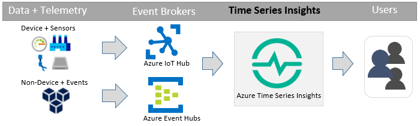

# Overview of Azure Time Series Insights

Azure Time Series Insights is a fully managed cloud service with storage, analytics, and visualization components that make it incredibly easy to ingest, store, explore and analyze billions of events simultaneously. Time Series Insights gives you a global view of your data, letting you quickly validate your IoT Solutions and avoid costly downtime to mission critical devices by helping you discover hidden trends and anomalies, and conduct root-cause analyses in near real-time. Time Series Insights ingests time-series data from event-brokers (e.g. IoT Hubs or Event Hubs), indexes the data, and retires data based on a configurable retention policy. Users consume the data for their business scenario either through an intuitive UX or REST Query APIs.

## Primary scenarios

* Validation and monitoring of IoT solutions in minutes
* Intuitive visualization and analysis of IoT data at scale
* Expediting root-cause analysis and anomaly detection
* Creating a global view of multiple devices, plants, and data

## Key capabilities and benefits

* **Easy to get started**: Azure Time Series Insights requires no up-front data preparation and is incredibly fast, so you can connect to billions of events in your Azure IoT Hub or Event Hub in minutes. Once connected, you can visualize and interact with your sensor data in seconds to quickly validate your IoT solutions. Time Series Insights is incredibly intuitive and easy to use; you can interact with your data without having to write a single line of code.  Additionally, there is no new language to learn, as Time Series Insights provides a granular, free-text query surface for advanced users, as well as point and click exploration for novices.

* **Near Real-time insights in seconds**: Get more value out of your time-series data with Time Series Insights’s storage, analysis, and visualization components, all in one place. Time Series Insights can ingest hundreds of millions of sensor events per day, with one minute latency, so you can react to changes quickly. Time Series Insights gives you deeper insights into your sensor data by helping you spot trends and anomalies fast, allowing you to easily conduct complex root-cause analyses and avoid costly downtime. By enabling cross-correlation between real-time and historical data, Time Series Insights allows users to unlock hidden trends in their data.

* **Build custom solutions**: Embed Azure Time Series Insights data into your existing applications, or create new custom solutions with Time Series Insights REST APIs.  Plus, creating and sharing personalized views is a breeze, making it simple for others to explore the discoveries you’ve made.

* **Scalability**: Time Series Insights is designed to support IoT scale. In preview, it can ingress from 1 million to 100 million events per day, with a default retention span of 31 days. Time Series Insights allows users to visualize and analyze live data streams in near real-time, alongside vast amounts of historical data. Moving forward, ingress and retention rates will increase to accommodate ever evolving enterprise scale.

## Taxonomy of Time Series Insights

* **Environment**: An environment is an Azure resource with ingress and storage capacity.  Customers provision environments via the Azure portal with their required capacity.
* **Event Source**: An Event Source is derived from an event broker, like Azure Event Hubs.  Time Series Insights connects directly to Event Sources, ingesting the data stream without requiring users to write a single line of code. Currently, Time Series Insights supports Azure Event Hubs and Azure IoT Hubs, and in the future, more Event Sources will be added.
* **Reference data**: Time Series Insights provides users the ability to join time series data with reference data.  Reference data can include metadata about devices, or other static data that changes relatively infrequently. Time Series Insights joins the reference data with data streams, allowing users to visualize and analyze this data in near real-time.
