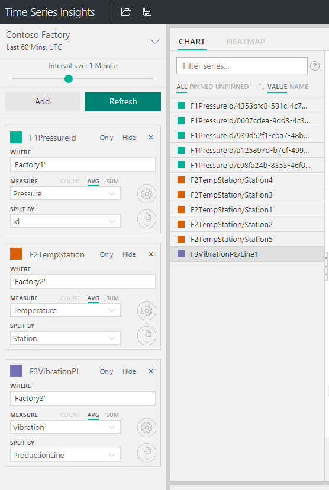
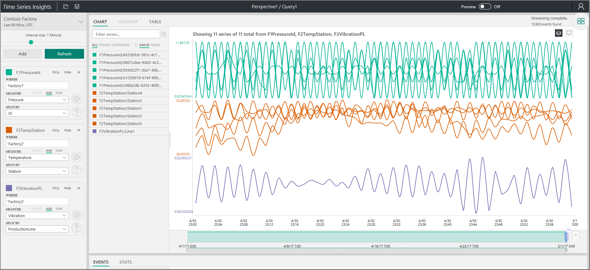

# Share a custom view using a parameterized URL

To share a custom view in Time Series Insights explorer, you can programmatically create a parameterized URL of the custom view.

The Time Series Insights explorer supports URL query parameters to specify views in the experience directly from the URL.  For example, using only the URL, you can specify a target environment, a search predicate, and desired time span. When a user clicks the customized URL, the interface provides a link directly to that asset in the Time Series Insights portal.  Data access policies apply. 

## Environment ID

The `environmentId=<guid>` parameter specifies the target environment ID.  This is a component of the data access FQDN, and you can find this in the top right corner of the environment overview in the Azure portal.  It’s everything that precedes `env.timeseries.azure.com`. An example environment ID parameter is `?environmentId=10000000-0000-0000-0000-100000000108`.

## Time

You can specify absolute or relative time values with a parameterized URL.

### Absolute time values

For absolute time values, use the `from=<integer>` and `to=<integer>` parameters. 

`from=<integer>` is a value in JavaScript milliseconds of the start time for the search span.

`to=<integer>`is a value in JavaScript milliseconds of the end time for the search span. 

To identify the JavaScript milliseconds for a date, see [Epoch & Unix Timestamp Converter](https://www.freeformatter.com/epoch-timestamp-to-date-converter.html).

### Relative time values

For a relative time value, use `relativeMillis=<value>`, where *value* is in JavaScript milliseconds from the most recent data on the backend.

For example, `&relativeMillis=3600000` displays the most recent 60 minutes of data.

Accepted values correspond to the Time Series Insights explorer **quick time** menu, and include the following:

- 1800000 (Last 30 mins)
- 3600000 (Last 60 mins)
- 10800000 (Last 3 Hours)
- 21600000 (Last 6 Hours)
- 43200000 (Last 12 Hours)
- 86400000 (Last 24 Hours)
- 604800000 (Last 7 Days)
- 2592000000 (Last 30 Hours)

### Optional parameters

The `timeSeriesDefinitions=<collection of term objects>` parameter specifies the terms of a Time Series Insights view, where:

- "name":"<string>"
  - The name of the *term*.
- "splitBy":"<string>"
  - The column name to *split by*.
- "measureName":"<string>"
  - The column name of *measure*.
- "predicate":"<string>"
  - The *where* clause for server-side filtering.
-  "useSum":"true"
  - This is an optional parameter that specifies using sum for your measure.  Note, if "Events" is the selected measure, count is selected by default.  If "Events" is not selected, average is selected by default.  

The 'multiChartStack=<true/false>' parameter enables stacking in the chart and the 'multiChartSameScale=<true/false>' parameter enables the same Y-axis scale across terms within an optional parameter.  

- 'multiChartStack=false'
  - 'True' is enabled by default so pass 'false' to stack.
- 'multiChartStack=false&multiChartSameScale=true' 
  - Stacking must be enabled to use the same Y-axis scale across terms.  It is 'false' by default, so passing 'true' enables this functionality.  
  
The 'timeBucketUnit=<Unit>&timeBucketSize=<integer>' enables you to adjust the interval slider to provide a more granular or smoother, more aggregated view of the chart.  
- 'timeBucketUnit=<Unit>&timeBucketSize=<integer>'
  - Units = days, hours, minutes, seconds, milliseconds.  Always capitalize the unit.
  - Define the number of units by passing the desired integer for timeBucketSize.  Note, you smooth up to 7 days.  
  
The 'timezoneOffset=<integer>' parameter enables you to set the timezone for the chart to be viewed in as an offset to UTC.  
  - 'timezoneOffset=-<integer>'
    - The integer is always in milliseconds.  
    - Note, this functionality is slightly different than what we enable in the TSI explorer, where we enable you to choose local (browser time) or UTC.  
 
### Examples

For example, to add time series definitions as a URL parameter, you can use the following:

```https
&timeSeriesDefinitions=[{"name":"F1PressureId","splitBy":"Id","measureName":"Pressure","predicate":"'Factory1'"},{"name":"F2TempStation","splitBy":"Station","measureName":"Temperature","predicate":"'Factory2'"},
{"name":"F3VibrationPL","splitBy":"ProductionLine","measureName":"Vibration","predicate":"'Factory3'"}]
```

Using these example time series definitions for 

- environment ID
- last 60 minutes of data
- terms (F1PressureID, F2TempStation, and F3VibrationPL) that comprise the optional parameters
 
you can construct the following parameterized URL for a view:

```https
https://insights.timeseries.azure.com/samples?environmentId=10000000-0000-0000-0000-100000000108&relativeMillis=3600000&timeSeriesDefinitions=[{"name":"F1PressureId","splitBy":"Id","measureName":"Pressure","predicate":"'Factory1'"},{"name":"F2TempStation","splitBy":"Station","measureName":"Temperature","predicate":"'Factory2'"},{"name":"F3VibrationPL","splitBy":"ProductionLine","measureName":"Vibration","predicate":"'Factory3'"}]
```

If you had used Time Series Insights explorer to build the view described by the preceding URL, it would appear like this:



The full view (including the chart) would appear like this:



## Next steps
[Query data using C#](time-series-insights-query-data-csharp.md)
