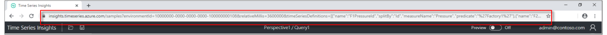
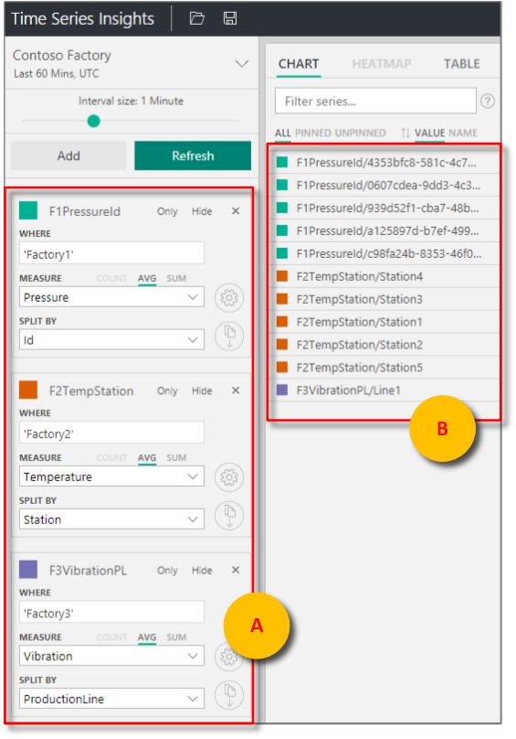
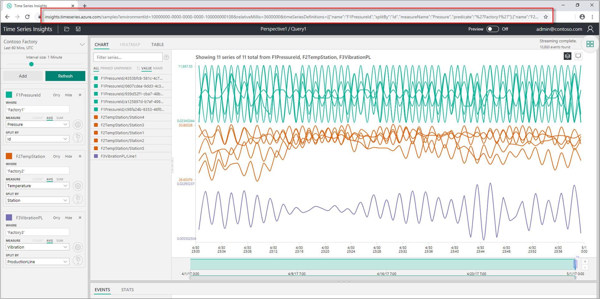

# Share a custom view using a parameterized URL

[!INCLUDE [retirement](../../includes/tsi-retirement.md)]

To share a custom view in Azure Time Series Insights Explorer, you can programmatically create a parameterized URL of the custom view.

Azure Time Series Insights Explorer supports URL query parameters to specify views in the experience directly from the URL. For example, using only the URL, you can specify a target environment, a search predicate, and desired time span. When a user selects the customized URL, the interface provides a link directly to that asset in the Azure Time Series Insights portal. Data access policies apply.

> [!TIP]
>
> * View the free [Azure Time Series Insights demo](https://insights.timeseries.azure.com/samples).
> * Read the accompanying [Azure Time Series Insights Explorer](./time-series-insights-explorer.md) documentation.

## Environment ID

The `environmentId=<guid>` parameter specifies the target environment ID. It's a component of the data access FQDN, and you can find it in the top-right corner of the environment overview in the Azure portal. It's everything that precedes `env.timeseries.azure.com`.

An example environment ID parameter is `?environmentId=10000000-0000-0000-0000-100000000108`.

## Time

You can specify absolute or relative time values with a parameterized URL.

### Absolute time values

For absolute time values, use the `from=<integer>` and `to=<integer>` parameters.

* `from=<integer>` is a value in JavaScript milliseconds of the start time for the search span.
* `to=<integer>`is a value in JavaScript milliseconds of the end time for the search span.

> [!TIP]
> To easily translate dates into JavaScript milliseconds, try the [Epoch & Unix Timestamp Converter](https://www.freeformatter.com/epoch-timestamp-to-date-converter.html).

### Relative time values

For a relative time value, use `relativeMillis=<value>`, where *value* is in JavaScript milliseconds from the most recent timestamp received from the API.

For example, `&relativeMillis=3600000` displays the most recent 60 minutes of data.

Accepted values correspond to the Azure Time Series Insights Explorer **quick time** menu, and include:

* `1800000` (Last 30 mins)
* `3600000` (Last 60 mins)
* `10800000` (Last 3 Hours)
* `21600000` (Last 6 Hours)
* `43200000` (Last 12 Hours)
* `86400000` (Last 24 Hours)
* `604800000` (Last 7 Days)
* `2592000000` (Last 30 Hours)

### Optional parameters

The `timeSeriesDefinitions=<collection of term objects>` parameter specifies predicate terms that will appear in an Azure Time Series Insights view:

| Parameter | URL Item | Description |
| --- | --- | --- |
| **name** | `\<string>` | The name of the *term*. |
| **splitBy** | `\<string>` | The column name to *split by*. |
| **measureName** | `\<string>` | The column name of *measure*. |
| **predicate** | `\<string>` | The *where* clause for server-side filtering. |
| **useSum** | `true` | An optional parameter that specifies using sum for your measure. |

> [!NOTE]
> If `Events` is the selected **useSum** measure, count is selected by default.
> If `Events` is not selected, average is selected by default. |

* The `multiChartStack=<true/false>` key-value pair enables stacking in the chart.
* The `multiChartSameScale=<true/false>` key-value pair enables the same Y-axis scale across terms within an optional parameter.
* The `timeBucketUnit=<Unit>&timeBucketSize=<integer>` enables you to adjust the interval slider to provide a more granular or smoother, more aggregated view of the chart.
* The `timezoneOffset=<integer>` parameter enables you to set the timezone for the chart to be viewed in as an offset to UTC.

| Pair(s) | Description |
| --- | --- |
| `multiChartStack=false` | `true` is enabled by default so pass `false` to stack. |
| `multiChartStack=false&multiChartSameScale=true` | Stacking must be enabled to use the same Y-axis scale across terms.  It's `false` by default, so passing `true` enables this functionality. |
| `timeBucketUnit=<Unit>&timeBucketSize=<integer>` | Units = `days`, `hours`, `minutes`, `seconds`, `milliseconds`.  Always capitalize the unit. </br> Define the number of units by passing the desired integer for **timeBucketSize**.  |
| `timezoneOffset=-<integer>` | The integer is always in milliseconds. |

> [!NOTE]
> **timeBucketUnit** values can be smoothed up to 7 days.
> **timezoneOffset** values are neither UTC nor local time.

### Examples

To add time series definitions to an Azure Time Series Insights environment as a URL parameter, append:

```URL parameter
&timeSeriesDefinitions=[{"name":"F1PressureId","splitBy":"Id","measureName":"Pressure","predicate":"'Factory1'"},{"name":"F2TempStation","splitBy":"Station","measureName":"Temperature","predicate":"'Factory2'"},
{"name":"F3VibrationPL","splitBy":"ProductionLine","measureName":"Vibration","predicate":"'Factory3'"}]
```

Use the example time series definitions for:

* The environment ID
* The last 60 minutes of data
* The terms (**F1PressureID**, **F2TempStation**, and **F3VibrationPL**) that comprise the optional parameters

You can construct the following parameterized URL for a view:

```URL
https://insights.timeseries.azure.com/classic/samples?environmentId=10000000-0000-0000-0000-100000000108&relativeMillis=3600000&timeSeriesDefinitions=[{"name":"F1PressureId","splitBy":"Id","measureName":"Pressure","predicate":"'Factory1'"},{"name":"F2TempStation","splitBy":"Station","measureName":"Temperature","predicate":"'Factory2'"},{"name":"F3VibrationPL","splitBy":"ProductionLine","measureName":"Vibration","predicate":"'Factory3'"}]
```

[](media/parameterized-url/share-parameterized-url.png#lightbox)

> [!TIP]
> See the Explorer live [using the URL](https://insights.timeseries.azure.com/classic/samples?environmentId=10000000-0000-0000-0000-100000000108&relativeMillis=3600000&timeSeriesDefinitions=[%7B%22name%22:%22F1PressureId%22,%22splitBy%22:%22Id%22,%22measureName%22:%22Pressure%22,%22predicate%22:%22%27Factory1%27%22%7D,%7B%22name%22:%22F2TempStation%22,%22splitBy%22:%22Station%22,%22measureName%22:%22Temperature%22,%22predicate%22:%22%27Factory2%27%22%7D,%7B%22name%22:%22F3VibrationPL%22,%22splitBy%22:%22ProductionLine%22,%22measureName%22:%22Vibration%22,%22predicate%22:%22%27Factory3%27%22%7D]) example above.

The URL above describes and displays the parameterized Azure Time Series Insights Explorer view.

* The parameterized predicates.

  [](media/parameterized-url/share-parameterized-url-predicates.png#lightbox)

* The shared full chart view.

  [](media/parameterized-url/share-parameterized-url-full-chart.png#lightbox)

## Next steps

* Learn how to [query data using C#](time-series-insights-query-data-csharp.md).

* Learn about the [Azure Time Series Insights Explorer](./time-series-insights-explorer.md).
