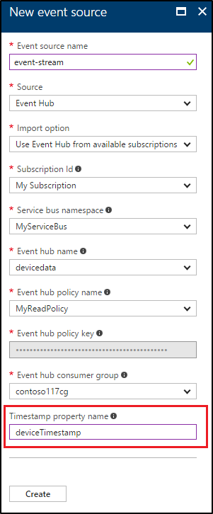

# Send events to a Time Series Insights environment via event hub

This tutorial explains how to create and configure event hub and run a sample application to push events. If you have an existing event hub that already has events in JSON format, you can skip this tutorial and view your environment in [time series explorer](https://insights.timeseries.azure.com).

## Configure an event hub
1. To create an event hub, follow instructions from the Event Hub [documentation](https://docs.microsoft.com/azure/event-hubs/event-hubs-create).

2. Make sure you create a consumer group that is used exclusively by your Time Series Insights event source.

  > [!IMPORTANT]
  > Make sure this consumer group is not used by any other service (such as Stream Analytics job or another Time Series Insights environment). If consumer group is used by other services, read operation is negatively affected for this environment and the other services. If you are using “$Default” as the consumer group, it could lead to potential reuse by other readers.

  

3. On the event hub, create “MySendPolicy” that is used to send events in the sample below.

    

    

## Create Time Series Insights event source
1. If you haven't created event source, follow instructions specified [here](time-series-insights-add-event-source.md) to create an event source.

2. Specify “deviceTimestamp” as the timestamp property name – this property is used as the actual timestamp in the sample below. The timestamp property name is case-sensitive and values should have the format __yyyy-MM-ddTHH:mm:ss.FFFFFFFK__ when sent as JSON to event hub. If the property does not exist in the event, then the time at which the event was enqueued to event hub is used.

  

## Run sample code to push events
1. Go to the event hub policy “MySendPolicy” and copy the connection string with the policy key.

  

2. Run the following code that will send 600 events per each of the three devices. Update `eventHubConnectionString` with your connection string.

```csharp
using System;
using System.Collections.Generic;
using System.Globalization;
using System.IO;
using Microsoft.ServiceBus.Messaging;

namespace Microsoft.Rdx.DataGenerator
{
    internal class Program
    {
        private static void Main(string[] args)
        {
            var from = new DateTime(2017, 4, 20, 15, 0, 0, DateTimeKind.Utc);
            Random r = new Random();
            const int numberOfEvents = 600;

            var deviceIds = new[] { "device1", "device2", "device3" };

            var events = new List<string>();
            for (int i = 0; i < numberOfEvents; ++i)
            {
                for (int device = 0; device < deviceIds.Length; ++device)
                {
                    // Generate event and serialize as JSON object:
                    // { "deviceTimestamp": "utc timestamp", "deviceId": "guid", "value": 123.456 }
                    events.Add(
                        String.Format(
                            CultureInfo.InvariantCulture,
                            @"{{ ""deviceTimestamp"": ""{0}"", ""deviceId"": ""{1}"", ""value"": {2} }}",
                            (from + TimeSpan.FromSeconds(i * 30)).ToString("o"),
                            deviceIds[device],
                            r.NextDouble()));
                }
            }

            // Create event hub connection.
            var eventHubConnectionString = @"Endpoint=sb://...";
            var eventHubClient = EventHubClient.CreateFromConnectionString(eventHubConnectionString);

            using (var ms = new MemoryStream())
            using (var sw = new StreamWriter(ms))
            {
                // Wrap events into JSON array:
                sw.Write("[");
                for (int i = 0; i < events.Count; ++i)
                {
                    if (i > 0)
                    {
                        sw.Write(',');
                    }
                    sw.Write(events[i]);
                }
                sw.Write("]");

                sw.Flush();
                ms.Position = 0;

                // Send JSON to event hub.
                EventData eventData = new EventData(ms);
                eventHubClient.Send(eventData);
            }
        }
    }
}

```
## Supported JSON shapes
### Sample 1

#### Input

A simple JSON object.

```json
{
    "deviceId":"device1",
    "deviceTimestamp":"2016-01-08T01:08:00Z"
}
```
#### Output - 1 event

|deviceId|deviceTimestamp|
|--------|---------------|
|device1|2016-01-08T01:08:00Z|

### Sample 2

#### Input
A JSON array with two JSON objects. Each JSON object will be converted to an event.
```json
[
    {
        "deviceId":"device1",
        "deviceTimestamp":"2016-01-08T01:08:00Z"
    },
    {
        "deviceId":"device2",
        "deviceTimestamp":"2016-01-17T01:17:00Z"
    }
]
```
#### Output - 2 Events

|deviceId|deviceTimestamp|
|--------|---------------|
|device1|2016-01-08T01:08:00Z|
|device2|2016-01-08T01:17:00Z|
### Sample 3

#### Input

A JSON object with a nested JSON array containing two JSON objects.
```json
{
    "location":"WestUs",
    "events":[
        {
            "deviceId":"device1",
            "deviceTimestamp":"2016-01-08T01:08:00Z"
        },
        {
            "deviceId":"device2",
            "deviceTimestamp":"2016-01-17T01:17:00Z"
        }
    ]
}

```
#### Output - 2 Events
Note that the property "location" is copied over to each of the event.

|location|events.deviceId|events.deviceTimestamp|
|--------|---------------|----------------------|
|WestUs|device1|2016-01-08T01:08:00Z|
|WestUs|device2|2016-01-08T01:17:00Z|

### Sample 4

#### Input

A JSON object with a nested JSON array containing two JSON objects. This input demonstrates that the global properties may be represented by the complex JSON object.

```json
{
    "location":"WestUs",
    "manufacturerInfo":{
        "name":"manufacturer1",
        "location":"EastUs"
    },
    "events":[
        {
            "deviceId":"device1",
            "deviceTimestamp":"2016-01-08T01:08:00Z",
            "deviceData":{
                "type":"pressure",
                "units":"psi",
                "value":108.09
            }
        },
        {
            "deviceId":"device2",
            "deviceTimestamp":"2016-01-17T01:17:00Z",
            "deviceData":{
                "type":"vibration",
                "units":"abs G",
                "value":217.09
            }
        }
    ]
}
```
#### Output - 2 Events

|location|manufacturerInfo.name|manufacturerInfo.location|events.deviceId|events.deviceTimestamp|events.deviceData.type|events.deviceData.units|events.deviceData.value|
|---|---|---|---|---|---|---|---|
|WestUs|manufacturer1|EastUs|device1|2016-01-08T01:08:00Z|pressure|psi|108.09|
|WestUs|manufacturer1|EastUs|device2|2016-01-08T01:17:00Z|vibration|abs G|217.09|

## Next steps

* View your environment in [Time Series Insights Portal](https://insights.timeseries.azure.com)
