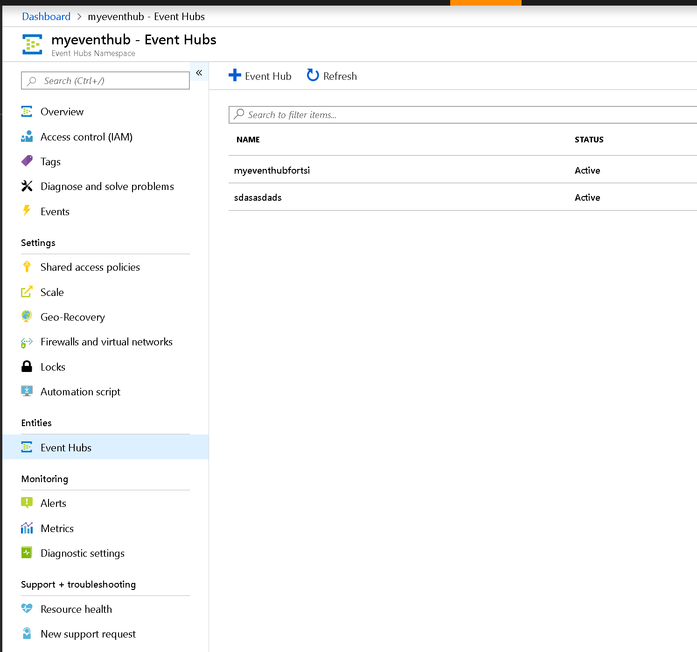
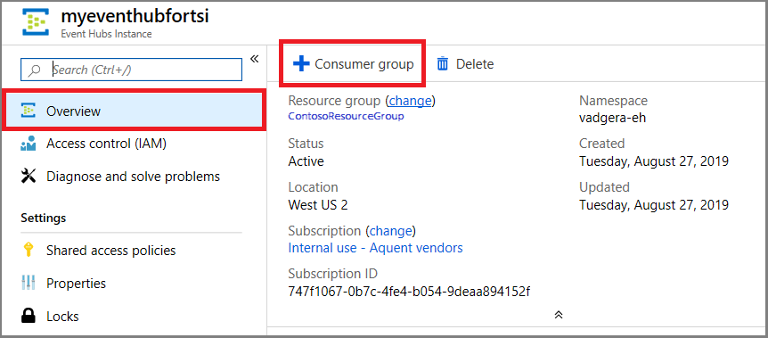
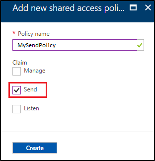
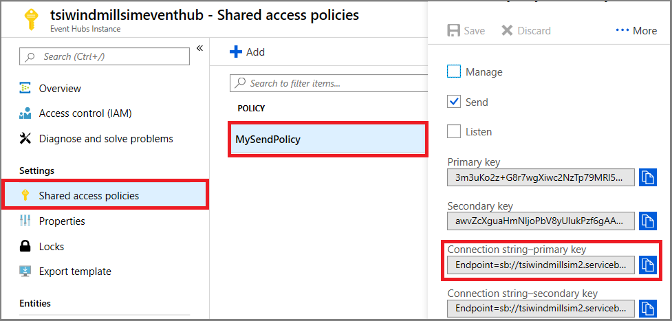
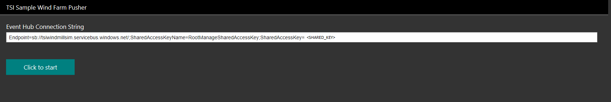
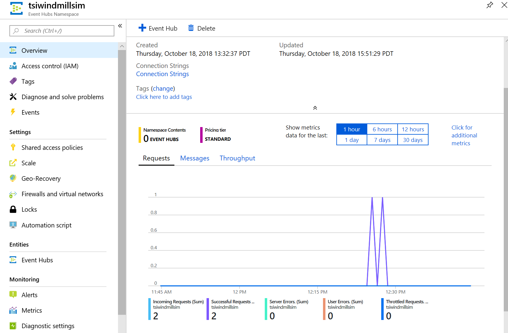

# Send events to a Time Series Insights environment by using an event hub

This article explains how to create and configure an event hub in Azure Event Hubs. It also describes how to run a sample application to push events to Azure Time Series Insights from Event Hubs. If you have an existing event hub with events in JSON format, skip this tutorial and view your environment in [Azure Time Series Insights](./time-series-insights-update-create-environment.md).

## Configure an event hub

1. To learn how to create an event hub, see the [Event Hubs documentation](https://docs.microsoft.com/azure/event-hubs/).
1. In the search box, search for **Event Hubs**. In the returned list, select **Event Hubs**.
1. Select your event hub.
1. When you create an event hub, you're creating an event hub namespace. If you haven't yet created an event hub within the namespace, on the menu, under **Entities**, create an event hub.  

    [](media/send-events/updated.png#lightbox)

1. After you create an event hub, select it in the list of event hubs.
1. On the menu, under **Entities**, select **Event Hubs**.
1. Select the name of the event hub to configure it.
1. Under **Entities**, select **Consumer groups**, and then select **Consumer Group**.

    [](media/send-events/consumer-group.png#lightbox)

1. Make sure you create a consumer group that's used exclusively by your Time Series Insights event source.

    > [!IMPORTANT]
    > Make sure this consumer group isn't used by any other service, such as an Azure Stream Analytics job or another Time Series Insights environment. If the consumer group is used by the other services, read operations are negatively affected both for this environment and for other services. If you use **$Default** as the consumer group, other readers might potentially reuse your consumer group.

1. On the menu, under **Settings**, select **Shared access policies**, and then select **Add**.

    [](media/send-events/shared-access-policy.png#lightbox)

1. In the **Add new shared access policy** pane, create a shared access named **MySendPolicy**. You use this shared access policy to send events in the C# examples later in this article.

    [](media/send-events/shared-access-policy-2.png#lightbox)

1. Under **Claim**, select the **Send** check box.

## Add a Time Series Insights instance

The Time Series Insights update uses instances to add contextual data to incoming telemetry data. The data is joined at query time by using a **Time Series ID**. The **Time Series ID** for the sample windmills project that we use later in this article is `id`. To learn more about Time Series Insight instances and **Time Series ID**, see [Time Series Models](./time-series-insights-update-tsm.md).

### Create a Time Series Insights event source

1. If you haven't created an event source, complete the steps to [create an event source](https://docs.microsoft.com/azure/time-series-insights/time-series-insights-how-to-add-an-event-source-eventhub).

1. Set a value for `timeSeriesId`. To learn more about **Time Series ID**, see [Time Series Models](./time-series-insights-update-tsm.md).

### <a name="push-events"></a>Push events (windmills sample)

1. In the search bar, search for **Event Hubs**. In the returned list, select **Event Hubs**.

1. Select your event hub.

1. Go to **Shared Access Policies** > **RootManageSharedAccessKey**. Copy the value for **Connection string-primary key**.

    [](media/send-events/sample-code-connection-string.png#lightbox)

1. Go to https://tsiclientsample.azurewebsites.net/windFarmGen.html. The URL runs simulated windmill devices.
1. In the **Event Hub Connection String** box on the webpage, paste the connection string that you copied in [Push events](#push-events).
  
    [](media/send-events/updated_two.png#lightbox)

1. Select **Click to start**. The simulator generates instance JSON that you can use directly.

1. Go back to your event hub in the Azure portal. On the **Overview** page, you see the new events that are received by the event hub.

    [](media/send-events/telemetry.png#lightbox)

## <a name="json"></a>Supported JSON shapes

### Example one

* **Input**: A simple JSON object.

    ```JSON
    {
        "id":"device1",
        "timestamp":"2016-01-08T01:08:00Z"
    }
    ```

* **Output**: One event.

    |id|timestamp|
    |--------|---------------|
    |device1|2016-01-08T01:08:00Z|

### Example two

* **Input**: A JSON array with two JSON objects. Each JSON object is converted to an event.

    ```JSON
    [
        {
            "id":"device1",
            "timestamp":"2016-01-08T01:08:00Z"
        },
        {
            "id":"device2",
            "timestamp":"2016-01-17T01:17:00Z"
        }
    ]
    ```

* **Output**: Two events.

    |id|timestamp|
    |--------|---------------|
    |device1|2016-01-08T01:08:00Z|
    |device2|2016-01-08T01:17:00Z|

### Example three

* **Input**: A JSON object with a nested JSON array that contains two JSON objects.

    ```JSON
    {
        "location":"WestUs",
        "events":[
            {
                "id":"device1",
                "timestamp":"2016-01-08T01:08:00Z"
            },
            {
                "id":"device2",
                "timestamp":"2016-01-17T01:17:00Z"
            }
        ]
    }
    ```

* **Output**: Two events. The property **location** is copied over to each event.

    |location|events.id|events.timestamp|
    |--------|---------------|----------------------|
    |WestUs|device1|2016-01-08T01:08:00Z|
    |WestUs|device2|2016-01-08T01:17:00Z|

### Example four

* **Input**: A JSON object with a nested JSON array that contains two JSON objects. This input demonstrates that global properties can be represented by the complex JSON object.

    ```JSON
    {
        "location":"WestUs",
        "manufacturer":{
            "name":"manufacturer1",
            "location":"EastUs"
        },
        "events":[
            {
                "id":"device1",
                "timestamp":"2016-01-08T01:08:00Z",
                "data":{
                    "type":"pressure",
                    "units":"psi",
                    "value":108.09
                }
            },
            {
                "id":"device2",
                "timestamp":"2016-01-17T01:17:00Z",
                "data":{
                    "type":"vibration",
                    "units":"abs G",
                    "value":217.09
                }
            }
        ]
    }
    ```

* **Output**: Two events.

    |location|manufacturer.name|manufacturer.location|events.id|events.timestamp|events.data.type|events.data.units|events.data.value|
    |---|---|---|---|---|---|---|---|
    |WestUs|manufacturer1|EastUs|device1|2016-01-08T01:08:00Z|pressure|psi|108.09|
    |WestUs|manufacturer1|EastUs|device2|2016-01-08T01:17:00Z|vibration|abs G|217.09|

## Next steps

- [View your environment](https://insights.timeseries.azure.com) in the Time Series Insights explorer.
