# Tutorial: Set up an Azure Time Series Insights Preview environment

This tutorial guides you through the process of creating an Azure Time Series Insights Preview pay-as-you-go (PAYG) environment. 

In this tutorial, you learn how to:

* Create an Azure Time Series Insights Preview environment.
* Connect the Azure Time Series Insights Preview environment to an event hub in Azure Event Hubs.
* Run a solution accelerator sample to stream data into the Azure Time Series Insights Preview environment.
* Perform basic analysis on the data.
* Define a Time Series Model type and hierarchy, and associate it with your instances.

>[!TIP]
> [IoT solution accelerators](https://www.azureiotsolutions.com/Accelerators) provide enterprise-grade preconfigured solutions that you can use to accelerate the development of custom IoT solutions.

## Create a device simulation

In this section, you create three simulated devices that send data to an Azure IoT Hub instance.

1. Go to the [Azure IoT solution accelerators page](https://www.azureiotsolutions.com/Accelerators). The page displays several prebuilt examples. Sign in by using your Azure account. Then, select **Device Simulation**.

   [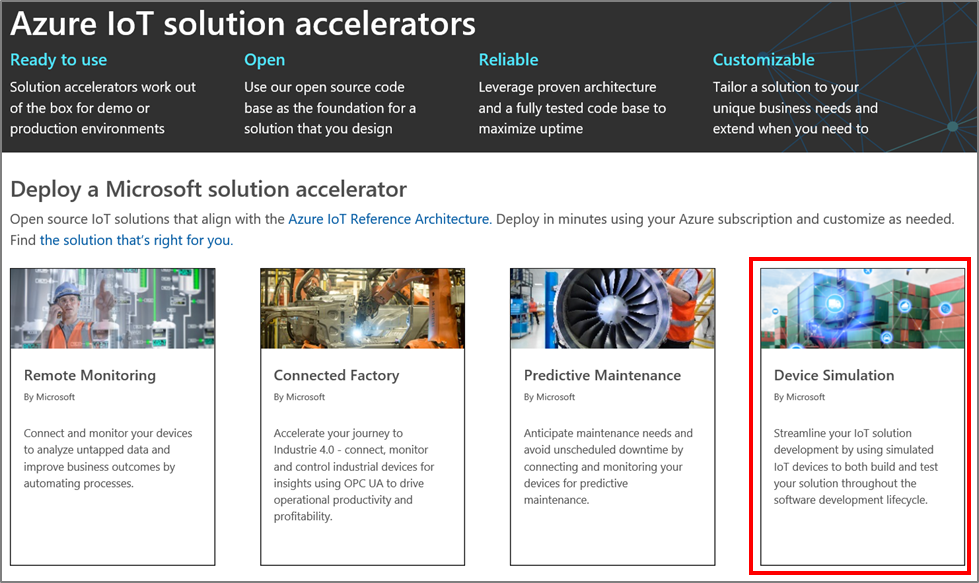](media/v2-update-provision/device-one-accelerator.png#lightbox)

   Select **Try Now**.

1. On the **Create Device Simulation solution** page, set the following parameters:

    | Parameter | Action |
    | --- | --- |
    | **Deployment name** | Enter a unique value for a new resource group. The listed Azure resources are created and assigned to the resource group. |
    | **Azure subscription** | Select the subscription that you used to create your Time Series Insights environment. |
    | **Azure location** | Select the region that you used to create your Time Series Insights environment. |
    | **Deployment options** | Select **Provision new IoT Hub**. |
 
    Select **Create solution**. It may take up to 20 minutes for the solution to finish deploying.

    [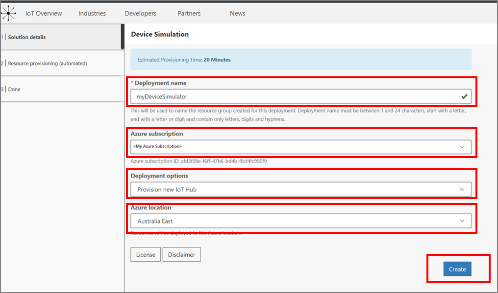](media/v2-update-provision/device-two-create.png#lightbox)

## Create a Time Series Insights Preview PAYG environment

This section describes how to create an Azure Time Series Insights Preview environment and connect it to the IoT hub created by the IoT Solution Accelerator using the [Azure portal](https://portal.azure.com/).

1. Sign in to the Azure portal by using your subscription account.

1. Select **Create a resource** > **Internet of Things** > **Time Series Insights**.

   [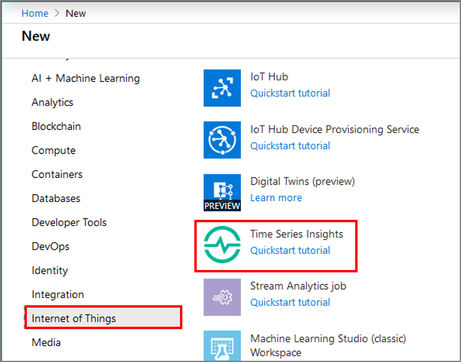](media/v2-update-provision/payg-one-azure.png#lightbox)

1. In the **Create Time Series Insights environment** pane, on the **Basics** tab, set the following parameters:

    | Parameter | Action |
    | --- | ---|
    | **Environment name** | Enter a unique name for the Azure Time Series Insights Preview environment. |
    | **Subscription** | Enter the subscription where you want to create the Azure Time Series Insights Preview environment. A best practice is to use the same subscription as the rest of the IoT resources that are created by the device simulator. |
    | **Resource group** | Select an existing resource group or create a new resource group for the Azure Time Series Insights Preview environment resource. A resource group is a container for Azure resources. A best practice is to use the same resource group as the other IoT resources that are created by the device simulator. |
    | **Location** | Select a datacenter region for your Azure Time Series Insights Preview environment. To avoid additional latency, it's best to create your Azure Time Series Insights Preview environment in the same region as your other IoT resources. |
    | **Tier** |  Select **PAYG** (*pay-as-you-go*). This is the SKU for the Azure Time Series Insights Preview product. |
    | **Property ID** | Enter a value that uniquely identifies your time series instance. The value you enter in the **Property ID** box is immutable. You can't change it later. For this tutorial, enter **iothub-connection-device-id**. To learn more about Time Series ID, see [Best practices for choosing a Time Series ID](./time-series-insights-update-how-to-id.md). |
    | **Storage account name** | Enter a globally unique name for a new storage account to create. |
   
   Select **Next: Event Source**.

   [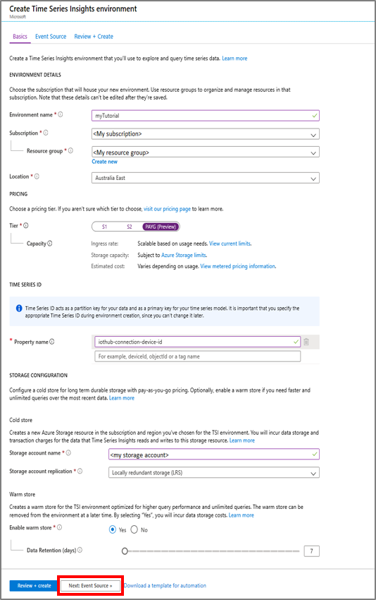](media/v2-update-provision/payg-two-create.png#lightbox)

1. On the **Event Source** tab, set the following parameters:

   | Parameter | Action |
   | --- | --- |
   | **Create an event source?** | Select **Yes**.|
   | **Name** | Enter a unique value for the event source name. |
   | **Source type** | Select **IoT Hub**. |
   | **Select a hub** | Choose **Select existing**. |
   | **Subscription** | Select the subscription that you used for the device simulator. |
   | **IoT Hub name** | Select the IoT hub name you created for the device simulator. |
   | **IoT Hub access policy** | Select **iothubowner**. |
   | **IoT Hub consumer group** | Select **New**, enter a unique name, and then select **Add**. The consumer group must be a unique value in Azure Time Series Insights Preview. |
   | **Timestamp property** | This value is used to identify the **Timestamp** property in your incoming telemetry data. For this tutorial, leave this box empty. This simulator uses the incoming timestamp from IoT Hub, which Time Series Insights defaults to. |

   Select **Review + create**.

   [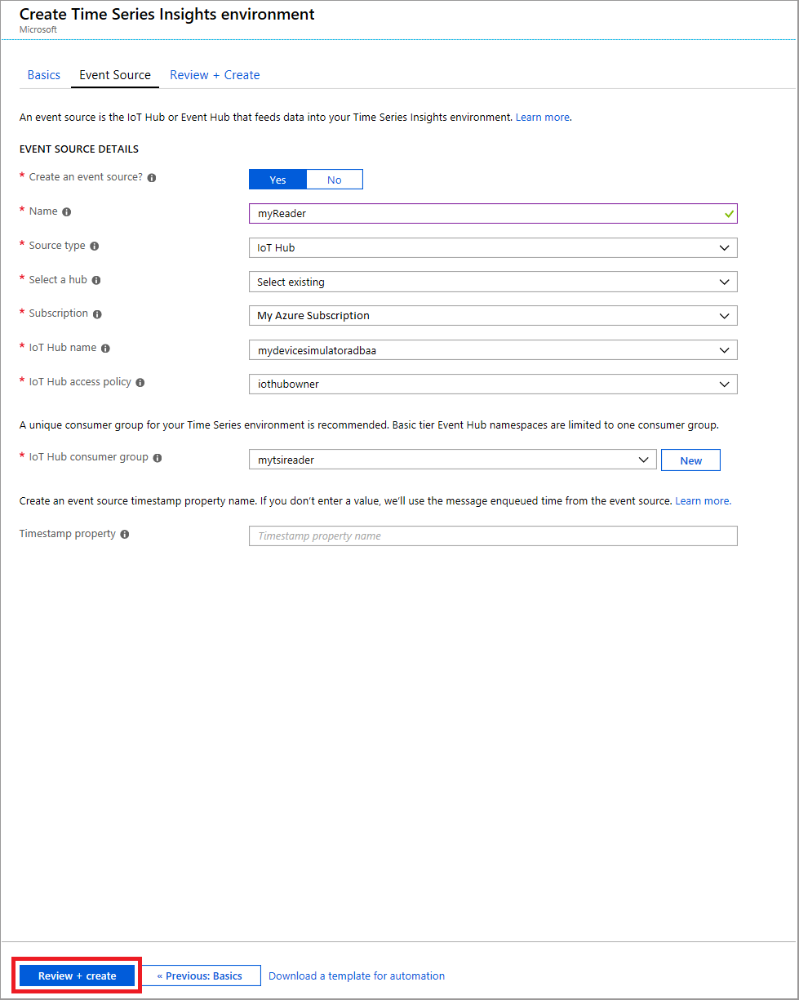](media/v2-update-provision/payg-five-event-source.png#lightbox)

1. On the **Review + Create** tab review your selections, and then select **Create**.

    [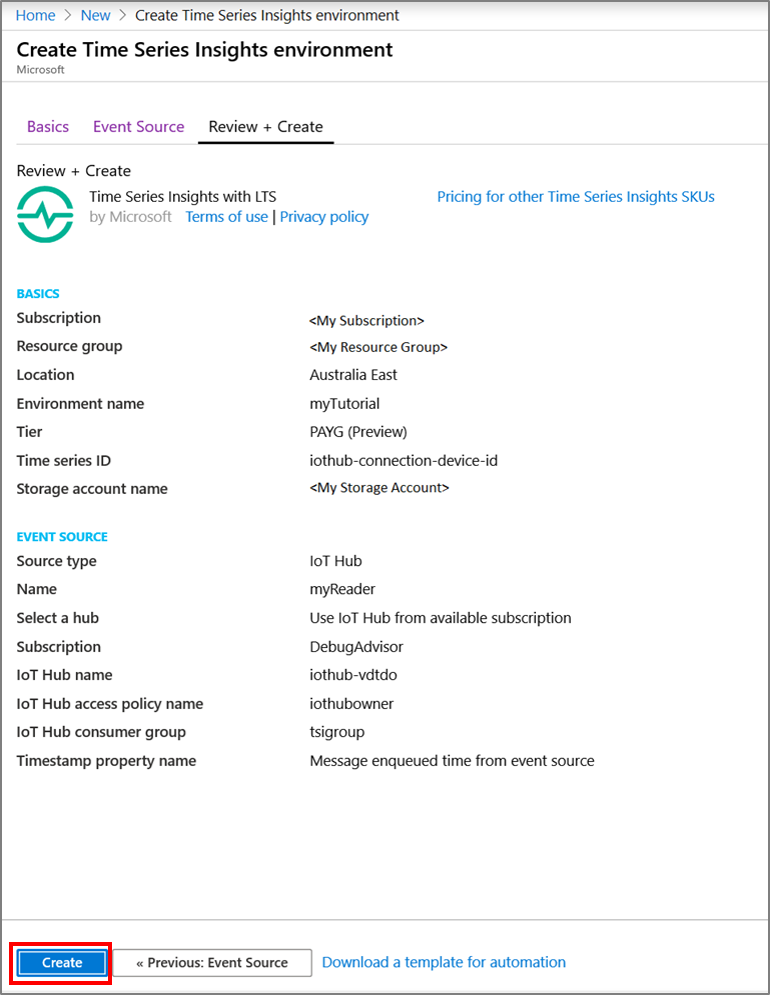](media/v2-update-provision/payg-six-review.png#lightbox)

    You can see the status of your deployment:

    [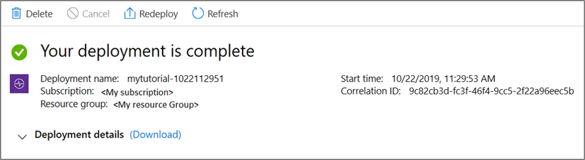](media/v2-update-provision/payg-seven-deploy.png#lightbox)

1. You have access to your Azure Time Series Insights Preview environment if you own the tenant. To make sure that you have access:

   1. Search for your resource group, and then select your Azure Time Series Insights Preview environment:

      [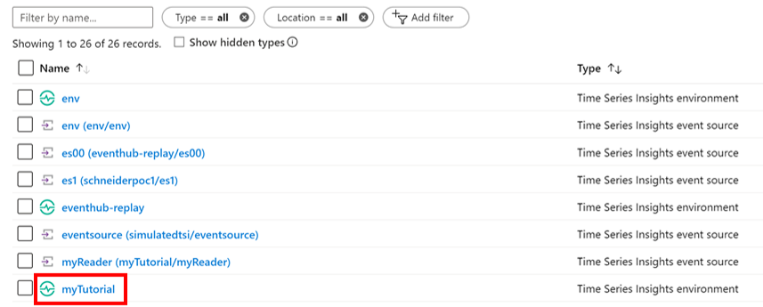](media/v2-update-provision/payg-eight-environment.png#lightbox)

   1. On the Azure Time Series Insights Preview page, select **Data Access Policies**:

      [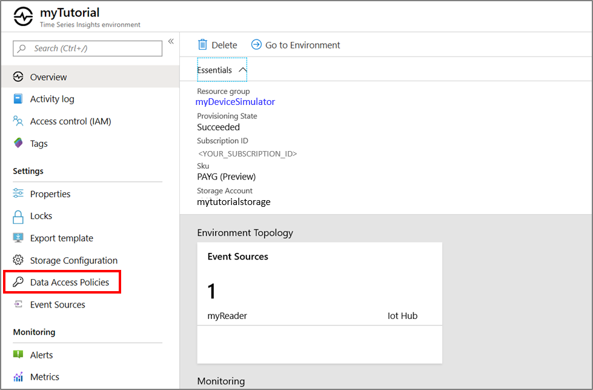](media/v2-update-provision/payg-nine-data-access.png#lightbox)

   1. Verify that your credentials are listed:

      [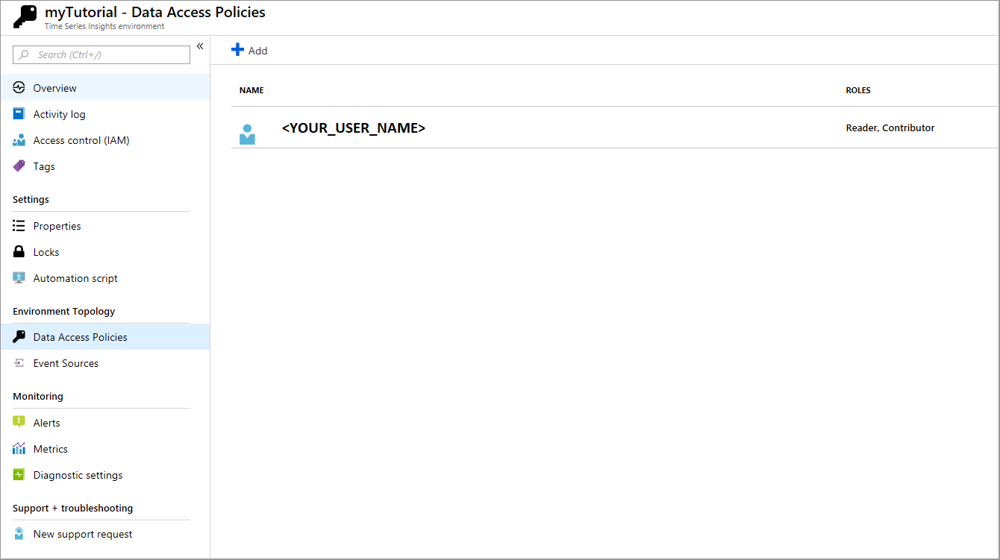](media/v2-update-provision/payg-ten-verify.png#lightbox)

   If your credentials aren't listed, you must grant yourself permission to access the environment. To learn more about setting permissions, read [Grant data access](./time-series-insights-data-access.md).

## Stream data into your environment

1. Navigate back to the [Azure IoT solution accelerators page](https://www.azureiotsolutions.com/Accelerators). Locate your solution in your solution accelerator dashboard. Then, select **Launch**:

    [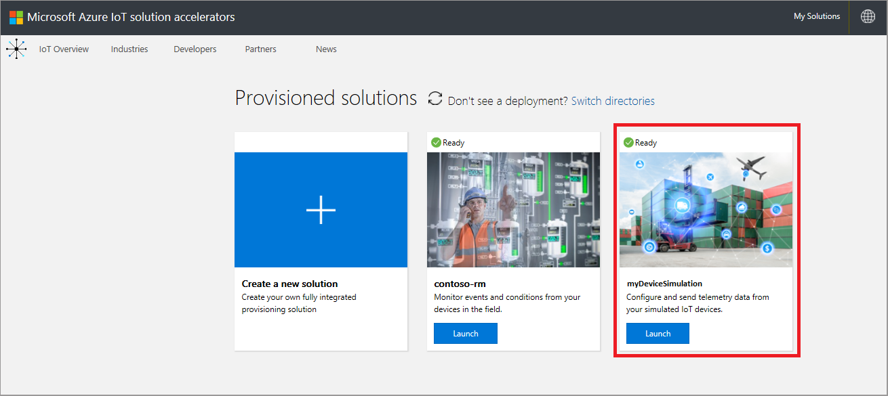](media/v2-update-provision/device-three-launch.png#lightbox)

1. You're redirected to the **Microsoft Azure IoT Device Simulation** page. In the upper-right corner of the page, select **New simulation**.

    [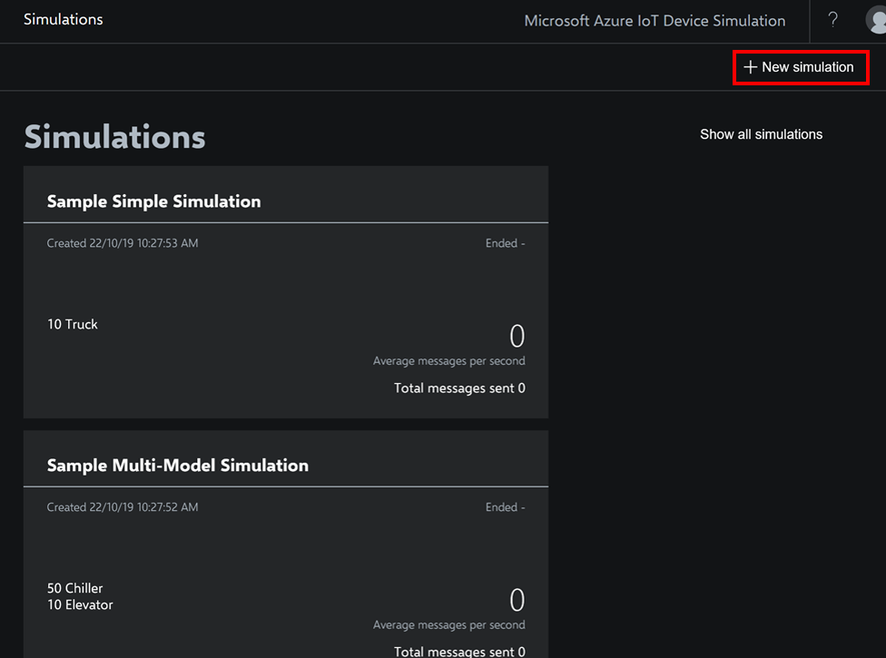](media/v2-update-provision/device-four-iot-sim-page.png#lightbox)

1. In the **Simulation setup** pane, set the following parameters:

    | Parameter | Action |
    | --- | --- |
    | **Name** | Enter a unique name for a simulator. |
    | **Description** | Enter a definition. |
    | **Simulation duration** | Set to **Run indefinitely**. |
    | **Device model** | **Name**: Enter **Chiller**.  **Amount**: Enter **3**. |
    | **Target IoT Hub** | Set to **Use pre-provisioned IoT Hub**. |

    [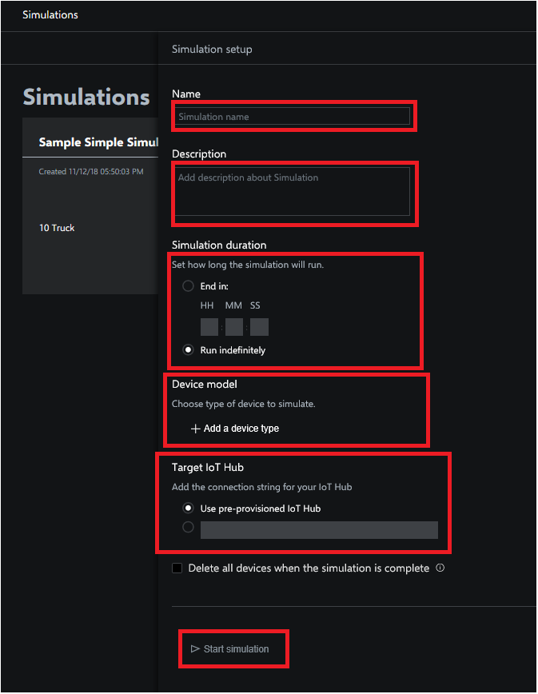](media/v2-update-provision/device-five-params.png#lightbox)

    Select **Start simulation**.

    In the device simulation dashboard, note the information shown for **Active devices** and **Messages per second**.

    [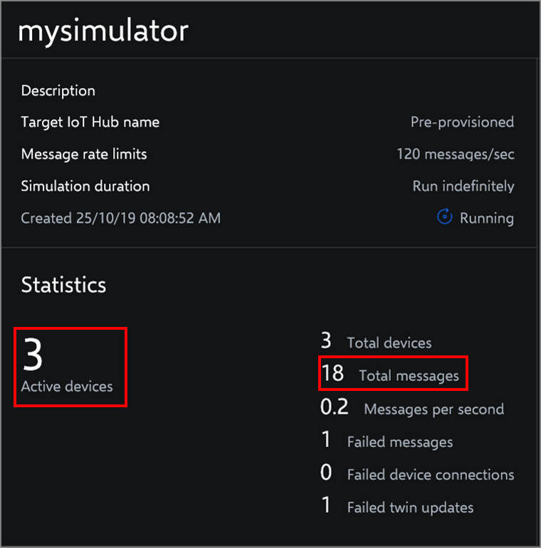](media/v2-update-provision/device-seven-dashboard.png#lightbox)

## Analyze data in your environment

In this section, you perform basic analytics on your time series data by using the [Azure Time Series Insights Preview explorer](./time-series-insights-update-explorer.md).

1. Go to your Azure Time Series Insights Preview explorer by selecting the URL from the resource page in the [Azure portal](https://portal.azure.com/).

    [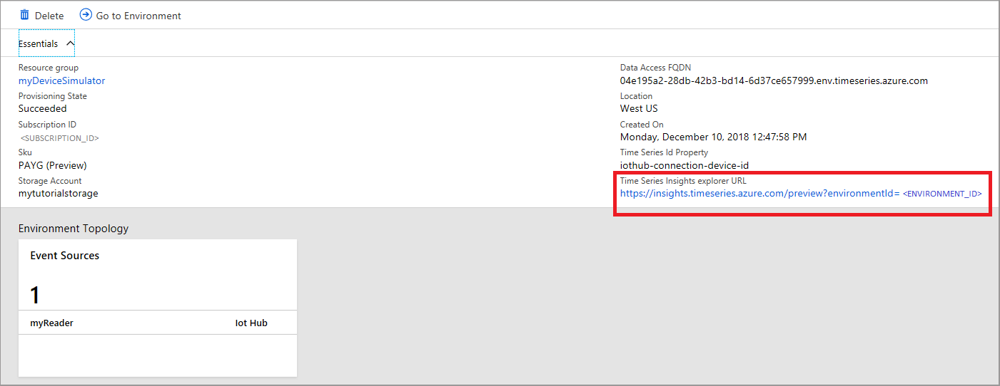](media/v2-update-provision/analyze-one-portal.png#lightbox)

1. In the explorer, select the **Time Series Instances** node to see all the Azure Time Series Insights Preview instances in the environment.

    [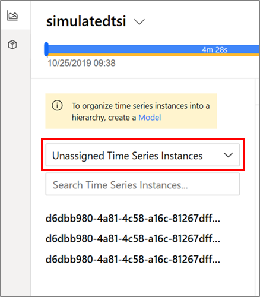](media/v2-update-provision/analyze-two-unparented.png#lightbox)

1. Select the first time series instance. Then, select **Show pressure**.

    [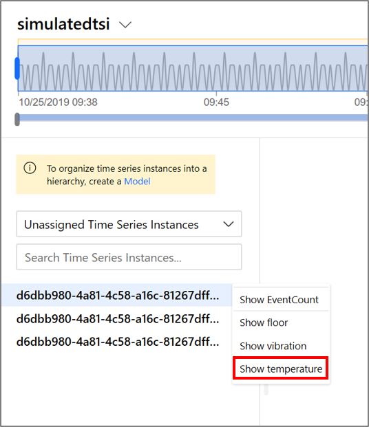](media/v2-update-provision/analyze-three-show-pressure.png#lightbox)

    A time series chart appears. Change the **Interval** to **15s**.

    [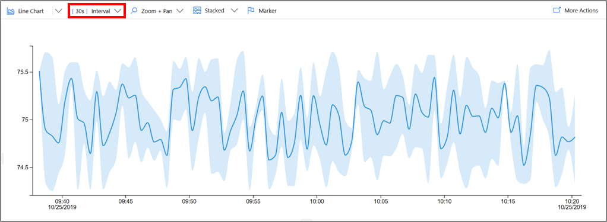](media/v2-update-provision/analyze-four-chart.png#lightbox)

1. Repeat step 3 with the other two time series instances. You can view all time series instances, as shown in this chart:

    [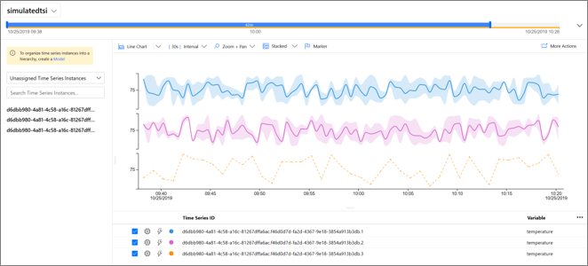](media/v2-update-provision/analyze-five-chart.png#lightbox)

1. In the **Timeframe** option box, modify the time range to see time series trends over the last hour:

    [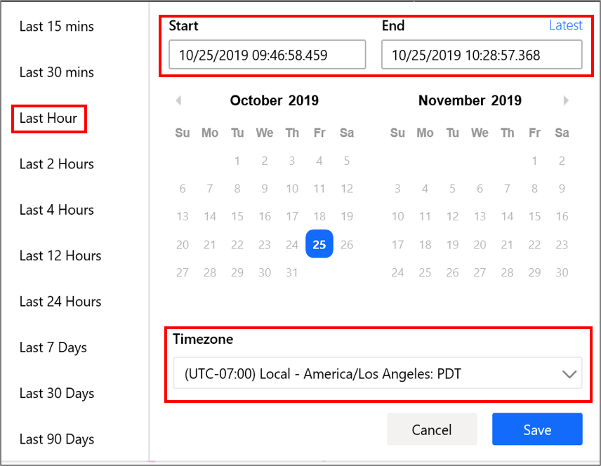](media/v2-update-provision/analyze-six-time.png#lightbox)

## Define and apply a model

In this section, you apply a model to structure your data. To complete the model, you define types, hierarchies, and instances. To learn more about data modeling, see [Time Series Model](./time-series-insights-update-tsm.md).

1. In the explorer, select the **Model** tab:

   [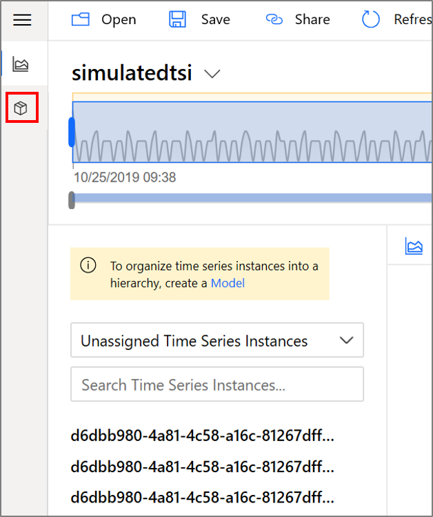](media/v2-update-provision/define-one-model.png#lightbox)

1. Select **Add** to add a type:

   [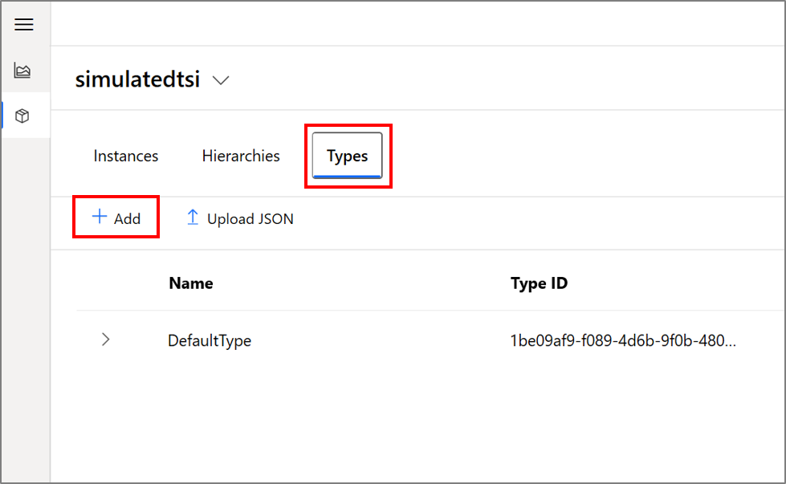](media/v2-update-provision/define-two-add.png#lightbox)

1. Next, you define three variables for the type: *pressure*, *temperature*, and *humidity*. In the **Add a Type** pane, set the following parameters:

    | Parameter | Action |
    | --- | ---|
    | **Name** | Enter **Chiller**. |
    | **Description** | Enter **This is a type definition of Chiller**. |

   * To define *pressure*, under **Variables**, set the following parameters:

     | Parameter | Action |
     | --- | ---|
     | **Name** | Enter **Avg Pressure**. |
     | **Value** | Select **pressure (Double)**. It might take a few minutes for **Value** to be automatically populated after Azure Time Series Insights Preview starts receiving events. |
     | **Aggregation Operation** | Select **AVG**. |

      [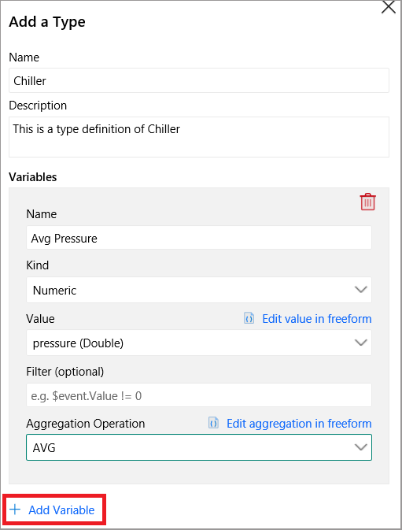](media/v2-update-provision/define-three-variable.png#lightbox)

      To add the next variable, select  **Add Variable**.

   * Define *temperature*:

     | Parameter | Action |
     | --- | ---|
     | **Name** | Enter **Avg Temperature**. |
     | **Value** | Select **temperature (Double)**. It might take a few minutes for **Value** to be automatically populated after Azure Time Series Insights Preview starts receiving events. |
     | **Aggregation Operation** | Select **AVG**.|

      [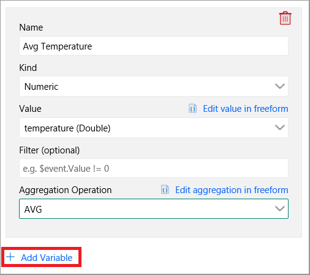](media/v2-update-provision/define-four-avg.png#lightbox)

      To add the next variable, select  **Add Variable**.

   * Define *humidity*:

      | | |
      | --- | ---|
      | **Name** | Enter **Max Humidity** |
      | **Value** | Select **humidity (Double)**. It might take a few minutes for **Value** to be automatically populated after Azure Time Series Insights Preview starts receiving events. |
      | **Aggregation Operation** | Select **MAX**.|

      [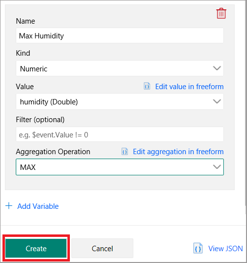](media/v2-update-provision/define-five-humidity.png#lightbox)

    Select **Create**.

    You can see the type you added:

    [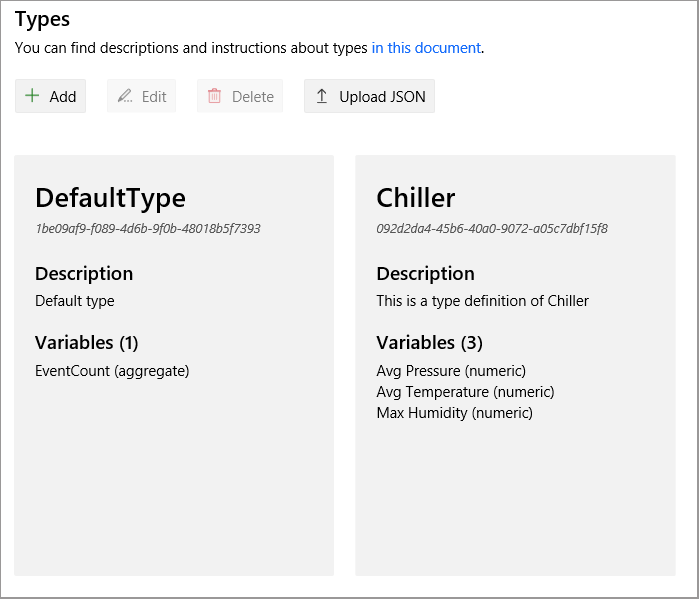](media/v2-update-provision/define-six-type.png#lightbox)

1. The next step is to add a hierarchy. Under **Hierarchies**, select **Add**:

    [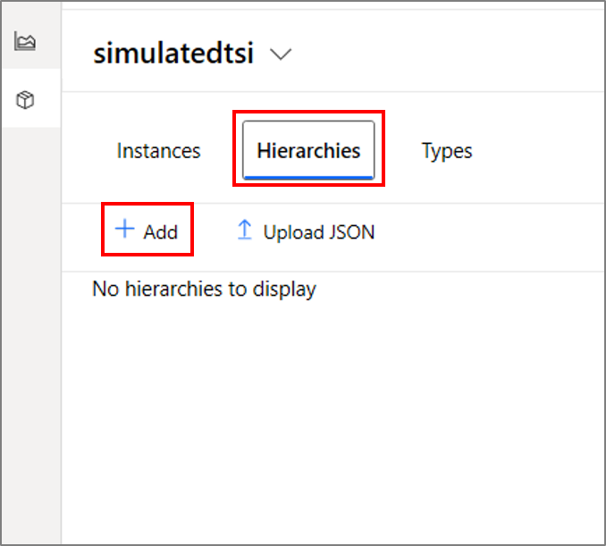](media/v2-update-provision/define-seven-hierarchy.png#lightbox)

1. In the **Edit Hierarchy** pane, set the following parameters:

   | Parameter | Action |
   | --- | ---|
   | **Name** | Enter **Location Hierarchy**. |
   | **Level 1** | Enter **Country**. |
   | **Level 2** | Enter **City**. |
   | **Level 3** | Enter **Building**. |

   Select **Save**.

    [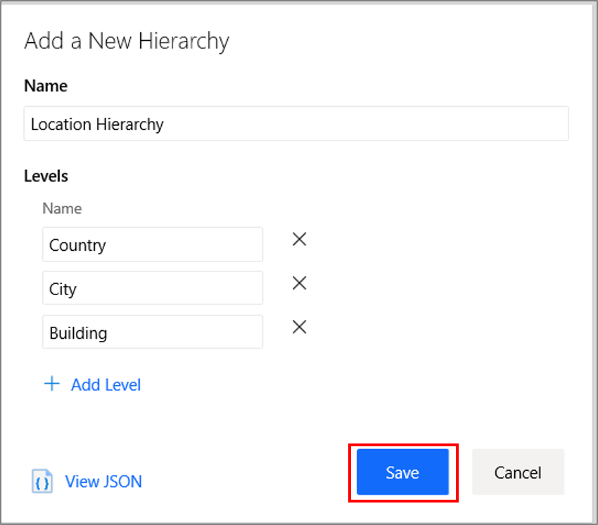](media/v2-update-provision/define-eight-add-hierarchy.png#lightbox)

   You can see the hierarchy that you created:

    

1. Select **Instances**. Select the first instance, and then select **Edit**:

    [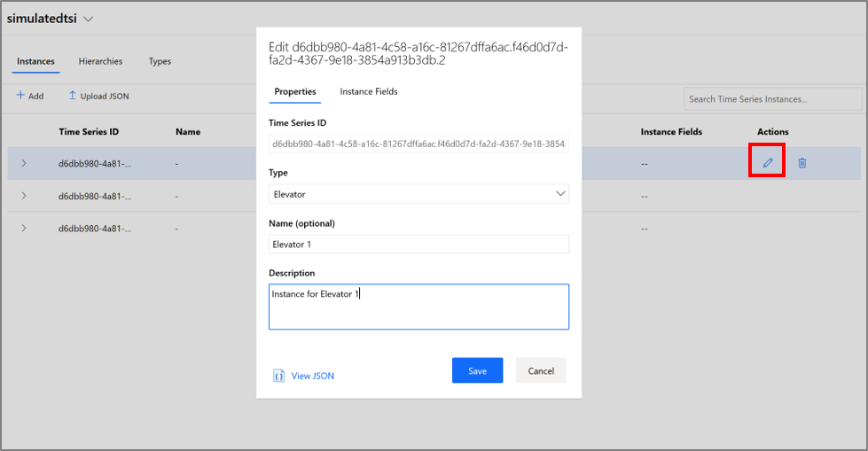](media/v2-update-provision/define-ten-edit.png#lightbox)

1. In the **Edit instances** pane, set the following parameters:

    | Parameter | Action |
    | --- | --- |
    | **Type** | Select **Chiller**. |
    | **Description** | Enter **Instance for Chiller-01.1**. |
    | **Hierarchies** | Select **Location Hierarchy**. |
    | **Country** | Enter **USA**. |
    | **City** | Enter **Seattle**. |
    | **Building** | Enter **Space Needle**. |

    [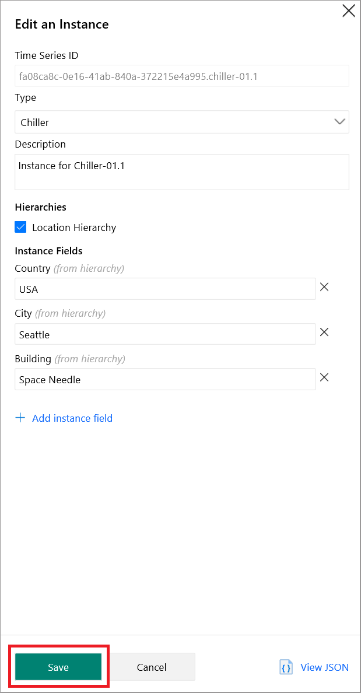](media/v2-update-provision/define-eleven-chiller.png#lightbox)

   Select **Save**.

1. Repeat the preceding step for the other sensors. Update the following values:

   * For Chiller 01.2:

     | Parameter | Action |
     | --- | --- |
     | **Type** | Select **Chiller**. |
     | **Description** | Enter **Instance for Chiller-01.2**. |
     | **Hierarchies** | Select **Location Hierarchy**. |
     | **Country** | Enter **USA**. |
     | **City** | Enter **Seattle**. |
     | **Building** | Enter **Pacific Science Center**. |

   * For Chiller 01.3:

     | Parameter | Action |
     | --- | --- |
     | **Type** | Select **Chiller**. |
     | **Description** | Enter **Instance for Chiller-01.3**. |
     | **Hierarchies** | Select **Location Hierarchy**. |
     | **Country** | Enter **USA**. |
     | **City** | Enter **New York**. |
     | **Building** | Enter **Empire State Building**. |

1. Select the **Analyze** tab, and then refresh the page. Under **Location Hierarchy**, expand all hierarchy levels to display the time series instances:

   

1. To explore the time series instances over the last hour, change **Quick Times** to **Last Hour**:

    [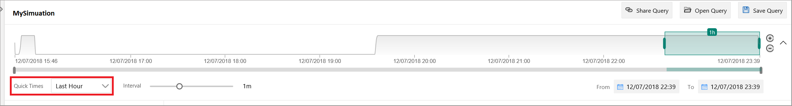](media/v2-update-provision/define-thirteen-explore.png#lightbox)

1. Under **Pacific Science Center**, select the time series instance, and then select **Show Max Humidity**.

    [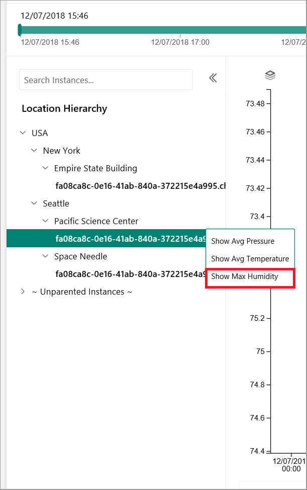](media/v2-update-provision/define-fourteen-show-max.png#lightbox)

1. The time series for **Max Humidity** with an interval size of **1 minute** opens. To filter a range, select a region. To analyze events in the time frame, right-click the chart, and then select **Zoom**:

   [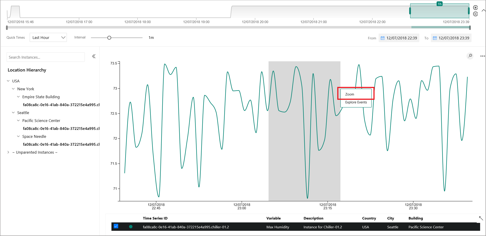](media/v2-update-provision/define-fifteen-filter.png#lightbox)

1. To see event details, select a region, and then right-click the chart:

   [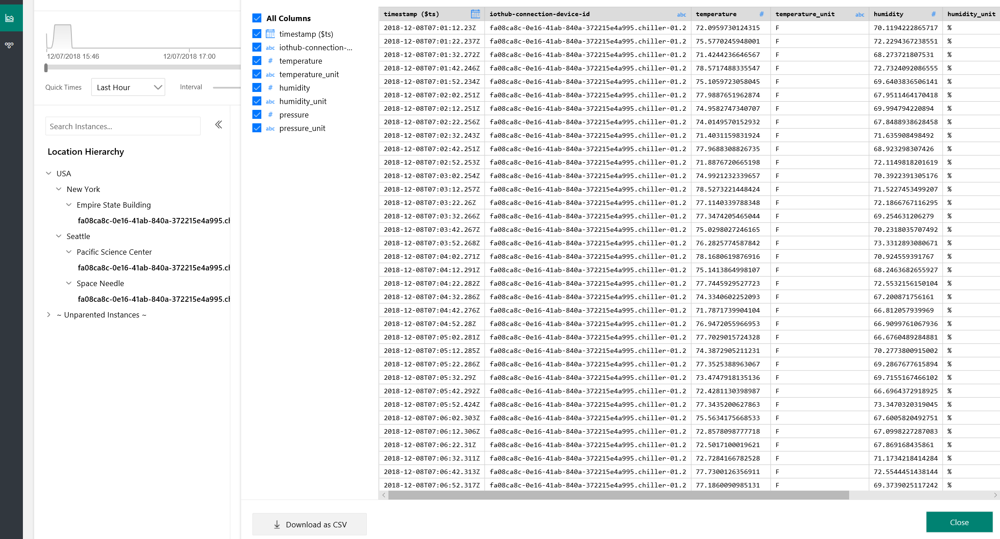](media/v2-update-provision/define-eighteen.png#lightbox)

## Next steps

In this tutorial, you learned how to:  

> [!div class="checklist"]
> * Create and use a device simulation accelerator.
> * Create an Azure Time Series Insights Preview PAYG environment.
> * Connect the Azure Time Series Insights Preview environment to an event hub.
> * Run a solution accelerator sample to stream data to the Azure Time Series Insights Preview environment.
> * Perform a basic analysis of the data.
> * Define a Time Series Model type and hierarchy, and associate them with your instances.

Now that you know how to create your own Azure Time Series Insights Preview environment, learn more about the key concepts in Azure Time Series Insights.

Read about the Azure Time Series Insights storage configuration:

> [!div class="nextstepaction"]
> [Azure Time Series Insights Preview storage and ingress](./time-series-insights-update-storage-ingress.md)

Learn more about Time Series Models:

> [!div class="nextstepaction"]
> [Azure Time Series Insights Preview data modeling](./time-series-insights-update-tsm.md)
