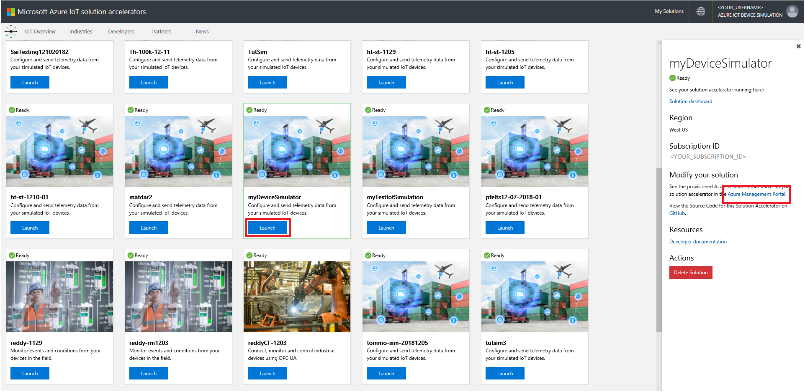

---
title: 'Tutorial: Set up an Azure Time Series Insights Preview environment | Microsoft Docs'
description: Learn how to set up your environment in Azure Time Series Insights Preview.
author: ashannon7
ms.author: anshan
ms.workload: big-data
manager: cshankar
ms.service: time-series-insights
services: time-series-insights
ms.topic: tutorial
ms.date: 12/12/2018
ms.custom: seodec18
---

# Tutorial: Set up an Azure Time Series Insights Preview environment

This tutorial guides you through the process of creating an Azure Time Series Insights Preview pay-as-you-go (PAYG) environment. In this tutorial, you learn how to:

* Create an Azure Time Series Insights Preview environment.
* Connect the Azure Time Series Insights Preview environment to an event hub in Azure Event Hubs.
* Run a solution accelerator sample to stream data into the Azure Time Series Insights Preview environment.
* Perform basic analysis on the data.
* Define a Time Series Model type and hierarchy, and associate it with your instances.

# Create a device simulation

In this section, you create three simulated devices that will send data to an IoT hub.

1. Go to the [Azure IoT solution accelerators page](https://www.azureiotsolutions.com/Accelerators). The page displays several prebuilt examples. Sign in by using your Azure account. Then, select **Device Simulation**.

   

   Select **Try Now**.

1. Enter the required parameters on the **Create Device Simulation solution** page:

   | Parameter | Description |
   | --- | --- |
   | **Solution name** |	Enter a unique value for creation of a new resource group. The listed Azure resources are created and assigned to the resource group. |
   | **Subscription** |	Specify the same subscription used for creation of your Time Series Insights environment. |
   | **Region** |	Specify the same region used for creation of your Time Series Insights environment. |
   | **Deploy optional Azure Resources**	| Leave IoT Hub selected, because the simulated devices will use it to connect and stream data. |

   Then, select **Create solution**. Wait 10-15 minutes for your solution to be deployed.

   

1. In your solution accelerator dashboard, select the **Launch** button:

   

1. You're redirected to the **Microsoft Azure IoT Device Simulation** page. Select **+ New simulation** on the upper right of the page.

   

1. Fill out the required parameters as follows:

    

    |||
    | --- | --- |
    | **Name** | Enter a unique name for a simulator. |
    | **Description** | Enter a definition. |
    | **Simulation duration** | Set to **Run indefinitely**. |
    | **Device model** | **Name**: Enter `Chiller`.  **Amount**: Enter `3`. |
    | **Target IoT Hub** | Set to **Use pre-provisioned IoT Hub**. |

    Then, select **Start simulation**.

1. In the device simulation dashboard, see **Active devices** and **Messages per second**.

    

## List device simulation properties

Before you create an Azure Time Series Insights environment, you need the names of your IoT hub, subscription, and resource group.

1. Go to the solution accelerator dashboard and sign in by using the same Azure subscription account. Find the device simulation that you created in the previous steps.

1. Select your device simulator and select **Launch**. Select the **Azure Management Portal** link on the right side.

    

1. Take note of the IoT hub, subscription, and resource group names.

    

## Create a Time Series Insights Preview PAYG environment

This section describes how to create an Azure Time Series Insights Preview environment by using the [Azure portal](https://portal.azure.com/).

1. Sign in to the Azure portal by using your subscription account.

1. Select **Create a resource**.

1. Select the **Internet of Things** category, and then select **Time Series Insights**.

   

1. Fill in the fields on the page as follows:

   | | |
   | --- | ---|
   | **Environment name** | Choose a unique name for the Azure Time Series Insights Preview environment. |
   | **Subscription** | Enter your subscription where you want to create the Azure Time Series Insights Preview environment. It's a best practice to use the same subscription as the rest of your IoT resources created by the device simulator. |
   | **Resource group** | A resource group is a container for Azure resources. Choose an existing resource group, or create a new one, for the Azure Time Series Insights Preview environment resource. It's a best practice to use the same resource group as the rest of your IoT resources created by the device simulator. |
   | **Location** | Choose a datacenter region for your Azure Time Series Insights Preview environment. To avoid added bandwidth costs and latency, it's best to keep the Azure Time Series Insights Preview environment in the same region as other IoT resources. |
   | **Tier** |  Select **PAYG**, which stands for pay-as-you-go. This is the SKU for the Azure Time Series Insights Preview product. |
   | **Property ID** | Enter something that uniquely identifies your time series. Note that this field is immutable and can't be changed later. For this tutorial, use `iothub-connection-device-id`. To learn more about the Time Series ID, read [How to choose a Time Series ID](./time-series-insights-update-how-to-id.md). |
   | **Storage account name** | Enter a globally unique name for a new storage account to be created. |

   Then, select **Next: Event Source**.

   

1. On the page for the event source, fill in the fields as follows:

   | | |
   | --- | --- |
   | **Create an event source?** | Enter `Yes`.|
   | **Name** | Enter a unique value that's used to name the event source.|
   | **Source type** | Select **IoT Hub**. |
   | **Select a hub?** | Select **Select existing**. |
   | **Subscription** | Select the subscription you used for the device simulator. |
   | **IoT Hub name** | Select the IoT hub name you created for the device simulator. |
   | **IoT Hub access policy** | Select **iothubowner**. |
   | **Iot Hub consumer group** | You need a unique consumer group for Azure Time Series Insights Preview. Select **New**, enter a unique name, and then select **Add**. |
   | **Timestamp property** | This field is used to identify the timestamp property in your incoming telemetry data. For this tutorial, don't fill in the field. This simulator uses the incoming timestamp from IoT Hub, which Time Series Insights defaults to.|

   Then, select **Review + create**.

   

1. Review all fields on the review page and select **Create**.

   

1. You can see the status of your deployment.

   

1. You should receive access to your Azure Time Series Insights Preview environment if you own the tenant. To make sure that you have access:

   a. Search for your resource group and select your Azure Time Series Insights Preview environment:

      

   b. On the Azure Time Series Insights Preview page, go to **Data Access Policies**.

     

   c. Verify that your credentials are listed.

     

   If your credentials aren't listed, you have to give yourself permission to access the environment. To learn more about setting permissions, read [Grant data access](./time-series-insights-data-access.md).

## Analyze data in your environment

In this section, you perform basic analytics on your time series data by using the [Azure Time Series Insights Preview explorer](./time-series-insights-update-explorer.md).

1. Go to your Azure Time Series Insights Preview explorer by selecting the URL from the resource page in the [Azure portal](https://portal.azure.com/).

   

1. In the explorer, select the **Time Series Instances** node to see all the Azure Time Series Insights Preview instances in the environment.

   

1. In the time series shown, select the first instance. Then, select **Show Avg pressure**.

   

   A time series chart should appear on the right. Adjust the **Interval** to `15s`.

   

1. Repeat step 3 with the other two time series. You can then view all time series, as shown in this chart:

   

1. Modify the time range to see time series trends over the last hour.

   a. Select the **Timeframe** option box:

      

## Define and apply a model

In this section, you apply a model to structure your data. To complete the model, you define types, hierarchies, and instances. To learn more about data modeling, go to [Time Series Model](./time-series-insights-update-tsm.md).

1. In the explorer, select the **Model** tab:

   

1. Select **+ Add** to add a type. On the right side, a type editor opens.

   

1. Define three variables for the type: pressure, temperature, and humidity. Enter the following information:

   | | |
   | --- | ---|
   | **Name** | Enter `Chiller`. |
   | **Description** | Enter `This is a type definition of Chiller`. |

   * Define pressure with three variables:

      | | |
      | --- | ---|
      | **Name** | Enter `Avg Pressure`. |
      | **Value** | Select **pressure (Double)**. Note that this field might take a few minutes to be populated after Azure Time Series Insights Preview starts receiving events. |
      | **Aggregation Operation** | Select **AVG**. |

      

      Select  **+ Add Variable** to add the next variable.

   * Define temperature:

      | | |
      | --- | ---|
      | **Name** | Enter **Avg Temperature**. |
      | **Value** | Select **temperature (Double)**. Note that this field might take a few minutes to be populated after Azure Time Series Insights Preview starts receiving events. |
      | **Aggregation Operation** | Select **AVG**.|

      

   * Define humidity:

      | | |
      | --- | ---|
      | **Name** | Enter **Max Humidity**. |
      | **Value** | Select **humidity (Double)**. Note that this field might take a few minutes to be populated after Azure Time Series Insights Preview starts receiving events. |
      | **Aggregation Operation** | Select **MAX**.|

      

   Then, select **Create**.

1. You can see your type added:

   

1. The next step is to add a hierarchy. In the **Hierarchies** section, select **+ Add**:

   

1. Define the hierarchy. Fill in the fields as follows:

   | | |
   | --- | ---|
   | **Name** | Enter `Location Hierarchy`. |
   | **Level 1** | Enter `Country`. |
   | **Level 2** | Enter `City`. |
   | **Level 3** | Enter `Building`. |

   Then, select **Create**.

   

1. You can see the hierarchy that you created:

   

1. Select **Instances** on the left. After the instances appear, select the first instance, and then select **Edit**:

   

1. On the right side, a text editor appears. Add the following information:

   | | |
   | --- | --- |
   | **Type** | Select **Chiller**. |
   | **Description** | Enter `Instance for Chiller-01.1`. |
   | **Hierarchies** | Select **Location Hierarchy**. |
   | **Country** | Enter **USA**. |
   | **City** | Enter **Seattle**. |
   | **Building** | Enter **Space Needle**. |

    Then, select **Save**.

   

1. Repeat the previous step for the other sensors. Use the following fields:

   * For Chiller 01.2:

     | | |
     | --- | --- |
     | **Type** | Select **Chiller**. |
     | **Description** | Enter `Instance for Chiller-01.2`. |
     | **Hierarchies** | Select **Location Hierarchy**. |
     | **Country** | Enter **USA**. |
     | **City** | Enter **Seattle**. |
     | **Building** | Enter **Pacific Science Center**. |

   * For Chiller 01.3:

     | | |
     | --- | --- |
     | **Type** | Select **Chiller**. |
     | **Description** | Enter `Instance for Chiller-01.3`. |
     | **Hierarchies** | Select **Location Hierarchy**. |
     | **Country** | Enter **USA**. |
     | **City** | Enter **New York**. |
     | **Building** | Enter **Empire State Building**. |

1. Go to the **Analyze** tab and refresh the page. Expand all hierarchy levels to find the time series.

   

1. To explore time series over the last hour, change **Quick Times** to **Last Hour**:

    

1. Select the time series under **Pacific Science Center** and select **Show Max Humidity**.

    

1. The time series for **Max Humidity** with an interval size of **1 minute** opens. Select a region to filter a range. Then, right-click and select **Zoom** to analyze events in the time frame:

   

1. You can also select a region and then right-click to see event details:

   

## Next steps

In this tutorial, you learned how to:  

> [!div class="checklist"]
> * Create and use a device simulation accelerator.
> * Create an Azure Time Series Insights Preview PAYG environment.
> * Connect the Azure Time Series Insights Preview environment to an event hub.
> * Run a solution accelerator sample to stream data to the Azure Time Series Insights Preview environment.
> * Perform a basic analysis of the data.
> * Define a Time Series Model type and hierarchy, and associate them with your instances.

Now that you know how to create your own Azure Time Series Insights Preview environment, learn more about the key concepts in Azure Time Series Insights.

Read about the Azure Time Series Insights storage configuration:

> [!div class="nextstepaction"]
> [Azure Time Series Insights Preview storage and ingress](./time-series-insights-update-storage-ingress.md)

Learn more about Time Series Models:

> [!div class="nextstepaction"]
> [Azure Time Series Insights Preview data modeling](./time-series-insights-update-tsm.md)