# Tutorial: Set up an Azure Time Series Insights Preview environment

This tutorial guides you through the process of creating an Azure Time Series Insights Preview pay-as-you-go (PAYG) environment.

In this tutorial, you learn how to:

> [!div class="checklist"]
>
> * Create an Azure Time Series Insights Preview environment.
> * Connect the Azure Time Series Insights Preview environment to an IoT Hub.
> * Run a solution accelerator sample to stream data into the Azure Time Series Insights Preview environment.
> * Perform basic analysis on the data.
> * Define a Time Series Model type and hierarchy, and associate it with your instances.
> * Use the Power BI connector and visualize data in Power BI.

>[!TIP]
> [IoT solution accelerators](https://www.azureiotsolutions.com/Accelerators) provide enterprise-grade preconfigured solutions that you can use to accelerate the development of custom IoT solutions.

Sign up for a [free Azure subscription](https://azure.microsoft.com/free/) if you don't already have one.

## Prerequisites

* At minimum, you must have the **Contributor** role for the Azure subscription. For more information, see [Manage access by using role-based access control and the Azure portal](../role-based-access-control/role-assignments-portal.md).

## Create a device simulation

In this section, you will create three simulated devices that send data to an Azure IoT Hub instance.

1. Go to the [Azure IoT solution accelerators page](https://www.azureiotsolutions.com/Accelerators). The page displays several prebuilt examples. Sign in by using your Azure account. Then, select **Device Simulation**.

   

1. On the next page, select **Try Now**.

   [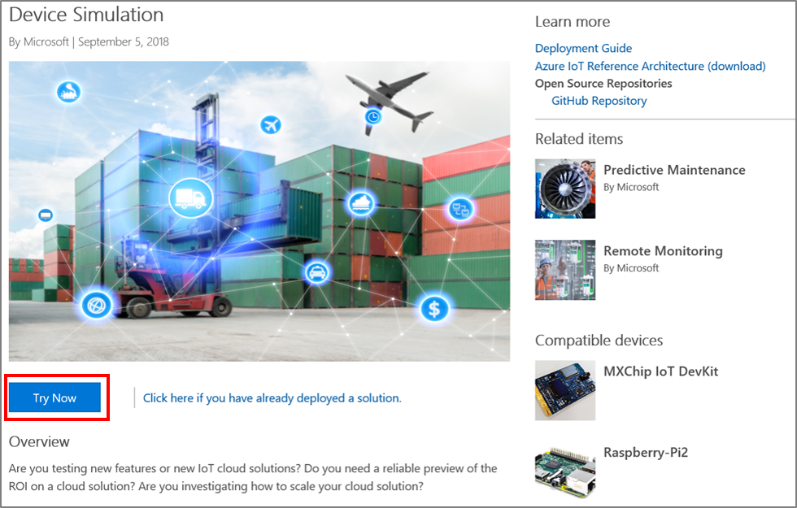](media/v2-update-provision/device-two-try.png#lightbox)

1. On the **Create Device Simulation solution** page, set the following parameters:

    | Parameter | Action |
    | --- | --- |
    | **Deployment name** | Enter a unique value for a new resource group. The listed Azure resources are created and assigned to the resource group. |
    | **Azure subscription** | Select the subscription where you will create your Time Series Insights environment. |
    | **Azure location** | Select the region where you intend to store your Time Series Insights environment. Note that the device simulator is only offered in a limited number of regions, thus, if you do not see your desired region you may choose to select a location solely for the tutorial and then create a new TSI environment when you’re ready to move onto your next phase of on-boarding.  |
    | **Deployment options** | Select **Provision new IoT Hub**. |

    1. Select **Create**.
    

1. After about 20 minutes, your solution accelerator will be ready.

    [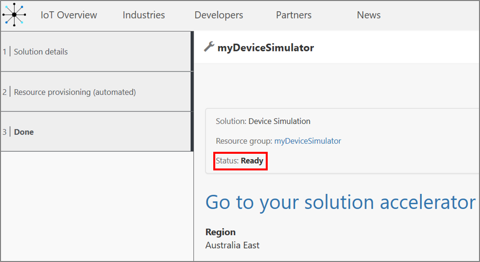](media/v2-update-provision/device-two-ready.png#lightbox)

## Create a Preview PAYG environment

This section describes how to create an Azure Time Series Insights Preview environment and connect it to the IoT hub created by the IoT Solution Accelerator using the [Azure portal](https://portal.azure.com/).

1. Sign in to the Azure portal by using your subscription account.

1. Select **Create a resource** > **Internet of Things** > **Time Series Insights**.

   

1. In the **Create Time Series Insights environment** pane, on the **Basics** tab, set the following parameters:

    | Parameter | Action |
    | --- | ---|
    | **Environment name** | Enter a unique name for the Azure Time Series Insights Preview environment. |
    | **Subscription** | Enter the subscription where you want to create the Azure Time Series Insights Preview environment. A best practice is to use the same subscription as the rest of the IoT resources that are created by the device simulator. |
    | **Resource group** | Select an existing resource group or create a new resource group for the Azure Time Series Insights Preview environment resource. A resource group is a container for Azure resources. A best practice is to use the same resource group as the other IoT resources that are created by the device simulator. |
    | **Location** | Select a data center region for your Azure Time Series Insights Preview environment. To avoid additional latency, it's best to create your Azure Time Series Insights Preview environment in the same region as your IoT hub created by the device simulator. |
    | **Tier** |  Select **PAYG** (*pay-as-you-go*). This is the SKU for the Azure Time Series Insights Preview product. |
    | **Property ID** | Enter a value that uniquely identifies your time series instance. The value you enter in the **Property ID** box cannot be changed later. For this tutorial, enter **iothub-connection-device-id**. To learn more about Time Series ID, see [Best practices for choosing a Time Series ID](./time-series-insights-update-how-to-id.md). |
    | **Storage account name** | Enter a globally unique name for a new storage account.|
    |**Enable warm store**|Select **Yes** to enable warm store.|
    |**Data retention (in days)**|Choose the default option of 7 days. |

    Select **Next: Event Source**.

   [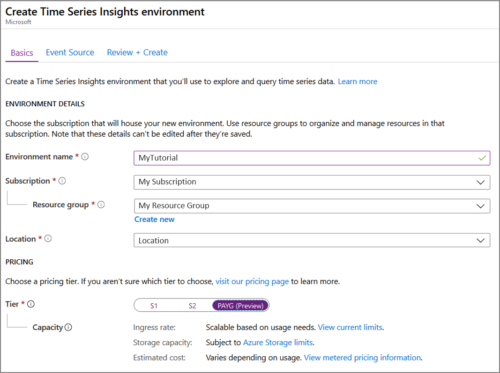](media/v2-update-provision/payg-two-1-create.png#lightbox)
   [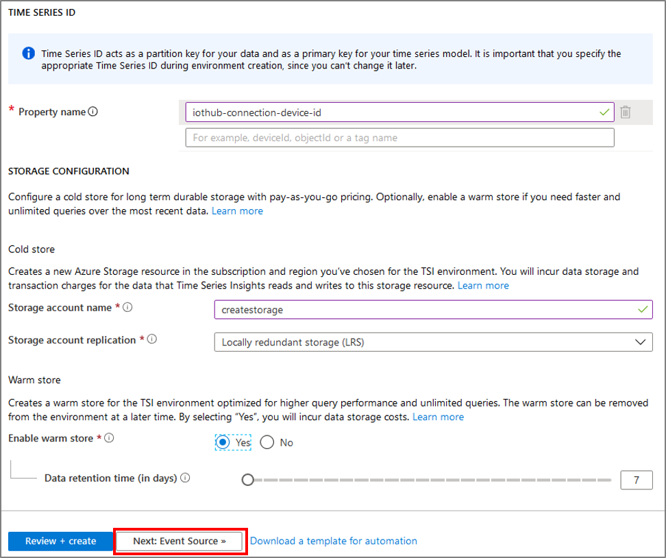](media/v2-update-provision/payg-two-2-create.png#lightbox)

1. On the **Event Source** tab, set the following parameters:

   | Parameter | Action |
   | --- | --- |
   | **Create an event source?** | Select **Yes**.|
   | **Name** | Enter a unique value for the event source name. |
   | **Source type** | Select **IoT Hub**. |
   | **Select a hub** | Choose **Select existing**. |
   | **Subscription** | Select the subscription that you used for the device simulator. |
   | **IoT Hub name** | Select the IoT hub name you created for the device simulator. |
   | **IoT Hub access policy** | Select **iothubowner**. |
   | **IoT Hub consumer group** | Select **New**, enter a unique name, and then select **Add**. The consumer group must be a unique value in Azure Time Series Insights Preview. |
   | **Timestamp property** | This value is used to identify the **Timestamp** property in your incoming telemetry data. For this tutorial, leave this box empty. This simulator uses the incoming timestamp from IoT Hub, which Time Series Insights defaults to. |

   Select **Review + create**.

   

1. Select **Create**.

    

    You can see the status of your deployment:

    

1. You have access to your Azure Time Series Insights Preview environment by default if you are an owner of the Azure subscription. Verify that you have access:

   1. Search for your resource group, and then select your newly created Azure Time Series Insights Preview environment. 
      

   1. On the Azure Time Series Insights Preview page, select **Data Access Policies**:
      

   1. Verify that your credentials are listed:

      

   If your credentials aren't listed, you must grant yourself permission to access the environment by selecting Add and searching for your credentials. To learn more about setting permissions, read [Grant data access](./time-series-insights-data-access.md).

## Stream data

Now that you've deployed your Time Series Insights environment, begin streaming data for analysis.

1. Navigate back to the [Azure IoT solution accelerators page](https://www.azureiotsolutions.com/Accelerators). Locate your solution in your solution accelerator dashboard, then select **Launch**:

    

1. Select **Go to your solution accelerator**.

    [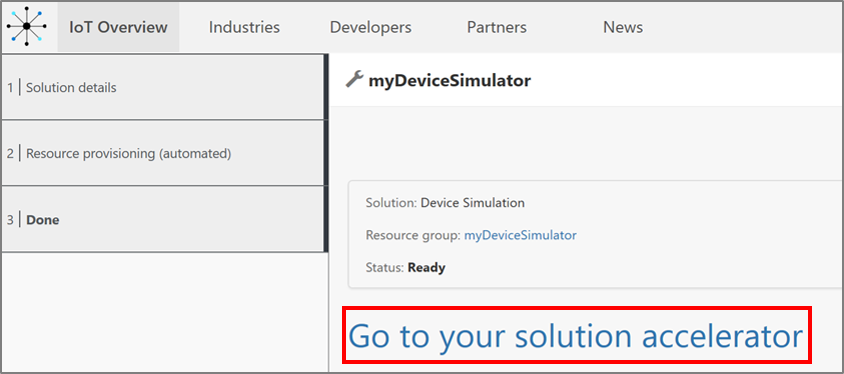](media/v2-update-provision/device-accelerator.png#lightbox)

1. You're redirected to the **Microsoft Azure IoT Device Simulation** page. In the upper-right corner of the page, select **New simulation**.

    

1. In the **Simulation setup** pane, set the following parameters:

    | Parameter | Action |
    | --- | --- |
    | **Name** | Enter a unique name for a simulator. |
    | **Description** | Enter a definition. |
    | **Simulation duration** | Set to **Run indefinitely**. |
    | **Device model** | Click + **Add a device type**  **Name**: Enter **Elevator**.  **Amount**: Enter **3**.   Leave the remaining default values |
    | **Target IoT Hub** | Set to **Use pre-provisioned IoT Hub**. |

    

    Select **Start simulation**.

    In the device simulation dashboard, you will see **Active devices** and **Total messages**.

    

## Analyze data

In this section, you perform basic analytics on your time series data by using the [Azure Time Series Insights Preview explorer](./time-series-insights-update-explorer.md).

1. Go to your Azure Time Series Insights Preview explorer by selecting the URL from the resource page in the [Azure portal](https://portal.azure.com/).

    

1. In the Time Series Insights explorer, you will see a bar spanning the top of the screen. This is your availability picker. Ensure that you have at least two 2m selected, and if needed, expand the time frame by selecting and dragging the picker handles to the left and right.

1. You will be able to see **Time Series Instances** on the left.

    

1. Select the first time series instance. Then, select **Show pressure**.

    

    A time series chart appears. Change the **Interval** to **30s**.

    

1. Repeat step 3 with the other two time series instances so that you’re viewing all three, as shown in this chart:

    

1. Select the time span picker in the upper right corner. Here you can select specific start and end times down to the millisecond, or choose from pre-configured options such as last hour. You can also change the default time zone.

    

    Below is a screen capture of the charting pane after running the simulation for an hour:

    [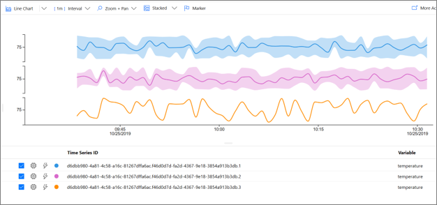](media/v2-update-provision/analyze-seven-time.png#lightbox)

## Define and apply a model

In this section, you apply a model to structure your data. To complete the model, you define types, hierarchies, and instances. To learn more about data modeling, see [Time Series Model](./time-series-insights-update-tsm.md).

1. In the explorer, select the **Model** tab:

   

1. In the **Types** tab, select **Add**.

   

1. Enter the following parameters:

    | Parameter | Action |
    | --- | ---|
    | **Name** | Enter **Elevator** |
    | **Description** | Enter **This is a type definition for Elevator** |

    [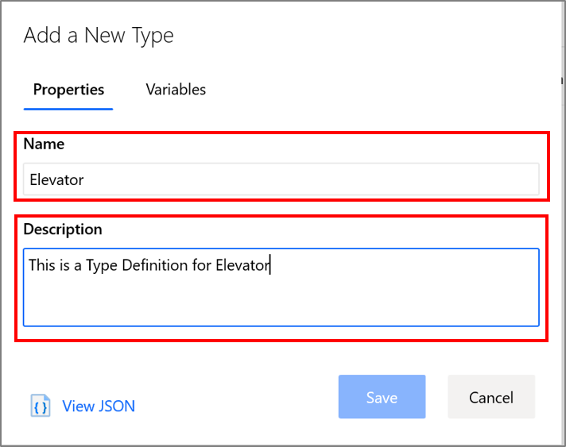](media/v2-update-provision/define-three-properties.png#lightbox)

1. Next, select the **Variables** tab.
[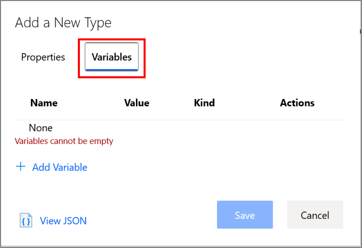](media/v2-update-provision/define-four-variables.png#lightbox)

1. Select **+ Add Variable** and fill in the following values for the first variable of the Elevator type. You will author three variables in total.

    | Parameter | Action |
    | --- | --- |
    | **Name** | Enter **Avg Temperature**. |
    | **Kind** | Select **Numeric** |
    | **Value** | Select from preset: Select **temperature (Double)**.   Note: It might take a few minutes for **Value** to be automatically populated after Azure Time Series Insights Preview starts receiving events.|
    | **Aggregation Operation** | Expand **Advanced Options**.   Select **AVG**. |

    [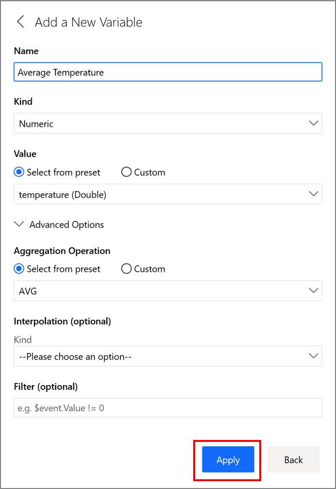](media/v2-update-provision/define-five-variable.png#lightbox)

    Select **Apply**.

    Select **+ Add Variable** again, and set the following values:

    | Parameter | Action |
    | --- | --- |
    | **Name** | Enter **Avg Vibration**. |
    | **Kind** | Select **Numeric** |
    | **Value** | Select from preset: Select **vibration (Double)**.   Note: It might take a few minutes for **Value** to be automatically populated after Azure Time Series Insights Preview starts receiving events.|
    | **Aggregation Operation** | Expand **Advanced Options**.   Select **AVG**. |

    [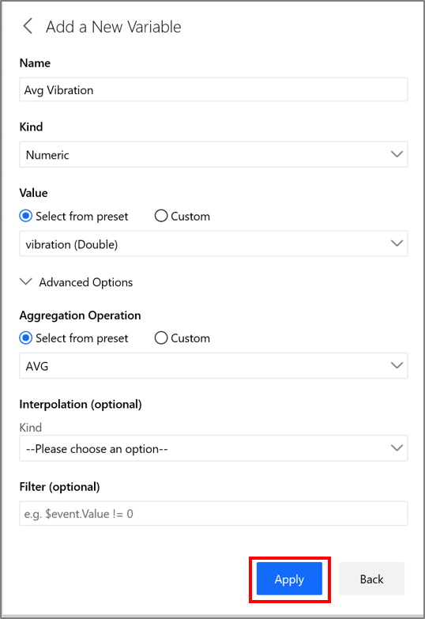](media/v2-update-provision/define-five-vibration.png#lightbox)

    Select **Apply**.

    Select **+ Add Variable** again, and set the following values for the third and final variable:

    | Parameter | Action |
    | --- | --- |
    | **Name** | Enter **Floor**. |
    | **Kind** | Select **Categorical** |
    | **Value** | Select from preset: Select **Floor (Double)**.   Note: It might take a few minutes for **Value** to be automatically populated after Azure Time Series Insights Preview starts receiving events.|
    | **Categories** | Label   - Values   Lower: 1,2,3,4   Middle: 5,6,7,8,9   Upper: 10,11,12,13,14,15 |
    | **Default Category** | Enter **Unknown** |

    [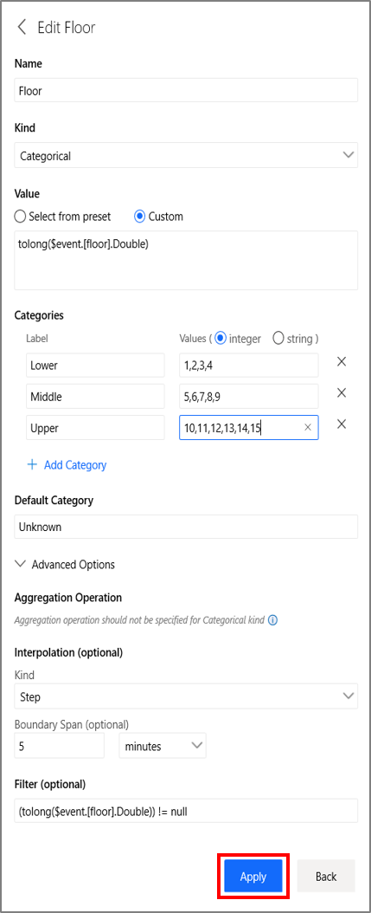](media/v2-update-provision/define-five-floor.png#lightbox)

    Select **Apply**. You should see three variables created:

    [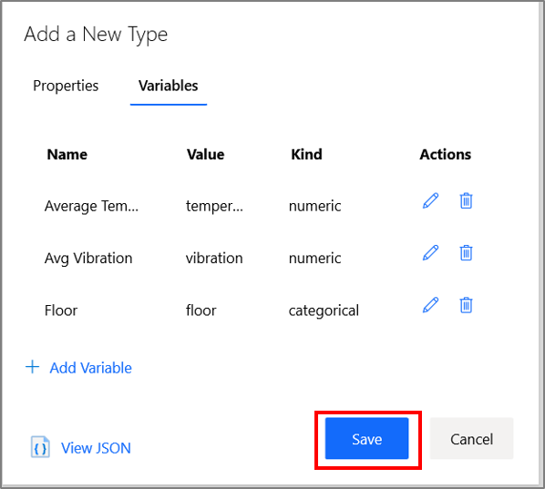](media/v2-update-provision/define-five-floor2.png#lightbox)

   Select **Save**. You will see the **Type** Created:

    

1. Select the **Hierarchies** tab. Select **+Add**.

    

1. In the **Edit Hierarchy** pane, set the following parameters:

   | Parameter | Action |
   | --- | ---|
   | **Name** | Enter **Location Hierarchy**. |
   |**Levels**| Enter **Country** as the name of the first level   Select **+ Add Level**   Enter **City** for the second level, then select **+ Add Level**   Enter **Building** as the name of the third and final level |

   Select **Save**.

    

   You can see the hierarchy that you created:

    

1. Navigate to **Instances**. Under **Actions** on the far right, and select the pencil icon to edit the first instance with the following values:

    | Parameter | Action |
    | --- | --- |
    | **Type** | Select **Elevator**. |
    | **Name** | Enter **Elevator 1**|
    | **Description** | Enter **Instance for Elevator 1** |

    

    Navigate to **Instance Fields** and enter the following:

    | Parameter | Action |
    | --- | --- |
    | **Hierarchies** | Select **Location Hierarchy** |
    | **Country** | Enter **USA** |
    | **City** | Enter **Seattle** |
    | **Building** | Enter **Space Needle** |

    [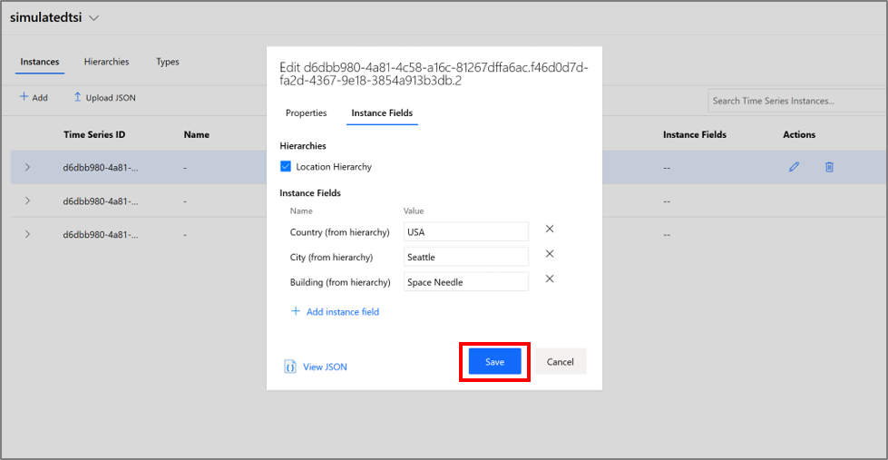](media/v2-update-provision/define-ten2-edit.png#lightbox)

    Select **Save**.

1. Repeat Step 8 with the other two instances with the following values:

    For Elevator 2:

    | Parameter | Action |
    | --- | --- |
    | **Type** | Select **Elevator**. |
    | **Name** | Enter **Elevator 2**|
    | **Description** | Enter **Instance for Elevator 2** |
    | **Hierarchies** | Select **Location Hierarchy** |
    | **Country** | Enter **USA** |
    | **City** | Enter **Seattle** |
    | **Building** | Enter **Pacific Science Center** |

    For Elevator 3:

    | Parameter | Action |
    | --- | --- |
    | **Type** | Select **Elevator**. |
    | **Name** | Enter **Elevator 3**|
    | **Description** | Enter **Instance for Elevator 3** |
    | **Hierarchies** | Select **Location Hierarchy** |
    | **Country** | Enter **USA** |
    | **City** | Enter **New York** |
    | **Building** | Enter **Empire State Building** |

1. Navigate back to the **Analyze** tab to view the charting pane. Under **Location Hierarchy**, expand all hierarchy levels to display the time series instances:

   

1. Under **Pacific Science Center**, select the Time Series Instance **Elevator 2**, and then select **Show Average Temperature**.

    [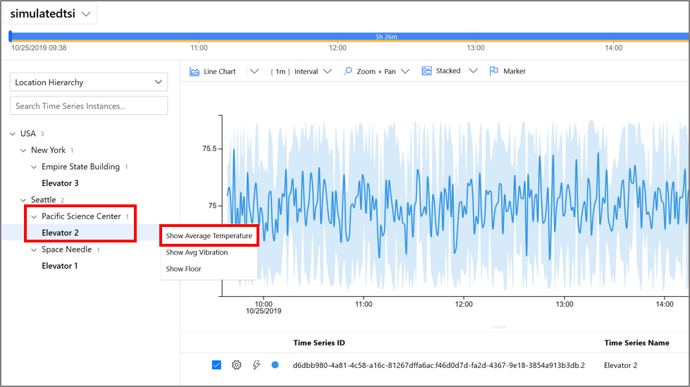](media/v2-update-provision/define-eleven-temperature.png#lightbox)

1. For the same instance, **Elevator 2**, select **Show Floor**.

    [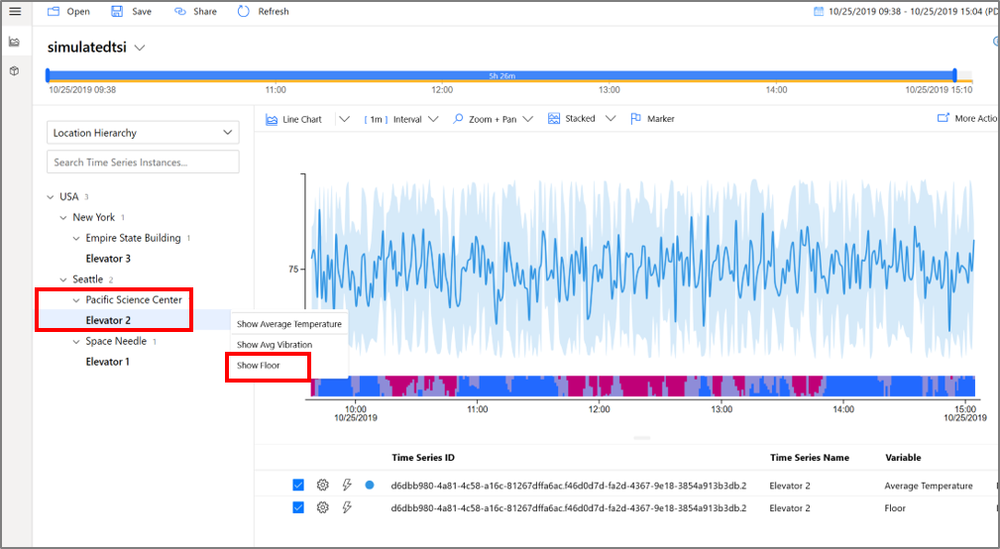](media/v2-update-provision/define-twelve-floor.png#lightbox)

    With your categorical variable, you can determine how much time the elevator spent on the upper, lower, and middle floors.

## Clean up resources

Now that you've completed the tutorial, clean up the resources you created:

1. From the left menu in the [Azure portal](https://portal.azure.com), select **All resources**, locate your Azure Time Series Insights resource group.
1. Either delete the entire resource group (and all resources contained within it) by selecting **Delete** or remove each resource individually.

## Next steps

In this tutorial, you learned how to:  

* Create and use a device simulation accelerator.
* Create an Azure Time Series Insights Preview PAYG environment.
* Connect the Azure Time Series Insights Preview environment to an iot hub.
* Run a solution accelerator sample to stream data to the Azure Time Series Insights Preview environment.
* Perform a basic analysis of the data.
* Define a Time Series Model type and hierarchy, and associate them with your instances.

Now that you know how to create your own Azure Time Series Insights Preview environment, learn more about the key concepts in Azure Time Series Insights.

Read about the Azure Time Series Insights storage configuration:

> [!div class="nextstepaction"]
> [Azure Time Series Insights Preview storage and ingress](./time-series-insights-update-storage-ingress.md)

Learn more about Time Series Models:

> [!div class="nextstepaction"]
> [Azure Time Series Insights Preview data modeling](./time-series-insights-update-tsm.md)
