# Visualize data in the explorer Preview

This document describes the UI/UX features and interface of the Azure Time Series Insights Preview [demo web app](https://insights.timeseries.azure.com/preview/demo). Specifically, it discusses the layout of the hosted sample, interface customization options, and navigation through the provided demo.

## Prerequisites

To get started with the Azure Time Series Insights Preview explorer, you must:

* Have a Time Series Insights environment set up. To learn more about provisioning an instance try our [Azure Time Series Insights Preview](./time-series-insights-update-create-environment.md) tutorial.
* [Provide data access](./time-series-insights-data-access.md) to the Time Series Insights environment that you created for the account. You can provide access to others as well as to yourself.
* Add an event source to the Time Series Insights environment to push data to the environment:
  * Learn [How to connect to an Event hub](./time-series-insights-how-to-add-an-event-source-eventhub.md)
  * Learn [How to connect to an IoT hub](./time-series-insights-how-to-add-an-event-source-iothub.md)

## Learn about the Preview explorer

The Azure Time Series Insights Preview explorer consists of the following elements:

[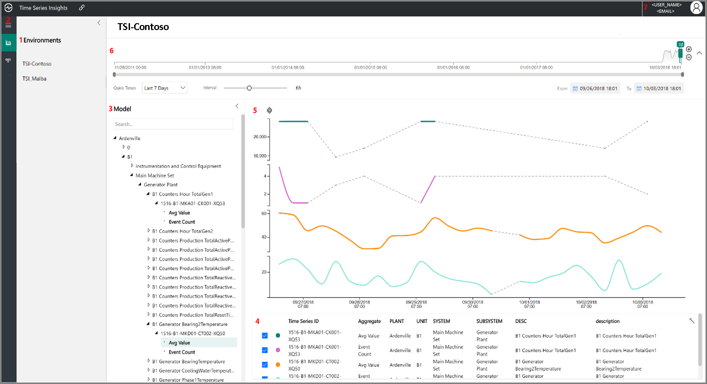](media/v2-update-explorer/explorer-one.png#lightbox)

1. <a href="#environment-dropdown">**Environment panel**</a>: Displays your Azure TSI environments.
1. <a href="#navigation-menu">**Navigation menu**</a>: Lets you switch between the **Analyze** and **Model** pages.
1. <a href="#hierarchy-tree">**Hierarchy tree**</a>: Lets you select specific model and data elements to be charted.
1. <a href="#preview-well">**Time series well**</a>: Displays your currently selected data elements in table format with color-coding.
1. <a href="#preview-chart">**Chart panel**</a>:  Displays your current working chart.
1. <a href="#time-editor-panel">**Timeline**</a>:  Lets you modify your working time span.
1. <a href="#navigation-panel">**App bar**</a>:  Contains your user management options, such as current tenant, and lets you change theme and language settings.

## Environment dropdown

The environment dropdown displays all the Time Series Insights environments you have access to. The list includes pay-as-you-go environments (Preview) and S1/S2 environments (general availability or GA). 

1. Simply click the dropdown arrow next to your displayed environment:

   [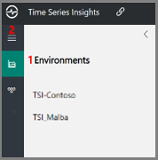](media/v2-update-explorer/explorer-two.png#lightbox)

1. Then, select the desired environment.

## Navigation menu

  [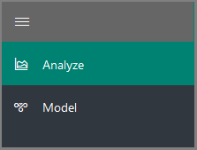](media/v2-update-explorer/explorer-three.png#lightbox)

The navigation menu allows you to select between two views:

* **Analyze**: Lets you chart and perform rich analytics on your modeled or unmodeled time series data.
* **Model**: Lets you push new Time Series Insights Preview types, hierarchies, and instances to your Time Series Insights model.

## Hierarchy tree

The hierarchy tree displays selected data elements including models, specific devices, and sensors on your devices.

### Model search panel

The model search panel lets you easily search and navigate your Time Series Model hierarchy to find the specific time series instances you want to display on your chart. When you select your instances, they are added to both the current chart and the data well.

  [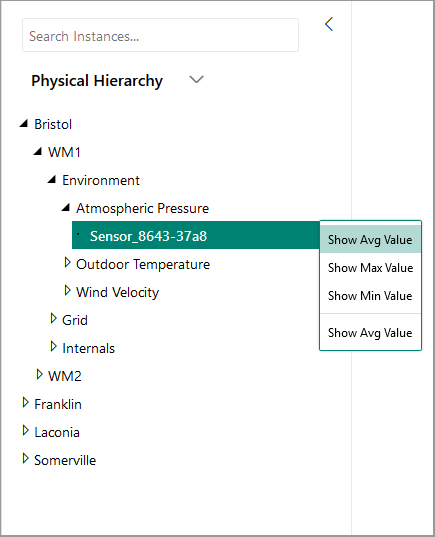](media/v2-update-explorer/explorer-four.png#lightbox)

### Model authoring

The Azure Time Series Insights Preview supports full Create, Read, Update, and Delete (CRUD) operations on your Time Series Model.  

* **Time Series Model type**: Time Series Insights types enable defining variables or formulas for doing computations. They are associated with a given Time Series Insights instance. A type can have one or more variables.
* **Time Series Model hierarchy**: Hierarchies are systematic organizations of your data. Hierarchies depict the relationships between different entities in your Time Series Insights data.
* **Time Series Model instance**: Instances are the time series themselves. In most cases, they are the **DeviceID** or **AssetID**, which is the unique identifier of the asset in the environment.

To learn more about the Time Series Model, see [Times Series Models](./time-series-insights-update-tsm.md).

## Preview well

The well displays instance fields and other metadata associated with selected TSI instances. The check boxes on the right-side let you hide or display specific instances from the current chart. You may also remove specific data elements from your current data well by clicking the red **Delete** (trash can) control in the left-side of the element.

  [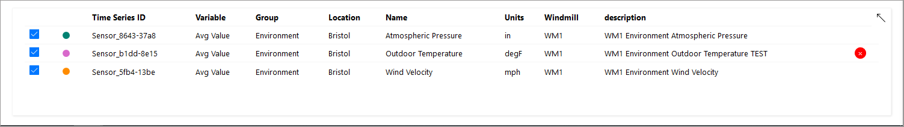](media/v2-update-explorer/explorer-five.png#lightbox)

You can also reconfigure the layout of your **Analyze** chart page by selecting the ellipses icon in the top-right:

  [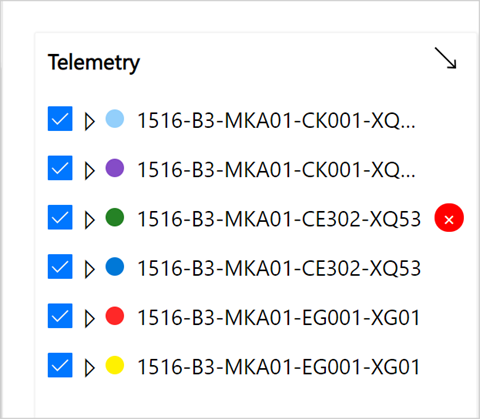](media/v2-update-explorer/explorer-six.png#lightbox)

> [!NOTE]
> If you see the following message, the instance does not have any data during the time span selected. To resolve the issue, you can increase the time span or confirm that the instance is pushing data.
>
> 

## Preview chart

With the chart, you can display TSI instances as lines. You can collapse the environment panel, data model, and time span control panel by clicking the web controls to make the chart larger.

  [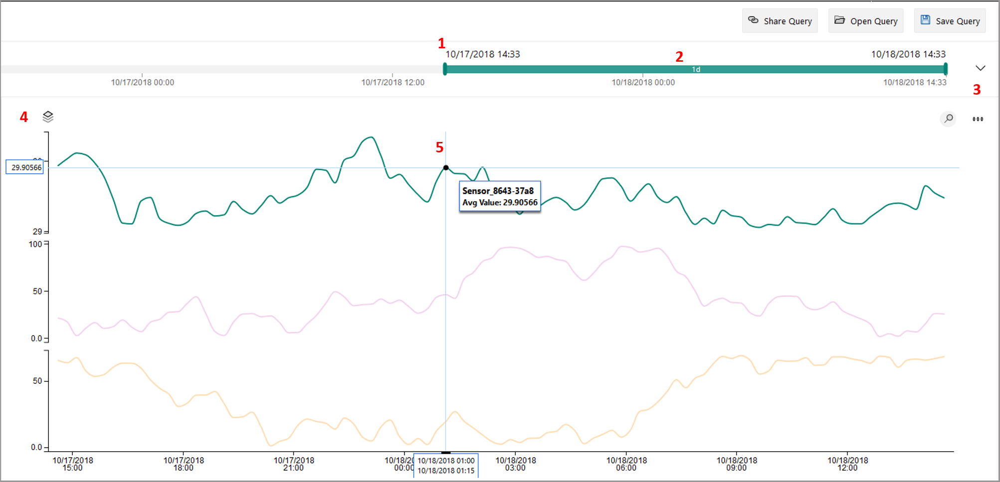](media/v2-update-explorer/explorer-eight.png#lightbox)

1. **Selected Date range**: Controls which data elements are available for visualization.

1. **Inner Date range slider tool**: Use the two endpoint controls by dragging them over the desired time span.

1. **Time span collapse control**: Collapses and expands the time span panel editor.

1. **Y-axis format control**: Cycles through the available Y-axis view options:

    * `Default`: Each line has an individual Y-axis.
    * `Stacked`: Lets you stack multiple lines on the same Y-axis, with the Y-axis data changing based on the line selected.
    * `Shared`: All Y-axis data displayed together.

1. **Current data element**: The currently selected data element and its associated details.

You can further drill into a specific data slice by left-clicking a data point on the current graph and then dragging the selected area to the endpoint of your choice. Right-click the greyed, selected area, and click **Zoom** as shown in this following image:

  [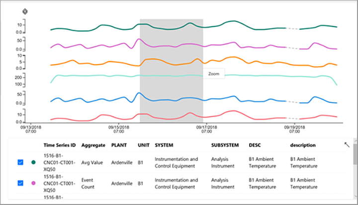](media/v2-update-explorer/explorer-nine.png#lightbox)

After you perform the **Zoom** action, you will see your selected dataset. Click the Y-axis format control to cycle through the three Y-axis representations of your Time Series Insights data.

  [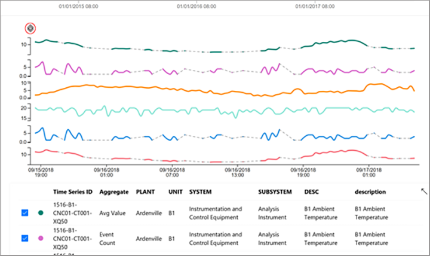](media/v2-update-explorer/explorer-ten.png#lightbox)

Here you can see an example of shared Y-axes:

  [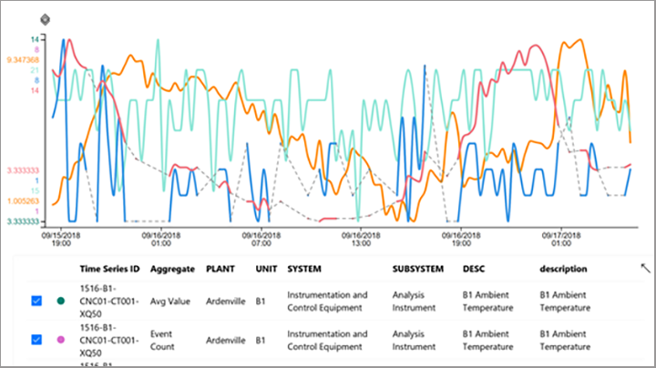](media/v2-update-explorer/explorer-eleven.png#lightbox)

## Time editor panel

When you work with Time Series Insights Preview, you first select a time span. The selected time span controls the dataset that is available for manipulation with the Time Series Insights Preview widgets. The following web controls are available in Time Series Insights Preview for selecting your working time span.

  [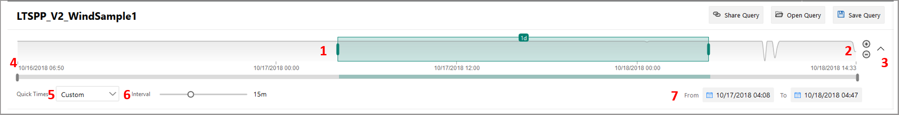](media/v2-update-explorer/explorer-twelve.png#lightbox)

1. **Inner-date range slider tool**: Use the two endpoint controls by dragging them over the desired time span. This inner-date range is constrained by the outer-date range slider control.

1. **Increase and decrease date range buttons**: Increase or decrease your time span by selecting either button for the interval you want.

1. **Time span collapse control**: This web control lets you hide all the controls except for the inner-date range slider tool.

1. **Outer-date range slider control**: Use the endpoint controls to select the outer-date range, which will be available for your inner-date range control.

1. **Quick times date-range drop-down**: Lets you quickly switch between preset time span selections, such as the last **30 minutes**, the **last 12 hours**, or a **custom range**. Changing this value also changes the available interval ranges discussed in the interval-size slider tool.

1. **Interval-size slider tool**: Lets you zoom in and out of intervals over the same time span. This action provides more precise control of movement between large slices of time. It displays smooth trends down to slices as small as a millisecond, allowing you to see granular, high-resolution cuts of your data. The slider’s default starting point is set as the most optimal view of the data from your selection, which balances resolution, query speed, and granularity.

1. **Date range to and from web control**: With this web control, you can easily click and select your desired date and time ranges. You can also use the control to switch between different time zones. After you make the changes, to apply to your current workspace, select **Save**.

   [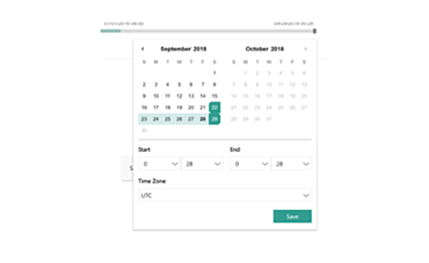](media/v2-update-explorer/explorer-thirteen.png#lightbox)

## Navigation panel

The Time Series Insights Preview navigation panel appears at the top of your TSI app. It provides the following functionalities.

### Current session share link control

  [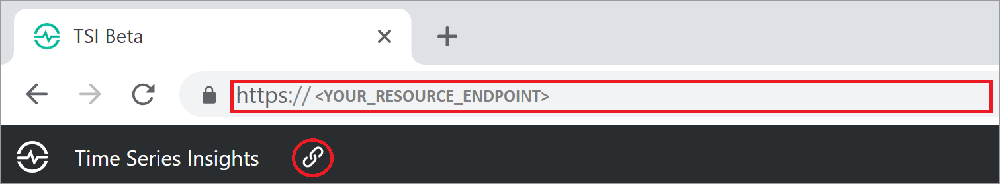](media/v2-update-explorer/explorer-fifteen.png#lightbox)

Select the new **Share** icon to share a URL link with your team.

  [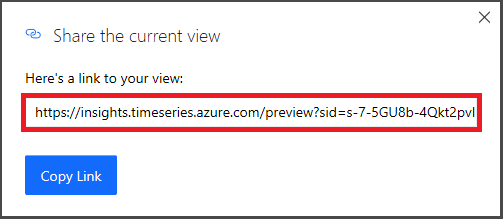](media/v2-update-explorer/url-share.png#lightbox)

### Tenant section

  

* Displays your current Time Series Insights login account information.
* Lets you switch between the available Time Series Insights themes.
* Allows you to view the Preview [demo web app](https://insights.timeseries.azure.com/preview/demo).

### Theme selection

To select a new theme, click on your profile icon located in the top-right corner. Then, select **Change Theme**.

  [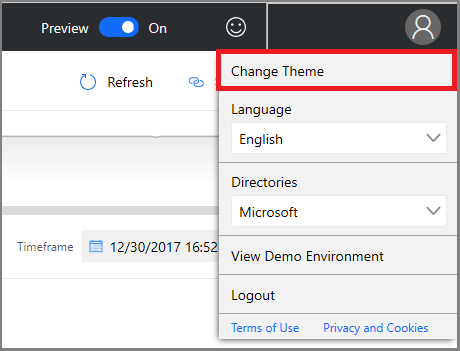](media/v2-update-explorer/theme-selection.png#lightbox)

> [!TIP]
> Language selection is also available by clicking on your profile icon.

Azure Time Series Insights Preview supports two themes:

* **Light Theme**: The default theme shown throughout this document.
* **Dark theme**:  Renders the explorer as shown here:

  

## S1/S2 environment controls

### Preview terms panel

This section applies only to existing S1/S2 environments that attempt to use the explorer in the updated UI. You might want to use the GA product and Preview in combination. We’ve added some functionality from the existing UI to the updated explorer, but you can get the full UI experience for S1/S2 environment in the existing Time Series Insights explorer.  

In lieu of the hierarchy, you will see the Time Series Insights terms panel, where you define queries in your environment. It lets you filter your data based on a predicate.

  [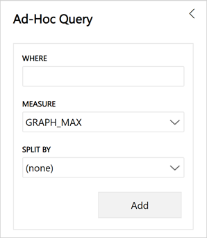](media/v2-update-explorer/explorer-eighteen.png#lightbox)

The Time Series Insights Preview terms editor panel takes the following parameters:

**Where**: The where clause lets you quickly filter your events by using the set of operands listed in the following table. If you conduct a search by selecting an operand, the predicate is automatically updated based on that search. Supported operand types include:

| Operation	| Supported types	| Notes |
| --- | --- | --- |
| `<`, `>`, `<=`, `>=` | Double, DateTime, TimeSpan | |
| `=`, `!=`, `<>` | String, Bool, Double, DateTime, TimeSpan, NULL |
| `IN` | String, Bool, Double, DateTime, TimeSpan, NULL | All operands should be of the same type or be NULL constant. |
| `HAS` | String | Only constant string literals are allowed at right-hand side. Empty string and NULL are not allowed. |

Learn more about supported query operations and data types by reading [Time Series Expression (TSX)](https://docs.microsoft.com/rest/api/time-series-insights/preview-tsx).

### Examples of Where clauses

  [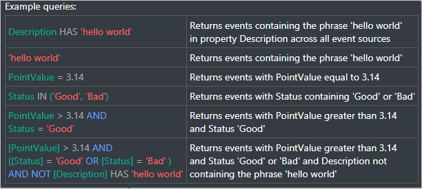](media/v2-update-explorer/explorer-nineteen.png#lightbox)

**Measure**: A drop-down that displays all the numeric columns (**Doubles**) you may use as elements for your current chart.

**Split by**: This drop-down displays all the available categorical columns (Strings) in your model that you can group your data by. You can add up to five terms to view on the same X-axis. Enter your desired parameters, and then select **Add** to add a fresh term.

  [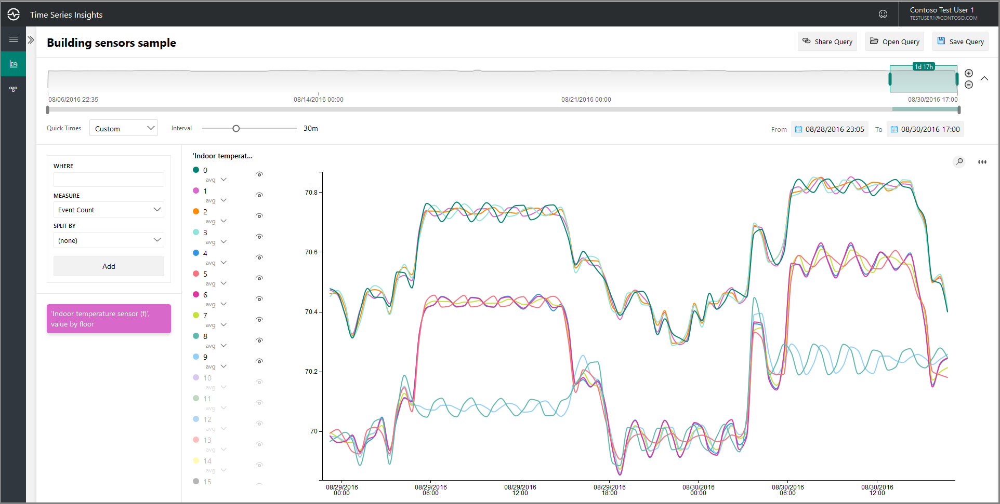](media/v2-update-explorer/explorer-twenty.png#lightbox)

You can show and hide elements in the chart panel by selecting the visible icon as shown in the following image. You can completely remove queries by clicking the red **X**.

  [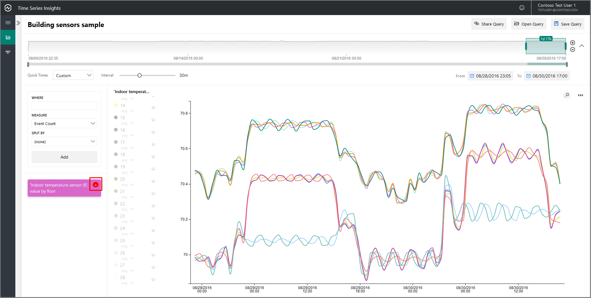](media/v2-update-explorer/explorer-twenty-one.png#lightbox)

## Next steps

- Learn about [storage and ingress](./time-series-insights-update-storage-ingress.md) in the Azure Time Series Insights Preview.

- Read the Time Series Insights Preview document on [data modeling](./time-series-insights-update-tsm.md).

- Learn [how to diagnose and troubleshoot](./time-series-insights-update-how-to-troubleshoot.md) your Time Series Insights instance.
