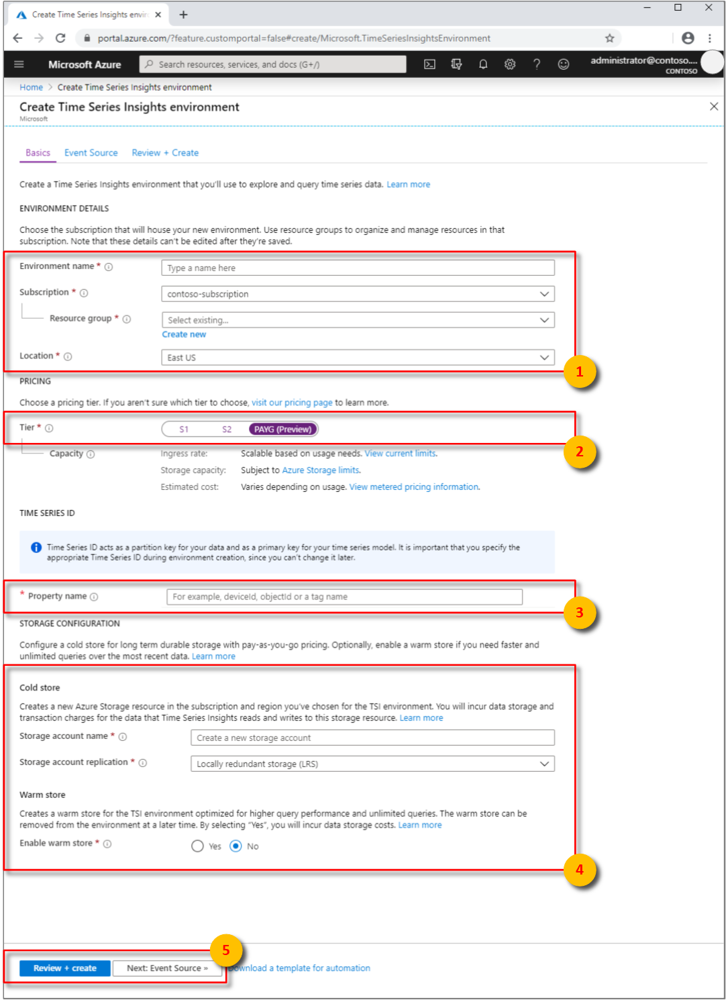
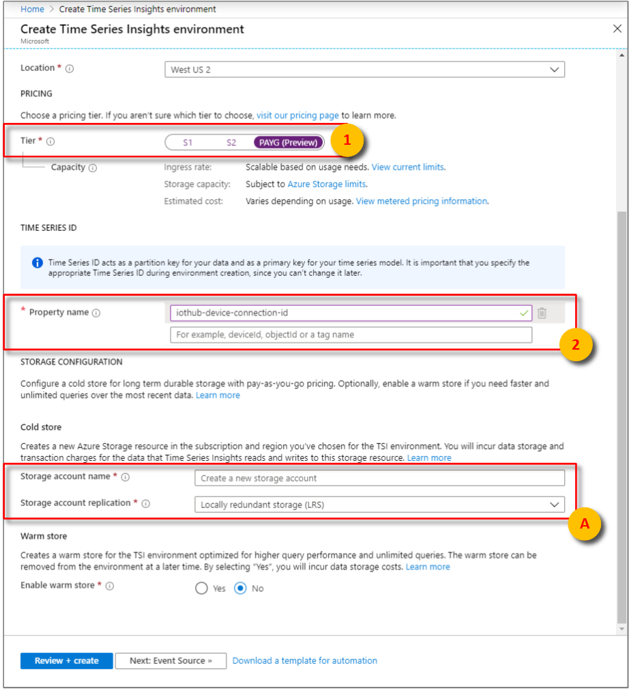
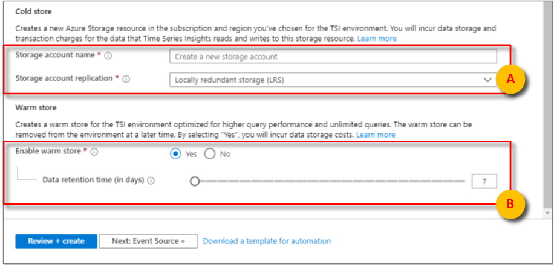
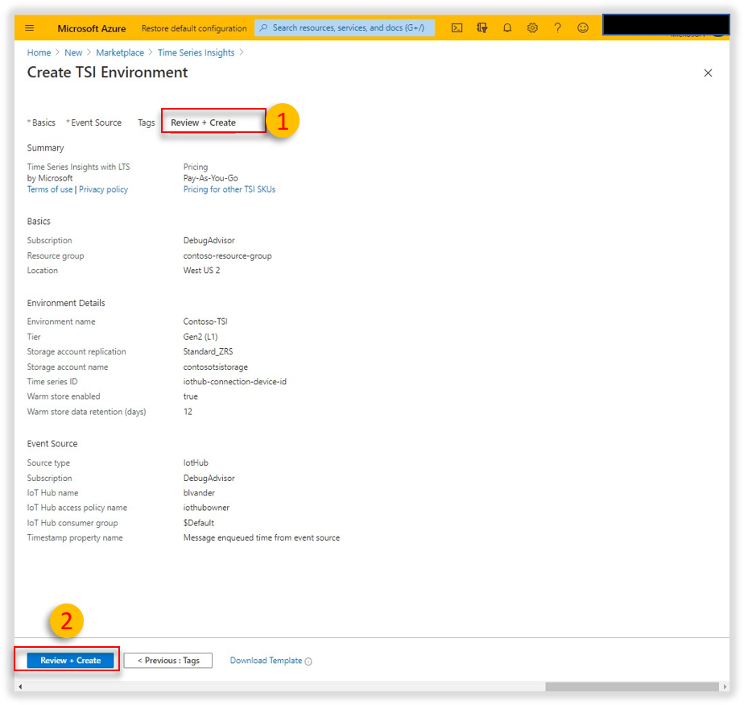
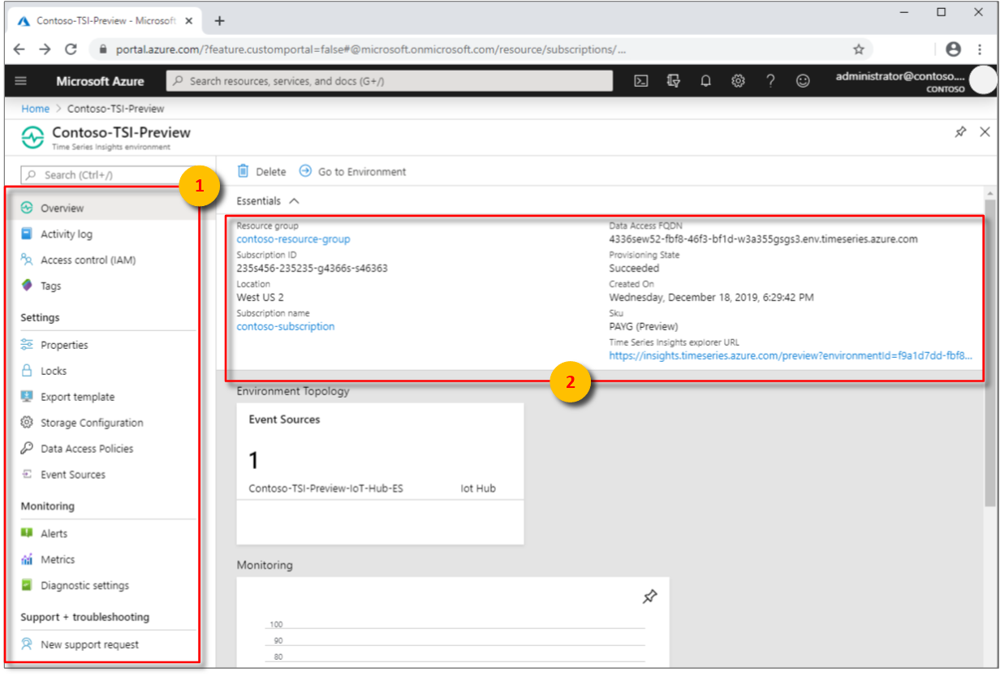

# Provision and manage Azure Time Series Insights Preview

This article describes how to create and manage an Azure Time Series Insights Preview environment by using the [Azure portal](https://portal.azure.com/).

## Overview

Azure Time Series Insights Preview environments are *pay-as-you-go* (PAYG) environments.

When you provision an Azure Time Series Insights Preview environment, you create these Azure resources:

* An Azure Time Series Insights Preview environment  
* An Azure Storage general-purpose v1 account
* An optional warm store for faster and unlimited queries

> [!TIP]
> * Learn [how to plan your environment](./time-series-insights-update-plan.md).
> * Read about how to [Add an event hub source](./time-series-insights-how-to-add-an-event-source-eventhub.md) or how to [Add an IoT hub source](./time-series-insights-how-to-add-an-event-source-iothub.md).

You will learn how to:

1. **(Optional)** Associate each Azure Time Series Insights Preview environment with an event source. You will also provide a Timestamp ID property and a unique consumer group to ensure that the environment has access to the appropriate events.

   > [!NOTE]
   > The preceding step is optional when provisioning an environment. If you skip this step, you must attach an event source to the environment later so data can be accessed in the environment.

1. After provisioning is complete, you can modify your access policies and other environment attributes to suit your business requirements.

## Create the environment

To create an Azure Time Series Insights Preview environment:

1. Select **PAYG** as the **Tier**. Provide an environment name, and choose the subscription group and resource group to use. Then select a supported location to host the environment.

   

1. Enter a Time Series ID.

    > [!NOTE]
    > * The Time Series ID is *case-sensitive* and *immutable*. (It can't be changed after it's set.)
    > * Time Series IDs can be up to *three* keys.
    > * Read more about [How to choose a Time Series ID](time-series-insights-update-how-to-id.md)

1. Create an Azure Storage account by selecting a storage account name and designating a replication choice. Doing so automatically creates an Azure Storage general-purpose v1 account. The account is created in the same region as the Azure Time Series Insights Preview environment that you previously selected.

    

1. **(Optional)** Enable warm store for your environment if you want faster and unlimited queries over most recent data in your environment. You can also create or delete a warm store through the **Storage Configuration** option in the left navigation pane, after you create a Time Series Insights Preview environment.

    

1. **(Optional)** You can add an event source now. You can also wait until after the instance has been provisioned.

   * Time Series Insights supports [Azure IoT Hub](./time-series-insights-how-to-add-an-event-source-iothub.md) and [Azure Event Hubs](./time-series-insights-how-to-add-an-event-source-eventhub.md) as event source options. Although you can add only a single event source when you create the environment, you can add another event source later. 
   
     You can select an existing consumer group or create a new consumer group when you add the event source. It's best to create a unique consumer group to ensure that all events are visible to your Azure Time Series Insights Preview environment.

   * Choose the appropriate Timestamp property. By default, Azure Time Series Insights uses the message-enqueued time for each event source.

     > [!TIP]
     > The message-enqueued time might not be the best configured setting to use in batch event scenarios or historical data uploading scenarios. In such cases, make sure to verify your decision to use or not use a Timestamp property.

     

1. Confirm that your environment has been provisioned and configured the way you want.

    

## Manage the environment

You can manage your Azure Time Series Insights Preview environment by using the Azure portal. There a few key differences  between a PAYG Azure Time Series Insights Preview environment and the generally available S1 or S2 environments to bear in mind when you manage your environment through the Azure portal:

* The Azure portal Preview **Overview**  blade has the following changes:

  * Capacity is removed because it doesn't apply to PAYG environments.
  * The **Time series ID** property is added. It determines how your data is partitioned.
  * Reference data sets are removed.
  * The displayed URL directs you to the [Azure Time Series Insights Preview explorer](./time-series-insights-update-explorer.md).
  * Your Azure Storage account name is listed.

* The Azure portal's **Configure** blade is removed in Azure Time Series Insights Preview because PAYG environments aren't configurable. However, you can use **Storage Configuration** to configure the newly introduced warm store.

* The Azure portal's **Reference data** blade is removed in Azure Time Series Insights Preview because reference data isn't part of PAYG environments.

## Next steps

- Learn more about Time Series Insights generally available environments and preview environments by reading [Plan your environment](./time-series-insights-update-plan.md).

- Learn how to [Add an event hub source](./time-series-insights-how-to-add-an-event-source-eventhub.md).

- Configure an [IoT hub source](./time-series-insights-how-to-add-an-event-source-iothub.md).
