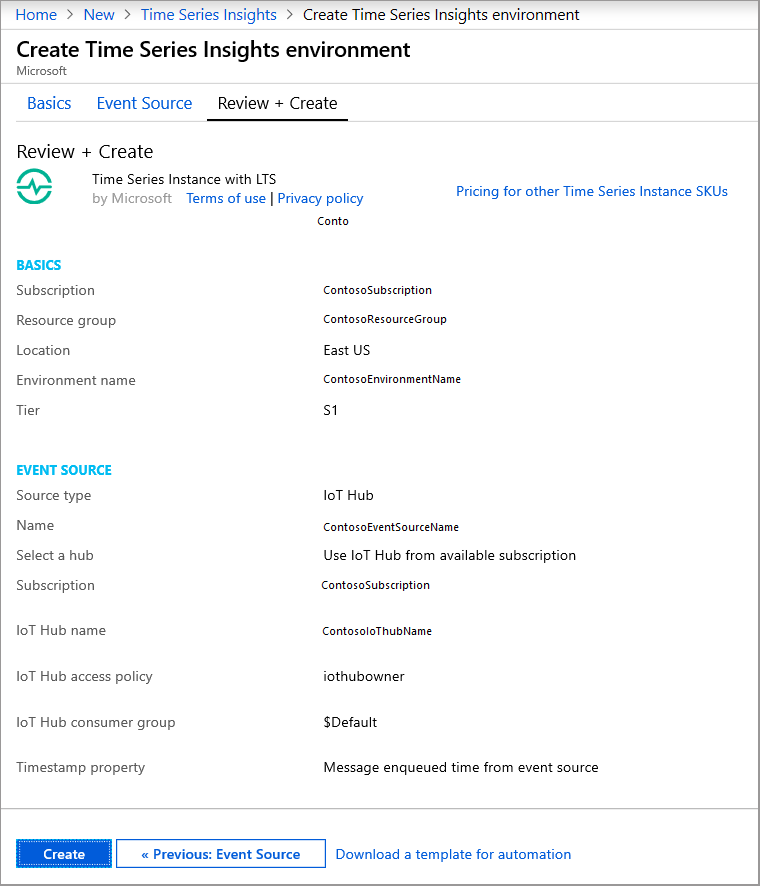
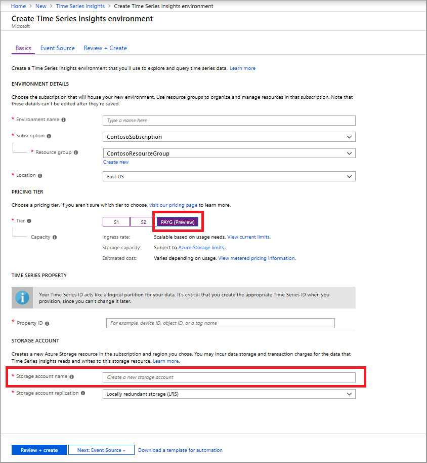
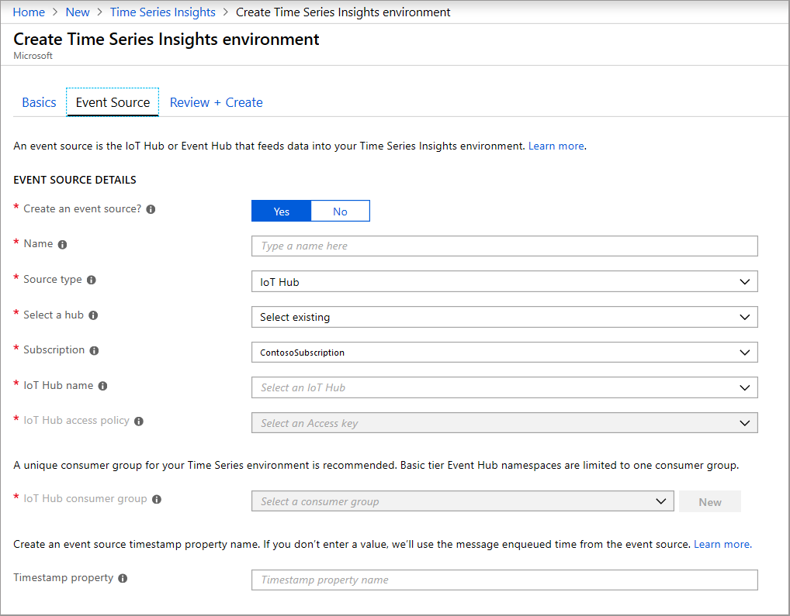
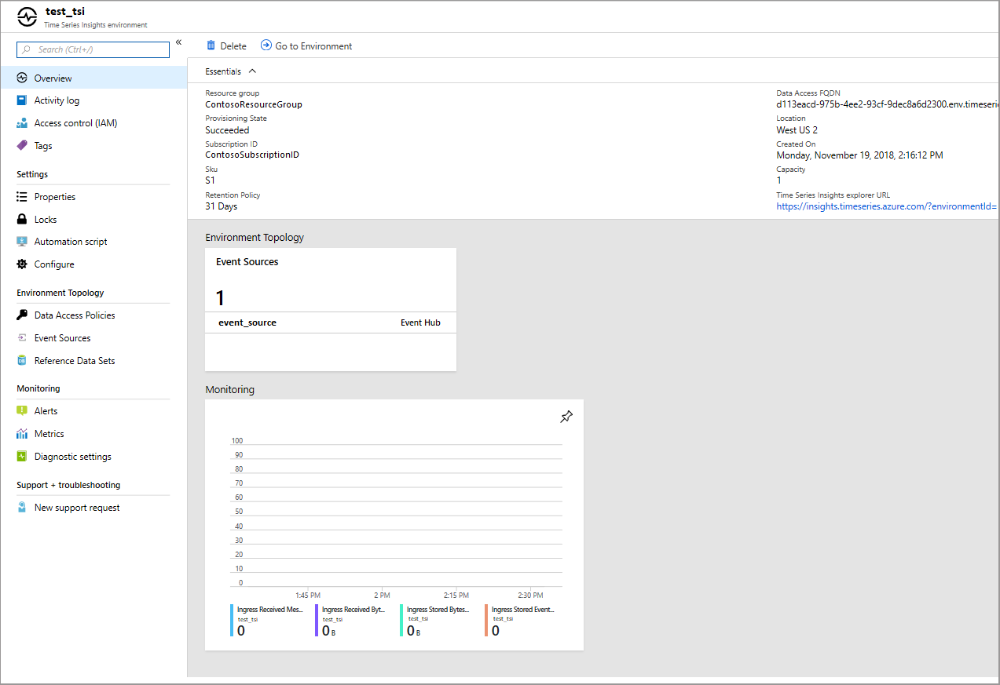

# Provision and manage Azure Time Series Insights Preview

This article describes how to create and manage an Azure Time Series Insights Preview environment by using the [Azure portal](https://portal.azure.com/).

## Overview

Azure Time Series Insights Preview environments are pay-as-you-go (PAYG) environments.

When you provision an Azure Time Series Insights Preview environment, you create two Azure resources:

* An Azure Time Series Insights Preview environment  
* An Azure Storage general-purpose v1 account
  
Learn [how to plan your environment](./time-series-insights-update-plan.md).

>[!IMPORTANT]
> For the Preview, make sure you're using an Azure Storage general-purpose v1 (GPv1) account.

Optionally, you can associate each Azure Time Series Insights Preview environment with an event source. For more information, read [Add an event hub source](./time-series-insights-how-to-add-an-event-source-eventhub.md) and [Add an IoT hub source](./time-series-insights-how-to-add-an-event-source-iothub.md). You provide a Timestamp ID property and a unique consumer group during this step. Doing so ensures that the environment has access to the appropriate events.

After provisioning is complete, you can modify your access policies and other environment attributes to suit your business requirements.

## Create the environment

The following steps describe how to create an Azure Time Series Insights Preview environment:

1. Select the **PAYG** button under the **SKU** menu. Supply an environment name, and choose which subscription group and which resource group to use. Then, select a supported location for the environment to be hosted in.

   

1. Enter a Time Series ID.

    >[!NOTE]
    > * The Time Series ID is case-sensitive and immutable. (It can't be changed after it's set.)
    > * Time Series IDs can be up to three keys.
    > * For more information about selecting a Time Series ID, read [Choose a Time Series ID](./time-series-insights-update-how-to-id.md).

1. Create an Azure storage account by selecting a storage account name and designating a replication choice. Doing so automatically creates an Azure Storage general-purpose v1 account. It will be created in the same region as the Azure Time Series Insights Preview environment that you previously selected.

    

1. Optionally, you can add an event source.

   * Time Series Insights supports [Azure IoT Hub](./time-series-insights-how-to-add-an-event-source-iothub.md) and [Azure Event Hubs](./time-series-insights-how-to-add-an-event-source-eventhub.md) as options. Although you can add only a single event source at environment creation time, you can add another event source later. It’s best to create a unique consumer group to ensure that all events are visible to your Azure Time Series Insights Preview instance. You can select an existing consumer group or create a new consumer group when adding the event source.

   * You should also choose the appropriate Timestamp property. By default, Azure Time Series Insights uses the message enqueued time for each event source.

     > [!TIP]
     > The message enqueued time might not be the best configured setting to use in batch event or historical data uploading scenarios. Make sure to verify your decision to use or not use a Timestamp property in such cases.

     

1. Confirm that your environment has been provisioned with the desired settings.

    

## Manage the environment

You can manage your Azure Time Series Insights Preview environment by using the Azure portal. Here are the major differences in managing a PAYG Azure Time Series Insights Preview environment, as opposed to an S1 or S2 environment, by using the Azure portal:

* The Azure portal's **Overview** blade is unchanged in Azure Time Series Insights, except in the following ways:
  * Capacity is removed, because this concept is not relevant to PAYG environments.
  * The Time Series ID property has been added. It determines how your data is partitioned.
  * Reference data sets are removed.
  * The displayed URL directs you to the [Azure Time Series Insights Preview explorer](./time-series-insights-update-explorer.md).
  * Your Azure storage account name is listed.

* The Azure portal's **Configure** blade has been removed in Azure Time Series Insights Preview because PAYG environments are not configurable.

* The Azure portal's **Reference data** blade has been removed in Azure Time Series Insights Preview because reference data is not a component of PAYG environments.

## Next steps

- Read [Plan your environment](./time-series-insights-update-plan.md).

- Learn how to [Add an event hub source](./time-series-insights-how-to-add-an-event-source-eventhub.md).

- Configure [an IoT hub source](./time-series-insights-how-to-add-an-event-source-iothub.md).