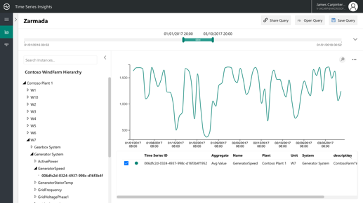
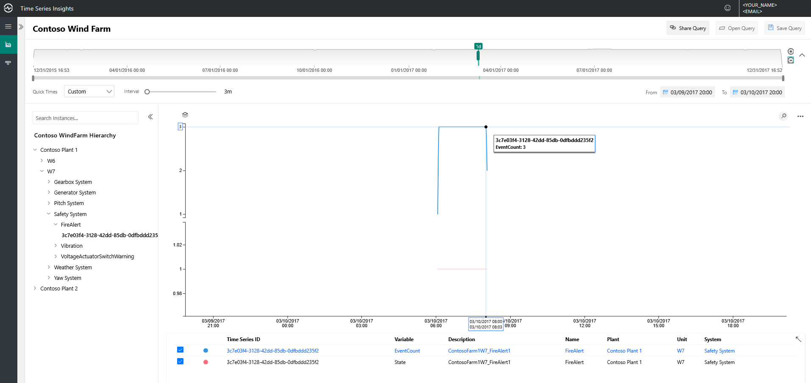
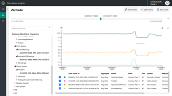
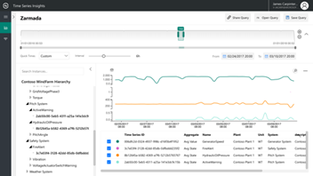
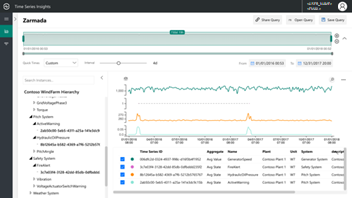
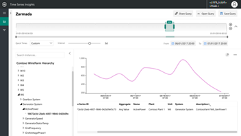
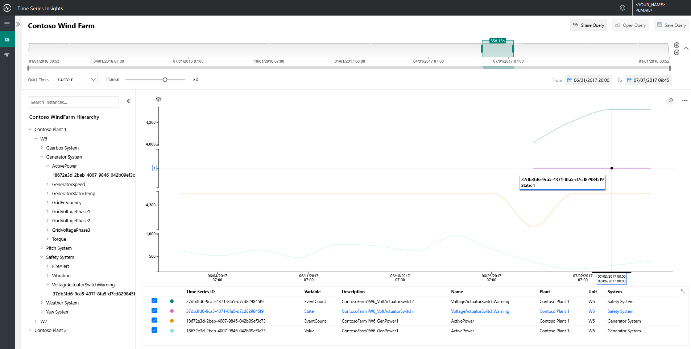
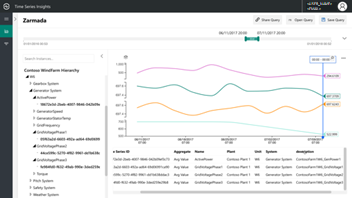
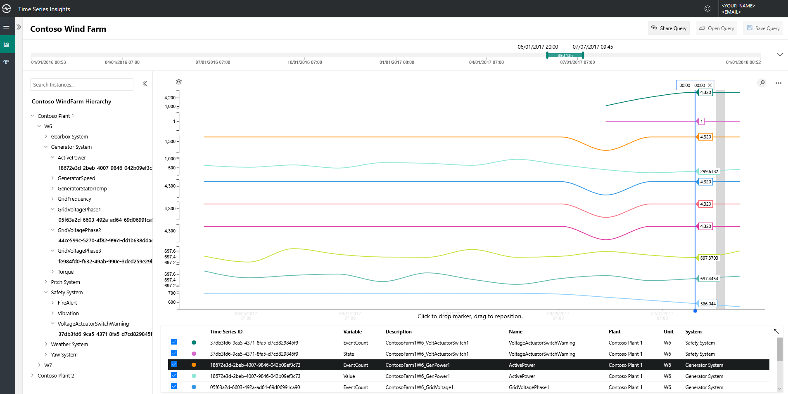
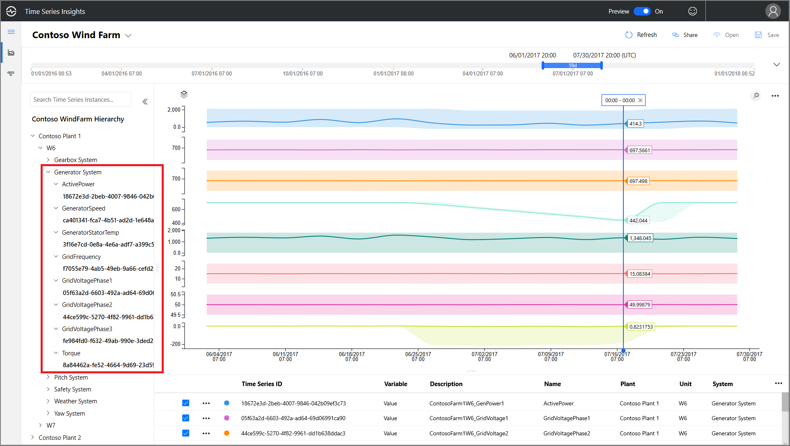

# Quickstart: Explore the Azure Time Series Insights Preview demo environment

This quickstart gets you started with the Azure Time Series Insights Preview environment. In the free demo, you tour key features that have been added to Time Series Insights Preview.

The Time Series Insights Preview demo environment contains a scenario company, Contoso, that operates two wind turbine farms. Each farm has 10 turbines. Each turbine has 20 sensors that report data every minute to Azure IoT Hub. The sensors gather information about weather conditions, blade pitch, and yaw position. Information about generator performance, gearbox behavior, and safety monitors also is recorded.

In this quickstart, you learn how to use Time Series Insights to find actionable insights in Contoso data. You also conduct a short root cause analysis to better predict critical failures and to perform maintenance.

## Explore the Time Series Insights explorer in a demo environment

The Time Series Insights Preview explorer demonstrates historical data and root causes analysis. To get started:

1. Create a [free Azure account](https://azure.microsoft.com/free/?ref=microsoft.com&utm_source=microsoft.com&utm_medium=docs&utm_campaign=visualstudio) if you don't have one.

1. Go to the [Contoso Wind Farm demo](https://insights.timeseries.azure.com/preview/samples) environment.  

1. If you're prompted, sign in to the Time Series Insights explorer by using your Azure account credentials.

## Work with historical data

1. In **Contoso Plant 1**, look at wind turbine **W7**.  

   1. Change the view range to **1/1/17 20:00 to 3/10/17 20:00 (UTC)**.
   1. To select a sensor, select **Contoso Plant 1** > **W7** > **Generator System** > **GeneratorSpeed**. Then, review the values that are shown.

      

1. Recently, Contoso found a fire in wind turbine **W7**. Opinions vary about what caused the fire. In Time Series Insights, we can see that the fire alert sensor was activated during the fire.

   1. Change the view range to **3/9/17 20:00 to 3/10/17 20:00 (UTC)**.
   1. Select **Safety System** > **FireAlert**.

      

1. Review other events around the time of the fire to understand what occurred. Oil pressure and active warnings spiked just before the fire.

   1. Select **Pitch System** > **HydraulicOilPressure**.
   1. Select **Pitch System** > **ActiveWarning**.

      

1. The oil pressure and active warning sensors spiked right before the fire. Expand the displayed time series to see other signs that were evident leading up to the fire. Both sensors fluctuated consistently over time. The fluctuations indicate a persistent and worrisome pattern.

    * Change the view range to **2/24/17 20:00 to 3/10/17 20:00 (UTC)**.

      

1. Examining two years of historical data reveals another fire event that had the same sensor fluctuations.

    * Change the view range to **1/1/16 to 12/31/17** (all data).

      

Using Time Series Insights and our sensor telemetry, we've discovered a long-term and problematic trend hidden in the historical data. With these new insights, we can:

> [!div class="checklist"]
> * Explain what actually occurred.
> * Correct the problem.
> * Put superior alert notification systems into place.

## Root cause analysis

1. Some scenarios require sophisticated analysis to uncover subtle clues in data. Select the windmill **W6** on date **6/25**.

    1. Change the view range to **6/1/17 20:00 to 7/1/17 20:00 (UTC)**.
    1. Select **Contoso Plant 1** > **W6** > **Safety System** > **VoltageActuatorSwitchWarning**.

       

1. The warning indicates an issue with the voltage being output by the generator. The overall power output of the generator is operating within normal parameters in the current interval. By increasing our interval, another pattern emerges. A definite drop-off is evident.

    1. Remove the **VoltageActuatorSwitchWarning** sensor.
    1. Select **Generator System** > **ActivePower**.
    1. Change the interval to **3d**.

       

1. By expanding the time range, we can determine whether the issue has stopped or whether it continues.

    * Extend the time span to 60 days.

      

1. Other sensor data points can be added to provide greater context. The more sensors we view, the fuller our understanding of the problem is. Let’s drop a marker to see the actual values. 

    1. Select **Generator System**, and then select three sensors: **GridVoltagePhase1**, **GridVoltagePhase2**, and **GridVoltagePhase3**.
    1. Drop a marker on the last data point in the visible area.

       

    Two of the voltage sensors are operating comparably and within normal parameters. It looks like the **GridVoltagePhase3** sensor is the culprit.

1. With highly contextual data added, the phase 3 drop-off appears even more to be the problem. Now, we have a good lead on the cause of the warning. We’re ready to refer the issue to our maintenance team.  

    * Change the display to overlay all **Generator System** sensors on the same chart scale.

      

## Next steps

You're ready to create your own Time Series Insights Preview environment. To start:

> [!div class="nextstepaction"]
> [Plan your Time Series Insights Preview environment](time-series-insights-update-plan.md)

Learn to navigate the demo and its features:

> [!div class="nextstepaction"]
> [The Time Series Insights Preview explorer](time-series-insights-update-explorer.md)
