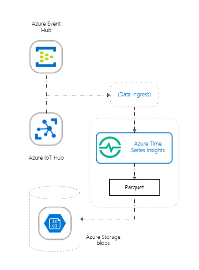

# Data storage and ingress in Azure Time Series Insights Preview

This article describes updates to data storage and ingress for Azure Time Series Insights Preview. It covers the underlying storage structure, file format, and Time Series ID property. It also discusses the underlying ingress process, throughput, and limitations.

## Data ingress

In Time Series Insights Preview, data ingress policies determine where data can be sourced from and what format the data should have.

### Ingress policies

Time Series Insights Preview supports the same event sources that Time Series Insights currently supports:

- [Azure IoT Hub](../iot-hub/about-iot-hub.md)
- [Azure Event Hubs](../event-hubs/event-hubs-about.md)

Time Series Insights Preview supports a maximum of two event sources per instance.
  
Azure Time Series Insights supports JSON submitted through Azure IoT Hub or Azure Event Hubs. To optimize your IoT JSON data, learn [how to shape JSON](./time-series-insights-send-events.md#supported-json-shapes).

### Data storage

When you create a Time Series Insights Preview pay-as-you-go SKU environment, you create two Azure resources:

* A Time Series Insights Preview environment that can optionally include warm store capabilities.
* An Azure Storage general-purpose V1 blob account for cold data storage.

Data in your warm store is available only via [Time Series Query](./time-series-insights-update-tsq.md) and the [Azure Time Series Insights Preview explorer](./time-series-insights-update-explorer.md). 

Time Series Insights Preview saves your cold store data to Azure Blob storage in the [Parquet file format](#parquet-file-format-and-folder-structure). Time Series Insights Preview manages this cold store data exclusively, but it's available for you to read directly as standard Parquet files.

> [!WARNING]
> As the owner of the Azure Blob storage account where cold store data resides, you have full access to all data in the account. This access includes write and delete permissions. Don't edit or delete the data that Time Series Insights Preview writes, because that can cause data loss.

### Data availability
Time Series Insights Preview partitions and indexes data for optimum query performance. Data becomes available to query after it’s indexed. The amount of data that's being ingested can affect this availability.

> [!IMPORTANT]
> The general availability (GA) release of Time Series Insights will make data available in 60 seconds after it's read from the event source. During the preview, you might experience a longer period before the data becomes available. If you experience significant latency beyond 60 seconds, please contact us.

### Scale

By default, Time Series Insights Preview supports an initial ingress scale of up to 1 megabyte per second (MB/s) per environment. A throughput of up to 16 MB/s is available if you need it. If you need enhanced scaling support, please contact us.

You can get additional ingress and scaling capabilities for the event source:

* [IoT Hub](../iot-hub/iot-hub-scaling.md)
* [Event Hubs](../event-hubs/event-hubs-scalability.md)

## Azure Storage

This section describes Azure Storage details relevant to Azure Time Series Insights Preview.

For a thorough description of Azure Blob storage, read the [Storage blobs introduction](../storage/blobs/storage-blobs-introduction.md).

### Your storage account

When you create a Time Series Insights Preview pay-as-you-go environment, an Azure Storage general-purpose V1 blob account is created as your long-term cold store.  

Time Series Insights Preview publishes up to two copies of each event in your Azure storage account. The initial copy has events ordered by ingestion time and is always preserved, so you can use other services to access it. You can use Spark, Hadoop, and other familiar tools to process the raw Parquet files. 

Time Series Insights Preview repartitions the Parquet files to optimize for the Time Series Insights query. This repartitioned copy of the data is also saved.

During public preview, data is stored indefinitely in your Azure storage account.

### Writing and editing Time Series Insights blobs

To ensure query performance and data availability, don't edit or delete any blobs that Time Series Insights Preview creates.

### Accessing and exporting data from Time Series Insights Preview

You might want to access data viewed in the Time Series Insights Preview explorer to use in conjunction with other services. For example, you can use your data to build a report in Power BI or to train a machine learning model by using Azure Machine Learning Studio. Or, you can use your data to transform, visualize, and model in your Jupyter Notebooks.

You can access your data in three general ways:

* From the Time Series Insights Preview explorer. You can export data as a CSV file from the explorer. For more information, see [Time Series Insights Preview explorer](./time-series-insights-update-explorer.md).
* From the Time Series Insights Preview API. You can reach the API endpoint at `/getRecorded`. To learn more about this API, see [Time Series Query](./time-series-insights-update-tsq.md).
* Directly from an Azure storage account. You need read access to whatever account you're using to access your Time Series Insights Preview data. For more information, see [Manage access to your storage account resources](../storage/blobs/storage-manage-access-to-resources.md).

### Data deletion

Don't delete your Time Series Insights Preview files. You should manage related data from within Time Series Insights Preview only.

## Parquet file format and folder structure

Parquet is an open-source columnar file format that was designed for efficient storage and performance. Time Series Insights Preview uses Parquet for these reasons. It partitions data by Time Series ID for query performance at scale.  

For more information about the Parquet file type, see the [Parquet documentation](https://parquet.apache.org/documentation/latest/).

Time Series Insights Preview stores copies of your data as follows:

* The first, initial copy is partitioned by ingestion time and stores data roughly in order of arrival. The data resides in the `PT=Time` folder:

  `V=1/PT=Time/Y=<YYYY>/M=<MM>/<YYYYMMDDHHMMSSfff>_<TSI_INTERNAL_SUFFIX>.parquet`

* The second, repartitioned copy is partitioned by a grouping of Time Series IDs and resides in the `PT=TsId` folder:

  `V=1/PT=TsId/Y=<YYYY>/M=<MM>/<YYYYMMDDHHMMSSfff>_<TSI_INTERNAL_SUFFIX>.parquet`

In both cases, the time values correspond to blob creation time. Data in the `PT=Time` folder is preserved. Data in the `PT=TsId` folder will be optimized for query over time and will not remain static.

> [!NOTE]
> * `<YYYY>` maps to a four-digit year representation.
> * `<MM>` maps to a two-digit month representation.
> * `<YYYYMMDDHHMMSSfff>` maps to a time-stamp representation with four-digit year (`YYYY`), two-digit month (`MM`), two-digit day (`DD`), two-digit hour (`HH`), two-digit minute (`MM`), two-digit second (`SS`), and three-digit millisecond (`fff`).

Time Series Insights Preview events are mapped to Parquet file contents as follows:

* Each event maps to a single row.
* Every row includes the **timestamp** column with an event time stamp. The time-stamp property is never null. It defaults to **event enqueued time** if the time-stamp property isn't specified in the event source. The time stamp is always in UTC.
* Every row includes the Time Series ID column as defined when the Time Series Insights environment is created. The property name includes the `_string` suffix.
* All other properties sent as telemetry data are mapped to column names that end with `_string` (string), `_bool` (Boolean), `_datetime` (datetime), or `_double` (double), depending on the property type.
* This mapping scheme applies to the first version of the file format, referenced as **V=1**. As this feature evolves, the name might be incremented.

## Next steps

- Read [Azure Time Series Insights Preview storage and ingress](./time-series-insights-update-storage-ingress.md).

- Read about the new [data modeling](./time-series-insights-update-tsm.md).
