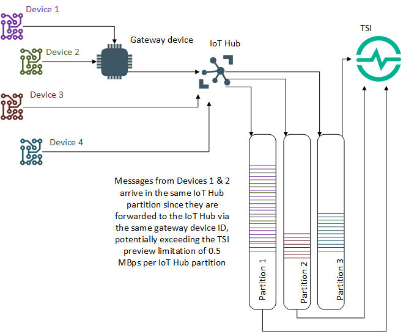

# Data storage and ingress in Azure Time Series Insights Preview

This article describes updates to data storage and ingress for Azure Time Series Insights Preview. It describes the underlying storage structure, file format, and Time Series ID property. The underlying ingress process, best practices, and current preview limitations are also described.

## Data ingress

Your Azure Time Series Insights environment contains an *ingestion engine* to collect, process, and store time-series data.

There are some considerations to be mindful of to ensure all incoming data is processed, to achieve high ingress scale, and minimize *ingestion latency* (the time taken by Time Series Insights to read and process data from the event source) when [planning your environment](time-series-insights-update-plan.md).

Time Series Insights Preview data ingress policies determine where data can be sourced from and what format the data should have.

### Ingress policies

*Data ingress* involves how data is sent to an Azure Time Series Insights Preview environment.

Key configuration, formatting, and best practices are summarized below.

#### Event Sources

Azure Time Series Insights Preview supports the following event sources:

- [Azure IoT Hub](../iot-hub/about-iot-hub.md)
- [Azure Event Hubs](../event-hubs/event-hubs-about.md)

Azure Time Series Insights Preview supports a maximum of two event sources per instance. When you connect an event source, your TSI environment will read all of the events currently stored in your Iot or Event Hub, starting with the oldest event.

> [!IMPORTANT]
>
> * You may experience high initial latency when attaching an event source to your Preview environment.
> Event source latency depends on the number of events currently in your IoT Hub or Event Hub.
> * High latency will subside after event source data is first ingested. Submit a support ticket through the Azure portal if you experience ongoing high latency.

#### Supported data format and types

Azure Time Series Insights supports UTF-8 encoded JSON sent from Azure IoT Hub or Azure Event Hubs. 

The supported data types are:

| Data type | Description |
|---|---|
| **bool** | A data type having one of two states: `true` or `false`. |
| **dateTime** | Represents an instant in time, typically expressed as a date and time of day. Expressed in [ISO 8601](https://www.iso.org/iso-8601-date-and-time-format.html) format. |
| **double** | A double-precision 64-bit [IEEE 754](https://ieeexplore.ieee.org/document/8766229) floating point. |
| **string** | Text values, comprised of Unicode characters.          |

#### Objects and arrays

You may send complex types such as objects and arrays as part of your event payload, but your data will undergo a flattening process when stored.

Detailed information describing how to shape your JSON events, send complex type, and nested object flattening is available in [How to shape JSON for ingress and query](./time-series-insights-update-how-to-shape-events.md) to assist with planning and optimization.

### Ingress best practices

We recommend that you employ the following best practices:

* Configure Azure Time Series Insights and any IoT Hub or Event Hub in the same region to reduce potential latency.

* [Plan for your scale needs](time-series-insights-update-plan.md) by calculating your anticipated ingestion rate and verifying that it falls within the supported rate listed below.

* Understand how to optimize and shape your JSON data, as well as the current limitations in preview, by reading [how to shape JSON for ingress and query](./time-series-insights-update-how-to-shape-events.md).

* Use streaming ingestion for near real-time and recent data only, streaming historical data is not supported.

#### Historical Data Ingestion

Using the streaming pipeline to import historical data is not currently supported in Azure Time Series Insights Preview. If you need to import past data into your environment, follow the guidelines below:

* Do not stream live and historical data in parallel. Ingesting out of order data will result in degraded query performance.
* Ingest historical data in time-ordered fashion for best performance.
* Stay within the ingestion throughput rate limits below.
* Disable Warm Store if the data is older than your Warm Store retention period.

### Ingress scale and Preview limitations

Azure Time Series Insights Preview ingress limitations are described below.

> [!TIP]
> Read [Plan your Preview environment](https://docs.microsoft.com/azure/time-series-insights/time-series-insights-update-plan#review-preview-limits) for a comprehensive list of all Preview limits.

#### Per environment limitations

In general, ingress rates are viewed as the factor of the number of devices that are in your organization, event emission frequency, and the size of each event:

*  **Number of devices** × **Event emission frequency** × **Size of each event**.

By default, Time Series Insights preview can ingest incoming data at a rate of **up to 1 megabyte per second (MBps) per Time Series Insights environment**. There are additional limitations [per hub partition](https://docs.microsoft.com/azure/time-series-insights/time-series-insights-update-storage-ingress#hub-partitions-and-per-partition-limits).

> [!TIP]
>
> * Environment support for ingesting speeds up to 16 MBps can be provided by request.
> * Contact us if you require higher throughput by submitting a support ticket through Azure portal.
 
* **Example 1:**

    Contoso Shipping has 100,000 devices that emit an event three times per minute. The size of an event is 200 bytes. They’re using an IoT Hub with four partitions as the Time Series Insights event source.

    * The ingestion rate for their Time Series Insights environment would be: **100,000 devices * 200 bytes/event * (3/60 event/sec) = 1 MBps**.
    * The ingestion rate per partition would be 0.25 MBps.
    * Contoso Shipping’s ingestion rate would be within the preview scale limitation.

* **Example 2:**

    Contoso Fleet Analytics has 60,000 devices that emit an event every second. They are using an Event Hub with a partition count of 4 as the Time Series Insights event source. The size of an event is 200 bytes.

    * The environment ingestion rate would be: **60,000 devices * 200 bytes/event * 1 event/sec = 12 MBps**.
    * The per partition rate would be 3 MBps.
    * Contoso Fleet Analytics' ingestion rate is over the environment and partition limits. They can submit a request to Time Series Insights through Azure portal to increase the ingestion rate for their environment, and create an Event Hub with more partitions to be within the Preview limits.

#### Hub partitions and per partition limits

When planning your Time Series Insights environment, it's important to consider the configuration of the event source(s) that you'll be connecting to Time Series Insights. Both Azure IoT Hub and Event Hubs utilize partitions to enable horizontal scale for event processing. 

A *partition* is an ordered sequence of events held in a hub. The partition count is set during the hub creation phase and cannot be changed.

For Event Hubs partitioning best practices, review [How many partitions do I need?](https://docs.microsoft.com/azure/event-hubs/event-hubs-faq#how-many-partitions-do-i-need)

> [!NOTE]
> Most IoT Hubs used with Azure Time Series Insights only need four partitions.

Whether you're creating a new hub for your Time Series Insights environment or using an existing one, you'll need to calculate your per partition ingestion rate to determine if it's within the preview limits. 

Azure Time Series Insights Preview currently has a general **per partition limit of 0.5 MBps**.

#### IoT Hub-specific considerations

When a device is created in IoT Hub, it's permanently assigned to a partition. In doing so, IoT Hub is able to guarantee event ordering (since the assignment never changes).

A fixed partition assignment also impacts Time Series Insights instances that are ingesting data sent from IoT Hub downstream. When messages from multiple devices are forwarded to the hub using the same gateway device ID, they may arrive in the same partition at the same time potentially exceeding the per partition scale limits.

**Impact**:

* If a single partition experiences a sustained rate of ingestion over the Preview limit, it's possible that Time Series Insights will not sync all device telemetry before the IoT Hub data retention period has been exceeded. As a result, sent data can be lost if the ingestion limits are consistently exceeded.

To mitigate that circumstance, we recommend the following best practices:

* Calculate your per environment and per partition ingestion rates before deploying your solution.
* Ensure that your IoT Hub devices are load-balanced to the furthest extent possible.

> [!IMPORTANT]
> For environments using IoT Hub as an event source, calculate the ingestion rate using the number of hub devices in use to be sure that the rate falls below the 0.5 MBps per partition limitation in preview.
>
> * Even if several events arrive simultaneously, the Preview limit will not be exceeded.

  

Refer to the following resources to learn more about optimizing hub throughput and partitions:

* [IoT Hub Scale](https://docs.microsoft.com/azure/iot-hub/iot-hub-scaling)
* [Event Hub Scale](https://docs.microsoft.com/azure/event-hubs/event-hubs-scalability#throughput-units)
* [Event Hub Partitions](https://docs.microsoft.com/azure/event-hubs/event-hubs-features#partitions)

### Data storage

When you create a Time Series Insights Preview *pay-as-you-go* (PAYG) SKU environment, you create two Azure resources:

* An Azure Time Series Insights Preview environment that can be configured for warm data storage.
* An Azure Storage general-purpose V1 blob account for cold data storage.

Data in your warm store is available only via [Time Series Query](./time-series-insights-update-tsq.md) and the [Azure Time Series Insights Preview explorer](./time-series-insights-update-explorer.md). Your warm store will contain recent data within the [retention period](./time-series-insights-update-plan.md#the-preview-environment) selected when creating the Time Series Insights environment.

Time Series Insights Preview saves your cold store data to Azure Blob storage in the [Parquet file format](#parquet-file-format-and-folder-structure). Time Series Insights Preview manages this cold store data exclusively, but it's available for you to read directly as standard Parquet files.

> [!WARNING]
> As the owner of the Azure Blob storage account where cold store data resides, you have full access to all data in the account. This access includes write and delete permissions. Don't edit or delete the data that Time Series Insights Preview writes, because that can cause data loss.

### Data availability

Azure Time Series Insights Preview partitions and indexes data for optimum query performance. Data becomes available to query from both warm (if enabled) and cold store after it’s indexed. The amount of data that's being ingested can affect this availability.

> [!IMPORTANT]
> During the preview, you might experience a period of up to 60 seconds before data becomes available. If you experience significant latency beyond 60 seconds, please submit a support ticket through the Azure portal.

## Azure Storage

This section describes Azure Storage details relevant to Azure Time Series Insights Preview.

For a thorough description of Azure Blob storage, read the [Storage blobs introduction](../storage/blobs/storage-blobs-introduction.md).

### Your storage account

When you create an Azure Time Series Insights Preview PAYG environment, an Azure Storage general-purpose V1 blob account is created as your long-term cold store.  

Azure Time Series Insights Preview retains up to two copies of each event in your Azure Storage account. One copy stores events ordered by ingestion time, always allowing access to events in a time-ordered sequence. Over time, Time Series Insights Preview also creates a repartitioned copy of the data to optimize for performant Time Series Insights query.

During public Preview, data is stored indefinitely in your Azure Storage account.

#### Writing and editing Time Series Insights blobs

To ensure query performance and data availability, don't edit or delete any blobs that Time Series Insights Preview creates.

#### Accessing Time Series Insights Preview cold store data

In addition to accessing your data from the [Time Series Insights Preview explorer](./time-series-insights-update-explorer.md) and [Time Series Query](./time-series-insights-update-tsq.md), you may also want to access your data directly from the Parquet files stored in the cold store. For example, you can read, transform, and cleanse data in a Jupyter notebook, then use it to train your Azure Machine Learning model in the same Spark workflow.

To access data directly from your Azure Storage account, you need read access to the account used to store your Time Series Insights Preview data. You can then read selected data based on the creation time of the Parquet file located in the `PT=Time` folder described below in the [Parquet file format](#parquet-file-format-and-folder-structure) section.  For more information on enabling read access to your storage account, see [Manage access to your storage account resources](../storage/blobs/storage-manage-access-to-resources.md).

#### Data deletion

Don't delete your Time Series Insights Preview files. Manage related data from within Time Series Insights Preview only.

### Parquet file format and folder structure

Parquet is an open-source columnar file format designed for efficient storage and performance. Time Series Insights Preview uses Parquet to enable Time Series ID-based query performance at scale.  

For more information about the Parquet file type, read the [Parquet documentation](https://parquet.apache.org/documentation/latest/).

Time Series Insights Preview stores copies of your data as follows:

* The first, initial copy is partitioned by ingestion time and stores data roughly in order of arrival. This data resides in the `PT=Time` folder:

  `V=1/PT=Time/Y=<YYYY>/M=<MM>/<YYYYMMDDHHMMSSfff>_<TSI_INTERNAL_SUFFIX>.parquet`

* The second, repartitioned copy is grouped by Time Series IDs and resides in the `PT=TsId` folder:

  `V=1/PT=TsId/Y=<YYYY>/M=<MM>/<YYYYMMDDHHMMSSfff>_<TSI_INTERNAL_SUFFIX>.parquet`

In both cases, the time property of the Parquet file corresponds to blob creation time. Data in the `PT=Time` folder is preserved with no changes once it's written to the file. Data in the `PT=TsId` folder will be optimized for query over time and is not static.

> [!NOTE]
>
> * `<YYYY>` maps to a four-digit year representation.
> * `<MM>` maps to a two-digit month representation.
> * `<YYYYMMDDHHMMSSfff>` maps to a time-stamp representation with four-digit year (`YYYY`), two-digit month (`MM`), two-digit day (`DD`), two-digit hour (`HH`), two-digit minute (`MM`), two-digit second (`SS`), and three-digit millisecond (`fff`).

Time Series Insights Preview events are mapped to Parquet file contents as follows:

* Each event maps to a single row.
* Every row includes the **timestamp** column with an event time stamp. The time-stamp property is never null. It defaults to the **event enqueued time** if the time-stamp property isn't specified in the event source. The stored time-stamp is always in UTC.
* Every row includes the Time Series ID (TSID) column(s) as defined when the Time Series Insights environment is created. The TSID property name includes the `_string` suffix.
* All other properties sent as telemetry data are mapped to column names that end with `_string` (string), `_bool` (Boolean), `_datetime` (datetime), or `_double` (double), depending on the property type.
* This mapping schema applies to the first version of the file format, referenced as **V=1** and stored in the base folder of the same name. As this feature evolves, this mapping schema might change and the reference name incremented.

## Next steps

- Read [how to shape JSON for ingress and query](./time-series-insights-update-how-to-shape-events.md).

- Read about the new [data modeling](./time-series-insights-update-tsm.md).
