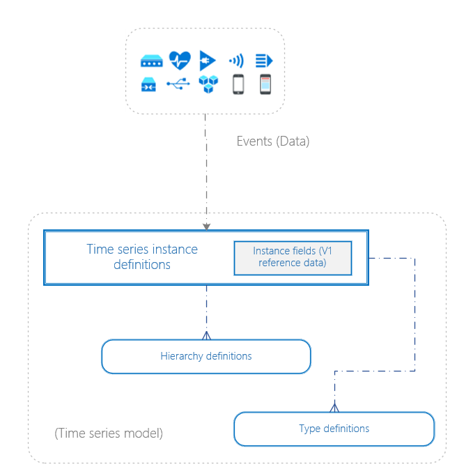
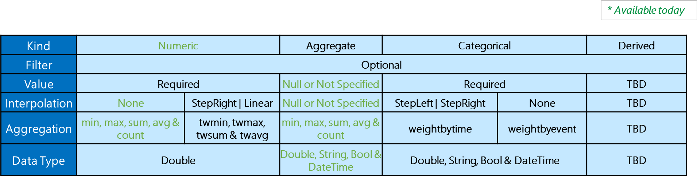

---
title: 'Time Series Model in Azure Time Series Insights Preview | Microsoft Docs'
description: Understanding Azure Time Series Insights Time Series Model.
author: ashannon7
ms.author: dpalled
ms.workload: big-data
manager: cshankar
ms.service: time-series-insights
services: time-series-insights
ms.topic: conceptual
ms.date: 04/29/2019
ms.custom: seodec18
---

# Time Series Model

This article describes the Time Series Model part of Azure Time Series Insights Preview. It discusses the model itself, its capabilities, and how to get started building and updating your own model.

Traditionally, the data that's collected from IoT devices lacks contextual information, which makes it difficult to find and analyze sensors quickly. The main motivation for Time Series Model is to simplify finding and analyzing IoT data. It achieves this objective by enabling the curation, maintenance, and enrichment of time series data to help prepare consumer-ready datasets.

Time Series Models play a vital role in queries and navigation because they contextualize device and non-device entities. Data that's persisted in Time Series Model powers time-series query computations by taking advantage of the formulas stored in them.

[](media/v2-update-tsm/tsm.png#lightbox)

## Key capabilities

With the goal to make it simple and effortless to manage time series contextualization, Time Series Model enables the following capabilities in Time Series Insights Preview. It helps you:

* Author and manage computations or formulas, transform data leveraging scalar functions, aggregate operations, and so on.
* Define parent-child relationships to enable navigation and reference and provide context to time series telemetry.
* Define properties that are associated with the instances part of *instance fields* and use them to create hierarchies.

## Entity components

Time Series Models have three core components:

* <a href="#time-series-model-types">Time Series Model types</a>
* <a href="#time-series-model-hierarchies">Time Series Model hierarchies</a>
* <a href="#time-series-model-instances">Time Series Model instances</a>

These components are combined to specify a Time Series Model and to organize your Azure Time Series Insights data.

## Time Series Model types

Time Series Model *types* help you define variables or formulas for doing computations. The types are associated with a specific Time Series Insights instance. A type can have one or more variables. For example, a Time Series Insights instance might be of type *Temperature Sensor*, which consists of the variables *avg temperature*, *min temperature*, and *max temperature*. We create a default type when the data starts flowing into Time Series Insights. The default type can be retrieved and updated from model settings. Default types have a variable that counts the number of events.

### Time Series Model type JSON example

Sample:

```JSON
{
    "name": "SampleType",
    "description": "This is sample type",
    "variables": {
        "Avg Temperature": {
            "kind": "numeric",
            "filter": null,
            "value": { "tsx": "$event.temperature.Double" },
            "aggregation": {"tsx": "avg($value)"}
        },
        "Count Temperature": {
            "kind": "aggregate",
            "filter": null,
            "value": null,
            "aggregation": {"tsx": "count()"}
        }
    }
}
```

For more information about Time Series Model types, see the [Reference documentation](https://docs.microsoft.com/rest/api/time-series-insights/preview-model#types-api).

### Variables

Time Series Insights types have variables, which are named calculations over values from the events. Time Series Insights variable definitions contain formula and computation rules. Variable definitions include *kind*, *value*, *filter*, *reduction*, and *boundaries*. Variables are stored in the type definition in Time Series Model and can be provided inline via Query APIs to override the stored definition.

The following matrix works as a legend for variable definitions:

[](media/v2-update-tsm/table.png#lightbox)

| Definition | Description |
| --- | ---|
| Variable kind |  *Numeric* and *Aggregate* kinds are supported |
| Variable filter | Variable filters specify an optional filter clause to restrict the number of rows being considered for computation based on conditions. |
| Variable value | Variable values are and should be used in computation. The relevant field to refer to for the data point in question. |
| Variable aggregation | The aggregate function of the variable enables part of computation. Time Series Insights supports regular aggregates (namely, *min*, *max*, *avg*, *sum*, and *count*). |

## Time Series Model hierarchies

Hierarchies organize instances by specifying property names and their relationships. You might have a single hierarchy or multiple hierarchies. They don't need to be a current part of your data, but each instance should map to a hierarchy. A Time Series Model instance can map to a single hierarchy or multiple hierarchies.

Hierarchies are defined by *Hierarchy ID*, *name*, and *source*. Hierarchies have a path, which is a top-down parent-child order of the hierarchy that users want to create. The parent-child properties map *instance fields*.

### Time Series Model hierarchy JSON example

Sample:

```JSON
{
    "id": "4c6f1231-f632-4d6f-9b63-e366d04175e3",
    "name": "Location",
    "source": {
        "instanceFieldNames": [
                "state",
                "city"
            ]
    }
}
```

For more information about Time Series Model hierarchies, see the [Reference documentation](https://docs.microsoft.com/rest/api/time-series-insights/preview-model#hierarchies-api).

### Hierarchy definition behavior

Consider the following example where hierarchy H1 has *building*, *floor*, and *room* as part of its definition:

```plaintext
 H1 = [“building”, “floor”, “room”]
```

Depending on the *instance fields*, the hierarchy attributes and values appear as shown in the following table:

| Time Series ID | Instance fields |
| --- | --- |
| ID1 | “building” = “1000”, “floor” = “10”, “room” = “55”  |
| ID2 | “building” = “1000”, “room” = “55” |
| ID3 | “floor” = “10” |
| ID4 | “building” = “1000”, “floor” = “10”  |
| ID5 | None of “building”, “floor” or “room” is set |

In the preceding example, **ID1** and **ID4** show as part of hierarchy H1 in the Azure Time Series Insights explorer, and the rest are classified under *Unparented Instances* because they don't conform to the specified data hierarchy.

## Time Series Model instances

Instances are the time series themselves. In most cases, the *deviceId* or *assetId* is the unique identifier of the asset in the environment. Instances have descriptive information associated with them called instance properties. At a minimum, instance properties include hierarchy information. They can also include useful, descriptive data like the manufacturer, operator, or the last service date.

Instances are defined by *typeId*, *timeSeriesId*, *name*, *description*, *hierarchyIds*, and *instanceFields*. Each instance maps to only one *type*, and one or more hierarchies. Instances inherit all properties from hierarchies, and additional *instanceFields* can be added for further instance property definition.

*instanceFields* are properties of an instance and any static data that defines an instance. They define values of hierarchy or non-hierarchy properties while also supporting indexing to perform search operations.

The *name* property is optional and case-sensitive. If *name* is not available, it will default to the Time Series ID. If a *name* is provided, the Time Series ID will still be available in the Well (the grid below the charts in the explorer).

### Time Series Model instance JSON example

Sample:

```JSON
{
    "typeId": "1be09af9-f089-4d6b-9f0b-48018b5f7393",
    "timeSeriesId": ["sampleTimeSeriesId"],
    "name": "sampleName",
    "description": "Sample Instance",
    "hierarchyIds": [
        "1643004c-0a84-48a5-80e5-7688c5ae9295"
    ],
    "instanceFields": {
        "state": "California",
        "city": "Los Angeles"
    }
}
```

For more information about Time Series Model instances, see the [Reference documentation](https://docs.microsoft.com/rest/api/time-series-insights/preview-model#instances-api).

### Time Series Model settings example

Sample:

```JSON
{
    "modelSettings": {
        "name": "DefaultModel",
        "timeSeriesIdProperties": [
            {
                "name": "id",
                "type": "String"
            }
        ],
        "defaultTypeId": "1be09af9-f089-4d6b-9f0b-48018b5f7393"
    }
}
```

For more information about Time Series Model settings, see the [Reference documentation](https://docs.microsoft.com/rest/api/time-series-insights/preview-model#model-settings-api).

## Next steps

- See [Azure Time Series Insights Preview storage and ingress](./time-series-insights-update-storage-ingress.md).

- See the new [Time Series Model](https://docs.microsoft.com/rest/api/time-series-insights/preview-model).