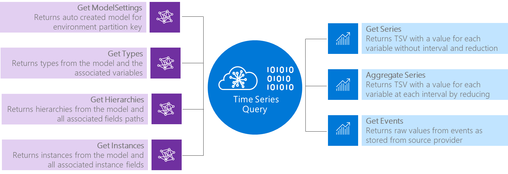

---
title: 'Azure Time Series Insights Preview data querying | Microsoft Docs'
description: Azure Time Series Insights Preview data querying.
author: ashannon7
ms.author: dpalled
ms.workload: big-data
manager: cshankar
ms.service: time-series-insights
services: time-series-insights
ms.topic: conceptual
ms.date: 05/06/2019
ms.custom: seodec18
---

# Data querying

Azure Time Series Insights Preview enables data querying on events and metadata stored in the environment via public surface APIs. These APIs also are used in the [Time Series Insights Preview explorer](./time-series-insights-update-explorer.md).

Three primary API categories are available in Time Series Insights:

* **Environment APIs**: Enables queries of the Time Series Insights environment itself. Examples of queries are the list of environments the caller has access to and environment metadata.

* **Time Series Model-Query (TSM-Q) APIs**: Enables create, read, update, and delete operations on metadata stored in the environment part of the time series model. Examples are instances, types, and hierarchies.

* **Time Series Query (TSQ) APIs**: Enables retrieval of events data as it's recorded from the source provider. These APIs can perform operations to transform, combine, and perform computations on time series data.

The [Time Series Expression (TSX) language](https://docs.microsoft.com/rest/api/time-series-insights/preview-tsx) is a powerful fourth category. It uses Time Series Models to enable composition of advanced computation.

## Azure Time Series Insights Preview core APIs

The following core APIs are supported.

## Environment APIs

The following Environment APIs are available:

* [Get Environment API](https://docs.microsoft.com/rest/api/time-series-insights/preview-env#get-environments-api): Returns the list of environments that the caller is authorized to access.
* [Get Environment Availability API](https://docs.microsoft.com/rest/api/time-series-insights/preview-env#get-environment-availability-api): Returns the distribution of event count over the event timestamp `$ts`. This API helps determine if there are any events in the timestamp by returning the count of events, if any exist.
* [Get Event Schema API](https://docs.microsoft.com/rest/api/time-series-insights/preview-env#get-event-schema-api): Returns the event schema metadata for a given search span. This API helps retrieve all metadata and properties available in the schema for the given search span.

## Time Series Model-Query (TSM-Q) APIs

The following Time Series Model-Query APIs are available:

* [Model Settings API](https://docs.microsoft.com/rest/api/time-series-insights/preview-model#model-settings-api): Enables get and patch on the default type and the model name of the environment.
* [Types API](https://docs.microsoft.com/rest/api/time-series-insights/preview-model#types-api): Enables CRUD on Time Series types and their associated variables.
* [Hierarchies API](https://docs.microsoft.com/rest/api/time-series-insights/preview-model#hierarchies-api): Enables CRUD on Time Series hierarchies and their associated field paths.
* [Instances API](https://docs.microsoft.com/rest/api/time-series-insights/preview-model#instances-api): Enables CRUD on Time Series instances and their associated instance fields.

## Time Series Query (TSQ) APIs

The following Time Series Query APIs are available:

* [Get Events API](https://docs.microsoft.com/rest/api/time-series-insights/preview-query#get-events-api): Enables query and retrieval of Time Series Insights data from events as they're recorded in Time Series Insights from the source provider.

* [Get Series API](https://docs.microsoft.com/rest/api/time-series-insights/preview-query#get-series-api): Enables query and retrieval of Time Series Insights data from captured events by using data recorded on the wire. The values that are returned are based on the variables that were defined in the model or provided inline.

    >[!NOTE]
    > The Aggregation clause is ignored even if it's specified in a model or provided inline.

  The Get Series API returns a Time Series value for each variable for each interval. A Time Series Value is a format that Time Series Insights uses for output JSON from a query. The values that are returned are based on the Time Series ID and the set of variables that were provided.

* [Aggregate Series API](https://docs.microsoft.com/rest/api/time-series-insights/preview-query#aggregate-series-api): Enables query and retrieval of Time Series Insights data from captured events by sampling and aggregating recorded data.

  The Aggregate Series API returns a Time Series value for each variable for each interval. The values are based on the Time Series ID and the set of variables that were provided. The Aggregate Series API achieves reduction by using variables stored in the Time Series Model or provided inline to aggregate or sample data.

  Supported Aggregate types: `Min`, `Max`, `Sum`, `Count`, `Average`

## Next steps

- Learn more about [storage and ingress](./time-series-insights-update-storage-ingress.md) in the Azure Time Series Insights Preview.

- Read the Time Series Insights Preview [data modeling](./time-series-insights-update-tsm.md) article.

- Discover [best practices when choosing a Time Series ID](./time-series-insights-update-how-to-id.md).
