# Private Preview Azure Time Series Insights explorer 
This article explores the various features and options available within the new V2 Time Series Insights explorer web app. As before you use Time Series Insights explorer in your web browser to create visualizations of your data.

## Video:

((Place holder for Video?))
 
## Why is there a new UI

We took our own Time Series Insights JS SDK and used it as the backbone of the new and improved V2 UI experience.

You can read more about the Time Series Insights JS SDK [here](https://review.docs.microsoft.com/en-us/azure/time-series-insights/time-series-insights-v2-sdk?branch=pr-en-us-53512)

Please see the Time Series Insights JS SDK github source [here](https://github.com/Microsoft/tsiclient)

## Considerations

* Time Series Insights V1 explorer has full functionality 
* Time Series Insight V2 explorer has limited functionality
* LTS environments will only work with the V2 explorer with the V2 query apis
* S1 and S2 environments will work with the existing apis that published

## Prerequisites

Before you can use Time Series Insights explorer, you must:
- Create a Time Series Insights environment
- Provide access to your account in the Time Series Insights environment
- Add an event source to ingest data and store it

## Explore and query data

1. To start, open the **Time Series Insights explorer** in your web browser, and select an environment on the left side of the window. All environments that you have access to are listed in alphabetical order.

    

2. Next select an environment on the left side of the window. All environments that you have access to are listed in alphabetical order. Here we will select TSI_Demo_Application2

    

3. We will collapse the environments and the tool bar to focus on the Data Model first by clicking on the highlighted toggle web controls.

    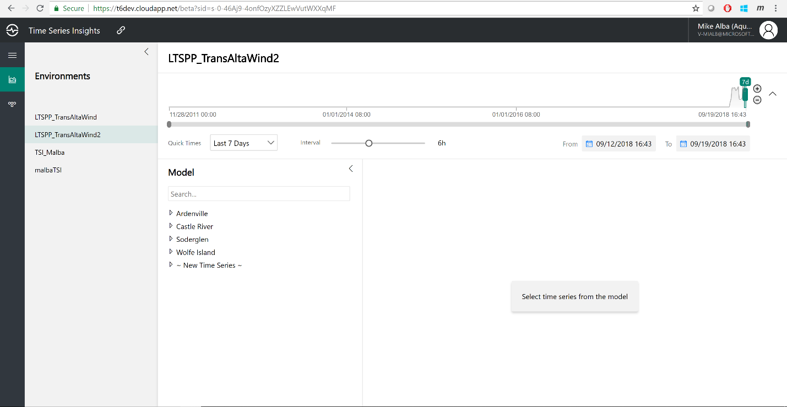

4. Now navigate through your data model as shown below from the left hand side and select the data points you would like to display.

    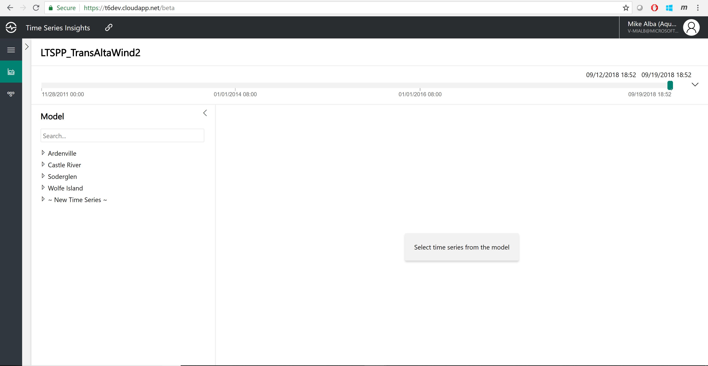

5. Pick and choose some sample data by drilling down into specific data points for Averages and Event Counts. The ones you select will be displayed on the graph as shown below.

    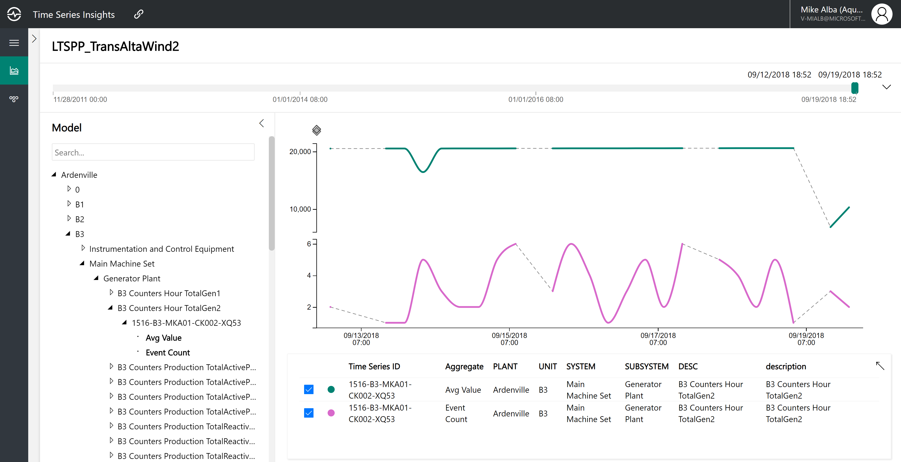

6. By utilizing the shown controls you can hide and show specific data points with a click.

    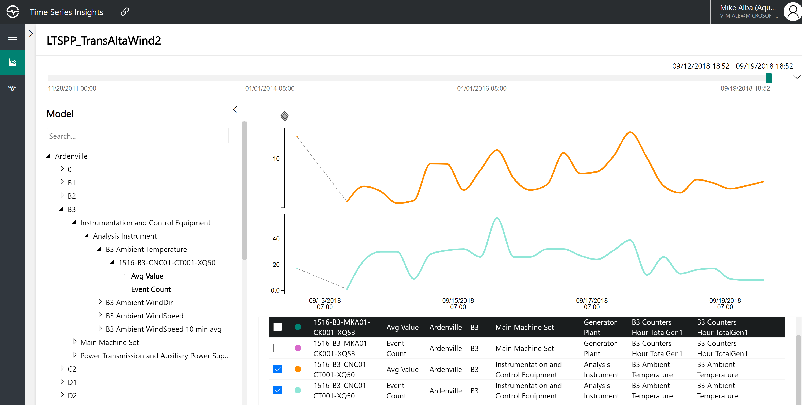

7. You can also remove data points by clicking on the red X as shown below. This will remove the data element from the current graph. You can also click the popup arrow to get a horizontal view of your data.

    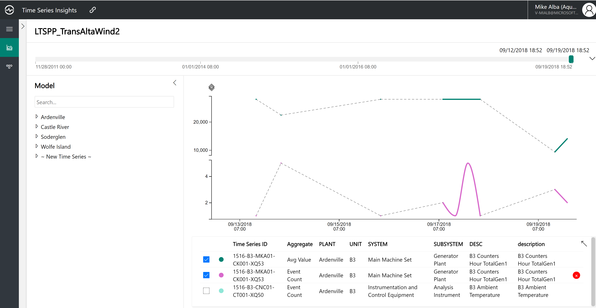

8. After clicking the popup web control you can now see your data in more of a horizontal view. Once you have selected the data elements you want for your current graph click the collapse web control as shown below. This will give you just the data elements you will be utilizing and now we can drill down further.

    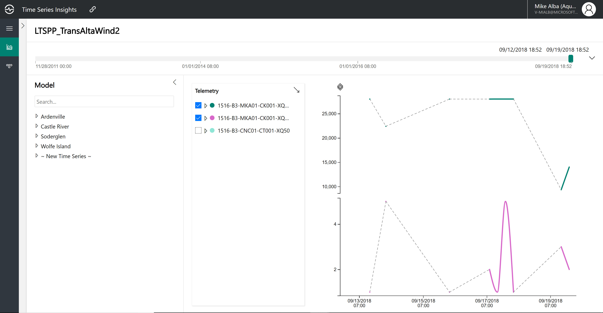

9.	Now lets expand our advanced graph controls and go through them each in more detail. Click the expand web control as shown below.

    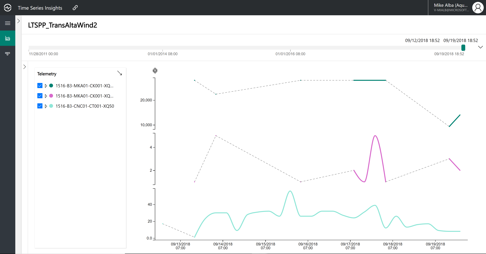

10.	Here are the advanced query controls

    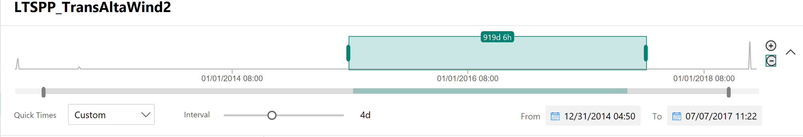

        Web controls
            1. Date range slider
            2. Increase or decrease date range buttons
            3. Hide or show advanced query controls collapse control
            4. Date range slider control
            5. Custom or preset date range drop down
            6. Interval slider control
            7. Date range to and from web controls 

11. Date range popup which gives you various options for creating date ranges

    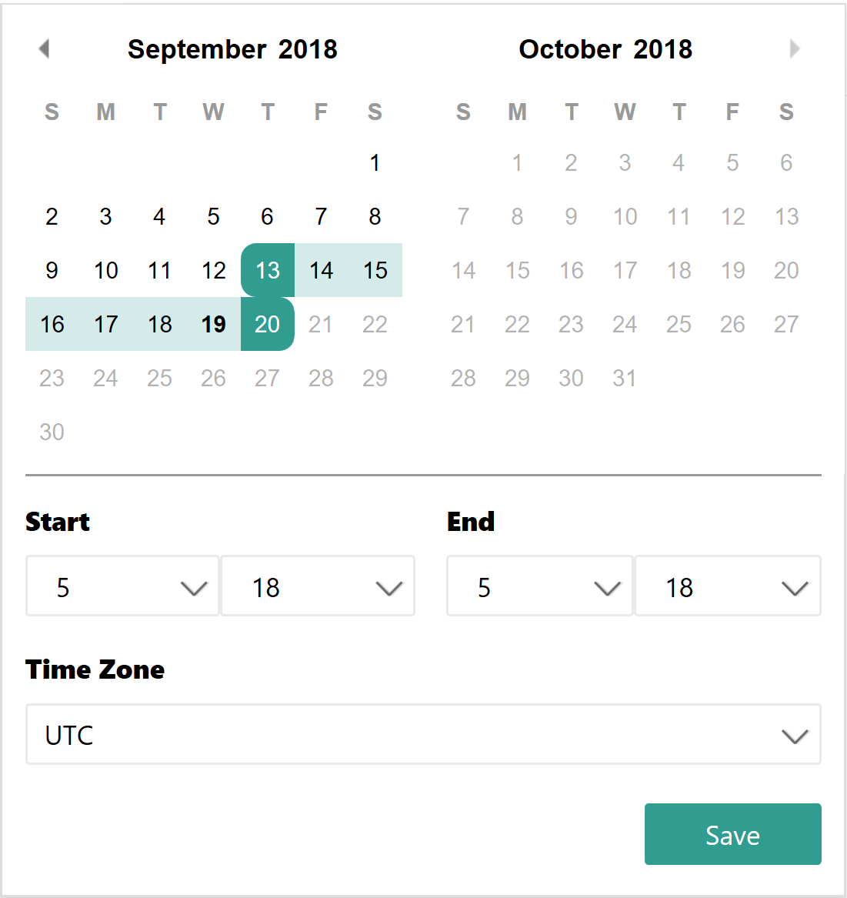

12. Show and describe carrots and zooming capability

    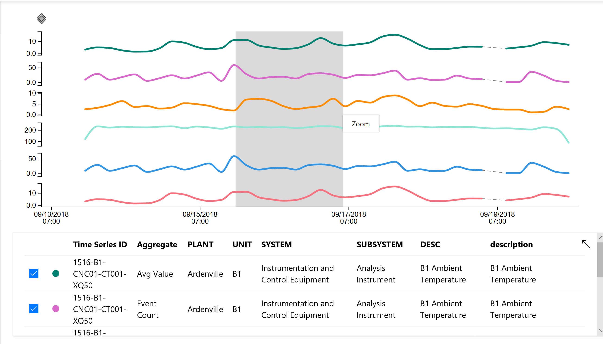

13. Zooming in for more detail

    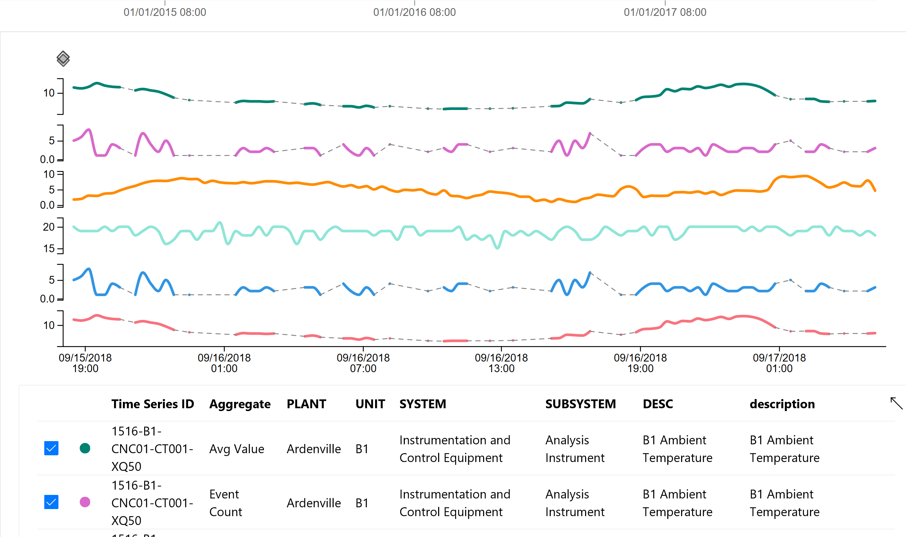

14. Click on carrot various layers exposing different interval views

    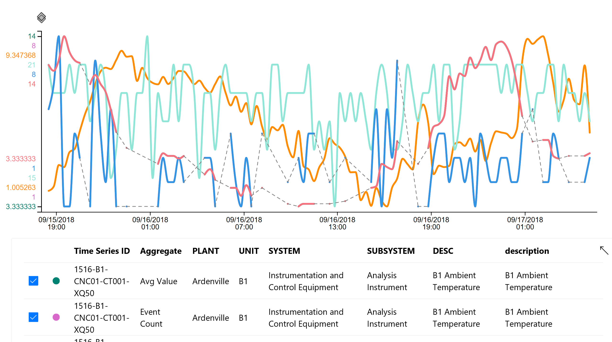

15. Demonstrate carrot options

    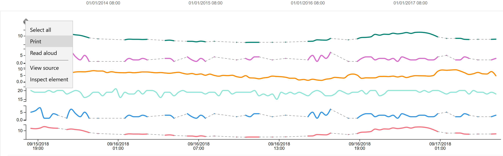

16. Explorer Screen Overview

    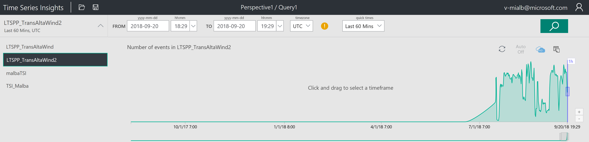

17. Create a new query

    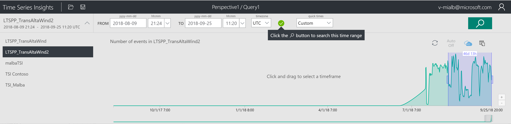

16. Save a query

    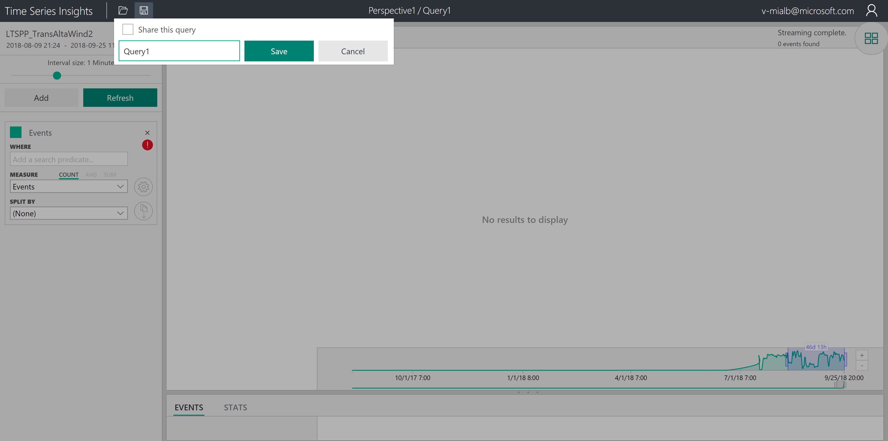

16. Explain explorer options

    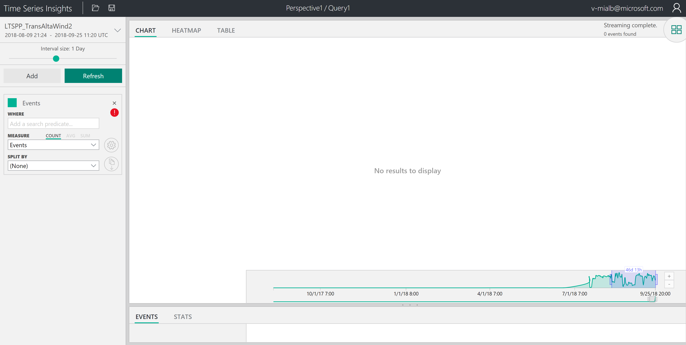

## Ad Hoc Query

1. Column descriptions?

    * Alias
    * Content encoding
    * Content type
    * DSCR
    * Data Source
    * Engineering Unit
    * Equipment Description
    * Format
    * IotHub Connection auth generation ID
    * IotHub Connection auth method
    * IotHub Connection device ID
    * IotHub Message source
    * Measurement description
    * Measurement name
    * Name
    * Plant
    * Source
    * Status
    * Subsubsystem
    * Subsystem
    * System
    * Tag ID
    * Type
    * Unit
    * Value 
    * Value Status

2. Where Clause

  Explain how to properly format predicates

3. Measures

    * Event Count
    * Graph MAX
    * Graph MIN
    * Name
    * Status code
    * Value
    * Value status

4. Split by

## V2 Private Preview Documents
* [Private Preview Explorer](https://review.docs.microsoft.com/en-us/azure/time-series-insights/time-series-insights-v2-explorer?branch=pr-en-us-53600)
* [Private Preview Storage and ingress](https://review.docs.microsoft.com/en-us/azure/time-series-insights/time-series-insights-v2-storage-ingress?branch=pr-en-us-53600)
* [Private Preview TSM](https://review.docs.microsoft.com/en-us/azure/time-series-insights/time-series-insights-v2-tsm?branch=pr-en-us-53600)
* [Private Preview TSQ](https://review.docs.microsoft.com/en-us/azure/time-series-insights/time-series-insights-v2-tsq?branch=pr-en-us-53600)
* [Private Preview TSI Javascript SDK](https://review.docs.microsoft.com/en-us/azure/time-series-insights/time-series-insights-v2-sdk?branch=pr-en-us-53600)