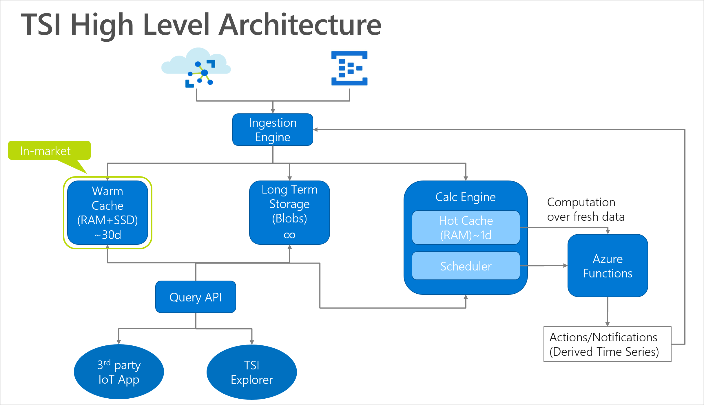
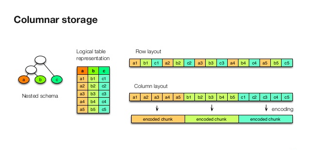
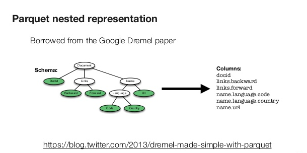

# Data Storage and ingress in Azure Time Series Insights Private Preview

The purpose of this document is to explain information related to how Time Series Insights new functionality will store and ingress data.  This document covers the underlying storage structure, the file format, Time Series ID property, underlying ingress process, throughput, and limitations.  

## Time Series Insights Architecture

## Data Storage

Azure Time Series Insights produces Azure blobs for storing time series data that are stored in a customer’s storage account.  However, in private preview, the Time Series Insights engineering group will provide free Azure Storage accounts, so the preview is free to use.  In public preview and beyond the data will reside in a customer-owned storage account.  Time Series Insights creates and manages the blobs stored in the storage account for reading-from and writing-to the blobs in the Azure Storage account.  However, you will be able to read from the blobs to support integraton scenarios. 

To ensure that all events can be queried performantly, the private preview will support Azure storage general purpose V1 and V2 ‘hot’ configurations.   

Time Series Insights Long Term Storage solution uses Azure Blob Storage with the Parquet filetype. The Time Series Insights solution manages all data operations including ingress, indexing and partitioning of the data.

To see more on Azure Blob Storage please see [Azure Blob Storage Overview](https://docs.microsoft.com/en-us/azure/storage/blobs/storage-blobs-introduction)

For more on Azure Blob Storage Parquet Filetypes please see [Azure Blob Storage Filetype Overview](https://docs.microsoft.com/en-us/azure/data-factory/supported-file-formats-and-compression-codecs#parquet-format)

## Parquet File Format 

Parquet is column-oriented data store that was designed for 

* Interoperability
* Space Efficiency
* Query Efficiency 

It provides efficient data compression and encoding schemes with enhanced performance to handle complex data in bulk.

### Parquet storage layout overview

With parquet files, Time Series Insights events are mapped to parquet file contents: 
* Every event is a single row 
* Builtin "_ts" column with event timestamp 
* Timestamp property is not indexed if set 
* All other properties map to columns prefixed with "s_", "b_", "dt_", "d_" depending on the property type. 
NOTE: This is NOT the final format. We reserve the right  to change it before or after Public Preview (and even GA) if we need to.   

To read more on the Parquet file format look [here](https://parquet.apache.org/documentation/latest/)

## How does data storage partitioning work 

Each Time Series Insights environment must have a Time Series ID property (partition key) and a time stamp property, which uniquely identify it. Your Time Series ID acts as a logical partition for your data and provides Azure Time Series Insights with a natural boundary for distributing data across physical partitions. For now, we support a single key, but we plan to add support for up to 3 keys at public preview. The data for a single logical partition must reside inside a single physical partition and physical partition management is managed by Azure Time Series Insights in an Azure Storage account. 

### Physical partition 

A physical partition is a block blob stored in Azure storage. The actual size of blobs will var as it depends on the push rate, however we expect blobs to be approximately 20MB in size, which Time Series Insights selected to optimize for query performance. 
 
### Logical partition 

A logical partition is a partition within a physical partition that stores all the data associated with a single partition key value. Time Series Insights will logically partition each blob based on two properties: 
1.	Time stamp (initial) 
2.	Time Series ID (repartition later to optimize query performance) 
Time Series Insights provides performant queries based on time series ID and to accomplish this, these two properties provide the most efficient means of delivering said performance.

## Best practices when choosing a Time Series ID (partition key)

The choice of the Time Series ID is like selecting a partition key for a database and is an important decision that you have to make at design time. Time Series ID is an immutable property, so selecting the appropriate Time Series ID is critical.  

Pick a property name that has a wide range of values and has even access patterns. It's a best practice to have a partition key with a large number of distinct values (e.g., hundreds or thousands). For many customers, this will be something like device ID, sensor ID, etc.  It should be unique at the leaf node level of your TSM (link to TSM).   

## Writing and editing Time Series Insights blobs 
Not allowed.

## Accessing and exporting data from Time Series Insights

You may want to access data stored in TSI to use in conjunction with other services.  For example, you may want to use your data for reporting in Power BI, to perform ML on using Azure Machine Learning Studio or Jupyter Notebooks, etc.   

There are two general paths to access your data – the first, directly from TSI and the second, directly from the Azure storage account.

3. Grant read access to Azure Blob Storage

[Manage Read Access to your Azure Blob Storage](https://docs.microsoft.com/en-us/azure/storage/blobs/storage-manage-access-to-resources)

4. Direct read access from Azure Blob Storage 

[Moving data to and from Azure Storage](https://docs.microsoft.com/en-us/azure/storage/common/storage-moving-data?toc=%2fazure%2fstorage%2fblobs%2ftoc.json)

5. Export from Azure Storage account 

[Azure Blob Storage Export Requirements](https://docs.microsoft.com/en-us/azure/storage/common/storage-import-export-requirements)

[Export Time Series Insights data from Azure Blob Storage](https://docs.microsoft.com/en-us/azure/storage/common/storage-import-export-data-from-blobs)

### From TSI: 
1. Export events from the Time Series Insights explorer 

    Screenshot issues

2. /GetRecorded API

    Enables query and retrieval of time series data from events as they are recorded in TSI from the source provider. GetRecorded API takes a tsId, searchSpan, filter condition, and provide projection condition for selecting only required values/properties from columns. Get Recorded returns raw values from events as stored in TSI for a given tsId and time range. Does not require variable definitions (neither TSM or variable definitions are used).

### From Azure storage account: 
1. Grant read access to Azure Blob Storage

    [Manage Read Access to your Azure Blob Storage](https://docs.microsoft.com/en-us/azure/storage/blobs/storage-manage-access-to-resources)

2. Direct read access from Azure Blob Storage 

    [Moving data to and from Azure Storage](https://docs.microsoft.com/en-us/azure/storage/common/storage-moving-data?toc=%2fazure%2fstorage%2fblobs%2ftoc.json)

3. Export from Azure Storage account 

    [Azure Blob Storage Export Requirements](https://docs.microsoft.com/en-us/azure/storage/common/storage-import-export-requirements)

    [Export Time Series Insights data from Azure Blob Storage](https://docs.microsoft.com/en-us/azure/storage/common/storage-import-export-data-from-blobs)

### Blob Storage Performance/Operational Considerations

It is important to mention that Azure storage does have read and write limits based on how heavy your systems usage is.

Time Series Insights performance can be adversely affect by reading or writing to your blob frequently. 

* Blobs are periodically repartitioned, new blobs are created, old ones deleted 
* Data may be duplicated across blobs 
* Use TSQ API to avoid getting duplicated data due to repartitioning. 

## Data deletion 

TSI does not currently support data deletion but will in the future.  We expect to support it by GA, but potentially sooner. We’ll notify users when we do. 

Do not delete blobs; otherwise, queries may fail, since TSI maintains metadata about the blobs inside of TSI. 

## Limitations and error handling 
In Private preview, Time Series Insights will support the following: 
•	@Andrey/@Dmitry/@Ravi - What limits should we call out here?  Note, this is not ingress or query, so is this effectively just Azure storage bounds? 
[Ravi Version – Feel free to edit] 
{ 
•	The LTS Catalog is not yet ready to support external data processing systems. Customers will need to read all of the blobs to be able to process the blobs. 
•	The Parquet blob format is optimized for TSI’s performance, and doesn’t comply with optimal external data processing requirements. 

## Ingress

### Azure Time Series Insights ingress policies  

Azure Time Series Insights supports the same event sources and file types that it does today.
Supported event sources: 
* Azure IoT Hub 
* Azure Event hubs 
    * Azure Event hubs support Kafka.  Note - we have not tested Kafka. 
Supported event type is JSON.  For more on the supported JSON shapes we can handle, please see documentation [here](https://review.docs.microsoft.com/en-us/azure/time-series-insights/time-series-insights-v2-tsq?branch=pr-en-us-52723).  
In private preview, Time Series Insights index data using a blob-size optimization strategy.  This means that data will be available to query once it’s indexed, which is based on how much data is coming in and at what velocity.  As we approach public preview, we will add logic to look for new events every few seconds, which will make data available for queries faster and more reliable.   @Ravi, can you please add more detail? 

### Scale 
We expect Azure Time Series Insights to support at least 72,000 events per minute in private preview.  However, we will be testing and validating this. If you experience any significant latency, please let us know.  

## V2 Private Preview Documents
* [Private Preview Explorer](https://review.docs.microsoft.com/en-us/azure/time-series-insights/time-series-insights-v2-explorer?branch=pr-en-us-53512)
* [Private Preview Storage and ingress](https://review.docs.microsoft.com/en-us/azure/time-series-insights/time-series-insights-v2-storage-ingress?branch=pr-en-us-53512)
* [Private Preview TSM](https://review.docs.microsoft.com/en-us/azure/time-series-insights/time-series-insights-v2-tsm?branch=pr-en-us-53512)
* [Private Preview TSQ](https://review.docs.microsoft.com/en-us/azure/time-series-insights/time-series-insights-v2-tsq?branch=pr-en-us-53512)
* [Private Preview TSI Javascript SDK](https://review.docs.microsoft.com/en-us/azure/time-series-insights/time-series-insights-v2-sdk?branch=pr-en-us-53512)