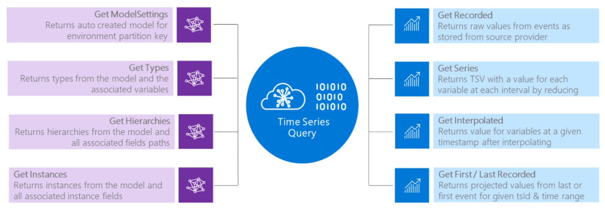
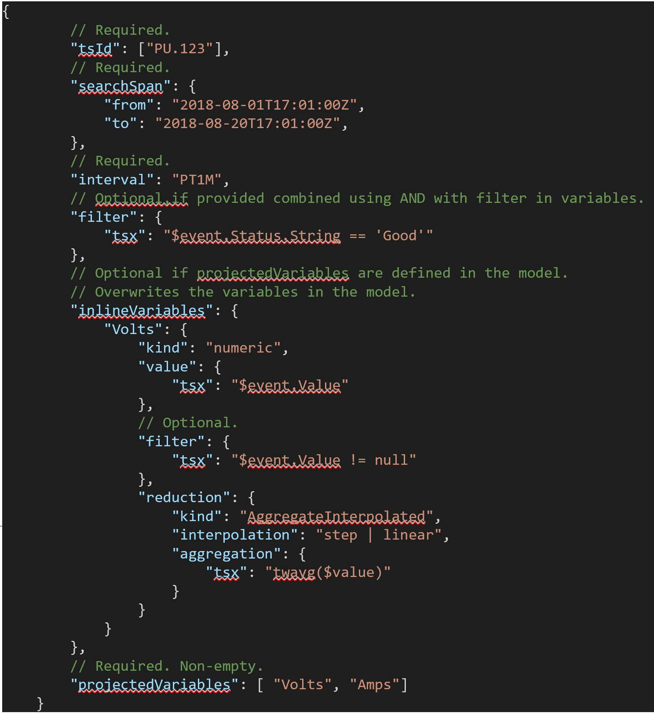
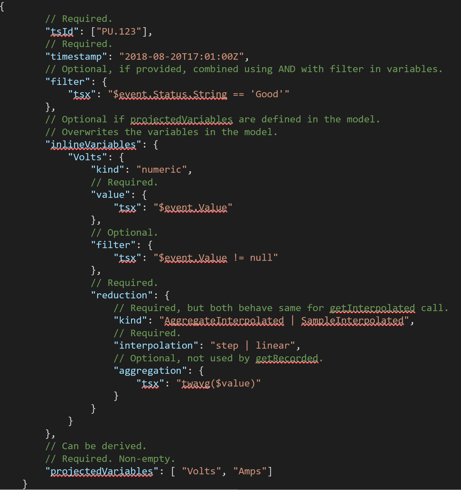
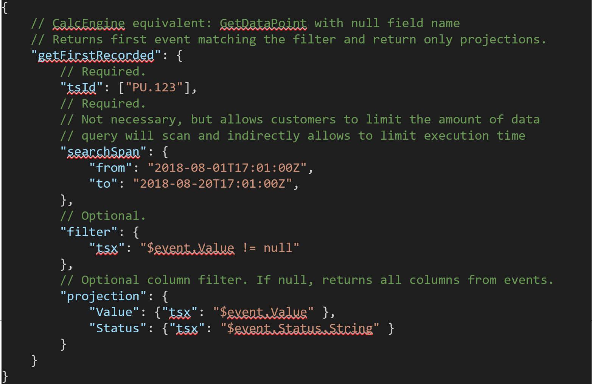
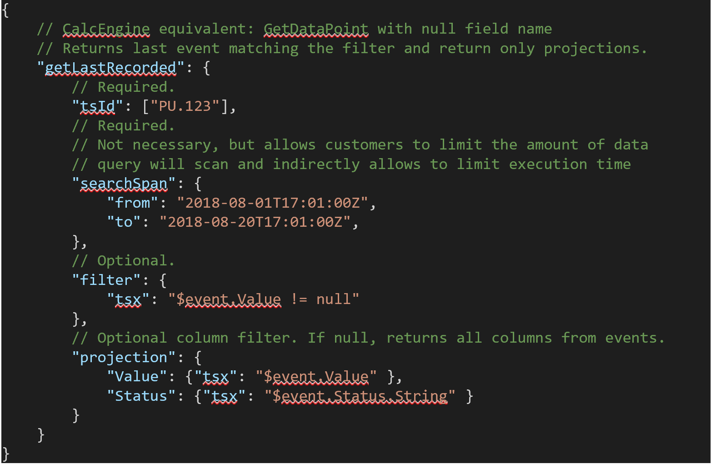

# Time Series Query 

## Overview

Time Series Query (TSQ), makes it easier to compute and retrieve IoT data at scale. TSQ leverages computation definitions stored in TSM or inline provided definition to transform the data while retrieving it from storage. TSQ retrieves data as it is recorded from source provider, or reconstructs the signals leveraging the specified method to enable customers perform operations to transform, combine, and perform computations on time series data. Data can be access via the native TSI explorer and/or Public Surface API.  

## Core APIs

TSQ makes data retrieval seamless at scale and enable customers to perform transform, combine, and perform computations on time series data, and retrieve the result set for analytical, computational, or downstream integration scenarios. At following APIs are available as of today: 

### Get Recorded 

Enables query and retrieval of time series data from events as they are recorded in TSI from the source provider. GetRecorded API takes a tsId, searchSpan, filter condition, and provide projection condition for selecting only required values/properties from columns. Get Recorded returns raw values from events as stored in TSI for a given tsId and time range. Does not require variable definitions (neither TSM or variable definitions are used).

### Get Series

Enables query and retrieval of time series data from events by aggregating/sampling recorded data using an aggregate or sample function. GetSeries API takes tsId, searchSpan, interval, projectedVariables and an optional inlineVariables. Returns TSV with a value for each variable for each interval for provided tsId & set of variables. 

*getSeries* achieve reduction by leveraging variables stored in TSM or provided inline to aggregate or sample. AggregateRecorded, AggregateInterpolated or SampleInterpolated are supported. Aggregate types include Min, Max, Sum, Count & Average, and Sample types include sample by time or sample by interval.

### Get Interpolated (Coming Soon) 

Enables query and retrieval of time series data from events by aggregating on interpolated data. Interpolation is constructing new data points in range of a discrete known data points. getInterpolated API takes tsId, timestamp, optional filter, projectedVariables and an optional inlineVariables. Returns TSV with a value for each of projected variables at a given timestamp after applying interpolation specified in the variable definitions. 

### Get First Value (Coming Soon)

Enables query and retrieval of time series data from events for first known value events. getFirstValue API takes a tsId, searchspan, optional filter, and an optional projection. 

Returns projected values from the first event for a given tsId and time range matching given filter. Does not require variable definitions (neither TSM nor variable definitions are used). 

### Get Last Value (Coming Soon)

Enables query and retrieval of time series data from events for last known value events. getLastValue API takes a tsId, searchspan, optional filter, and an optional projection. 

Returns projected values from the last event for a given tsId and time range matching given filter. Does not require variable definitions (neither TSM nor variable definitions are used).

## Time Series Query Tutorial
To Be updated

## V2 Private Preview Documents
* [Private Preview Explorer](https://review.docs.microsoft.com/en-us/azure/time-series-insights/time-series-insights-v2-explorer?branch=pr-en-us-53512)
* [Private Preview Storage and ingress](https://review.docs.microsoft.com/en-us/azure/time-series-insights/time-series-insights-v2-storage-ingress?branch=pr-en-us-53512)
* [Private Preview TSM](https://review.docs.microsoft.com/en-us/azure/time-series-insights/time-series-insights-v2-tsm?branch=pr-en-us-53512)
* [Private Preview TSQ](https://review.docs.microsoft.com/en-us/azure/time-series-insights/time-series-insights-v2-tsq?branch=pr-en-us-53512)
* [Private Preview TSI Javascript SDK](https://review.docs.microsoft.com/en-us/azure/time-series-insights/time-series-insights-v2-sdk?branch=pr-en-us-53512)