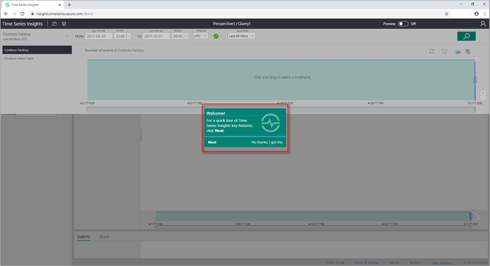
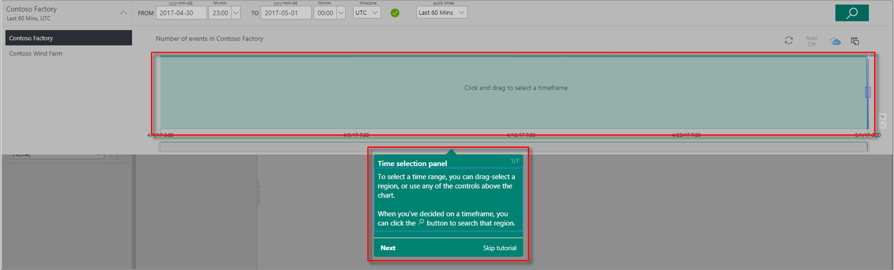
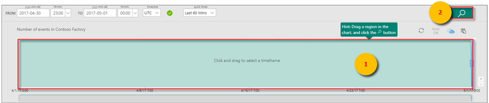
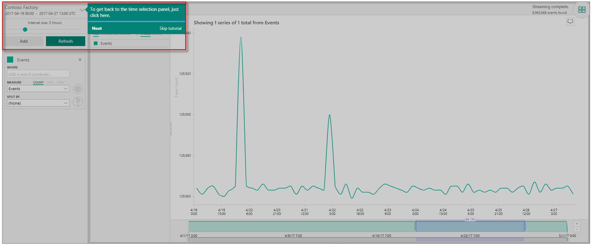
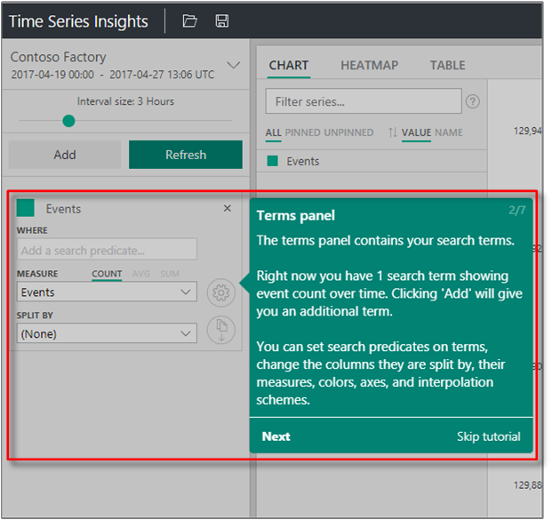
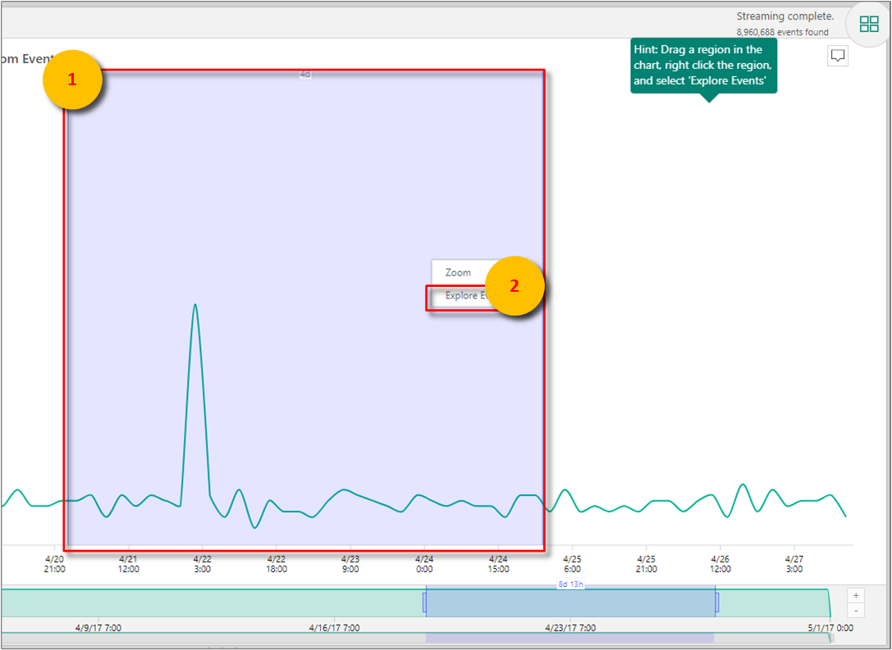
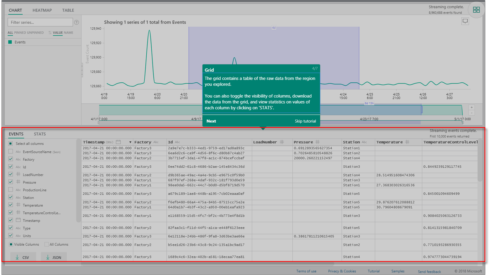
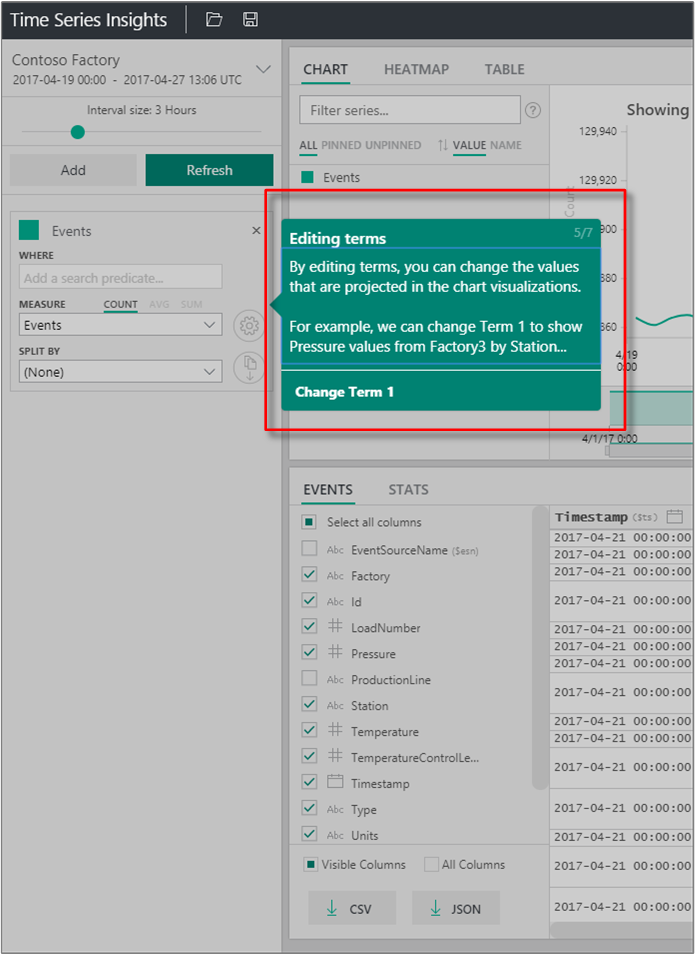
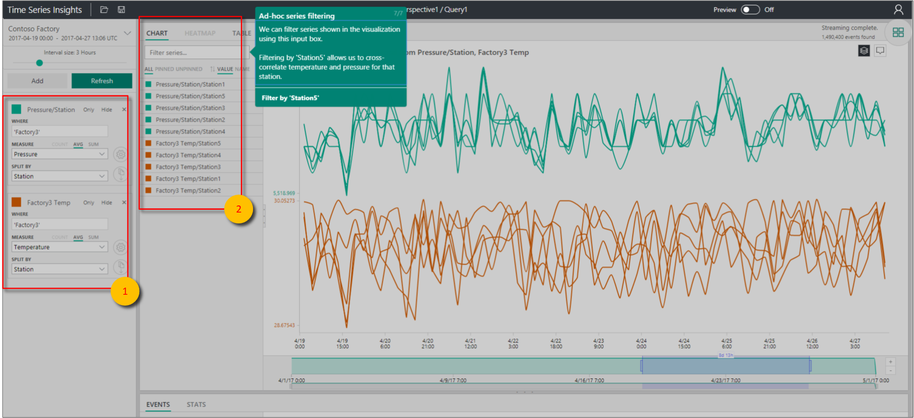

# Quickstart: Explore Azure Time Series Insights Gen1

[!INCLUDE [retirement](../../includes/tsi-retirement.md)]

> [!CAUTION]
> This is a Gen1 article.

This Azure Time Series Insights Explorer quickstart helps you get started with Azure Time Series Insights in a free demonstration environment. In this quickstart, you learn how to use your web browser to visualize large volumes of IoT data and tour key features that are generally available now.

Azure Time Series Insights is a fully managed analytics, storage, and visualization service that simplifies how to explore and analyze billions of IoT events simultaneously. It gives you a global view of your data so that you can quickly validate your IoT solution and avoid costly downtime to mission-critical devices. Azure Time Series Insights helps you to discover hidden trends, spot anomalies, and conduct root-cause analyses in near real time.

For additional flexibility, you can add Azure Time Series Insights to a preexisting application through its powerful [REST APIs](./concepts-query-overview.md) and [client SDK](https://github.com/microsoft/tsiclient). You can use the APIs to store, query, and consume time series data in a client application of your choice. You also can use the client SDK to add UI components to your existing application.

This Azure Time Series Insights Explorer quickstart offers a guided tour of features.

> [!IMPORTANT]
> Create a [free Azure account](https://azure.microsoft.com/free/?ref=microsoft.com&utm_source=microsoft.com&utm_medium=docs&utm_campaign=visualstudio) if you haven't created one already.

## Prepare the demo environment

1. In your browser, go to the [Gen1 demo](https://insights.timeseries.azure.com/demo).

1. If prompted, sign in to the Azure Time Series Insights Explorer by using your Azure account credentials.

1. The Azure Time Series Insights quick tour page displays. Select **Next** to begin the quick tour.

   

## Explore the demo environment

1. The **Time selection panel** displays. Use this panel to select a time frame to visualize.

   

1. Select a time frame and drag it in the region. Then select **Search**.

   

   Azure Time Series Insights displays a chart visualization for the time frame you specified. You can do various actions within the line chart. For example, you can filter, pin, sort, and stack.

   To return to the **Time selection panel**, select the down arrow as shown:

   

1. Select **Add** in the **Terms panel** to add a new search term.

   

1. In the chart, you can select a region, right-click the region, and select **Explore Events**.

   

   A grid of your raw data displays from the region that you're exploring.

   

## Select and filter data

1. Edit your terms to change the values in the chart. Add another term to cross-correlate different types of values.

   

1. Leave the **Filter series** box blank to display all selected search terms or enter a filter term in the **Filter series** box for improvised series filtering.

   

   For the quickstart, enter **Station5** to cross-correlate temperature and pressure for that station.

After you finish the quickstart, you can experiment with the sample data set to create different visualizations.

## Clean up resources

Now that you've completed the tutorial, clean up the resources you created:

1. From the left menu in the [Azure portal](https://portal.azure.com), select **All resources**, locate your Azure Time Series Insights resource group.
1. Either delete the entire resource group (and all resources contained within it) by selecting **Delete** or remove each resource individually.

## Next steps

* You're ready to create your own Azure Time Series Insights environment. Read [Plan your Azure Time Series Insights environment](time-series-insights-environment-planning.md).
