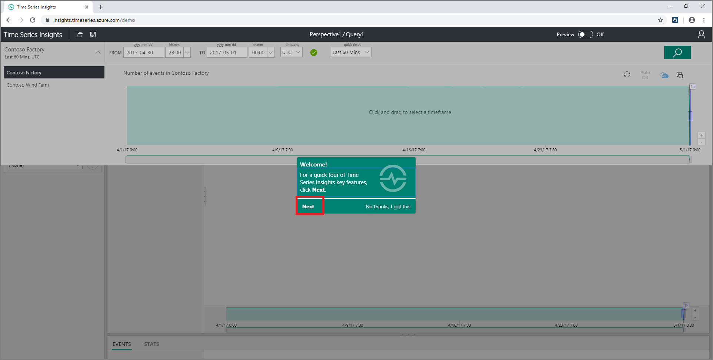
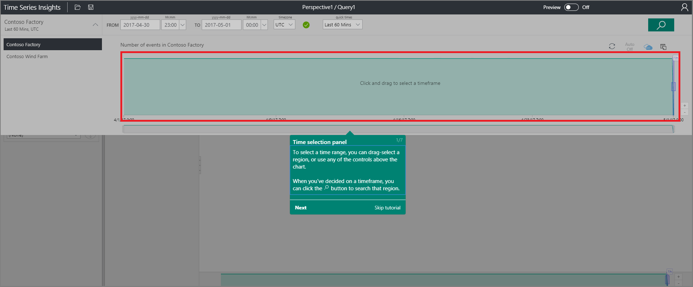
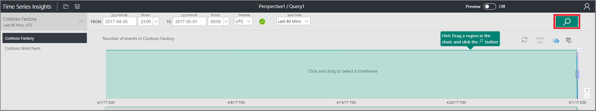
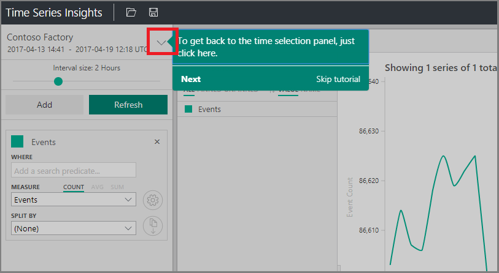
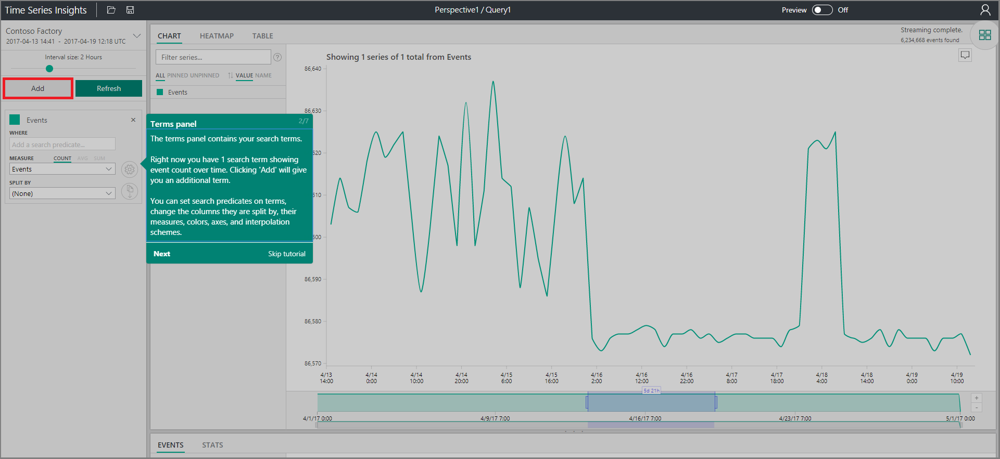
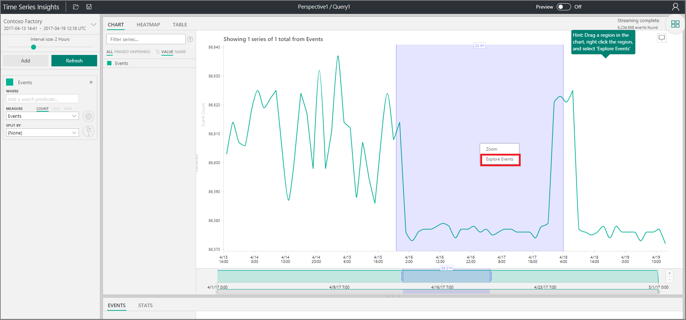
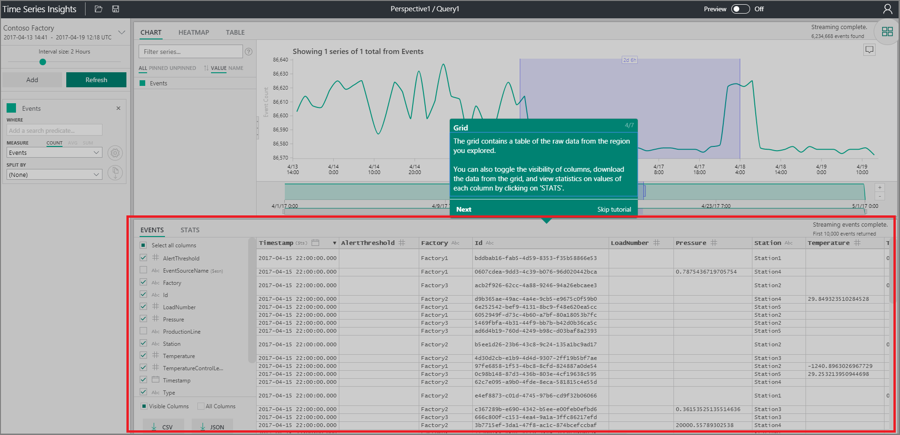
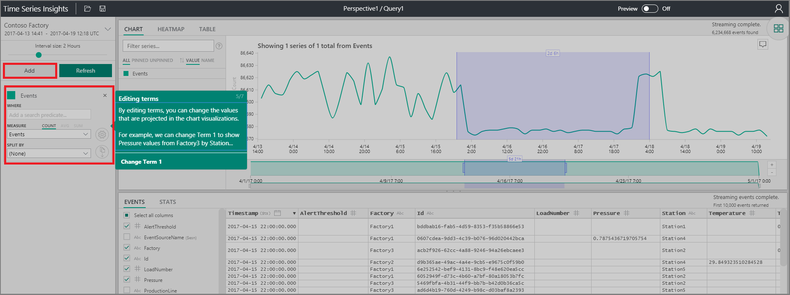
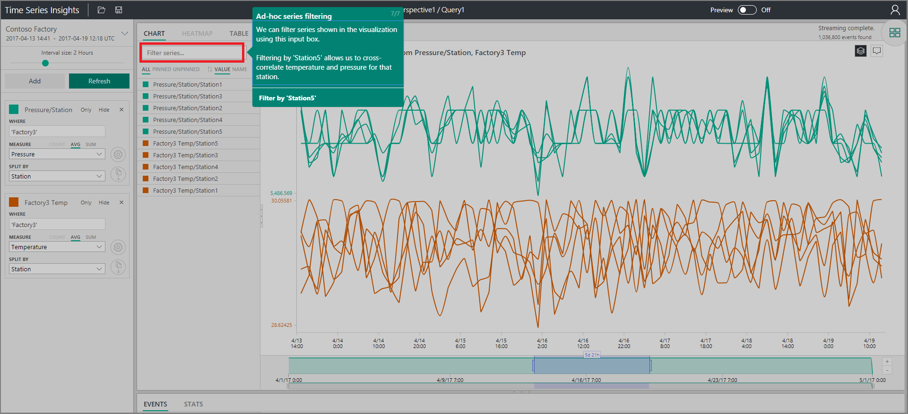

# Quickstart: Explore Azure Time Series Insights
This quickstart shows you how to get started with Azure Time Series Insights explorer in a free demonstration environment. You learn how to use your web browser to visualize large volumes of IoT data and tour the key features of the Time Series Insights explorer. 

Azure Time Series Insights is a fully managed analytics, storage, and visualization service that makes it simple to explore and analyze billions of IoT events simultaneously. It gives you a global view of your data, letting you quickly validate your IoT solution and avoid costly downtime to mission-critical devices by helping you discover hidden trends, spot anomalies, and conduct root-cause analyses in near real time.  If you are building an application that needs to store or query time series data, you can develop using the Time Series Insights REST APIs.

If you don't have an Azure subscription, create a [free Azure account](https://azure.microsoft.com/free/?ref=microsoft.com&utm_source=microsoft.com&utm_medium=docs&utm_campaign=visualstudio) before you begin.

## Explore Time Series Insights explorer in a demo environment

1. In your browser, navigate to [https://insights.timeseries.azure.com/demo](https://insights.timeseries.azure.com/demo). 

2. If prompted, log in to the Time Series Insights explorer using your Azure account credentials. 
 
3. The Time Series Insights quick tour page is displayed. Click **Next** to begin the quick tour.

   

4. The **Time selection panel** is displayed. Use this panel to select a time frame to visualize.

   

5. Click and drag in the region, then click the **Search** button.
 
    

   Time Series Insights displays a chart visualization for the time frame you specified. You can do various actions within with the line chart, such as filtering, pinning, sorting, and stacking. 

   To return to the **Time selection panel**, click the down arrow as shown:

   

6. Click **Add** in the **Terms panel** to add a new search term.

   

7. In the chart, you can select a region, right-click the region, and select **Explore Events**.
 
   

   A grid of your raw data is displayed from the region you are exploring:

   

8. Edit your terms to change the values in the chart, and add another term to cross-correlate different types of values:

   

9. Enter a filter term in the **Filter series...** box for ad hoc series filtering. For the quickstart, enter **Station5** to cross-correlate temperature and pressure for that station.
 
   

After you finish the quickstart, you can experiment with the sample data set to create different visualizations. 

### Next steps
You are ready to create your own Time Series Insights environment:
> [!div class="nextstepaction"]
> [Plan your Time Series Insights environment](time-series-insights-environment-planning.md)
