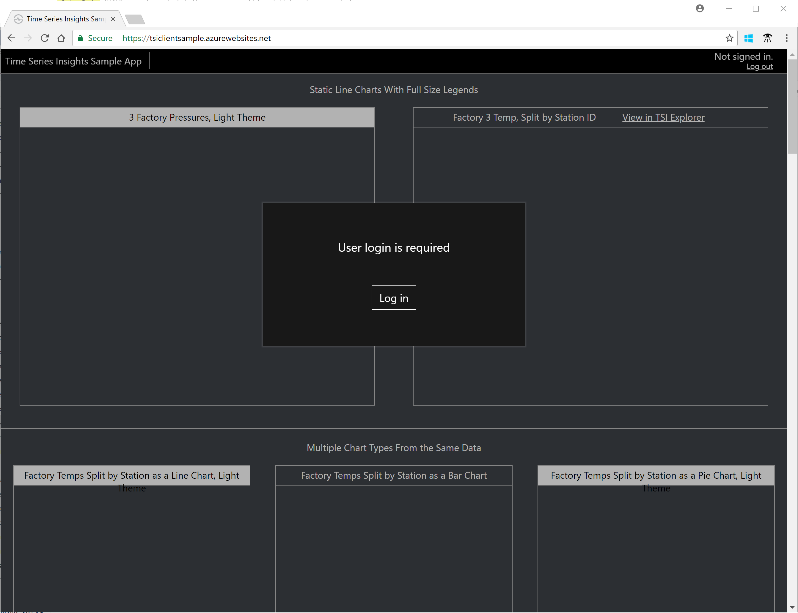
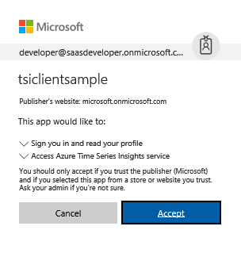
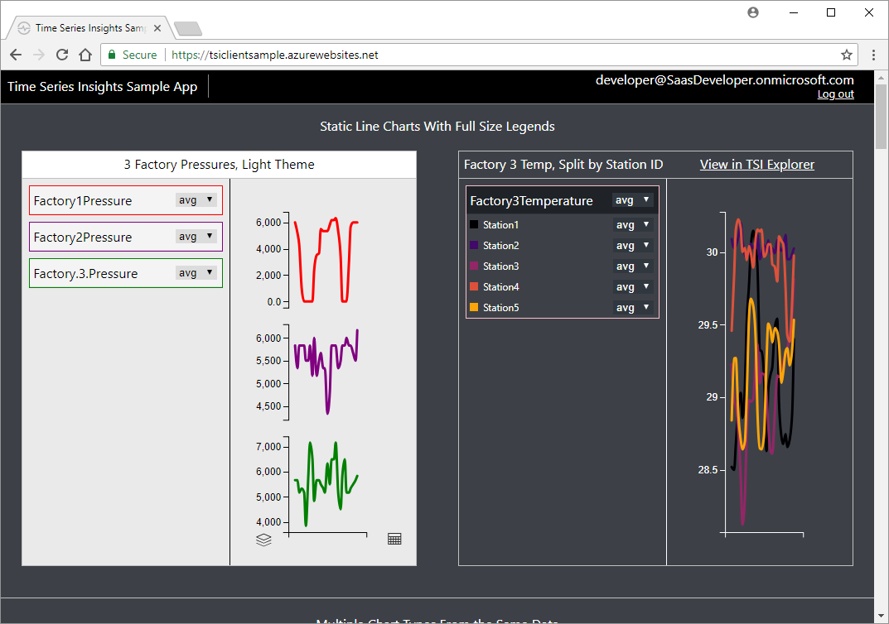
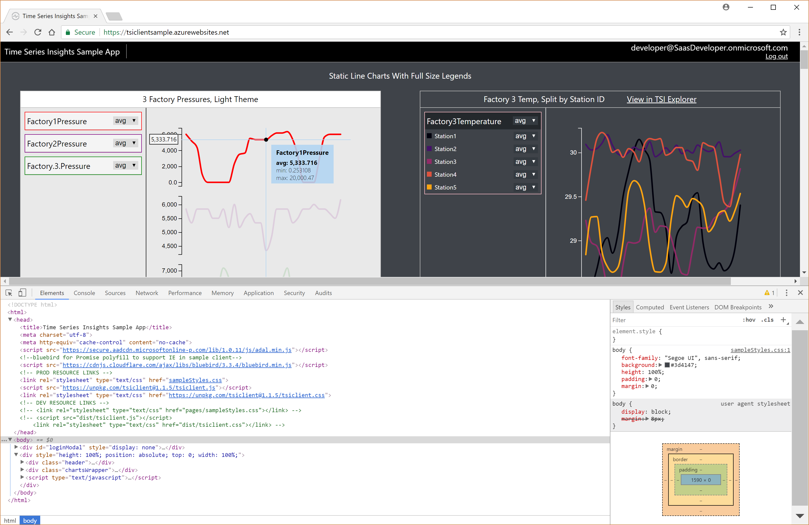
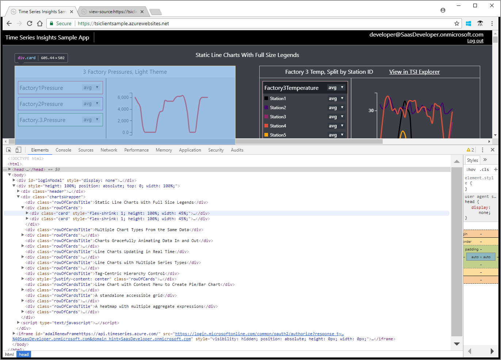
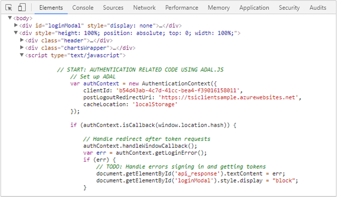

---
title: Explore the Time Series Insights JavaScript client library
description: Learn about the Time Series Insights JavaScript client library and related programming model.
documentationcenter: ''
services: time-series-insights
author: BryanLa
manager: timlt
editor: ''
tags: 

ms.assetid: 
ms.service: time-series-insights
ms.workload: na
ms.tgt_pltfrm: 
ms.devlang: na
ms.topic: tutorial
ms.date: 05/09/2018
ms.author: bryanla
# Customer intent: As a developer, I want learn about the TSI JavaScript client library, so I can use the APIs in my own applications.
---

# Tutorial: Explore the Time Series Insights JavaScript client library

This tutorial guides you through an exploration of the Time Series Insights (TSI) JavaScript client library, and the related programming model. The topics discussed provide you with opportunities to experiment, gain a deeper understanding of how to access TSI data, and use chart controls to render and visualize data. The goal is to provide you with enough details, that you can use the library in your own web application.

In this tutorial, you learn about:

> [!div class="checklist"]
> * The TSI Sample application 
> * 2
> * 3
> * 4

<!--
[!INCLUDE [cloud-shell-powershell.md](../../../includes/cloud-shell-powershell.md)]

If you choose to install and use the PowerShell locally, this tutorial requires the Azure PowerShell module version 5.3 or later. Run `Get-Module -ListAvailable AzureRM` to find the version. If you need to upgrade, see [Install Azure PowerShell module](/powershell/azure/install-azurerm-ps). If you are running PowerShell locally, you also need to run `Connect-AzureRmAccount` to create a connection with Azure. 
-->

## Prerequisites

<!--
If you don't have an Azure subscription, create a [free account](https://azure.microsoft.com/free/) before you begin.
-->
This tutorial makes heavy use of the "Developer Tools" feature (also known as DevTools or F12), found in most modern web browsers such as [Edge](/microsoft-edge/devtools-guide), [Chrome](https://developers.google.com/web/tools/chrome-devtools/), [FireFox](https://developer.mozilla.org/en-US/docs/Learn/Common_questions/What_are_browser_developer_tools), [Safari](https://developer.apple.com/safari/tools/), and others. If you're not already familiar, you may want to explore this feature in your browser before continuing. 

## The Time Series Insights Sample Application

Throughout this tutorial, the Time Series Insights Sample Application is used to explore the source code behind the application, including usage of the TSI JavaScript client library. The application is a Single-Page web Application (SPA), showcasing the use of the library for querying and visualizing data from a sample TSI environment. 

1. Navigate to the [Time Series Insights sample application](https://tsiclientsample.azurewebsites.net/). You see a page similar to the following, prompting you for sign-in:
   

2. Click the "Log in" button and enter your credentials. You can use either an enterprise/organization account (Azure Active Directory) or a personal account (Microsoft Account, or MSA). The first time you use the application with a given account, you are prompted to give your consent to the application. Consent allows the application to sign in under your account, and access the TSI APIs to retrieve data on your behalf.  
   

3. After successful sign-in, you will see a page similar to the following, containing several styles of example charts, populated with TSI data. Also note your user account and the "log out" link in the upper right:
   

### Page source and structure

First let's view the HTML and JavaScript source code behind the page that rendered in your browser. We don't walk through all of the elements, but you learn about the major sections giving you a sense of how the page works:

1. Open "Developer Tools" in your browser, and inspect the HTML elements that make up the current page, also known as the HTML or DOM tree.

2. Expand the `<head>` and `<body>` elements and notice:
   - Under `<head>`, you find elements that pull in additional files to assist in the functioning of the page:
     - a `<script>` element for referencing the Azure Active Directory Authentication Library (adal.min.js) - also known as ADAL, this is a JavaScript library that provides OAuth 2.0 authentication (sign-in) and token acquisition for accessing APIs:

       >[!NOTE]
       > The source code for the ADAL JavaScript library is available from the [azure-activedirectory-library-for-js repository](https://github.com/AzureAD/azure-activedirectory-library-for-js).

     - `<link>` elements for style sheets (sampleStyles.css, tsiclient.css) - also known as CSS, they're used to control visual page styling details, such as colors, fonts, spacing, etc. 
     - a `<script>` element for referencing the TSI Client library (tsiclient.js) - a JavaScript library used by the page to call TSI service APIs and render chart controls on the page.

   - Under `<body>`, you find `
` elements, which act as containers to define the layout of items on the page, and another `<script>` element:
     - the first `
` specifies the "Log In" dialog (`id="loginModal"`).
     - the second `
` acts as a parent for:
       - a header `
`, used for status messages and sign-in information near the top of the page (`class="header"`).
       - a `
` for the remainder of the page body elements, including all of the charts (`class="chartsWrapper"`).
       - a `<script>` section, which contains all of the JavaScript used to control the page.

   

3. Expand the `
` element, and you find more child `
` elements, used to position each chart control example. Notice there are several pairs of `
` elements, one for each chart example:
   - The first (`class="rowOfCardsTitle"`) contains a descriptive title to summarize what the chart(s) illustrate. For example: "Static Line Charts With Full Size Legends"
   - The second (`class="rowOfCards"`) is a parent, containing additional child `
` elements that position the actual chart control(s) within a row. 

  

4. Now expand the `<script type="text/javascript">` element, directly below the `
` element. You see the beginning of the page-level JavaScript section, used to handle all of the page logic for things such as authentication, calling TSI service APIs, rendering of the chart controls, and more:

  

### TSI Client JavaScript library

Although you don't need to review it in detail, fundamentally the TSI Client library (tsclient.js) provides an abstraction for two important categories:

- **Wrapper methods for calling the TSI Query APIs** - REST APIs that allow you to query for TSI data using aggregate expressions, and are organized under the `TsiClient.Server` namespace of the library. 
- ** Methods for creating and populating several types of charting controls** - Used for rendering the TSI aggregate data in a web page, and are organized under the `TsiClient.UX` namespace of the library. 

In the following sections, you explore the page JavaScript source code. There you see the programming model and API patterns take shape through the use of the methods discussed.

## Authentication

As mentioned earlier, this is an SPA and it uses the OAuth 2.0 support in ADAL for user authentication. You don't modify anything here, here are a couple of points of interest in this section of the script:

1. Using ADAL for authentication requires the client application to register itself in the Azure Active Directory (Azure AD) application registry. As an SPA, this application is registered to use the "implicit" OAuth 2.0 authorization grant flow. Correspondingly, the application specifies some of the registration properties at runtime, such as the client ID GUID (`clientId`) and redirect URI (`postLogoutRedirectUri`), to participate in the flow.

2. Later, the application requests an "access token" from Azure AD. The access token is issued for a finite set of permissions, for a specific service/API identifier (https://api.timeseries.azure.com/), also known as the token "audience." The token permissions are issued on behalf of the signed-in user, as requested in the consent prompt during authentication. Again, the identifier for the service/API is another one of the properties contained in the application's Azure AD registration. 

3. Once ADAL returns the access token to the application, it is used to as a "bearer token" to access the TSI service APIs. 

   [!code-html[head-sample](source/index.html?highlight=7,13-15&start=3&end=21)]

   [!code-javascript[head-sample](source/index.html?highlight=7,13-15&start=3&end=21)]

   [!code-html[head-sample](source/index.html?highlight=7,13-15&range=3-21)]

   [!code-html[head-sample](source/index.html?highlight=144&start=140&end=199)]

   [!code-html[head-sample](source/index.html?highlight=144-148&start=140&end=199)]

   [!code-html[head-sample](source/index.html?highlight=144-148,175-178&start=140&end=199)]

   [!code-html[adal-auth](source/index.html?highlight=144-148,175-178&range=140-199)]

   [!code-javascript[adal-auth](source/index.html?highlight=144-148,175-178&range=140-199)]

   [!code-javascript[adal-auth](source/index.html?range=140-199&highlight=144-148,175-178)]

   [!code-javascript[adal-auth](source/index.html?range=140-199&highlight=144,175-178)]

   [!code-javascript[adal-auth](source/index.html?range=140-199&highlight=144,175)]

   [!code-javascript[adal-auth](source/index.html?highlight=144-148,175-178&start=140&end=199)]

   [!code-javascript[adal-auth](source/index.html?start=140&end=199&highlight=144-148,175-178)]

   [!code-javascript[adal-auth](source/index.html?highlight=144,175-178&start=140&end=199)]

   [!code-javascript[adal-auth](source/index.html?highlight=144-148&start=140&end=199)]

   

## Pie, line, and bar charts

Let's look at some of the standard chart controls demonstrated in the application. Specifically, we examine the section of HTML under the `// Example 3/4/5` comment. 

As discussed earlier, the `
` elements within the `<body>` provide the layout for all of the chart controls demonstrated on the page. Each of them specifies several properties to control the placement and visual attributes of the control, as well as an `id` property. The `id` property provides an identifier, which is used in the JavaScript code to specify the target for control rendering and updating.

 

### Call pattern

You can also see a similar pattern emerge, for the population and rendering of each of the controls:

- a
- b
- c 

An aggregate expression provides the ability to construct one or more "search terms", similar to the [Time Series Insights explorer](https://insights.timeseries.azure.com/demo), using a search span, where predicate, measures, and split-by value.

### Pie chart

### Line chart

### Bar chart

TODO: Go through the steps from the video.

## States and events

TODO: Go through the steps from the video.

## Next steps

In this tutorial, you learned how to:

> [!div class="checklist"]
> * 1
> * 2
> * 3
> * 4

As discussed, the TSI Sample application uses a demo data set. To learn more about how you can create your own TSI environment and data set, advance to the following article:

> [!div class="nextstepaction"]
> [Plan your Azure Time Series Insights environment](time-series-insights-environment-planning.md)

