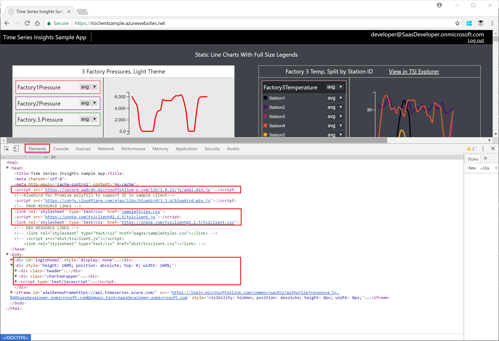

---
title: Explore the Time Series Insights JavaScript client library
description: Learn about the Time Series Insights JavaScript client library and related programming model.
documentationcenter: ''
services: time-series-insights
author: BryanLa
manager: timlt
editor: ''
tags: 

ms.assetid: 
ms.service: time-series-insights
ms.workload: na
ms.tgt_pltfrm: 
ms.devlang: na
ms.topic: tutorial
ms.date: 05/09/2018
ms.author: bryanla
# Customer intent: As a developer, I want learn about the TSI JavaScript client library, so I can use the APIs in my own applications.
---

# Tutorial: Explore the Time Series Insights JavaScript client library

This tutorial guides you through an exploration of the Time Series Insights (TSI) JavaScript client library, and the related programming model. The topics discussed provide you with opportunities to experiment, gain a deeper understanding of how to access TSI data, and use chart controls to render and visualize data. The goal is to provide you with enough details, that you can use the library in your own web application.

In this tutorial, you learn about:

> [!div class="checklist"]
> * The TSI Sample application 
> * 2
> * 3
> * 4

<!-->
[!INCLUDE [cloud-shell-powershell.md](../../../includes/cloud-shell-powershell.md)]

If you choose to install and use the PowerShell locally, this tutorial requires the Azure PowerShell module version 5.3 or later. Run `Get-Module -ListAvailable AzureRM` to find the version. If you need to upgrade, see [Install Azure PowerShell module](/powershell/azure/install-azurerm-ps). If you are running PowerShell locally, you also need to run `Connect-AzureRmAccount` to create a connection with Azure. 
-->

## Prerequisites

<!--
If you don't have an Azure subscription, create a [free account](https://azure.microsoft.com/free/) before you begin.
-->
This tutorial makes heavy use of the "Developer Tools" feature (also known as DevTools or F12), found in most browsers such as [Edge](/microsoft-edge/devtools-guide), [Chrome](https://developers.google.com/web/tools/chrome-devtools/), [FireFox](https://developer.mozilla.org/en-US/docs/Learn/Common_questions/What_are_browser_developer_tools), and other modern web browsers. If you're not already familiar, you may want to explore this feature in your browser before continuing. 

## TSI sample application

Throughout this tutorial, you use a Time Series Insights sample application to explore the TSI JavaScript library. The sample application is a Single-Page web Application (SPA), which showcases the use of the library for querying and visualizing data from a sample TSI environment. 

1. Navigate to the [Time Series Insights sample application](https://tsiclientsample.azurewebsites.net/)
   

2. Click the "Log in" button. You can use either an enterprise/organization account (Azure Active Directory) or a personal account (Microsoft Account, or MSA). The first time you use the application with a given account, you are prompted to give your consent to the application. Consent allows the application to sign in under your account, and access the TSI APIs to retrieve data on your behalf.  
   

3. After successful sign-in, you should see a page similar to the following, containing several styles of charts, populated with TSI data:
   

### Page source and structure

Now let's view the source code behind the page that rendered in your browser as the TSI sample application. You won't walk through everything, but you'll learn about the major sections of the code, giving you sense of what the page is doing:

1. Open "Developer Tools" in your browser, and inspect the elements that make up the current page, also known as the HTML or DOM tree:

   

2. You can see in the image above that the page contains, among many other things, the following major sections:
   - The \<head\> element, which pulls in additional files to assist in the functioning of the page:
     - Azure Active Directory Authentication Library (`adal.min.js`) - also known as ADAL, this is a JavaScript library that provides OAuth 2.0 authentication (sign-in) and token acquisition for accessing APIs.
     - Additional style sheets (`sampleStyles.css`, `tsiclient.css`) - also known as CSS, these are used to control page styling details, such as colors, fonts, spacing, etc.
     - TSI Client library (`tsiclient.js`) - this is the TSI JavaScript library. used by the page to call TSI APIs and render chart controls on the page.
   - The \<div\> section that contains the Log In dialog (`id="loginModal"`)
   - The \<div\> section that contains the header row, used for status messages and sign-in information (`class="header"`)
   - The \<div\> section that contains the rendering of the chart controls (`class="chartsWrapper"`)
   - The \<script\> section which contains all of the JavaScript used to control the page.

### TSI JavaScript library

Fundamentally, the library provides an abstraction for two important categories :
- wrappers for calling the TSI environment REST APIs to query data
- several types of charting controls used for rendering data in a web page

As you explore more of the source code below, and walk through specific examples, you will see the programming model and API patterns take shape.

## Explore pie, line, and bar charts

First, lets look at some of the standard chart controls as demonstrated in the TSI Client Sample application. 

1.   

Go through the steps from the video.

## Explore states and events

Go through teh steps from the video.

## Next steps

In this tutorial, you learned how to:

> [!div class="checklist"]
> * 1
> * 2
> * 3
> * 4

As discussed, the TSI Sample application uses a demo data set. To learn more about how you can create your own TSI environment and data set, advance to the next article below.

> [!div class="nextstepaction"]
> [Plan your Azure Time Series Insights environment](time-series-insights-environment-planning.md)

