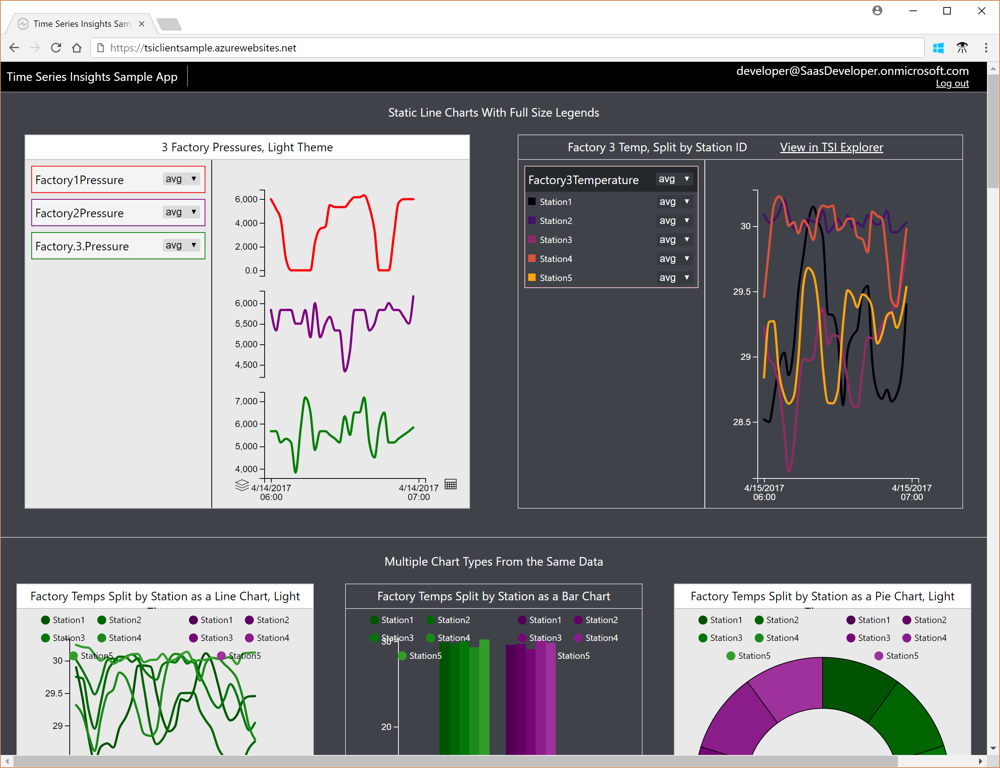

---
title: Explore the Time Series Insights JavaScript controls and programming model
description: Learn about the Time Series Insights JavaScript controls and related programming model.
documentationcenter: ''
services: time-series-insights
author: BryanLa
manager: timlt
editor: ''
tags: 

ms.assetid: 
ms.service: time-series-insights
ms.workload: na
ms.tgt_pltfrm: 
ms.devlang: na
ms.topic: tutorial
ms.date: 05/09/2018
ms.author: bryanla
# Customer intent: As a developer, I want learn about the TSI JavaScript controls, so I can use them in my own apps.
---

# Tutorial: Explore the Time Series Insights JavaScript controls and programming model

This tutorial will guide you through an exploration of the Time Series Insights (TSI) JavaScript controls, and the related programming model. The topics discussed will provide you with a opportunities to experiment, and gain a deeper understanding of how the controls are used to render and visualize TSI data. The goal is to provide you with enough details, that you can use the controls in your own web application.

In this tutorial, you learn about:

> [!div class="checklist"]
> * The TSI Sample application 
> * 2
> * 3
> * 4

<!-->
[!INCLUDE [cloud-shell-powershell.md](../../../includes/cloud-shell-powershell.md)]

If you choose to install and use the PowerShell locally, this tutorial requires the Azure PowerShell module version 5.3 or later. Run `Get-Module -ListAvailable AzureRM` to find the version. If you need to upgrade, see [Install Azure PowerShell module](/powershell/azure/install-azurerm-ps). If you are running PowerShell locally, you also need to run `Connect-AzureRmAccount` to create a connection with Azure. 
-->

## Prerequisites

If you don't have an Azure subscription, create a [free account](https://azure.microsoft.com/free/) before you begin.

This tutorial will also make heavy use of the "Developer Tools" feature (also known as F12 or DevTools), found in most web browsers such as [Edge](/microsoft-edge/devtools-guide), [Chrome](https://developers.google.com/web/tools/chrome-devtools/), [FireFox](https://developer.mozilla.org/en-US/docs/Learn/Common_questions/What_are_browser_developer_tools), and other modern browsers. If you're not already familiar, you may want to explore this feature in your browser before continuing. 

## TSI sample application overview

Talk about the structure of the HTML downloaded from the SPA web app. Talk about the fact that it uses a couple of additional CSS files for styling, uses DIVs for formatting/placement, and uses TSClient.js library to make API calls and render UX/controls.

## Exploring the pie, line, and bar charts

Go through the steps from the video.

## Exploring states and events

Go through teh steps from the video.

## Next steps

In this tutorial, you learned how to:

> [!div class="checklist"]
> * 1
> * 2
> * 3
> * 4

As discussed, the TSI Sample application uses a demo data set. To learn more about how you can create your own TSI environment and data set, advance to the next article below.

> [!div class="nextstepaction"]
> [Plan your Azure Time Series Insights environment](time-series-insights-environment-planning.md)

