# Tutorial: Create an Azure Time Series Insights environment

This tutorial guides you through the process of creating an Azure Time Series Insights environment that's populated with data from simulated devices. In this tutorial, you learn how to:

> [!div class="checklist"]
> * Create a Time Series Insights environment.
> * Create a device simulation solution that contains an IoT hub.
> * Connect the Time Series Insights environment to the IoT hub.
> * Run a device simulation to stream data into the Time Series Insights environment.
> * Verify the simulated telemetry data.

## Video

### Learn how to use an Azure IoT solution accelerator to generate data and get started with Time Series Insights.  

> [!VIDEO https://www.youtube.com/embed/6ehNf6AJkFo]

## Prerequisites

* If you don’t have an Azure subscription, create a [free account](https://azure.microsoft.com/free/).
* Your Azure sign-in account also must be a member of the subscription's **Owner** role. For more information, see [Manage access by using role-based access control and the Azure portal](/azure/role-based-access-control/role-assignments-portal).

## Overview

The Time Series Insights environment is where device data is collected and stored. Once stored, the [Azure Time Series Insights explorer](time-series-quickstart.md) and [Time Series Insights Query API](/rest/api/time-series-insights/ga-query-api) can be used to query and analyze the data.

Azure IoT Hub is the event source that's used by all devices (simulated or physical) in the tutorial to securely connect and transmit data to your Azure cloud.

This tutorial also uses an [IoT solution accelerator](https://www.azureiotsolutions.com) to generate and stream sample telemetry data to IoT Hub.

>[!TIP]
> [IoT solution accelerators](https://www.azureiotsolutions.com) provide enterprise-grade preconfigured solutions that you can use to accelerate the development of custom IoT solutions.

## Create a device simulation

First, create the device simulation solution, which generates test data to populate your Time Series Insights environment.

1. In a separate window or tab, go to [azureiotsolutions.com](https://www.azureiotsolutions.com). Sign in by using the same Azure subscription account, and select the **Device Simulation** accelerator.

   [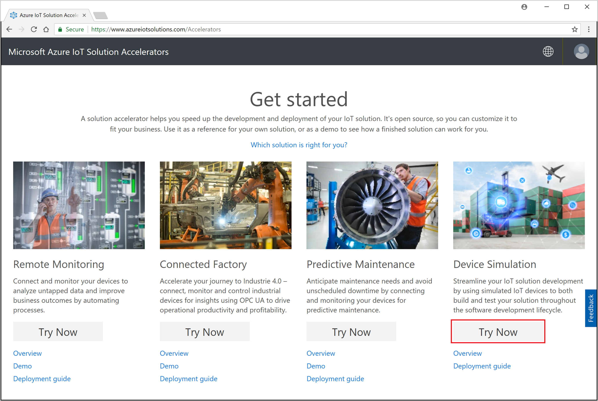](media/tutorial-create-populate-tsi-environment/sa-main.png#lightbox)

1. Enter the required parameters on the **Create Device Simulation solution** page.

   Parameter|Description
   ---|---
   **Deployment name** | This unique value is used to create a new resource group. The listed Azure resources are created and assigned to the resource group.
   **Azure subscription** | Specify the same subscription that was used to create your Time Series Insights environment in the previous section.
   **Deployment options** | Select **Provision new IoT Hub** to create a new IoT hub specific to this tutorial.
   **Azure location** | Specify the same region that was used to create your Time Series Insights environment in the previous section.

   When you're finished, select **Create solution** to provision the solution's Azure resources. It may take up to 20 minutes to complete this process.

   

1. After provisioning has finished, the text above your new solution changes from **Provisioning** to **Ready**.

   >[!IMPORTANT]
   > Don't select **Launch** yet! Keep this web page open because you'll return to it later.

   [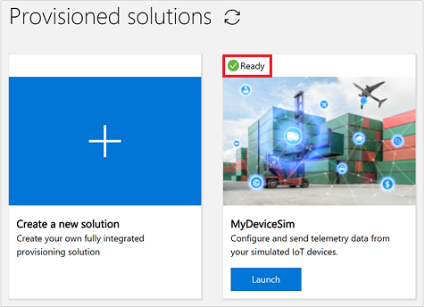](media/tutorial-create-populate-tsi-environment/sa-create-device-sim-solution-dashboard-ready.png#lightbox)

1. Now, inspect the newly created resources in the Azure portal. On the **Resource groups** page, notice that a new resource group was created by using the **Solution name** provided in the last step. Make note of the resources that were created for the device simulation.

   [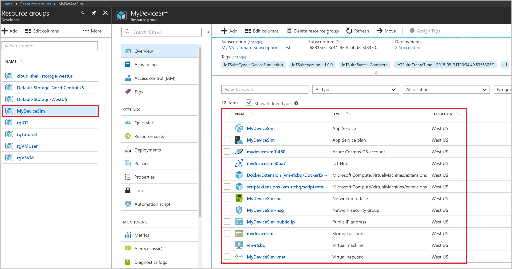](media/tutorial-create-populate-tsi-environment/ap-device-sim-solution-resources.png#lightbox)

## Create an environment

Second, create a Time Series Insights environment in your Azure subscription.

1. Sign in to the [Azure portal](https://portal.azure.com) by using your Azure subscription account. 
1. Select **+ Create a resource** in the upper left. 
1. Select the **Internet of Things** category, and then select **Time Series Insights**. 

   [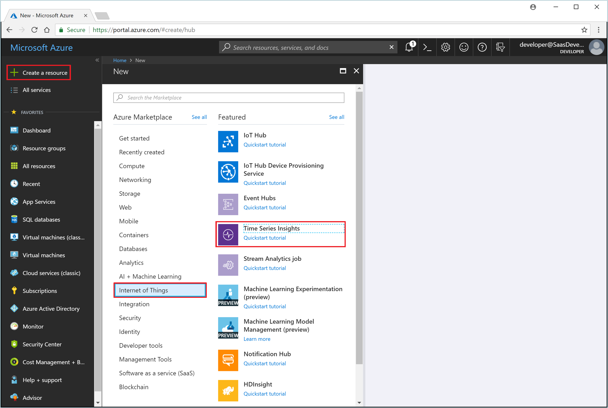](media/tutorial-create-populate-tsi-environment/ap-create-resource-tsi.png#lightbox)

1. On the **Time Series Insights environment** page, fill in the required parameters.

   Parameter|Description
   ---|---
   **Environment name** | Choose a unique name for the Time Series Insights environment. The names are used by the Time Series Insights explorer and the [Query APIs](https://docs.microsoft.com/rest/api/time-series-insights/ga-query).
   **Subscription** | Subscriptions are containers for Azure resources. Choose a subscription to create the Time Series Insights environment.
   **Resource group** | A resource group is a container for Azure resources. Choose an existing resource group or create a new one for the Time Series Insights environment resource.
   **Location** | Choose a data center region for your Time Series Insights environment. To avoid additional latency, create the Time Series Insights environment in the same region as other IoT resources.
   **Tier** | Choose the throughput needed. Select **S1**.
   **Capacity** | Capacity is the multiplier applied to the ingress rate and storage capacity associated with the selected SKU. You can change the capacity after creation. Select a capacity of **1**.

   When finished, select **Review + create** to proceed to the next step.

   [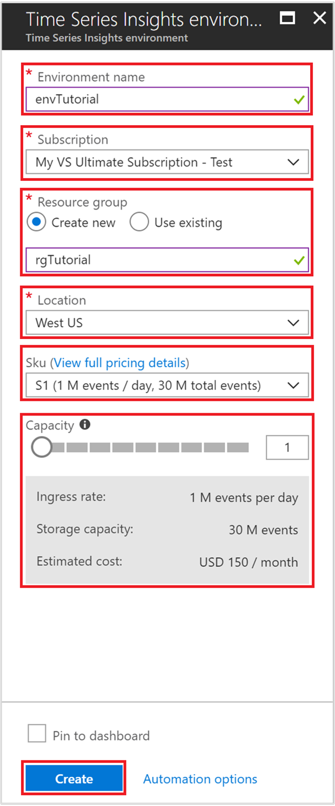](media/tutorial-create-populate-tsi-environment/ap-create-resource-tsi-params.png#lightbox)

1. Now, connect the Time Series Insights environment to the IoT hub created by the Solution Accelerator. Set **Select a hub** to `Select existing`. Then, choose the IoT hub created by the Solution Accelerator when setting **IoT Hub name**.

   [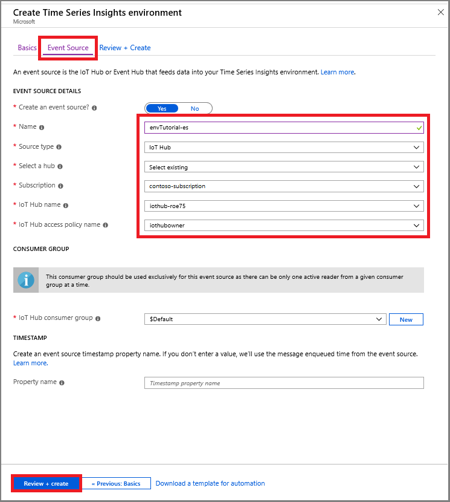](media/tutorial-create-populate-tsi-environment/ap-create-resource-iot-hub.png#lightbox)

1. Check the **Notifications** panel to monitor deployment completion. 

   [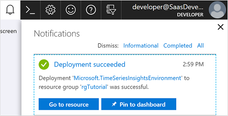](media/tutorial-create-populate-tsi-environment/ap-create-resource-tsi-deployment-succeeded.png#lightbox)

## Run device simulation to stream data

Now that the deployment and initial configuration's complete, populate the Time Series Insights environment with sample data from [simulated devices created by the accelerator](#create-a-device-simulation).

Along with the IoT hub, an Azure App Service web application was generated to create and transmit simulated device telemetry.

1. Go back to your [Solution accelerators dashboard](https://www.azureiotsolutions.com/Accelerators#dashboard). Sign in again, if necessary, by using the same Azure account you've been using in this tutorial. Now you can select **Launch** under your "Device Simulation" solution.

     [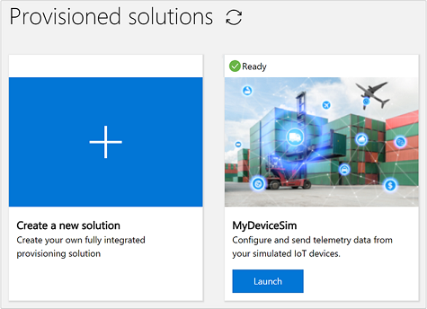](media/tutorial-create-populate-tsi-environment/sa-create-device-sim-solution-dashboard.png#lightbox)

1. The device simulation web app begins by prompting you to grant the web application the "Sign you in and read your profile" permission. This permission allows the application to retrieve the user profile information necessary to support the functioning of the application.

     [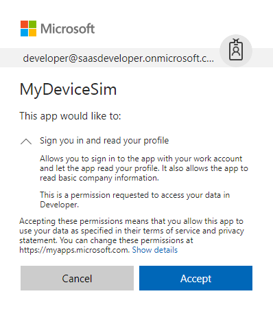](media/tutorial-create-populate-tsi-environment/sawa-signin-consent.png#lightbox)

1. After the **Simulation setup** page loads, enter the required parameters.

   Parameter|Description
   ---|---
   **Target IoT Hub** | Select **Use pre-provisioned IoT Hub**.
   **Device model** | Select **Chiller**.
   **Number of devices**  | Enter `1000` under **Amount**.
   **Telemetry frequency** | Enter `10` seconds.
   **Simulation duration** | Select **End in:** and enter `5` minutes.

   When you're finished, select **Start Simulation**. The simulation runs for a total of 5 minutes. It generates data from 1,000 simulated devices every 10 seconds. 

   [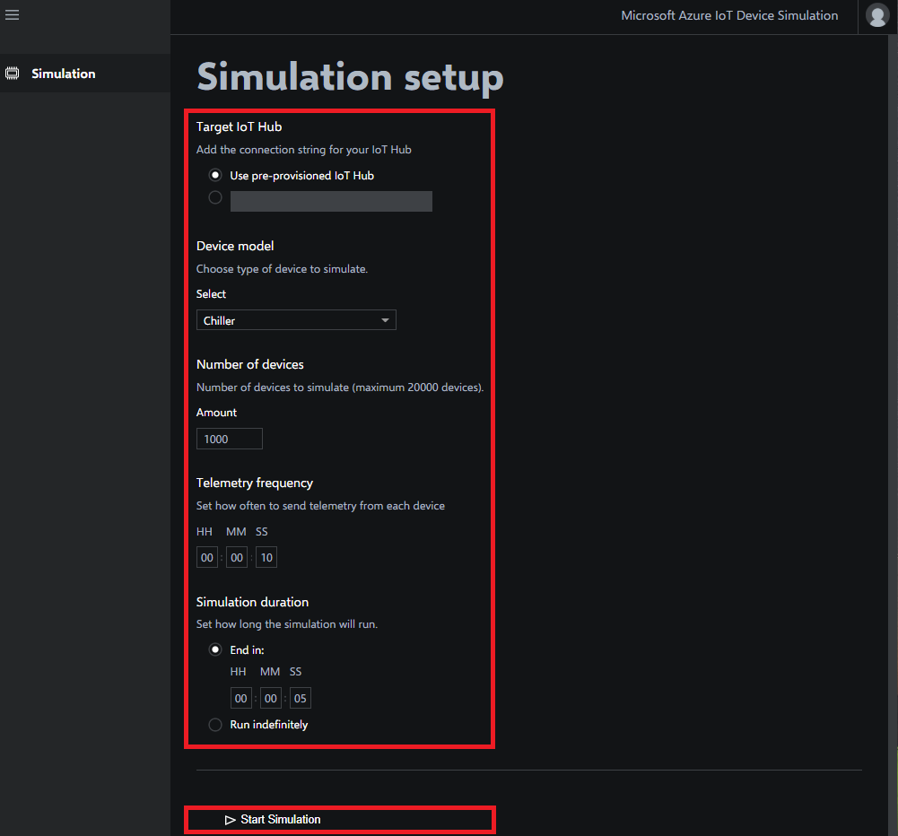](media/tutorial-create-populate-tsi-environment/sawa-simulation-setup.png#lightbox)

1. While the simulation runs, notice that the **Total messages** and **Messages per second** fields update, approximately every 10 seconds. The simulation ends after approximately 5 minutes and returns you to **Simulation setup**.

   [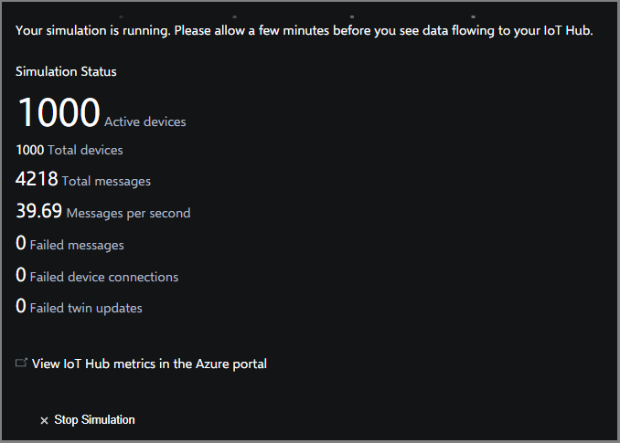](media/tutorial-create-populate-tsi-environment/sawa-simulation-running.png#lightbox)

## Verify the telemetry data

In this final section, you verify that the telemetry data was generated and stored in the Time Series Insights environment. To verify the data, you use the Time Series Insights explorer, which is used to query and analyze telemetry data.

1. Return to the Time Series Insights environment's resource group **Overview** page. Select the Time Series Insights environment.

   [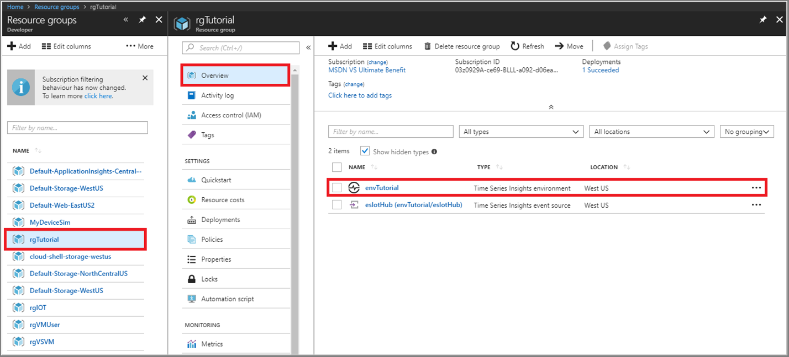](media/tutorial-create-populate-tsi-environment/ap-view-tsi-env-rg.png#lightbox)

1. On the Time Series Insights environment **Overview** page, select the **Time Series Insights explorer URL** to open the Time Series Insights explorer.

   [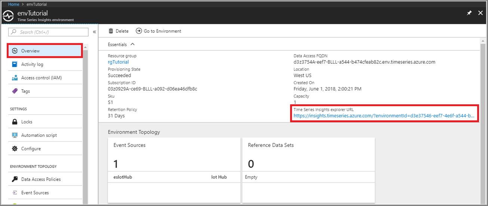](media/tutorial-create-populate-tsi-environment/ap-view-tsi-env-explorer-url.png#lightbox)

1. The Time Series Insights explorer loads and authenticates by using your Azure portal account. Upon initial view, you can see in the chart area that the Time Series Insights environment was populated with simulated telemetry data. To filter a narrower range of time, select the drop-down in the upper-left corner. Enter a time range large enough to span the duration of the device simulation. Then select the search magnifying glass.

   [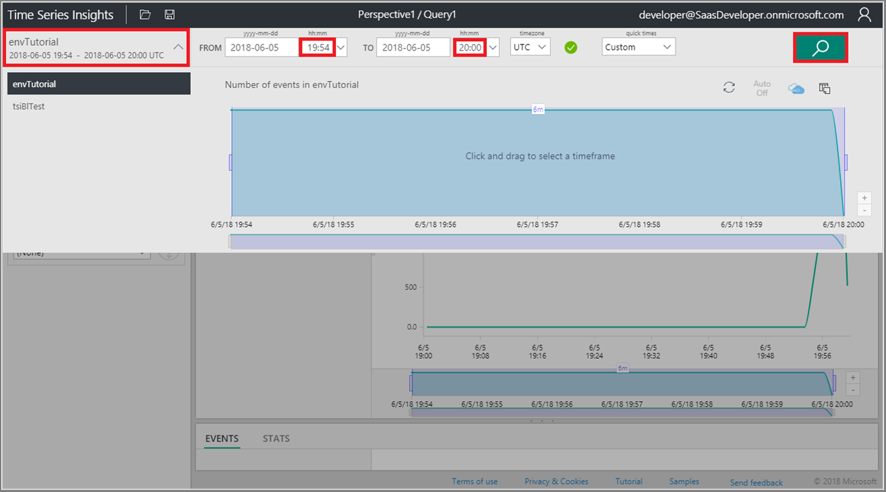](media/tutorial-create-populate-tsi-environment/tsie-filter-time-range.png#lightbox)

1. Narrowing the time range allows the chart to zoom in to the distinct bursts of data transfer to the IoT hub and the Time Series Insights environment. Also notice the **Streaming complete** text in the upper-right corner, which shows the total number of events found. You can also drag the **Interval size** slider to control the plot granularity on the chart.

   [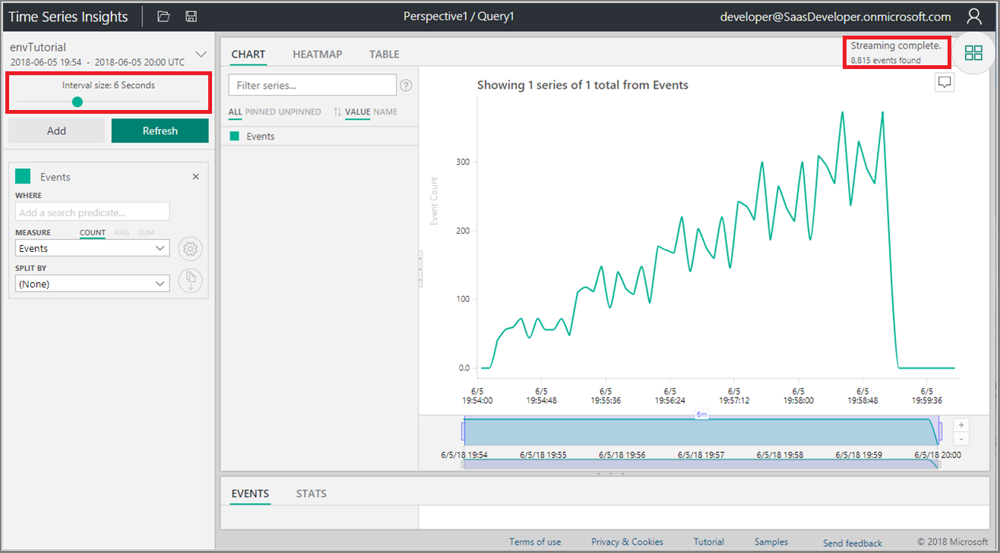](media/tutorial-create-populate-tsi-environment/tsie-view-time-range.png#lightbox)

1. Lastly, you can also left-click a region to filter a range. Then right-click and use **Explore events** to show event details in the tabular **Events** view.

   

## Clean up resources

This tutorial creates several running Azure services to support the Time Series Insights environment and device simulation solution. To remove them, navigate back to the Azure portal.

From the menu on the left in the Azure portal:

1. Select the **Resource groups** icon. Then select the resource group you created for the Time Series Insights environment. At the top of the page, select **Delete resource group**, enter the name of the resource group, and select **Delete**.

1. Select the **Resource groups** icon. Then select the resource group that was created by the device simulation solution accelerator. At the top of the page, select **Delete resource group**, enter the name of the resource group, and select **Delete**.

## Next steps

In this tutorial, you learned how to:

> [!div class="checklist"]
> * Create a Time Series Insights environment.
> * Create a device simulation solution that contains an IoT hub.
> * Connect the Time Series Insights environment to the IoT hub.
> * Run a device simulation to stream data into the Time Series Insights environment.
> * Verify the simulated telemetry data.

Now that you know how to create your own Time Series Insights environment, learn how to build a web application that consumes data from a Time Series Insights environment:

> [!div class="nextstepaction"]
> [Create an Azure Time Series Insights single-page web app](tutorial-create-tsi-sample-spa.md)
