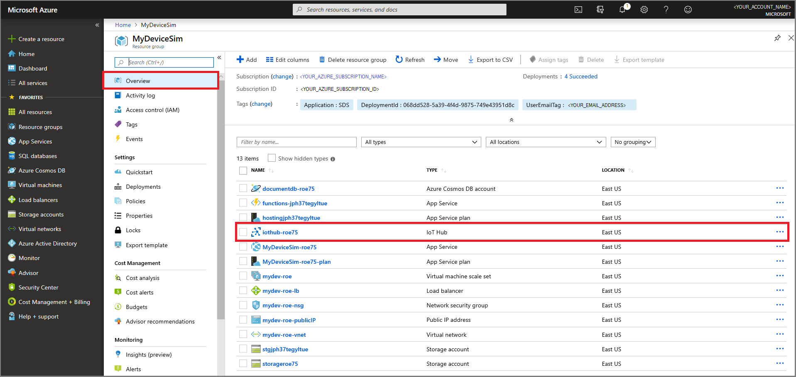
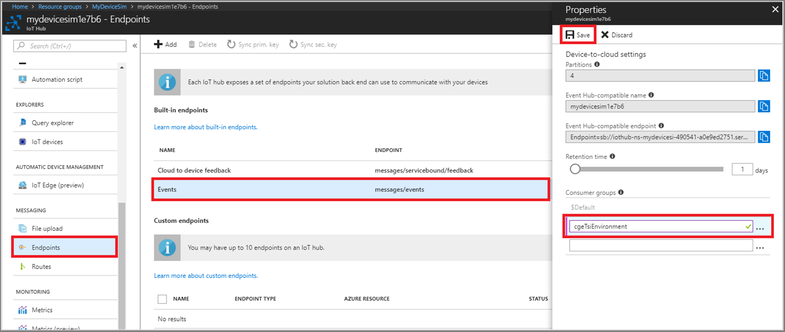
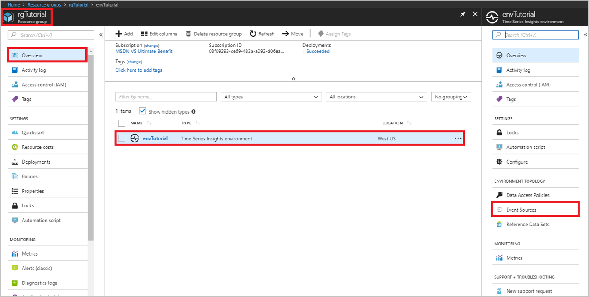
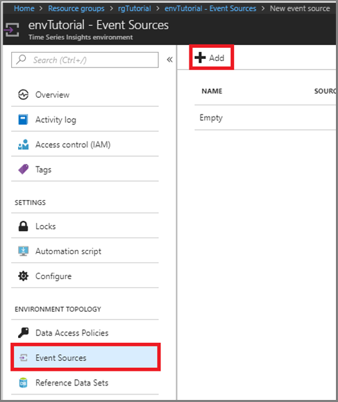
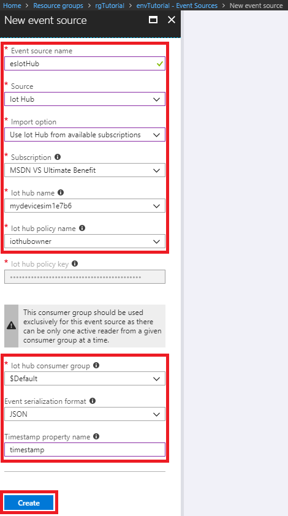

# Tutorial: Create an Azure Time Series Insights environment

This tutorial will guide you through the process of creating a Time Series Insight environment, populated with data from simulated devices. In this tutorial, you learn how to:

> [!div class="checklist"]
> * Create a Time Series Insights environment 
> * Create a device simulation solution containing an IoT Hub
> * Connect the Time Series Insights environment to the IoT hub
> * Run a device simulation to stream data into the Time Series Insights environment
> * Verify the simulated telemetry data

## Video

### Learn how to use an Azure IoT Solution Accelerator to generate data and get started with Time Series Insights.  

> [!VIDEO https://www.youtube.com/embed/6ehNf6AJkFo]

## Prerequisites

* If you don’t have an Azure subscription, create a [free account](https://azure.microsoft.com/free/).

* Your Azure sign-in account also needs to be a member of the subscription's **Owner** role. See [Manage access using RBAC and the Azure portal](/azure/role-based-access-control/role-assignments-portal) for more details.

## Overview

The Time Series Insights environment is where device data is collected and stored. Once stored in the Time Series Insights environment, the [Time Series Insights Explorer](time-series-quickstart.md) and [Time Series Insights Query API](/rest/api/time-series-insights/ga-query-api) can be used to query and analyze the data. IoT Hub is the connection point used by all devices (simulated or physical) to securely connect and transmit data to the Azure cloud. The [Time Series Insights Overview](time-series-insights-overview.md) notes that Azure IoT Hub also serves as an event source for streaming data into a Time Series Insights environment. This tutorial uses an [IoT solution accelerator](/azure/iot-accelerators/) to generate and stream sample telemetry data to IoT Hub.

>[!TIP]
> IoT solution accelerators provide enterprise-grade preconfigured solutions that enable you to accelerate the development of custom IoT solutions.

## Create an environment

First, create a Time Series Insights environment in your Azure subscription:

1. Sign in to the [Azure portal](https://portal.azure.com) using your Azure subscription account.  
1. Select **+ Create a resource** in the upper left.  
1. Select the **Internet of Things** category, then select **Time Series Insights**.  

   

1. On the **Time Series Insights environment** page, fill in the required parameters:

   Parameter|Description
   ---|---
   **Environment name** | Choose a unique name for the Time Series Insights environment. The name's used by Time Series Insights Explorer and  Query APIs.
   **Subscription** | Subscriptions are containers for Azure resources. Choose a subscription to create the Time Series Insights environment for.
   **Resource group** | A resource group is a container for Azure resources. Choose an existing resource group or create a new one for the Time Series Insights environment resource.
   **Location** | Choose a data center region for your Time Series Insights environment. To avoid added bandwidth costs and latency, it's best to keep the Time Series Insights environment in the same region as other IoT resources.
   **Pricing SKU** | Choose the throughput needed. For lowest cost and starter capacity, select `S1`.
   **Capacity** | Capacity is the multiplier applied to the ingress rate, storage capacity, and cost associated with the selected SKU.  You can change the capacity after creation. For the lowest cost, select a capacity of 1.

   When finished, click **Create** to begin the provisioning process.

   

1. Check the **Notifications** panel to monitor deployment completion.  

   

## Create a device simulation

Next, create the device simulation solution, which will generate test data to populate your Time Series Insights environment:

1. In a separate window/tab, go to [azureiotsolutions.com](https://www.azureiotsolutions.com). Sign in using the same Azure subscription account and select the **Device Simulation** accelerator.

   

1. Enter the required parameters on the **Create Device Simulation solution** page.

   Parameter|Description
   ---|---
   **Solution name** | A unique value, used for creation of a new resource group. The listed Azure resources are created and assigned to the resource group.
   **Subscription** | Specify the same subscription used for creation of your Time Series Insights environment, in the previous section.
   **Region** | Specify the same region used for creation of your Time Series Insights environment, in the previous section.
   **Deploy optional Azure Resources** | Leave **IoT Hub** checked, as the simulated devices will use it to connect/stream data.

   When finished, click **Create solution** to provision the solution's Azure resources. It may take 6-7 minutes to complete this process.

   

1. Once provisioning has finished, the text above your new solution will change from **Provisioning...** to **Ready**:

   >[!IMPORTANT]
   > Don't click the **Launch** button yet! But keep this web page open as you will return to it later.

   

1. Now go back to the Azure portal and inspect the newly created resources in your subscription. In the portal **Resource groups** page, you'll notice a new resource group was created using the **Solution name** provided in the last step. Also notice all of the resources created to support the device simulation solution:

   

## Connect the environment to the IoT hub

At this point, you've learned how to create two sets of resources, each in their own resource group:

- An empty Time Series Insights environment.
- Device simulation solution resources, including an IoT hub, generated by a solution accelerator.

Recall that the simulated devices need to connect to an IoT hub to stream device data. To flow the data into the Time Series Insights environment, you need to make configuration changes to both your IoT hub and Time Series Insights environment.

### IoT hub configuration: define a consumer group

IoT hub provides various endpoints to share functionality to other actors. The "Events" endpoint provides a way for other applications to consume data, as it's streamed to an IoT hub instance. Specifically, "consumer groups" provide a mechanism for applications to listen and pull data from the IoT Hub.

Next you define a new **consumer group** property, on the device simulation solution's IoT hub **Events endpoint**.

1. In the Azure portal, go to the **Overview** page of the resource group you created for the device simulation solution, then select the IoT Hub resource:

   

   Also make note of the **Name** of the IoT Hub resource generated for the solution, as you'll refer to it later.

1. Scroll down and select the **Endpoints** page, then select the **Events** endpoint. On the endpoint **Properties** page, enter a unique name for your endpoint under the "$Default" consumer group, then click **Save**:

   

### Environment configuration: define an event source

Now connect the new IoT hub **consumer group** event endpoint, to the Time Series Insights environment, as an **event source**.

1. Go to the **Overview** page of the resource group you created for the Time Series Insights environment, then select the Time Series Insights environment:

   

1. On the Time Series Insights environment page, select **Event Sources**, then click **+ Add**.

   

1. Enter the required parameters on the **New event source** page.

   Parameter|Description
   ---|---
   **Event source name** | Requires a unique value, which is used to name the event source.
   **Source** | Select **IoT Hub**.
   **Import option** | Select the default `Use IoT hub from available subscriptions`. This option will cause the next drop-down list to be populated with the available subscriptions.
   **Subscription** | Select the same subscription in which you created the Time Series Insights environment and Device Simulation resources.
   **Iot hub name** | Should be defaulted to the name of the IoT hub that you noted earlier. If not, select the correct IoT hub.
   **Iot hub policy name** | Select **iothubowner**.
   **Iot hub consumer group** | Should be defaulted to the name of the IoT hub consumer group you created earlier. If not, select the correct consumer group name.
   **Event serialization format** | Leave as the defaulted value of `JSON`.
   **Timestamp property name** | Specify as `timestamp`.

   When finished, click **Create** to add the event source. When you return to the resource group **Overview** page, along with your Time Series Insights environment resource, you see a new "Time Series Insights event source" resource.

   

## Run device simulation to stream data

Now that all of the configuration work is complete, it's time to populate the Time Series Insights environment with sample data from the simulated devices.

You may recall from the [Create a device simulation section](#create-a-device-simulation), several Azure resources were created by the accelerator to support the solution. Along with the IoT hub discussed previously, an Azure App Service web application was generated to create and transmit simulated device telemetry.

1. Go back to your [Solution accelerators dashboard](https://www.azureiotsolutions.com/Accelerators#dashboard). Sign in again if necessary, using the same Azure account you've been using in this tutorial. Now you can click the **Launch** button under your "Device Simulation" solution.

     

1. The device simulation web app will start at this point, and may take several seconds upon initial load. You're also prompted for consent, to grant the web application the "Sign you in and read your profile" permission. This permission allows the application to retrieve the user profile information necessary to support the functioning of the application.

     

1. Once the **Simulation setup** page loads, enter the required parameters.

   Parameter|Description
   ---|---
   **Target IoT Hub** | Select **Use pre-provisioned IoT Hub**.
   **Device model** | Select **Chiller**.
   **Number of devices**  | Enter `1000` under **Amount**.
   **Telemetry frequency** | Enter `10` seconds.
   **Simulation duration** | Select **End in:** and enter `5` minutes.

   When finished, click **Start Simulation**. The simulation will run for a total of 5 minutes, generating data from 1000 simulated devices, every 10 seconds.  

   

1. While the simulation runs, you'll notice the **Total messages** and **Messages per second** fields update, approximately every 10 seconds. The simulation will end after approximately 5 minutes, and return you to **Simulation setup**.

   

## Verify the telemetry data

In this final section, you verify that the telemetry data was generated and stored in the Time Series Insights environment. To verify the data, you use the Time Series Insights explorer, which is used to query and analyze telemetry data.

1. Return to the Time Series Insights environment's resource group **Overview** page. Select the Time Series Insights environment.

   

1. On the Time Series Insights environment **Overview** page, click the **Time Series Insights explorer URL** to open the Time Series Insights explorer.

   

1. Time Series Insights explorer will load and authenticate using your Azure portal account. Upon initial view, you can see in the chart area that the Time Series Insights environment was indeed populated with simulated telemetry data. To filter a narrower range of time, select the drop-down in the upper left. Then enter a time range large enough to span the duration of the device simulation. Then click the search magnifying class.

   

1. Narrowing the time range allows the chart to zoom in to the distinct bursts of data transfer, to the IoT hub and Time Series Insights environment. Also notice the **Streaming complete** text in the upper right, which shows the total number of events found. You can also drag the **Interval size** slider to control the plot granularity on the chart.

   

1. Lastly, you can also left-click a region to filter a range, then right-click and use **Explore events** to show event details in the tabular **Events** view.

   

## Clean up resources

This tutorial creates several running Azure services, to support the Time Series Insights environment and device simulation solution. If you wish to abandon and/or delay completion of this tutorial series, we recommend deleting all resources to avoid incurring unnecessary costs.

From the left-hand menu in the Azure portal:

1. Click the **Resource groups** icon, then select the resource group you created for the Time Series Insights Environment. At the top of the page, click **Delete resource group**, enter the name of the resource group, then click **Delete**.

1. Click the **Resource groups** icon, then select the resource group that was created by the device simulation solution accelerator. At the top of the page, click **Delete resource group**, enter the name of the resource group, then click **Delete**

## Next steps

In this tutorial, you learned how to:

> [!div class="checklist"]
> * Create a Time Series Insights environment 
> * Create a device simulation solution containing an IoT Hub
> * Connect the Time Series Insights environment to the IoT hub
> * Run a device simulation to stream data into the Time Series Insights environment
> * Verify the simulated telemetry data

Now that you know how to create your own Time Series Insights environment, learn how to build a web application that consumes data from a Time Series Insights environment:

> [!div class="nextstepaction"]
> [Create an Azure Time Series Insights single-page web app](tutorial-create-tsi-sample-spa.md)
