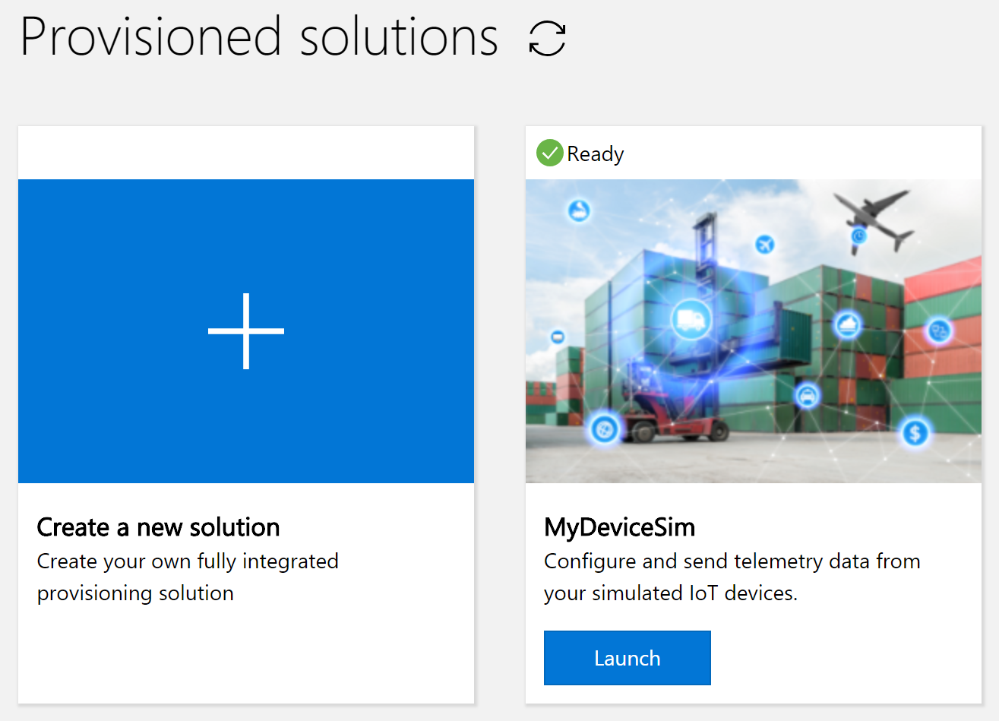

---
title: Create an Azure Time Series Insights environment
description: Learn how to create a Time Series Insights environment, populated with data from simulated devices.
author: BryanLa
ms.service: time-series-insights
ms.topic: tutorial
ms.date: 06/04/2018
ms.author: bryanla
# Customer intent: As a data analyst or developer, I want learn how to create a TSI environment, so I can use TSI queries to understand device behavior.
---

# Tutorial: Create an Azure Time Series Insights environment

This tutorial will guide you through the process of creating a Time Series Insight (TSI) environment, populated with data from simulated devices. In this tutorial, you learn how to:

> [!div class="checklist"]
> * Create a TSI environment 
> * Create a device simulation solution containing an IoT Hub
> * Connect the TSI environment to the IoT hub
> * Stream the simulated data into the IoT hub and TSI environment

## Prerequisites

If you don’t have an Azure subscription, create a [free account](https://azure.microsoft.com/en-us/free/) before you begin. 

Your Azure sign-in account also needs to be a member of the subscription's "Owner" role. For details, see [Add or change Azure subscription administrators](/azure/billing/billing-add-change-azure-subscription-administrator)

## Overview

The TSI environment is where device data is collected and stored. Once stored in the TSI environment, you can use the [TSI Explorer](time-series-quickstart.md) and [TSI Query API](/rest/api/time-series-insights/time-series-insights-reference-queryapi) to query and analyze the data.

Like all devices, simulated or physical, IoT Hub is the connection point used by devices to securely connect and transmit data to the cloud. As discussed in the [TSI Overview](time-series-insights-overview.md), IoT Hub also serves as an event source, for streaming data into the TSI environment. 

This tutorial also uses an [IoT solution accelerator](/azure/iot-accelerators/), to generate and stream sample data to IoT Hub. IoT solution accelerators provide enterprise-grade preconfigured solutions, that enable you to accelerate the development of custom IoT solutions. 

TODO: Diagram

## Create a TSI environment

First, create a TSI environment in your Azure subscription:

1. Sign in to the [Azure portal](https://portal.azure.com) using your Azure subscription account.  
2. Select **+ Create a resource** in the upper left.  
3. Select the **Internet of Things** category, then select **Time Series Insights**.  
   
   

4. On the **Time Series Insights environment** page, fill in the required parameters:
   
   Parameter|Description
   ---|---
   **Environment name** | Choose a unique name for the TSI environment. The name is used by TSI Explorer and the Query API.
   **Subscription** | Subscriptions contain Azure resources. Choose the subscription that will contain the TSI environment.
   **Resource group** | A resource group is a logical container for Azure resources. Choose an existing resource group, or create a new one, to contain the TSI environment resource.
   **Location** | Choose a data center region to contain your TSI environment. To avoid added bandwidth costs and  latency, it's best to keep the TSI environment in the same region as other IoT resources.
   **Pricing SKU** | Choose the throughput needed. For lowest cost and starter capacity, select S1.
   **Capacity** | Capacity is the multiplier applied to the ingress rate, storage capacity, and cost associated with the selected SKU.  You can change capacity of an environment after creation. For lowest cost, select a capacity of 1. 

   When finished, click **Create** to begin the provisioning process.

   

5. You can check the **Notifications** panel to monitor deployment completion, which should take about a minute:  

   

## Create a device simulation

Next, create the device simulation solution, which will generate test data to populate your TSI environment:

1. In a separate window/tab, go to https://www.azureiotsolutions.com, sign in using your Azure subscription account, and select the "Device Simulation" accelerator:

   

2. Enter the required parameters on the **Create Device Simulation solution** page:

   Parameter|Description
   ---|---
   **Solution name** | Requires a unique value, which is used for creation of a new resource group in your subscription. The new resource group will contain all of the Azure resources listed, which are required for the solution.
   **Subscription** | Specify the same subscription used for creation of your TSI environment, in the previous section.
   **Region** | Specify the same region used for creation of your TSI environment, in the previous section. 
   **Deploy optional Azure Resources** | Leave **IoT Hub** checked, as the simulated devices will use it to connect/stream data.

   When finished, click **Create Solution** to provision the solution, which will take a few minutes to complete. The new Azure resources will be created, in the resource group and subscription you specified.

   

3. Once provisioning has finished, the text above your new solution will change from "Provisioning..." to "Ready":

   >[!IMPORTANT]
   > Don't click the **Launch** button yet! But keep this web page open as you will return to it later.

   

4. Now go back to the Azure portal and inspect the newly created resources. You'll notice a new resource group has been created using the **Solution name** you provided in the last step. The resource group contains the resources created for the device simulation solution:

   

## Connect the TSI environment to the IoT hub event source

At this point, you've learned how to:
- create an empty TSI environment
- use the IoT device simulation solution accelerator, to create the supporting Azure resources, including an IoT hub

Recall that the simulated devices need to connect and stream device data to the IoT hub. To get the data to flow into the TSI environment, you need to first connect the environment to the IoT hub:

1. Using the Azure portal, go to the **Overview** page of the resource group you created for the device simulation solution, then select the IoT Hub resource:

   

   Also make note of the **Name** of the IoT Hub resource generated for the solution, as you will use it in the following steps.

2. Next you add a new "consumer group" to the IoT hub's built-in "Events" endpoint. Consumer groups allow applications to pull data from the IoT Hub. Scroll down and select the **Endpoints** page, then select the **Events** endpoint. On the **Properties** page, enter a unique name for your endpoint under the "$Default" consumer group, then click **Save**:

   

3. Now go to the **Overview** page of the resource group you created for the TSI environment, then select the TSI environment:

   

4. On the TSI environment page, select **Event Sources**, then click **+ Add**:

   

5. Enter the required parameters on the **New event source** page: 

   Parameter|Description
   ---|---
   **Name** | Requires a unique value, which is used to name the event source.
   **Source** | Select "IoT Hub."
   **Import option** | Use the defaulted "Use IoT hub from available subscriptions." This option will cause the next drop-down list to be populated with the available subscriptions.
   **Subscription** | Select the same subscription in which you created the TSI environment and Device Simulation resources.
   **Iot hub name** | Should be defaulted to the name of the IoT hub that you noted in step #1. If not, select the correct IoT hub.
   **Iot hub policy name** | Leave as the defaulted value of "iothubowner."
   **Iot hub consumer group** | Should be defaulted to the name of the IoT hub consumer group you created in step #2. If not, select the correct consumer group name. 
   **Event serialization format** | Leave as the defaulted value of "JSON."
   **Timestamp property name** | Specify as "timestamp."

   When finished, click **Create **.

   

## Stream the sample data to IoT hub and into the TSI environment

Now that all of the configuration work is complete, it's time to populate the TSI environment with sample data from the simulated devices.

1. Go back to your [Solution accelerators dashboard](https://www.azureiotsolutions.com/Accelerators#dashboard). Now you can click the **Launch** button under your "Device Simulation" solution:

     

2. 

## Clean up resources

If you plan to continue working through the next tutorial, do not clean up the resources created in this tutorial and proceed to [Next steps](#next-steps). If you do not plan to continue, use the following steps to delete all resources created by this Tutorial:  
- Close the device client sample output window on your machine.
- Close the TPM simulator window on your machine.
- From the left-hand menu in the Azure portal, click All resources and then select your Device Provisioning service. At the top of the All resources blade, click Delete. 
- From the left-hand menu in the Azure portal, click All resources and then select your IoT hub. At the top of the All resources blade, click Delete. 

-OR-

At this point, you might have the IoT Hub and TSI Environment services running in the portal. If you wish to abandon and/or delay completion of this tutorial series, we recommend shutting them down to avoid incurring unnecessary costs:

- From the left-hand menu in the Azure portal, click All resources and then select your Device Provisioning service. At the top of the All resources blade, click Delete. 
- From the left-hand menu in the Azure portal, click All resources and then select your IoT hub. At the top of the All resources blade, click Delete.

## Next steps

In this tutorial, you learned how to:

> [!div class="checklist"]
> * Sign in and explore the TSI Sample application and its source
> * Use APIs in the TSI JavaScript client library
> * Use JavaScript to create and populate chart controls with TSI data

Now that you know how to create your own TSI environment, learning more about the planning process by advancing to the following article:

> [!div class="nextstepaction"]
> [Plan your Azure Time Series Insights environment](time-series-insights-environment-planning.md)

