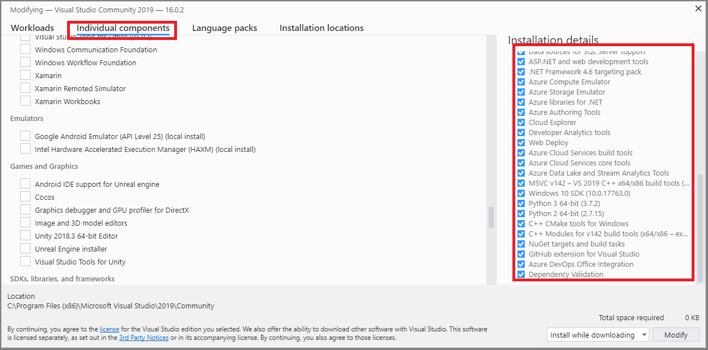
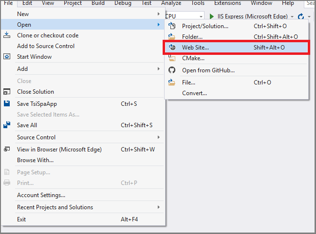
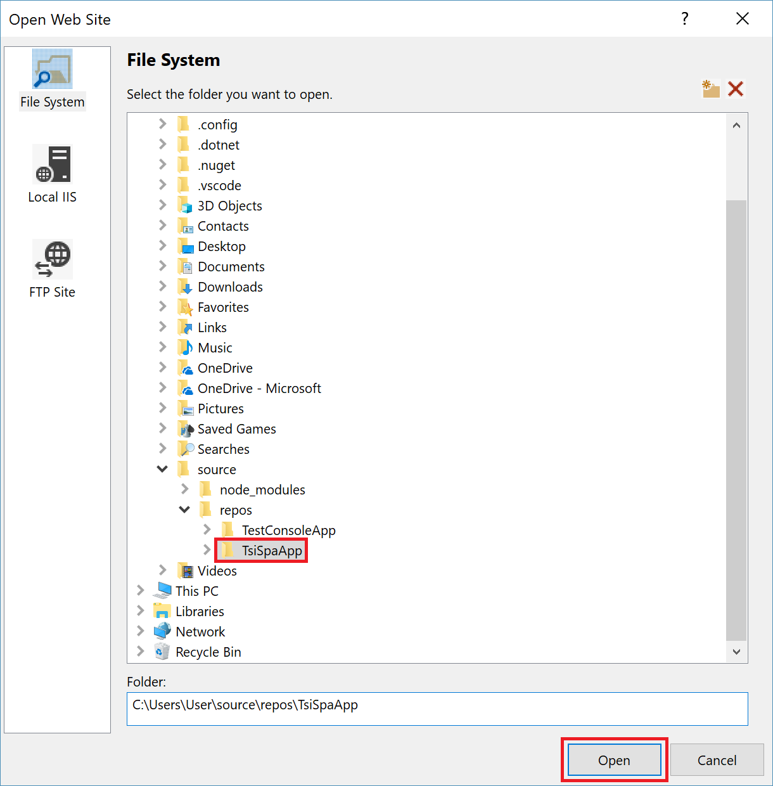
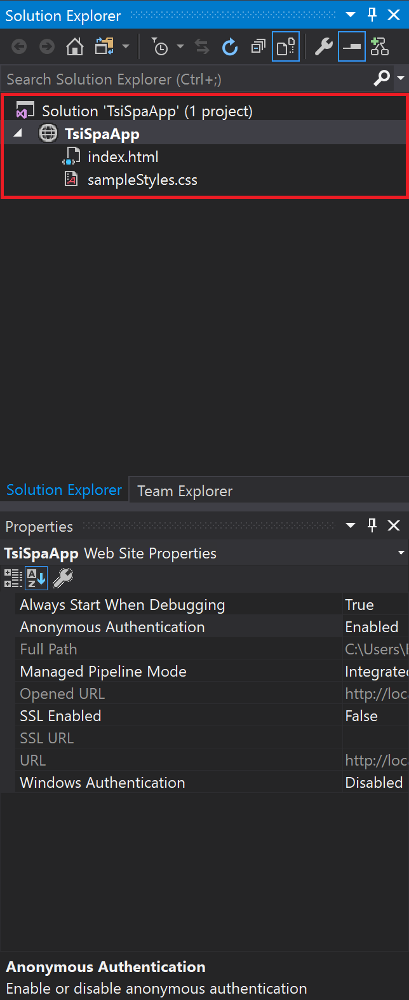
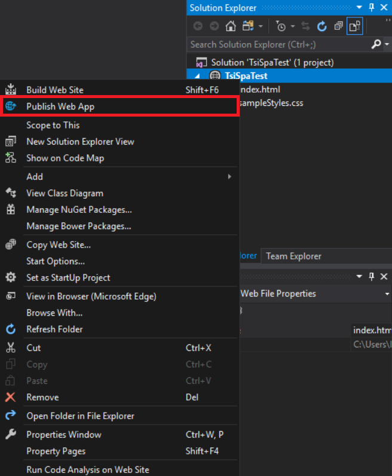
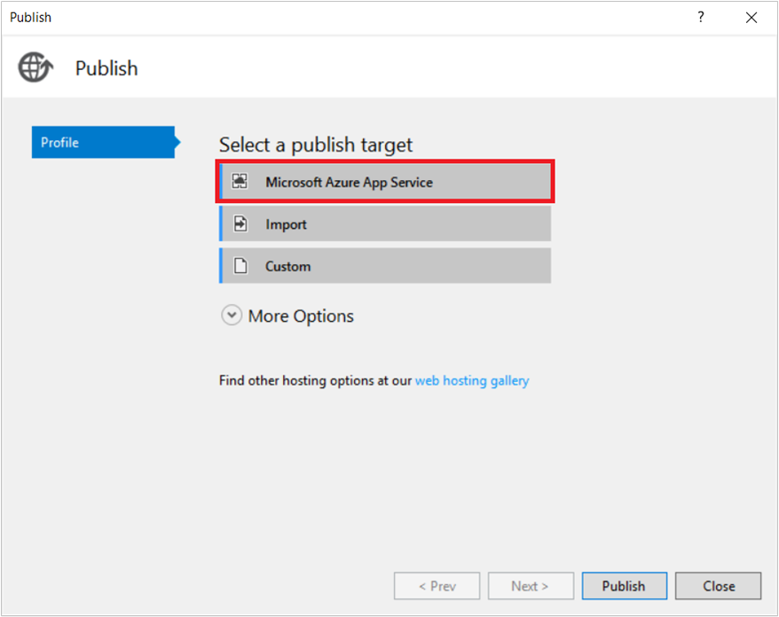
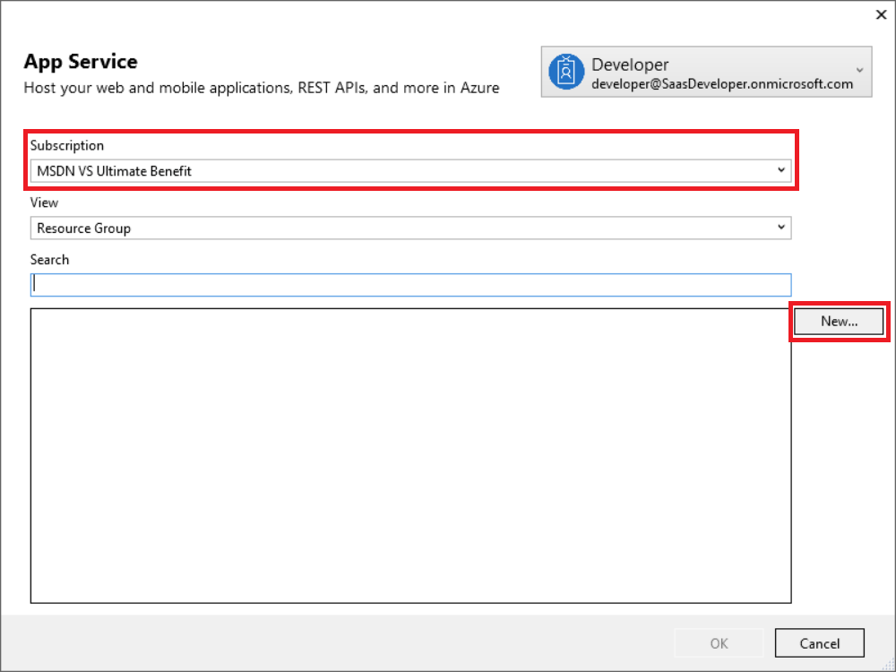
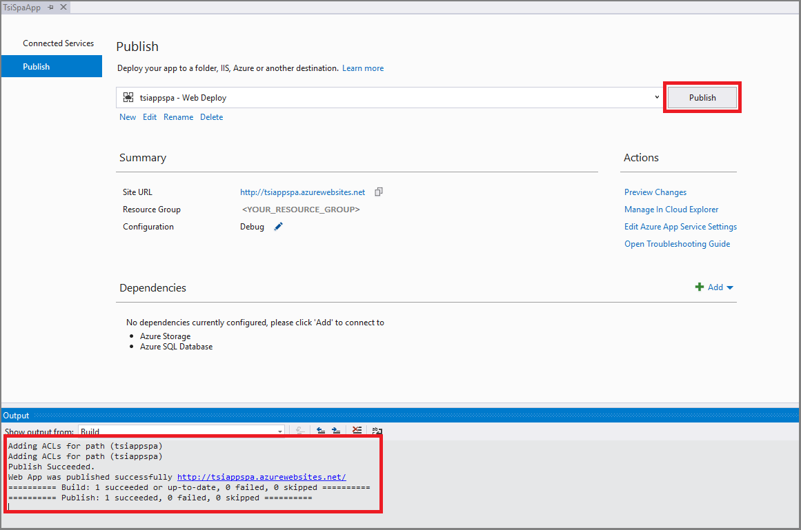

# Tutorial: Create an Azure Time Series Insights single-page web app

This tutorial guides you through the process of creating your own single-page web application (SPA) to access Azure Time Series Insights data.

In this tutorial, you'll learn about:

> [!div class="checklist"]
> * The application design
> * How to register your application with Azure Active Directory (Azure AD)
> * How to build, publish, and test your web application

> [!NOTE]
> * The source code for this tutorial is provided on [GitHub](https://github.com/Microsoft/tsiclient/tree/tutorial/pages/tutorial).
> * The Time Series Insights [client sample app](https://insights.timeseries.azure.com/clientsample) is hosted to show the completed app used in this tutorial.

## Prerequisites

* Sign up for a [free Azure subscription](https://azure.microsoft.com/free/) if you don't already have one.

* A free copy of Visual Studio. Download the [2017 or 2019 Community versions](https://www.visualstudio.com/downloads/) to get started.

* The IIS Express, Web Deploy, and Azure Cloud Services core tools components for Visual Studio. Add the components by modifying your Visual Studio installation.

## Application design

The Time Series Insights sample SPA is the basis for the design and code used in this tutorial. The code uses the Time Series Insights JavaScript client library. The Time Series Insights client library provides an abstraction for two main API categories:

- **Wrapper methods for calling the Time Series Insights query APIs**: REST APIs you can use to query for Time Series Insights data by using JSON-based expressions. The methods are organized under the TsiClient.server namespace of the library.

- **Methods for creating and populating several types of charting controls**: Methods you can use to visualize Time Series Insights data in a webpage. The methods are organized under the TsiClient.ux namespace of the library.

This tutorial also uses data from the sample application's Time Series Insights environment. For details about the structure of the Time Series Insights sample application and how it uses the Time Series Insights client library, see the tutorial [Explore the Azure Time Series Insights JavaScript client library](tutorial-explore-js-client-lib.md).

## Register the application with Azure AD

[!INCLUDE [Azure Active Directory app registration](../../includes/time-series-insights-aad-registration.md)]

## Build and publish the web application

1. Create a directory to store your application project files. Then, go to each of the following URLs. Right-click the **Raw** link in the upper-right corner of the page, and then select **Save as** to save the files in your project directory.

   - [*index.html*](https://github.com/Microsoft/tsiclient/blob/tutorial/pages/tutorial/index.html): the HTML and JavaScript for the page
   - [*sampleStyles.css*]( https://github.com/Microsoft/tsiclient/blob/tutorial/pages/tutorial/sampleStyles.css): the CSS style sheet

   > [!NOTE]
   > Depending on the browser, you might need to change the file extensions to .html or .css before you save the file.

1. Verify that the required components are installed in Visual Studio. The IIS Express, Web Deploy, and Azure Cloud Services core tools components for Visual Studio must be installed.

    [](media/tutorial-create-tsi-sample-spa/vs-installation.png#lightbox)

    > [!NOTE]
    > Your Visual Studio experience might vary slightly from the depicted examples depending on your version and configuration settings.

1. Open Visual Studio and sign in. To create a project for the web application, on the **File** menu, select **Open** > **Web Site**.

    [](media/tutorial-create-tsi-sample-spa/vs-solution-create.png#lightbox)

1. In the **Open Web Site** pane, select the working directory where you stored the HTML and CSS files, and then select **Open**.

   [](media/tutorial-create-tsi-sample-spa/vs-file-open-web-site.png#lightbox)

1. In the Visual Studio **View** menu, select **Solution Explorer**. Your new solution opens. It contains a website project (globe icon), which contains the HTML and CSS files.

   [](media/tutorial-create-tsi-sample-spa/vs-solution-explorer.png#lightbox)

1. Before you publish your app, you must alter the configuration settings in *index.html*.

   1. Uncomment the three lines under the comment `"PROD RESOURCE LINKS"` to switch the dependencies from DEVELOPMENT to PRODUCTION. Comment out the three lines under the comment `"DEV RESOURCE LINKS"`.

      [!code-html[head-sample](~/samples-javascript/pages/tutorial/index.html?range=2-20&highlight=10-13,15-18)]

      Your dependencies should be commented like the following example:

      ```HTML
      <!-- PROD RESOURCE LINKS -->
      <link rel="stylesheet" type="text/css" href="./sampleStyles.css">
      <script src="https://unpkg.com/tsiclient@1.1.4/tsiclient.js"></script>
      <link rel="stylesheet" type="text/css" href="https://unpkg.com/tsiclient@1.1.4/tsiclient.css">

      <!-- DEV RESOURCE LINKS -->
      <!-- <link rel="stylesheet" type="text/css" href="./sampleStyles.css">
      <script src="../../dist/tsiclient.js"></script>
      <link rel="stylesheet" type="text/css" href="../../dist/tsiclient.css"> -->
      ```

   1. To configure the app to use your Azure AD app registration ID, change the `clientID` value to use the **Application ID** you copied in **step 3** when you [registered the application to use Azure AD](#register-the-application-with-azure-ad). If you've created a **Logout URL** in Azure AD, set that value as the `postLogoutRedirectUri` value.

      [!code-javascript[head-sample](~/samples-javascript/pages/tutorial/index.html?range=147-153&highlight=4-5)]

      For example:

      ```javascript
      clientId: '8884d4ca-b9e7-403a-bd8a-366d0ce0d460',
      postLogoutRedirectUri: 'https://tsispaapp.azurewebsites.net',
      ```

   1. When you're finished making modifications, save *index.html*.

1. Publish the web application in your Azure subscription as an Azure App Service.  

   > [!NOTE]
   > Several options in the screenshots that are shown in the following steps are automatically populated with data from your Azure subscription. It might take a few seconds for each pane to load completely.  

   1. In Solution Explorer, right-click the website project node, and then select **Publish Web App**.  

      [](media/tutorial-create-tsi-sample-spa/vs-solution-explorer-publish-web-app.png#lightbox)

   1. Select **Start** to begin publishing your app.

      [](media/tutorial-create-tsi-sample-spa/vs-publish-profile-target.png#lightbox)

   1. Select the subscription that you want to use to publish the application. Select the **TsiSpaApp** project. Then, select **OK**.

      [](media/tutorial-create-tsi-sample-spa/vs-publish-profile-app-service.png#lightbox)

   1. Select **Publish** to deploy the web application.

      [](media/tutorial-create-tsi-sample-spa/vs-publish-profile-output.png#lightbox)

   1. A successful publish log appears in the Visual Studio **Output** pane. When deployment is finished, Visual Studio opens the web application in a browser tab and prompts for sign-in. After successful sign-in, the Time Series Insights controls are populated with data.

## Troubleshoot  

Error code/condition | Description
---------------------| -----------
*AADSTS50011: No reply address is registered for the application.* | The Azure AD registration is missing the **Reply URL** property. Go to **Settings** > **Reply URLs** for your Azure AD application registration. Verify that the **Redirect URI** you had the option to specify in **step 2** when you [registered the application to use Azure AD](#register-the-application-with-azure-ad) is present.
*AADSTS50011: The reply url specified in the request does not match the reply urls configured for the application: '\<Application ID GUID>'.* | The `postLogoutRedirectUri` specified in **step 6** in [Build and publish the web application](#build-and-publish-the-web-application) must match the value specified under **Settings** > **Reply URLs** in your Azure AD application registration. Be sure to also change the value for **Destination URL** to use *https* per **step 5** in [Build and publish the web application](#build-and-publish-the-web-application).
The web application loads, but it has an unstyled, text-only sign-in page, with a white background. | Verify that the paths discussed in **step 4** in [Build and publish the web application](#build-and-publish-the-web-application) are correct. If the web application can't find the .css files, the page won't be styled correctly.

## Clean up resources

This tutorial creates several running Azure services. If you don't plan to finish this tutorial series, we recommend that you delete all resources to avoid incurring unnecessary costs.

In the Azure portal left menu:

1. Select **Resource groups**, and then select the resource group you created for the Time Series Insights environment. At the top of the page, select **Delete resource group**, enter the name of the resource group, and then select **Delete**.
1. Select **Resource groups**, and then select the resource group that was created by the device simulation solution accelerator. At the top of the page, select **Delete resource group**, enter the name of the resource group, and then select **Delete**.

## Next steps

In this tutorial, you learned about:

> [!div class="checklist"]
> * The application design
> * How to register your application with Azure AD
> * How to build, publish, and test your web application

This tutorial integrates with Azure AD and uses the identity of the user who is signed in to acquire an access token. To learn how to access the Time Series Insights API by using the identity of a service or daemon application, see this article:

> [!div class="nextstepaction"]
> [Authentication and authorization for Azure Time Series Insights API](time-series-insights-authentication-and-authorization.md)
