---
title: Create an Azure Time Series Insights single-page web app
description: Learn how to create a single-page web application that queries and renders data from a TSI environment.
author: ashannon7
ms.service: time-series-insights
ms.topic: tutorial
ms.date: 06/14/2018
ms.author: anshan
manager: cshankar
# Customer intent: As a developer, I want learn how to create a Time Series Insights single-page web application (SPA), so I can apply the principles to building my own SPA.
---

# Tutorial: Create an Azure Time Series Insights single-page web app

This tutorial guides you through the process of creating your own single-page web application (SPA) to access TSI data, modeled after the [Time Series Insights (TSI) sample application](https://insights.timeseries.azure.com/clientsample). In this tutorial, you'll learn about:

> [!div class="checklist"]
> * The application design
> * How to register your application with Azure Active Directory (AD)
> * How to build, publish, and test your web application 

## Prerequisites

Sign up for a [free Azure subscription](https://azure.microsoft.com/free/), if you don't already have one. 

You'll also need to install Visual Studio if you haven't already. For this tutorial, you can [download/install the free Community version, or a free trial](https://www.visualstudio.com/downloads/).

## Application design overview

As mentioned, the TSI sample application provides the basis for the design and code used in this tutorial. The code includes the use of the TSI Client JavaScript library. The TSI Client library provides an abstraction for two main API categories:

- **Wrapper methods for calling the TSI Query APIs**: REST APIs that allow you to query for TSI data by using JSON-based expressions. The methods are organized under the `TsiClient.server` namespace of the library.
- **Methods for creating and populating several types of charting controls**: Methods that are used for visualizing the TSI data in a web page. The methods are organized under the `TsiClient.ux` namespace of the library.

This tutorial will also use the data from the sample application's TSI environment. For details on the structure of the TSI sample application and its use of the TSI Client library, refer to the [Explore the Azure Time Series Insights JavaScript client library](tutorial-explore-js-client-lib.md) tutorial.

## Register the application with Azure AD 

Before building the application, you need to register it with Azure AD. Registration provides the identity configuration for an application, allowing it to use OAuth support for single sign-on. OAuth requires SPAs to use the "implicit" authorization grant, which you'll update in the application manifest. An application manifest is a JSON representation of the application's identity configuration. 

1. Sign in to the [Azure portal](https://portal.azure.com) using your Azure subscription account.  
1. Select the **Azure Active Directory** resource in the left pane, then **App registrations**, then **+ New application registration**:  
   
   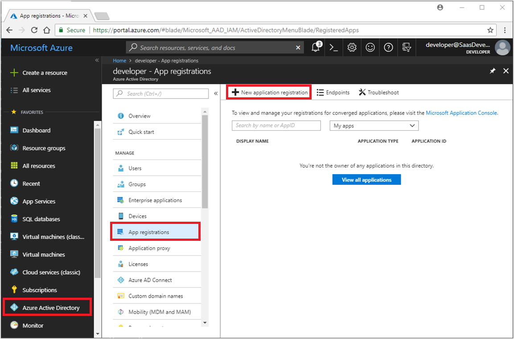

1. On the **Create** page, fill in the required parameters:
   
   Parameter|Description
   ---|---
   **Name** | Provide a meaningful registration name.  
   **Application type** | Since you're building an SPA web application, leave as "Web app/API."
   **Sign-on URL** | Enter the URL for the home/sign-in page of the application. Because the application will be hosted in Azure App Service (later), you must use a URL within the "https://azurewebsites.net" domain. In this example, the name is based on the registration name.

   When finished, click **Create** to create the new application registration.

   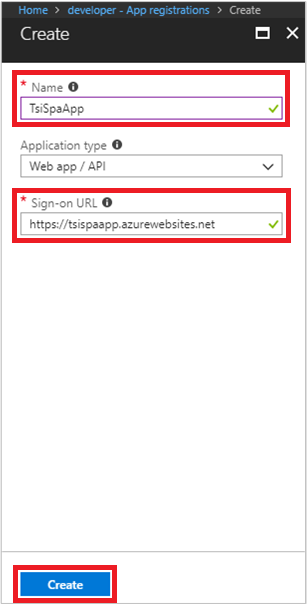

1. Resource applications provide REST APIs for use by other applications, and are also registered with Azure AD. APIs provide granular/secured access to client applications, by exposing "scopes." Because your application will call the "Azure Time Series Insights" API, you need to specify the API and scope, for which permission will be requested/granted at runtime. Select **Settings**, then **Required permissions**, then **+ Add**:

   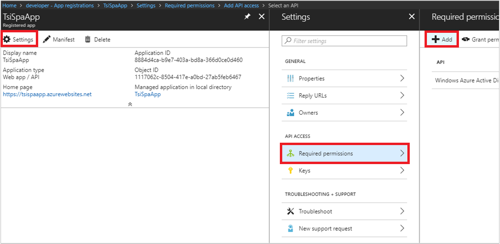

1. From the **Add API access** page, click **1 Select an API** to specify the TSI API. On the **Select an API** page, enter "azure time" in the search field. Then select the "Azure Time Series Insights" API in the results list, and click **Select**: 

   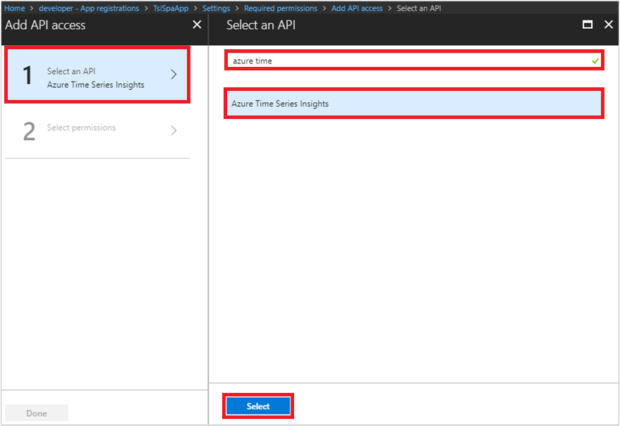

1. Now you specify a scope on the API. On the **Add API access** page again, click **2 Select permissions**. On the **Enable Access** page, select the "Access Azure Time Series Insights service" scope. Click **Select**, which will return you to the **Add API access** page, where you click **Done**:

   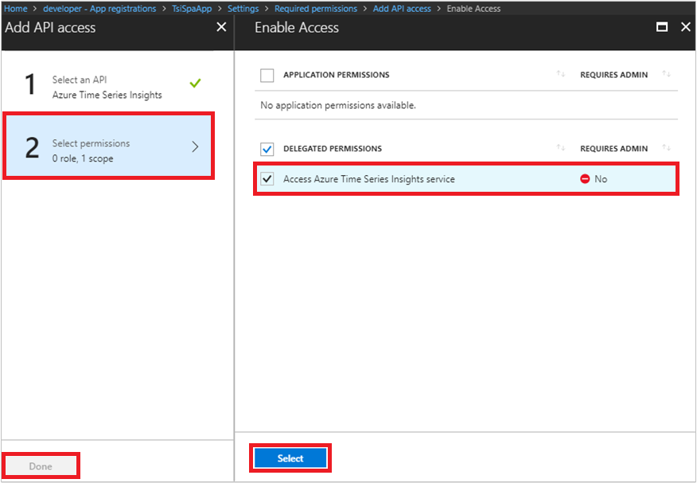

1. When you return to the **Required permissions** page, notice that the "Azure Time Series Insights" API is now listed. You also need to pre-consent permission for the application to access the API and scope, for all users. Click the **Grant permissions** button at the top, and select **Yes**:

   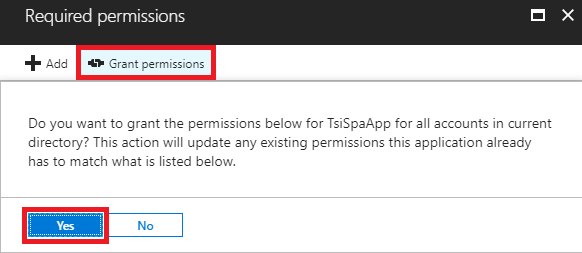

1. As mentioned previously, you also need to update the application manifest. Click on the application name in the breadcrumb to go back to the **Registered app** page. Select **Manifest**, change the `oauth2AllowImplicitFlow` property to `true`, then click **Save**:

   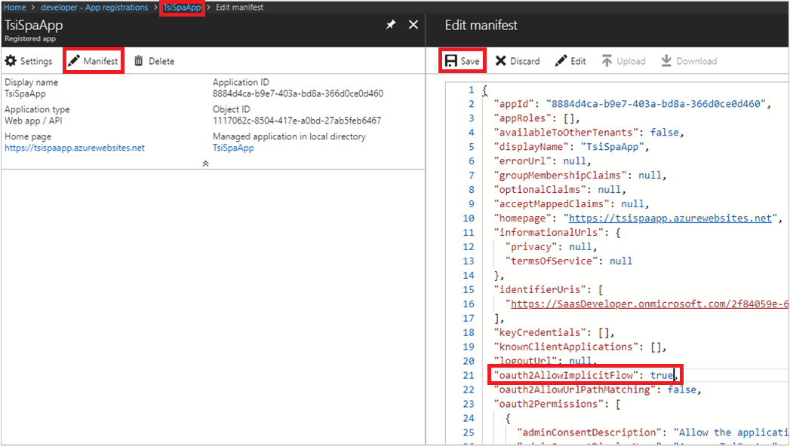

1. Finally, click on the breadcrumb to go back to the **Registered app** page again, and copy the **Home page** URL and **Application ID** properties for your application. You'll use these properties in a later step:

   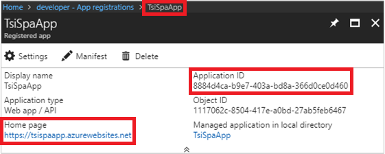

## Build and publish the web application

1. Create a directory to store your application project files. Then browse to each of the following URLs, right-click on the "Raw" link in the upper right area of the page, and "Save as" into your project directory:

   > [!NOTE]
   > Depending on the browser, you may need to correct the file extension (to HTML or CSS), before saving the file.

   - **index.html** HTML and JavaScript for the page https://github.com/Microsoft/tsiclient/blob/tutorial/pages/tutorial/index.html
   - **sampleStyles.css:** CSS style sheet: https://github.com/Microsoft/tsiclient/blob/tutorial/pages/tutorial/sampleStyles.css
    
1. Start and sign in to Visual Studio, to create a project for the web application. On the **File** menu, select the **Open**, **Web Site** option. On the **Open Web Site** dialog, select the working directory where you stored the HTML and CSS files, then click **Open**:

   

1. Open **Solution Explorer** from the Visual Studio **View** menu. You should see your new solution, containing a web site project (globe icon), which contains the HTML and CSS files:

   

1. Before you can publish the application, you need to update portions of the JavaScript code in **index.html**: 

   a. First, change the paths for the JavaScript and style sheet files reference in the `<head>` element. Open the **index.html** file in your Visual Studio solution, and find the following lines of JavaScript code. Uncomment the three lines under  "PROD RESOURCE LINKS", and comment out the three lines under the "DEV RESOURCE LINKS":
   
      [!code-javascript[head-sample](~/samples-javascript/pages/tutorial/index.html?range=2-20&highlight=10-13,15-18)]

      Your changed code should look similar to the following example:

      ```javascript
      <!-- PROD RESOURCE LINKS -->
      <link rel="stylesheet" type="text/css" href="sampleStyles.css"></link>
      <script src="https://unpkg.com/tsiclient@1.1.4/tsiclient.js"></script>
      <link rel="stylesheet" type="text/css" href="https://unpkg.com/tsiclient@1.1.4/tsiclient.css"></link>

      <!-- DEV RESOURCE LINKS -->
      <!-- <link rel="stylesheet" type="text/css" href="pages/samples/sampleStyles.css"></link>
      <script src="dist/tsiclient.js"></script>
      <link rel="stylesheet" type="text/css" href="dist/tsiclient.css"></link> -->
      ```

   b. Next, change the access token logic to use your new Azure AD application registration. Change the following `clientID` and `postLogoutRedirectUri` variables respectively, to use the Application ID and Home Page URL you copied in step #9 of the [Register the application with Azure AD](#register-the-application-with-azure-ad) section:

      [!code-javascript[head-sample](~/samples-javascript/pages/tutorial/index.html?range=147-153&highlight=4-5)]

      Your changed code should look similar to the following example:

      ```javascript
      clientId: '8884d4ca-b9e7-403a-bd8a-366d0ce0d460',
      postLogoutRedirectUri: 'https://tsispaapp.azurewebsites.net',
      ``` 

   c. Save the **index.html** when you've finished editing.

1. Now publish the web application into your Azure subscription as an Azure App Service:  

   > [!NOTE]
   > Several of the fields on the following dialog boxes are populated with data from your Azure subscription. As such, it may take a few seconds for each dialog to load completely, before you're able to continue.  

   a. Right click on the web site project node in **Solution Explorer**, and select **Publish Web App**:  

      

   b. Select **Microsoft Azure App Service** to create a publish target:  

        

   c. Select the subscription you'd like to use for publishing the application, then click “New”: 

        

   d. Give the **Create App Service** dialog a few seconds to load all fields, then modify the following fields:
   
      Field | Description
      ---|---
      **App Name** | Change to the Azure AD application registration name you used in step #3, in [Register the application with Azure AD](#register-the-application-with-azure-ad). 
      **Resource Group** | Using the **New...** button, change to match the **App Name** field.
      **App Service Plan** | Using the **New...** button, change to match the **App Name** field.

      When finished, click **Create**. The **Export** button in the lower left is replaced with "Deploying:" for several seconds, while the Azure resources are created. Once resources are created, you'll be returned to the previous dialog. 

      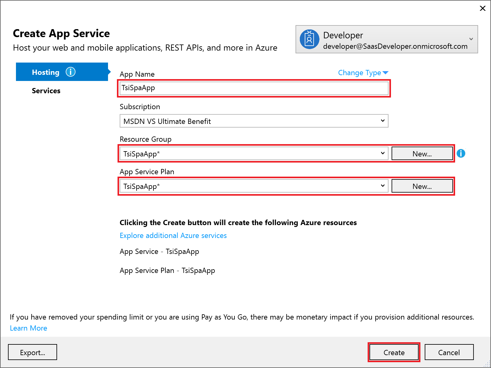  

   e. When you return to the **Publish** dialog, make sure **Publish method** is set to "Web deploy". Also change the **Destination URL** to use `https` instead of `http`, to match the Azure AD application registration. Then click “Publish” to deploy the web application:  

      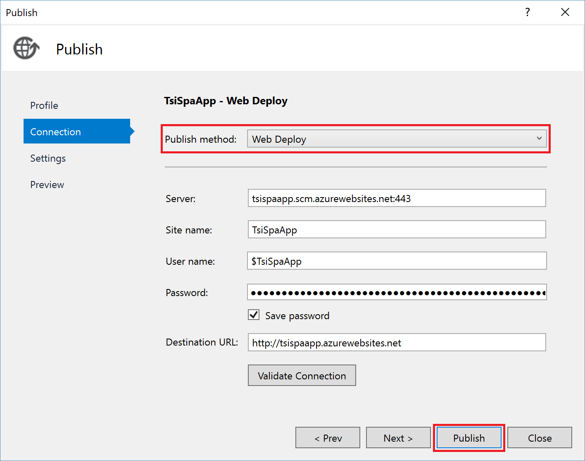  

   f. You should see a successful publish log in the Visual Studio **Output** window. After deployment is done, Visual Studio will also open the web application in a browser tab, prompting for sign-in. After successful sign-in, you'll see all the TSI controls populated with data:  

      [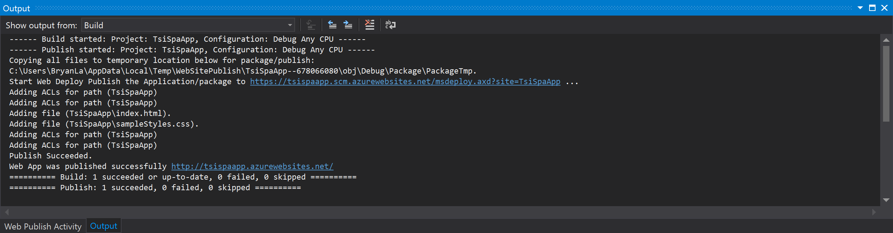](media/tutorial-create-tsi-sample-spa/vs-publish-output.png#lightbox)

      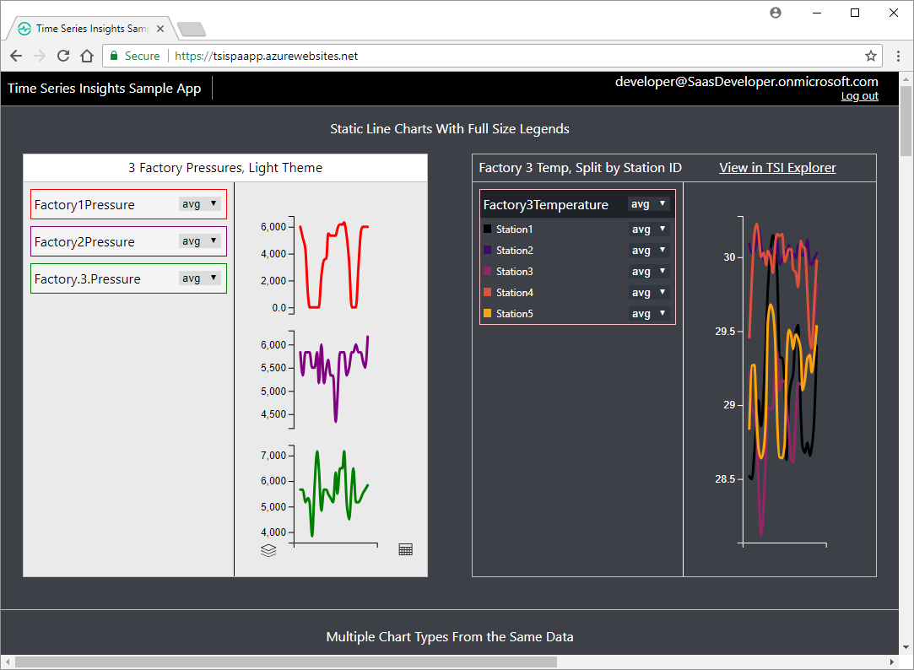  

## Troubleshooting  

Error code/condition | Description
---------------------| -----------
*AADSTS50011: No reply address is registered for the application.* | The Azure AD registration is missing the "Reply URL" property. Go to the **Settings** / **Reply URLs** page for your Azure AD application registration. Verify that the **Sign-on** URL specified in step #3 of [Register the application with Azure AD](#register-the-application-with-azure-ad) is present. 
*AADSTS50011: The reply url specified in the request does not match the reply urls configured for the application: '<Application ID GUID>'.* | The `postLogoutRedirectUri` specified in step #4.b of [Build and publish the web application](#build-and-publish-the-web-application), must match the value specified under the **Settings** / **Reply URLs** property in your Azure AD application registration. Be sure to also change **Destination URL** to use `https`, per step #5.e of [Build and publish the web application](#build-and-publish-the-web-application).
Web application loads, but has an unstyled text-only sign-in page, with a white background. | Verify that the paths discussed in step #4.a of [Build and publish the web application](#build-and-publish-the-web-application) are correct. If the web application can't find the .css files, the page won't be styled correctly.

## Clean up resources

This tutorial creates several running Azure services. If you don't plan to complete this tutorial series, we recommend deleting all resources to avoid incurring unnecessary costs. 

From the left-hand menu in the Azure portal:

1. Click the **Resource groups** icon, then select the resource group you created for the TSI Environment. At the top of the page, click **Delete resource group**, enter the name of the resource group, then click **Delete**. 
1. Click the **Resource groups** icon, then select the resource group that was created by the device simulation solution accelerator. At the top of the page, click **Delete resource group**, enter the name of the resource group, then click **Delete**. 

## Next steps

In this tutorial, you learned how to:

> [!div class="checklist"]
> * The application design
> * How to register your application with Azure Active Directory (AD)
> * How to build, publish, and test your web application 

This tutorial integrates with Azure AD, using the signed-in user's identity to acquire an access token. To learn how to access the TSI API using the identity of a service/daemon application, see:

> [!div class="nextstepaction"]
> [Authentication and authorization for Azure Time Series Insights API](time-series-insights-authentication-and-authorization.md)
