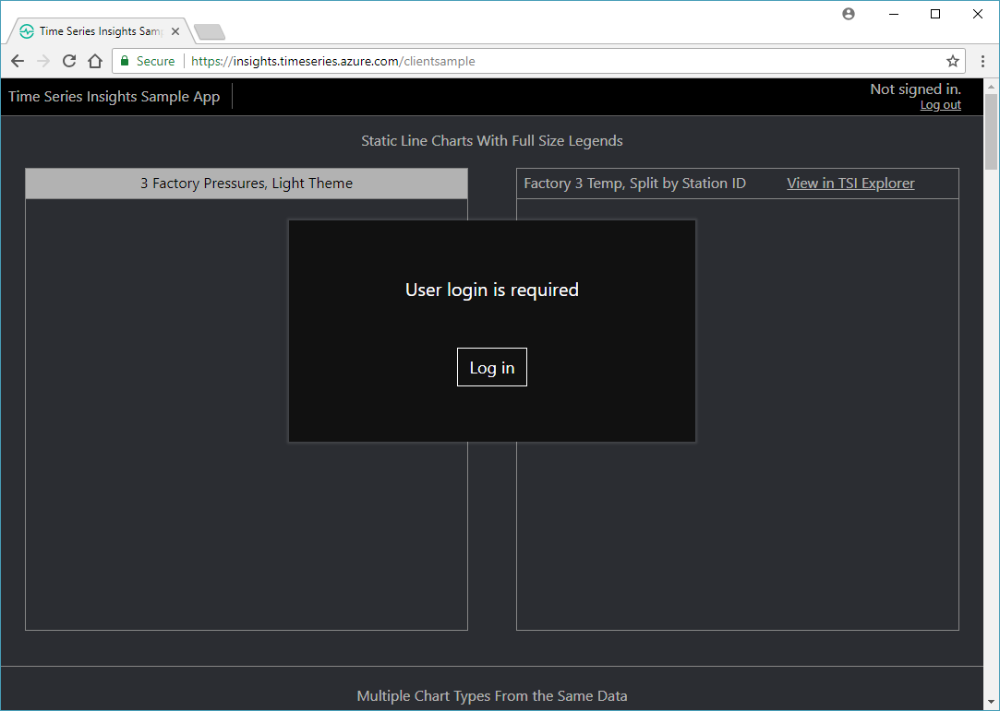
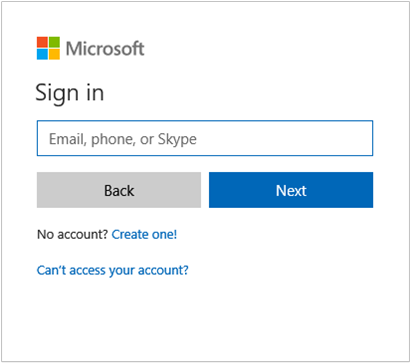
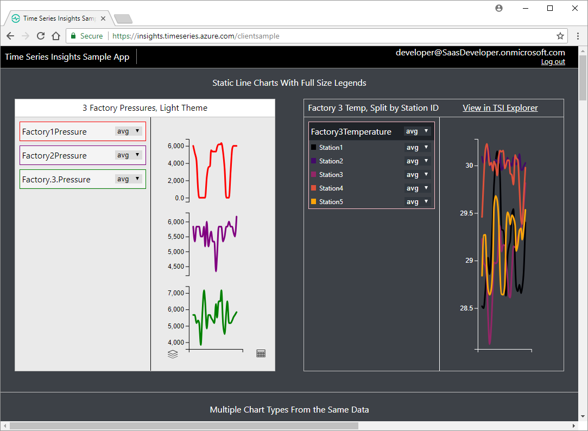
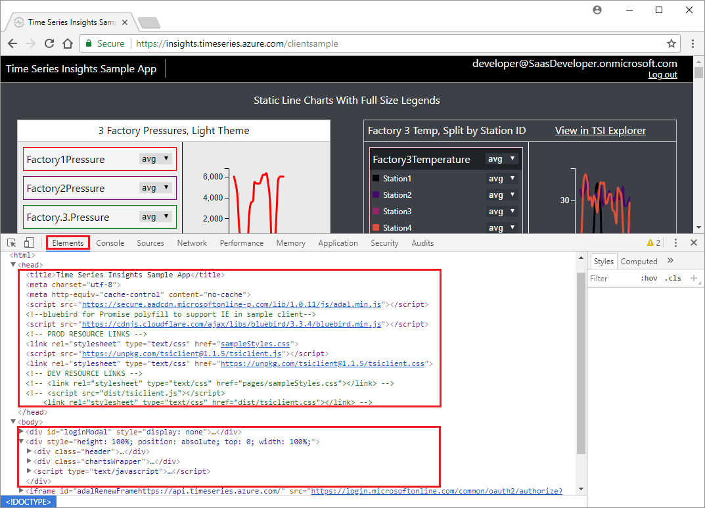
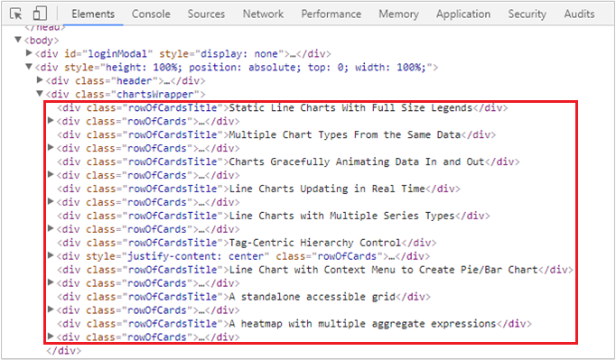
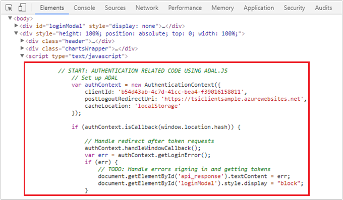
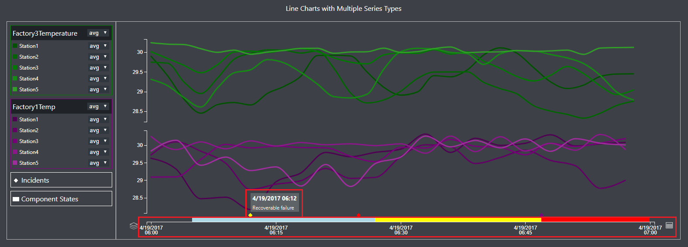
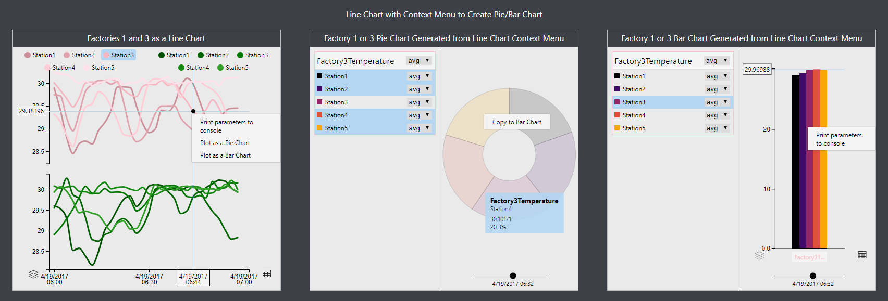
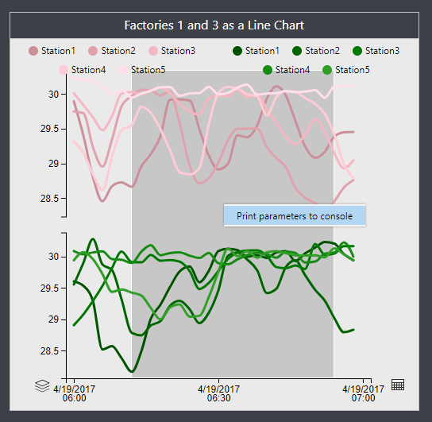

# Tutorial: Explore the Azure Time Series Insights JavaScript client library

To help web developers query and visualize data stored in Time Series Insights (TSI), the JavaScript D3-based TSI Client library was developed.  Using a sample web application, this tutorial will guide you through an exploration of the TSI Client library, and the related programming model.

The topics in this tutorial provide you with opportunities to experiment with the library, to gain an understanding of how to access TSI data and use chart controls to render and visualize data. The goal is to provide you with enough details, so that you can use the library in your own web application.

In this tutorial, you learn about:

> [!div class="checklist"]
> * The TSI sample application.
> * The TSI JavaScript client library.
> * How the sample application uses the library to visualize TSI data.

## Video: 

### In this video, we introduce the open source Time Series Insights JavaScript SDK.</br>

> [!VIDEO https://www.youtube.com/embed/X8sSm7Pl9aA]

## Prerequisites

This tutorial uses the "Developer Tools" feature (also known as DevTools or F12) that's found in most modern web browsers, including [Edge](/microsoft-edge/devtools-guide), [Chrome](https://developers.google.com/web/tools/chrome-devtools/), [FireFox](https://developer.mozilla.org/en-US/docs/Learn/Common_questions/What_are_browser_developer_tools), [Safari](https://developer.apple.com/safari/tools/), and others. If you're not already familiar with this feature, you might want to explore it in your browser before continuing.

## Time Series Insights sample application

Throughout this tutorial, the Time Series Insights sample application is used to explore the source code behind the application, including the usage of the TSI JavaScript client library. The sample is a single-page web application (SPA) that demonstrates how to use the library. The sample shows how to query and visualize data from a sample TSI environment.

1. Browse to the [Time Series Insights sample application](https://insights.timeseries.azure.com/clientsample). You see a page similar to the following image with a prompt to sign in:

   

2. Select **Log in** and enter or select your credentials. Use either an enterprise or organization account (Azure Active Directory) or a personal account (Microsoft Account or MSA).

   

3. After successful sign-in, you see a page similar to the following image. The page shows several styles of example charts that are populated with TSI data. Your user account and the **Log out** option are visible in the upper right corner:

   

### Page source and structure

First, let's view the HTML and JavaScript source code that's behind the page that's rendered in your browser. We don't walk through all of the elements, but you learn about the major sections and you get a sense of how the page works:

1. Open **Developer Tools** in your browser. Inspect the HTML elements that make up the current page (also known as the HTML or DOM tree).

2. Expand the `<head>` and `<body>` elements and notice the following sections:

   - Under the `<head>` element, you find elements that pull in additional files to assist in the functioning of the page:
     - A `<script>` element that's used for referencing the Azure Active Directory Authentication Library **adal.min.js** (also known as ADAL). ADAL is a JavaScript library that provides OAuth 2.0 authentication (sign-in) and token acquisition for accessing APIs.
     - Multiple `<link>` elements for style sheets (also known as CSS) like **sampleStyles.css** and **tsiclient.css**. The style sheets are used to control visual page styling details, such as colors, fonts, spacing, and so on.
     - A `<script>` element that's used for referencing the TSI Client JavaScript library **tsiclient.js**. The library is used by the page to call TSI service APIs and render chart controls on the page.

     >[!NOTE]
     > The source code for the ADAL JavaScript library is available from the [azure-activedirectory-library-for-js repository](https://github.com/AzureAD/azure-activedirectory-library-for-js).
     > The source code for the TSI Client JavaScript library is available from the [tsiclient repository](https://github.com/Microsoft/tsiclient).

   - Under the `<body>` element, you find `<div>` elements, which act as containers to define the layout of items on the page, and another `<script>` element:
     - The first `<div>` element specifies the **Log in** dialog (`id="loginModal"`).
     - The second `<div>` element acts as a parent for:
       - A header `<div>` element that's used for status messages and sign-in information near the top of the page (`class="header"`).
       - A `<div>` element for the remainder of the page body elements, including all of the charts (`class="chartsWrapper"`).
       - A `<script>` section that contains all of the JavaScript that's used to control the page.

   [](media/tutorial-explore-js-client-lib/tcs-devtools-callouts-head-body.png#lightbox)

3. Expand the `<div class="chartsWrapper">` element and you find more child `<div>` elements. These elements are used to position each chart control example. Notice that there are several pairs of `<div>` elements, one for each chart example:

   - The first (`class="rowOfCardsTitle"`) element contains a descriptive title to summarize what the chart(s) illustrate. For example: "Static Line Charts With Full-Size Legends."
   - The second (`class="rowOfCards"`) element is a parent that contains additional child `<div>` elements that position the actual chart control(s) within a row.

   

4. Now, expand the `<script type="text/javascript">` element that's directly below the `<div class="chartsWrapper">` element. Notice the beginning of the page-level JavaScript section that's used to handle all of the page logic: authentication, calling TSI service APIs, rendering the chart controls, and more:

   

## TSI JavaScript client library concepts

Although we don't review it in detail, fundamentally, the TSI Client library **tsclient.js** provides an abstraction for two important categories:

- **Wrapper methods for calling the TSI Query APIs**: REST APIs that allow you to query for TSI data by using aggregate expressions. The methods are organized under the `TsiClient.Server` namespace of the library.
- **Methods for creating and populating several types of charting controls**: Methods that are used for rendering the TSI aggregate data in a web page. The methods are organized under the `TsiClient.UX` namespace of the library.

The following concepts are universal and applicable to the TSI Client library APIs in general.

### Authentication

As mentioned earlier, this sample is an SPA that uses the OAuth 2.0 support in ADAL for user authentication. Here are some points of interest in this section of the script:

1. When using ADAL for authentication, the client application must register itself in the Azure Active Directory (Azure AD) application registry. As an SPA, this application is registered to use the "implicit" OAuth 2.0 authorization grant flow. Correspondingly, the application specifies some of the registration properties at runtime, such as the client ID GUID (`clientId`) and redirect URI (`postLogoutRedirectUri`), to participate in the flow.

2. Later, the application requests an "access token" from Azure AD. The access token is issued for a finite set of permissions for a specific service/API identifier https://api.timeseries.azure.com. The service/API identifier is also known as the token "audience." The token permissions are issued on behalf of the signed-in user. The identifier for the service/API is yet another property that's contained in the application's Azure AD registration. After ADAL returns the access token to the application, it's passed as a "bearer token" when accessing the TSI service APIs.

   [!code-javascript[head-sample](~/samples-javascript/pages/tutorial/index.html?range=145-204&highlight=4-9,36-39)]

### Control identification

As discussed earlier, the `<div>` elements within the `<body>` element provide the layout for all of the chart controls that are demonstrated on the page. Each `<div>` element specifies properties for the placement and visual attributes of the chart control, including an `id` property. The `id` property provides a unique identifier that's used in the JavaScript code to identify and bind to each control for rendering and updating.

### Aggregate expressions

The TSI Client library APIs make heavy use of aggregate expressions. An aggregate expression provides the ability to construct one or more "search terms." The APIs are designed similar to the way the [Time Series Insights explorer](https://insights.timeseries.azure.com/demo), which uses search span, where predicate, measures, and split-by value. Most library APIs take an array of aggregate expressions that are used by the service to build a TSI data query.

### Call pattern

The populating and rendering of chart controls follows a general pattern. You find this pattern used throughout the page JavaScript that instantiates and loads the TSI sample application controls:

1. Declare an `array` to hold one or more TSI aggregate expressions:

   ```javascript
   var aes =  [];
   ```

2. Build 1 to n aggregate expression objects, and add them to the aggregate expression array:

   ```javascript
   var ae = new tsiClient.ux.aggregateExpression(predicateObject, measureObject, measureTypes, searchSpan, splitByObject, color, alias, contextMenuActions);
   aes.push(ae);
   ```

   **aggregateExpression parameters**

   | Parameter | Description | Example |
   | --------- | ----------- | ------- |
   | `predicateObject` | The data Filtering expression. |`{predicateString: "Factory = 'Factory3'"}` |
   | `measureObject`   | The property name of the measure that's used. | `{property: 'Temperature', type: "Double"}` |
   | `measureTypes`    | The desired aggregations of the measure property. | `['avg', 'min']` |
   | `searchSpan`      | The duration and interval size of the aggregate expression. | `{from: startDate, to: endDate, bucketSize: '2m'}` |
   | `splitByObject`   | The string property that you wish to split by (optional – can be null). | `{property: 'Station', type: 'String'}` |
   | `color`         | The color of the objects that you wish to render. | `'pink'` |
   | `alias`           | A friendly name for the aggregate expression. | `'Factory3Temperature'` |
   | `contextMenuActions` | An array of actions to be bound to the time series objects in a visualization (optional). | For more information, see [Pop-up context menus in the Advanced features section.](#popup-context-menus) |

3. Call a TSI query by using the `TsiClient.Server` APIs to request the aggregate data:

   ```javascript
   tsiClient.server.getAggregates(token, envFQDN, aeTsxArray);
   ```

   **getAggregates parameters**

   | Parameter | Description | Example |
   | --------- | ----------- | ------- |
   | `token`     | The access token for the TSI API. |	`authContext.getTsiToken()` For more information, see [authentication section.](#authentication) |
   | `envFQDN`	 | The fully qualified domain name (FQDN) for the TSI environment. | From the Azure portal, for example: `10000000-0000-0000-0000-100000000108.env.timeseries.azure.com`. |
   | `aeTsxArray` | An array of TSI query expressions. | Use the `aes` variable as described previously: `aes.map(function(ae){return ae.toTsx()}`. |

4. Transform the compressed result that's returned from the TSI query into JSON for visualization:

   ```javascript
   var transformedResult = tsiClient.ux.transformAggregatesForVisualization(result, aes);
   ```

5. Create a chart control by using the `TsiClient.UX` APIs, and bind it to one of the `<div>` elements on the page:

   ```javascript
   var lineChart = new tsiClient.ux.BarChart(document.getElementById('chart3'));
   ```

6. Populate the chart control with the transformed JSON data object(s) and render the control on the page:

   ```javascript
   lineChart.render(transformedResult, {grid: true, legend: 'compact', theme: 'light'}, aes);
   ```

## Rendering controls

The TSI Client library currently exposes eight unique analytics controls: line chart, pie chart, bar chart, heatmap, hierarchy controls, accessible grid, discrete event timelines, and state transition timelines.

### Line, bar, pie chart examples

Look at the code that's behind some of the standard chart controls that are demonstrated in the application and the programming model/patterns for creating the controls. Specifically, examine the section of HTML under the `// Example 3/4/5` comment, which renders controls with the ID values `chart3`, `chart4`, and `chart5`.

Recall from step #3 in the [Page source and structure section](#page-source-and-structure) that chart controls are arranged in rows on the page, each of which has a descriptive title row. In this example, the three charts are populated under the "Multiple Chart Types From the Same Data" title `<div>` element, and are bound to the three `<div>` elements that are beneath the title:

[!code-javascript[code-sample1-line-bar-pie](~/samples-javascript/pages/tutorial/index.html?range=59-73&highlight=1,5,9,13)]

The following section of JavaScript code uses patterns that were outlined earlier: build TSI aggregate expressions, use them to query for TSI data, and render the three charts. Notice the three types that are used from the `tsiClient.ux` namespace: `LineChart`, `BarChart`, and `PieChart`, to create and render the respective charts. Also note that all three charts are able to use the same aggregate expression data `transformedResult`:

[!code-javascript[code-sample2-line-bar-pie](~/samples-javascript/pages/tutorial/index.html?range=241-262&highlight=13-14,16-17,19-20)]

The three charts appear as follows when rendered:

[](media/tutorial-explore-js-client-lib/tcs-multiple-chart-types-from-the-same-data.png#lightbox)

## Advanced features

The TSI Client library also exposes some optional advanced features that you might want to take advantage of.

### States and events

One example of the advanced functionality that's provided is the ability to add state transitions and discrete events to charts. This feature is useful for highlighting incidents, alerting, and state switches like on/off.

Look at the code that's behind the section of HTML that's under the `// Example 10` comment. The code renders a line control under the "Line Charts with Multiple Series Types" title, and binds it to the `<div>` element with the ID value `chart10`.

1. First, a structure named `events4` is defined, to hold the state-change elements to track. The structure contains:

   - A string key named `Component States`.
   - An array of value objects that represent the states. Each object includes:
     - A string key that contains a JavaScript ISO timestamp.
     - An array that contains the characteristics of the state: a color and a description.

2. Next, the `events5` structure is defined for "Incidents," which holds an array of the event elements to track. The array structure is the same shape as the structure that's outlined for `events4`.

3. Finally, the line chart is rendered, passing in the two structures with the chart options parameters: `events:` and `states:`. Notice the other option parameters for specifying a `tooltip:`, `theme:`, or `grid:`.

[!code-javascript[code-sample-states-events](~/samples-javascript/pages/tutorial/index.html?range=337-389&highlight=5,26,51)]

Visually, the diamond markers/pop-up windows that are used to indicate incidents, and the colored bars/pop-up windows along the time scale, indicate state changes:

[](media/tutorial-explore-js-client-lib/tcs-line-charts-with-multiple-series-types.png#lightbox)

### Pop-up context menus

Another example of advanced functionality is custom context menus (right-click pop-up menus). Custom context menus are useful for enabling actions and logical next steps within the scope of your application.

Look at the code that's behind the section of HTML that's under the `// Example 13/14/15` comment. This code initially renders a line chart under the "Line Chart with Context Menu to Create Pie/Bar Chart" title, and the chart is bound to the `<div>` element with the ID value `chart13`. By using context menus, the line chart provides the capability to dynamically create a pie and bar chart that are bound to `<div>` elements with the IDs `chart14` and `chart15`. In addition, both the pie and bar charts also use context menus to enable their own features: the ability to copy data from the pie to bar chart, and print the bar chart data to the browser console window, respectively.

1. First a series of custom actions are defined. Each action contains an array with one or more elements. Each element defines a single context menu item:

   - `barChartActions`: This action defines the context menu for the pie chart, which contains one element to define a single item:
     - `name`: The text that's used for the menu item: "Print parameters to console."
     - `action`: The action that's associated with the menu item. The action is always an anonymous function that takes three arguments that are based on the aggregate expression that's used to create the chart. In this case, the arguments are written to the browser console window:
       - `ae`: The aggregate expression array.
       - `splitBy`: The splitBy value.
       - `timestamp`: The timestamp.

   - `pieChartActions`: This action defines the context menu for the bar chart, which contains one element to define a single item. The shape and schema is the same as the previous `barChartActions` element, but notice that the `action` function is dramatically different: it instantiates and renders the bar chart. Also note that the `ae` argument is used to specify the aggregate expression array that's passed at runtime when the menu item opens. The function also sets the `ae.contextMenu` property with the `barChartActions` context menu.
   - `contextMenuActions`: This action defines the context menu for the line chart, which contains three elements to define three menu items. The shape and schema for each element is the same as the previous elements that were described. Just like the `barChartActions` element, the first item writes the three function arguments to the browser console window. Similar to the `pieChartActions` element, the second two items instantiate and render the pie and bar charts, respectively. The second two items also set their `ae.contextMenu` properties with the `pieChartActions` and `barChartActions` context menus, respectively.

2. Next, two aggregate expressions are pushed onto the `aes` aggregate expression array and specify the `contextMenuActions` array for each item. These expressions are used with the line chart control.

3. Finally, only the line chart is initially rendered, from which both the pie and bar chart can be rendered at runtime.

[!code-javascript[code-sample-context-menus](~/samples-javascript/pages/tutorial/index.html?range=461-540&highlight=7,16,29,61-64,78)]

The screenshot shows the charts with their respective pop-up context menus. The pie and bar charts were created dynamically by using the line chart context menu options.

[](media/tutorial-explore-js-client-lib/tcs-line-chart-with-context-menu-to-create-pie-bar-chart.png#lightbox)

### Brushes

Brushes are used to scope a time range to define actions like zoom and explore.

The code that's used to illustrate brushes is shown in the previous "Line Chart with Context Menu to Create Pie/Bar Chart" example that describes [Pop-up context menus](#popup-context-menus-section).

1. Brush actions are similar to a context menu in that they define a series of custom actions for the brush. Each action contains an array with one or more elements. Each element defines a single context menu item:
   - `name`: The text that's used for the menu item: "Print parameters to console."
   - `action`: The action that's associated with the menu item, which is always an anonymous function that takes two arguments. In this case, the arguments are written to the browser console window:
      - `fromTime`: The "from" timestamp of the brush selection.
      - `toTime`: The "to" timestamp of the brush selection.

2. Brush actions are added as another chart option property. Notice the `brushContextMenuActions: brushActions` property that's passed to the `linechart.Render` call.

[!code-javascript[code-sample-brushes](~/samples-javascript/pages/tutorial/index.html?range=526-540&highlight=1,13)]



## Next steps

In this tutorial, you learned how to:

> [!div class="checklist"]
> * Sign in and explore the TSI sample application and its source.
> * Use APIs in the TSI JavaScript client library.
> * Use JavaScript to create and populate chart controls with TSI data.

As discussed, the TSI Sample application uses a demo data set. To learn how you can create your own TSI environment and data set, advance to the following article:

> [!div class="nextstepaction"]
> [Tutorial: Create an Azure Time Series Insights environment](tutorial-create-populate-tsi-environment.md)


